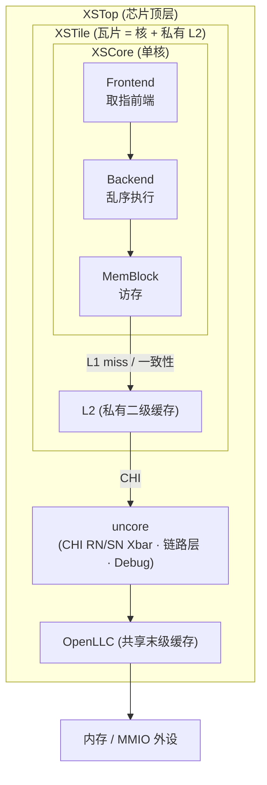
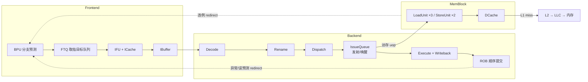
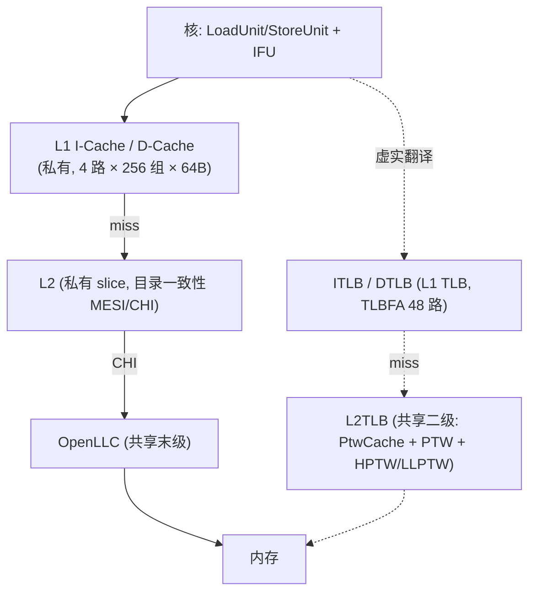

# 香山 V2R2（昆明湖）整体架构说明

> 本文是理解本仓库的**总入口**：先建立香山 V2R2 的整机认知，再顺着链接深入各子系统。
> 本仓库把香山 `kunminghu-v2r2` 的 Chisel 生成 RTL **手工重写为可读 SystemVerilog**；每个子系统都配有「逐模块设计文档 + `arch/` 背景文档层」（见文末[阅读指南](#8-文档体系与阅读指南)）。

---

## 1. 香山 V2R2 是什么

香山 V2R2（昆明湖）是一款**高性能乱序 RV64GC 处理器核**（含 H 特权扩展与向量）。它是典型的现代超标量乱序核：

- **超标量取指 + 多级分支预测**：每拍取一段指令块，用 uFTB/FTB/TAGE-SC/ITTAGE/RAS 多级预测器猜控制流。
- **深度乱序执行**：寄存器重命名消除假相关，160 项 ROB 支撑的乱序窗口，多功能单元并行。
- **非阻塞存储层次**：私有 L1 I/D-Cache（MSHR 非阻塞）→ 私有 L2 → 共享 LLC → CHI 一致性互联 → 内存。
- **完整地址翻译**：两级 TLB + 硬件页表遍历（支持 H 扩展两阶段翻译）。

---

## 2. 芯片层次（自顶向下）

| 层次 | 模块 | 职责 | 入口文档 |
|------|------|------|----------|
| 芯片顶 | **XSTop** | 例化 XSTile + OpenLLC(共享 LLC) + CHI 桥 + uncore 互联/调试 | [xstop/XSTop.md](xstop/XSTop.md) |
| 瓦片 | **XSTile** | 1 个 XSCore + 私有 L2；可参数化多瓦片（本配置单大核） | [xstile/XSTile.md](xstile/XSTile.md) |
| 单核 | **XSCore** | 组装 Frontend + Backend + MemBlock | [xscore/XSCore.md](xscore/XSCore.md) |
| 前端 | **Frontend** | 分支预测 + 取指 + 指令缓冲 | [frontend/arch/0-FRONTEND_OVERVIEW.md](frontend/arch/0-FRONTEND_OVERVIEW.md) |
| 后端 | **Backend** | 译码→重命名→发射→执行→提交 | [backend/arch/0-BACKEND_OVERVIEW.md](backend/arch/0-BACKEND_OVERVIEW.md) |
| 访存 | **MemBlock** | load/store 执行 + L1 DCache + TLB/PTW | [memblock/arch/0-MEMBLOCK_OVERVIEW.md](memblock/arch/0-MEMBLOCK_OVERVIEW.md) |
| 二级缓存 | **L2** | 私有 L2 + 目录一致性 + TL↔CHI | [l2/arch/0-L2_OVERVIEW.md](l2/arch/0-L2_OVERVIEW.md) |
| 非核 | **uncore** | 片上互联 Xbar + CHI 链路层 + 调试 | [uncore/arch/0-UNCORE_OVERVIEW.md](uncore/arch/0-UNCORE_OVERVIEW.md) |

---

## 3. 单核数据通路全景（一条指令的一生）

- **前端**（供指令）：BPU 每拍产一个预测块 → FTQ 排队 → IFU 按块向 ICache 取指、预译码 → IBuffer 解耦喂后端。
- **后端**（乱序执行）：译码 → 重命名（消假相关）→ 派遣到发射队列 → 就绪即发射、推测唤醒背靠背 → 多功能单元执行 → 写回 → **ROB 按序提交**保精确异常。
- **访存**（load/store）：访存 uop 交 LSU 执行，查 TLB/DCache；miss 走 L1→L2→LLC→内存；load/store 乱序执行但由 LoadQueue/StoreQueue 维护**内存序**。
- **纠错回路**：预测错由 IFU 预译码（早）或后端执行（晚）发 redirect，冲刷错误路径、从正确地址重取。

> 各级如何在时间轴上咬合、redirect 如何逐级冲刷，见 [前端时序](frontend/arch/4-CONTROL_FLOW_AND_TIMING.md) 与 [后端时序](backend/arch/6-CONTROL_FLOW_AND_TIMING.md)。

---

## 4. 五大子系统一览

| 子系统 | 一句话 | 背景总览入口 |
|--------|--------|--------------|
| **frontend** 前端 | 多级覆盖式分支预测(uFTB/FTB/TAGE-SC/ITTAGE/RAS) + FTQ + IFU + ICache + IBuffer | [frontend/arch/0-FRONTEND_OVERVIEW.md](frontend/arch/0-FRONTEND_OVERVIEW.md) |
| **backend** 后端 | 乱序执行：译码/重命名/派遣/发射唤醒/执行写回/ROB 提交/CSR | [backend/arch/0-BACKEND_OVERVIEW.md](backend/arch/0-BACKEND_OVERVIEW.md) |
| **memblock** 访存 | LSU + LoadQueue/StoreQueue + DCache + TLB/PTW + Sbuffer | [memblock/arch/0-MEMBLOCK_OVERVIEW.md](memblock/arch/0-MEMBLOCK_OVERVIEW.md) |
| **l2** 二级缓存 | 私有 L2：目录一致性(client+self) + MainPipe + TL↔CHI 耦合 | [l2/arch/0-L2_OVERVIEW.md](l2/arch/0-L2_OVERVIEW.md) |
| **uncore** 非核 | 片上互联(TL/AXI/CHI Xbar) + CHI 链路层 + JTAG 调试 | [uncore/arch/0-UNCORE_OVERVIEW.md](uncore/arch/0-UNCORE_OVERVIEW.md) |
| **common** 公共库 | 参数化 SRAM/PLRU/CAM/队列等被各子系统复用的基础件 | [common/](common/) |

---

## 5. 存储层次与地址翻译

- **数据/指令缓存**：L1 私有（DCache 4 路×256 组×64B，非阻塞 MSHR）→ L2 私有 slice（目录分 client/self，MESI/CHI 状态）→ OpenLLC 共享 → CHI → 内存。
- **地址翻译**：ITLB/DTLB（L1，全相联 TLBFA 48 路）→ 共享 **L2TLB**（PtwCache L0/L1/L2/L3 四级页表缓存 + 硬件 PTW；H 扩展两阶段用 HPTW/LLPTW）→ PMP/PMA 物理权限检查。前端 ITLB 与访存 DTLB 共享同一 L2TLB/PTW。

详见 [DCache 原理](memblock/arch/3-DCACHE_PRINCIPLES.md)、[TLB/MMU 原理](memblock/arch/4-TLB_MMU_PRINCIPLES.md)、[L2 一致性](l2/arch/2-COHERENCE_DIRECTORY_PRINCIPLES.md)。

---

## 6. 贯穿全机的关键机制

- **控制流与纠错**：BPU 多级覆盖式预测 → FTQ → 取指；预测错分两级纠正——IFU 预译码早纠错、后端执行/提交晚纠错，统一走 redirect 冲刷重取。
- **精确异常**：ROB 顺序提交，异常点精确；误预测/异常后按序 walk 回滚重命名映射与投机历史。
- **内存序（RVWMO）**：load/store 乱序执行但按程序序可见；LoadQueue 检测 RAR/RAW 违例并 replay，StoreQueue + Sbuffer 管提交写回。
- **推测唤醒**：发射侧 0 延迟功能单元背靠背唤醒依赖者，猜错时 og0Cancel/ldCancel 取消 squash。

---

## 7. 关键参数速查（以 RTL 为准）

| 域 | 参数 |
|----|------|
| 前端 | PredictWidth=16（预测块 ≤34B/17 半字）；FTQ=64 项；IBuffer=48；TAGE 4 表几何历史 8/13/32/119；RAS 投机栈 32+提交栈 16 |
| 后端 | DecodeWidth=RenameWidth=6；CommitWidth=8；RobSize=160（8 bank×20）；IntPhyRegs=224 / FpPhyRegs=192；发射队列按 int/fp/vf/mem 四域组织 |
| 访存 | LoadUnit×3 / StoreUnit×2；DCache 4 路×256 组×64B、MSHR=16；StoreQueue=56；VirtualLoadQueue=72；Sbuffer=16；DTLB load 4 路 / store·prefetch 各 2 路 |
| L2/LLC | L2 目录 8 路×512 组、MSHR=16；LLC clientDir 10 路×1024 组 + selfDir 16 路×4096 组 |
| 地址/向量 | VAddrBits=50 / PAddrBits=48 / VLEN=128 |

---

## 8. 文档体系与阅读指南

本仓库文档为**双层结构**：

1. **逐模块设计文档** `docs/<子系统>/<Module>.md`——讲某个模块「怎么实现」（端口/FSM/时序/坑）。
2. **背景文档层** `docs/<子系统>/arch/`——讲「为什么这么设计、原理、模块如何协同」，按阅读顺序编号（`0-*_OVERVIEW` 是该子系统总览，`1-`起为需求/原理/时序）。

**推荐阅读顺序**：本文（整机）→ 各子系统 `arch/0-*_OVERVIEW` → `arch/` 原理篇 → 具体模块设计文档。

- **重写方法学**：手写可读 SV（`xs_` 前缀参数化核 + golden 同名 wrapper），用 Formality 形式等价 + UT 双例化随机比对验证；可读标准见 [REWRITE_STYLE.md](REWRITE_STYLE.md)。
- **文档质量**：全部文档经过多轮对照 RTL 的 review 与审校，问题清单见 [DOC_REVIEW_REPORT.md](DOC_REVIEW_REPORT.md)。
- **各子系统进度**：见仓库根 [status.md](../status.md)。
