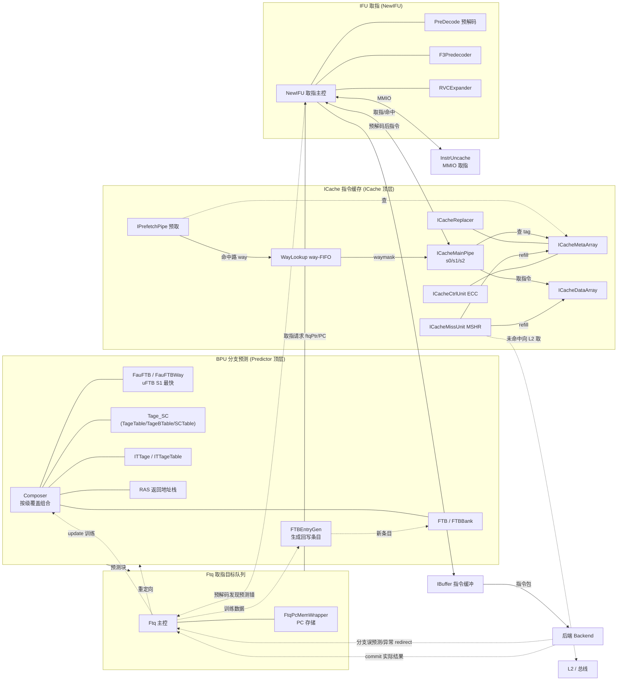

# 香山 V2R2（昆明湖）前端架构总览 —— 学习导读

> 本文把各模块串成一张完整的前端图，作为阅读 `docs/frontend/` 下各模块文档的索引与脉络。
> 目标：帮助读者建立"取指前端如何工作"的整体认知，再深入单个模块。

## 1. 前端在做什么

前端的职责：**持续地、尽可能准确地，把要执行的指令流喂给后端**。两个核心问题：

1. **下一条取哪？** —— 分支预测（BPU）：在还不知道分支结果时就猜测控制流走向。
2. **怎么把指令取回来？** —— 取指（IFU + ICache）：按预测的地址从指令缓存取回、预解码、
   排入指令缓冲。

预测会出错，所以还有第三件事：**纠错（redirect）** —— 预测错或后端发现异常时，冲刷错误
路径、从正确地址重取。

## 2. 顶层数据流

```mermaid
flowchart TB
  BPU["BPU 分支预测<br/>(Composer: uFTB/FTB/TAGE-SC/ITTAGE/RAS)"]
  FTQ["FTQ 取指目标队列<br/>(Fetch Target Queue)"]
  IFU["IFU 取指单元<br/>(NewIFU + PreDecode)"]
  ICACHE["ICache 指令缓存<br/>(MainPipe/MissUnit/Prefetch/Meta/Data...)"]
  IBUF["IBuffer 指令缓冲"]
  BE["后端 Backend"]

  BPU -->|预测块: 起始PC+目标+taken| FTQ
  FTQ -->|取指请求 ftqPtr/PC| IFU
  IFU <-->|取指/命中| ICACHE
  IFU -->|预解码后的指令| IBUF
  IBUF -->|指令| BE
  IFU -.预解码发现的预测错.->|redirect| FTQ
  BE  -.分支误预测/异常.->|redirect| FTQ
  FTQ -.重定向 BPU.-> BPU
  BE  -.commit: 实际结果.-> FTQ
  FTQ -.update: 训练预测器.-> BPU
```

- **BPU → FTQ**：BPU 每拍产出一个"预测块"（一段连续取指 + 末尾控制流去向）。FTQ 把这些块
  排队，逐个发给 IFU。
- **FTQ → IFU → ICache**：IFU 按 FTQ 给的 PC 向 ICache 取指；ICache 命中则返回，未命中则
  MissUnit 向 L2 取（refill）。
- **IFU → IBuffer → 后端**：IFU 预解码（识别 RVC/分支），排入 IBuffer 解耦，喂给后端。
- **纠错回路**：IFU 预解码若发现 BPU 预测与实际指令不符（如把非分支预测成 taken）→ redirect；
  后端执行发现分支真实方向/目标与预测不符 → redirect。两者都让 FTQ 冲刷并重取。
- **训练回路**：后端 commit 时把真实结果经 FTQ 回送，update 各预测器（FTB 条目、TAGE 计数、
  RAS 栈、uFTB 等）。

### 2.1 子系统级互联大图（模块到模块）

> 下图把前端各**真实模块**（与 `rtl/frontend/*.sv` 一一对应）连成一张互联图：左到右是
> 预测→排队→取指/缓存→预解码→缓冲→后端 的主数据流；点划线是 redirect/update 反馈回路。
> 每个框可点开对应模块文档（链接见图下）。



**图中模块 → 文档**：
[Predictor](frontend/Predictor.md) · [Composer](frontend/Composer.md) · [FauFTB](frontend/FauFTB.md) / [FauFTBWay](frontend/FauFTBWay.md) · [FTB](frontend/FTB.md) / [FTBBank](frontend/FTBBank.md) · [Tage_SC](frontend/Tage_SC.md)（[TageTable](frontend/TageTable.md)/[TageBTable](frontend/TageBTable.md)/[SCTable](frontend/SCTable.md)）· [ITTage](frontend/ITTage.md) / [ITTageTable](frontend/ITTageTable.md) · [RAS](frontend/RAS.md) · [FTBEntryGen](frontend/FTBEntryGen.md) · [Ftq](frontend/Ftq.md) / [FtqPcMemWrapper](frontend/FtqPcMemWrapper.md) · [ICache](frontend/ICache.md) / [ICacheMainPipe](frontend/ICacheMainPipe.md) / [IPrefetchPipe](frontend/IPrefetchPipe.md) / [WayLookup](frontend/WayLookup.md) / [ICacheMetaArray](frontend/ICacheMetaArray.md) / [ICacheDataArray](frontend/ICacheDataArray.md) / [ICacheReplacer](frontend/ICacheReplacer.md) / [ICacheMissUnit](frontend/ICacheMissUnit.md) / [ICacheCtrlUnit](frontend/ICacheCtrlUnit.md) · [NewIFU](frontend/NewIFU.md) / [PreDecode](frontend/PreDecode.md) / [F3Predecoder](frontend/F3Predecoder.md) / [RVCExpander](frontend/RVCExpander.md) · [InstrUncache](frontend/InstrUncache.md) · [IBuffer](frontend/IBuffer.md) · [Frontend](frontend/Frontend.md)（顶层集成）

## 3. 三条主线与对应模块

### 3.1 分支预测（BPU）—— "下一条取哪"

香山用**多级覆盖式预测**：地址一产生，最快的预测器先出结果让取指立刻动；后面更慢更准的
在随后几拍覆盖。各预测器由 **Composer** 串联组合，外层 **Predictor** 顶层封装 BPU 的流水/握手/
冲刷与对 FTQ 的输出，结果写入 FTQ。

| 预测器 | 角色 | 文档 / 状态 |
|------|------|------|
| Predictor | BPU 顶层：封装 Composer + 三级流水 s1/s2/s3、冲刷、对 FTQ 的预测/update 接口 | [Predictor](frontend/Predictor.md) ✅ |
| Composer | 组合各预测器，按级覆盖、串联 meta/历史 | [Composer](frontend/Composer.md) ✅ |
| uFTB (FauFTB) | S1 当拍最快预测，全相联微 FTB（多路 FauFTBWay）| [FauFTB](frontend/FauFTB.md) ✅ / [FauFTBWay](frontend/FauFTBWay.md) ✅ |
| FTB | 容量大的取指目标缓冲，给 fall-through 与分支槽（内含 FTBBank）| [FTB](frontend/FTB.md) ✅ / [FTBBank](frontend/FTBBank.md) ✅ |
| TAGE-SC | 主方向预测器（带几何历史长度的标签表 8/13/32/119 + 统计校正）| [Tage_SC](frontend/Tage_SC.md) ✅（含 [TageTable](frontend/TageTable.md) ✅ / [TageBTable](frontend/TageBTable.md) ✅ / [SCTable](frontend/SCTable.md) ✅）|
| ITTAGE | 间接跳转目标预测 | [ITTage](frontend/ITTage.md) ✅ / [ITTageTable](frontend/ITTageTable.md) ✅ |
| RAS | 返回地址栈，预测 ret 目标 | [RAS](frontend/RAS.md) ✅ |
| FTBEntryGen | 据执行结果生成要写回 FTB 的新条目 | [FTBEntryGen](frontend/FTBEntryGen.md) ✅ |

> FTB 条目编码（lower+tarStat 压缩目标、brSlot/tailSlot、sharing 共享槽）是 BPU 一大关键，
> 集中在 [`ftb_pkg`](../rtl/frontend/ftb_pkg.sv)，被 FauFTB/FTB/FTBEntryGen/FTQ 复用。先读
> [FTBEntryGen 文档](frontend/FTBEntryGen.md) 的"FTB 条目怎么存"一节最易入门。

### 3.2 取指与指令缓存（IFU + ICache）—— "怎么取回来"

| 模块 | 角色 | 文档 / 状态 |
|------|------|------|
| NewIFU | 取指主控：发请求、收数据、预解码、送 IBuffer | [NewIFU](frontend/NewIFU.md) ✅ |
| PreDecode | 预解码：RVC 判定、两段式指令边界、分支类型/跳转偏移 | [PreDecode](frontend/PreDecode.md) ✅ |
| F3Predecoder | F3 级分支预译码（复用 PreDecode 的分支译码） | [F3Predecoder](frontend/F3Predecoder.md) ✅ |
| RVCExpander | 16-bit 压缩指令展开成 32-bit | [RVCExpander](frontend/RVCExpander.md) ✅ |
| ICache | ICache 顶层：仲裁、错误上报、array 读写源选择 | [ICache](frontend/ICache.md) ✅ |
| ICacheMainPipe | ICache 主流水 s0/s1/s2：查 meta→取 data→响应 IFU | [ICacheMainPipe](frontend/ICacheMainPipe.md) ✅ |
| IPrefetchPipe | ICache 预取流水：提前查 meta、未命中发预取 | [IPrefetchPipe](frontend/IPrefetchPipe.md) ✅ |
| WayLookup | 预取与主流水之间的 way 命中信息 FIFO | [WayLookup](frontend/WayLookup.md) ✅ |
| ICacheMetaArray | meta（tag/valid/ECC）存储阵列 | [ICacheMetaArray](frontend/ICacheMetaArray.md) ✅ |
| ICacheDataArray | data（指令）存储阵列 | [ICacheDataArray](frontend/ICacheDataArray.md) ✅ |
| ICacheReplacer | 替换策略（way 选择/更新）| [ICacheReplacer](frontend/ICacheReplacer.md) ✅ |
| ICacheMissUnit | miss 处理：MSHR + 向 L2 取 + refill 回填 | [ICacheMissUnit](frontend/ICacheMissUnit.md) ✅ |
| ICacheCtrlUnit | ECC 控制/错误注入（TileLink 寄存器映射） | [ICacheCtrlUnit](frontend/ICacheCtrlUnit.md) ✅ |
| InstrUncache | MMIO（非缓存）取指 | [InstrUncache](frontend/InstrUncache.md) ✅ |

> ICache 是组相联缓存：meta 存 tag/valid，data 存指令。预取流水先查 meta 得"命中哪一路"
> 存进 WayLookup；主流水较晚来取，用 waymask 直接定位 data，省去重复查 meta。这条
> 预取→WayLookup→主流水 的解耦是 ICache 设计的精髓，建议按
> [IPrefetchPipe](frontend/IPrefetchPipe.md) → [WayLookup](frontend/WayLookup.md) →
> [ICacheMainPipe](frontend/ICacheMainPipe.md) 顺序读。

### 3.3 队列与缓冲（FTQ + IBuffer）—— "解耦与纠错"

| 模块 | 角色 | 文档 / 状态 |
|------|------|------|
| FTQ (Ftq) | 取指目标队列：连接 BPU 与 IFU，承载 redirect/commit/update | [Ftq](frontend/Ftq.md) ✅ |
| FtqPcMemWrapper | FTQ 的 PC 存储（多读口 + 写口）| [FtqPcMemWrapper](frontend/FtqPcMemWrapper.md) ✅ |
| IBuffer | 指令缓冲：解耦 IFU 与后端取指节奏 | [IBuffer](frontend/IBuffer.md) ✅ |
| Frontend | 前端顶层：把 BPU/FTQ/IFU/ICache/IBuffer 接成整体 + PC 连续性校验 | [Frontend](frontend/Frontend.md) ✅ |

## 4. 基础库（被各模块复用）

| 模块 | 用途 | 文档 |
|------|------|------|
| WrBypass | 预测器表的 SRAM 写旁路 | [WrBypass](frontend/WrBypass.md) ✅ |
| SRAMTemplate | 带 DFT 的同步 SRAM（ICache/BPU 表的存储） | [SRAMTemplate](common/SRAMTemplate.md) ✅ |
| SplittedSRAMTemplate | 把逻辑 SRAM 拆到多个物理 SRAM | [SplittedSRAMTemplate](common/SplittedSRAMTemplate.md) ✅ |
| FoldedSRAMTemplate | 折叠索引 SRAM（TAGE/SC/ITTAGE 用） | [FoldedSRAMTemplate](common/FoldedSRAMTemplate.md) ✅ |
| (Sync)DataModule | 多读写寄存器堆（FTQ 用） | [SyncDataModule](common/SyncDataModule.md) ✅ |
| PipelineConnect | 带握手的流水级缓冲 | [PipelineConnect](common/PipelineConnect.md) ✅ |
| PlruReplacer | PLRU 替换器 | [PlruReplacer](common/PlruReplacer.md) ✅ |
| IndexableCAM | 可索引 CAM | [IndexableCAM](common/IndexableCAM.md) ✅ |
| ftb_pkg | FTB 条目类型与目标编解码 | RTL: [`rtl/frontend/ftb_pkg.sv`](../rtl/frontend/ftb_pkg.sv) ✅ |
| predecode_pkg | 分支译码共享函数 | RTL: [`rtl/frontend/predecode_pkg.sv`](../rtl/frontend/predecode_pkg.sv) ✅ |

## 5. 怎么读这套代码（建议路径）

1. **入门**：[PreDecode](frontend/PreDecode.md)（纯组合、自包含，理解指令边界/RVC/分支识别）。
2. **存储与编码**：[SRAMTemplate](common/SRAMTemplate.md) + [FTBEntryGen](frontend/FTBEntryGen.md)
   （理解 FTB 条目压缩编码）。
3. **预测器**：[FauFTB](frontend/FauFTB.md)（完整但小的预测器，含 PLRU/饱和计数/全相联查询）
   → [RAS](frontend/RAS.md) → [FTB](frontend/FTB.md) → [Tage_SC](frontend/Tage_SC.md) →
   [ITTage](frontend/ITTage.md) → 顶层 [Composer](frontend/Composer.md) → [Predictor](frontend/Predictor.md)。
4. **ICache 子系统**：[IPrefetchPipe](frontend/IPrefetchPipe.md) → [WayLookup](frontend/WayLookup.md) →
   [ICacheMainPipe](frontend/ICacheMainPipe.md) → [ICacheMissUnit](frontend/ICacheMissUnit.md) →
   [ICache](frontend/ICache.md) 顶层。
5. **整合**：[Ftq](frontend/Ftq.md) → [NewIFU](frontend/NewIFU.md) → [IBuffer](frontend/IBuffer.md) →
   [Frontend](frontend/Frontend.md) 顶层。

## 6. 工程约定（读代码前须知）

- 每个模块：可读核 `xs_<Module>`（用 struct/enum/数组/纯函数 + 注释，从设计意图重写）
  + golden 同名 wrapper（把核的 struct/数组端口机械适配成 Chisel 生成的扁平端口）。
- 验证：UT（与 Chisel 生成的 golden RTL 双例化随机比对）+ FM（Formality 形式等价）。
  详见 [REWRITE_STYLE.md](REWRITE_STYLE.md)。
- 进度表见 [`status.md`](../status.md)（在仓库根，相对本文为 `../status.md`）。
