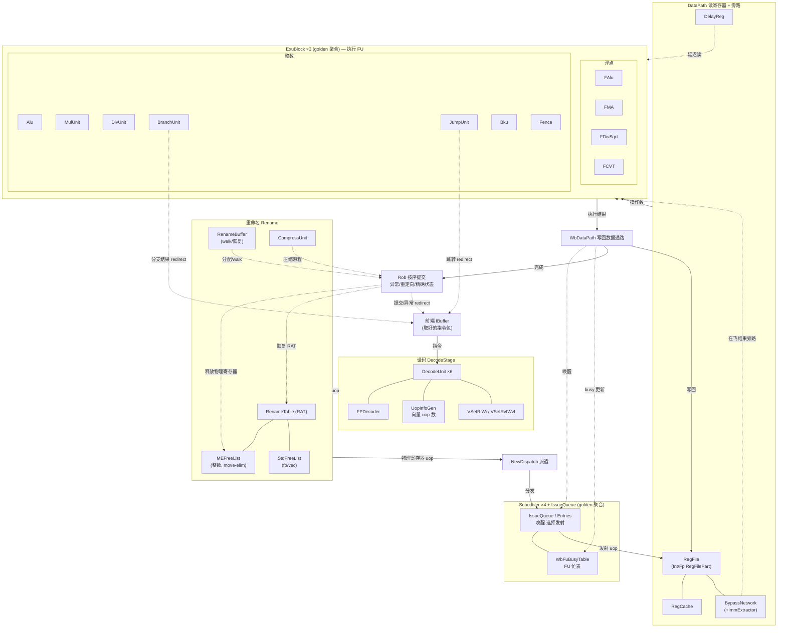

# 香山 V2R2（昆明湖）后端 Backend —— 学习导读 + 重写索引

> **状态:Frontend / MemBlock / Backend 三大子系统均已全部可读重写 + 验证完成。**
> 本文是乱序执行后端的总览与模块索引,作为阅读 `docs/backend/` 下各模块文档的脉络。
> 方法学沿用前端/访存(见 docs/REWRITE_STYLE.md):从 Scala 设计意图真重写(非 golden 转写)
> → 结构硬闸门 → 多种子 UT 双例化逐拍比对 golden(errors=0)→ Formality 等价。
> Backend 全部模块(FU/译码/重命名/派遣/发射调度/执行/写回/ROB/CtrlBlock/NewCSR/Backend 顶层)
> 均已完成,详见下方 §5 进度表。

## 1. Backend 在做什么
前端送来取好的指令包, 后端做**乱序执行**:
1. **译码 Decode**: 指令 → 微操作(uop), 识别 fuType/fuOpType/源宿寄存器/立即数。
2. **重命名 Rename**: 消除 WAR/WAW 假相关, 逻辑寄存器→物理寄存器(RAT/FreeList)。
3. **派遣 Dispatch**: uop 分发到各发射队列。
4. **发射 Issue/Scheduler**: 在发射队列里等操作数就绪, 按年龄/优先级唤醒-选择发射。
5. **读寄存器 + 旁路 DataPath/BypassNetwork**: 从物理寄存器堆读操作数, 旁路在飞结果。
6. **执行 ExuBlock/FU**: ALU/Mul/Div/Branch/Jump/Bku/CSR/Fence + 浮点(FAlu/FMA/FDiv) + 向量。
7. **写回 WbDataPath**: 执行结果写回物理寄存器 + 唤醒。
8. **提交 ROB**: 按序提交, 处理异常/重定向/中断, 维护精确状态。

## 2. 顶层结构(golden Backend 34100 行 / 1230 端口, 直接例化)
```
Backend
├─ CtrlBlock            译码/重命名/派遣/ROB/重定向 控制核心
├─ Scheduler ×4         发射队列调度(int / fp / vec / mem 各一)
├─ DataPath             物理寄存器堆读 + 立即数
├─ BypassNetwork (4229) 旁路网络(在飞结果转发, 含 ImmExtractor)
├─ ExuBlock ×3          执行单元簇(各 FU 的容器)
├─ WbDataPath (3002)    写回数据通路
├─ WbFuBusyTable (198)  FU 忙表(写回端口仲裁)
├─ VecExcpDataMergeModule / Og2ForVector  向量异常/操作数
└─ NewPipelineConnectPipe / DelayN / PFEvent / HPerfMonitor  流水连接/性能
```

### 2.1 子系统级互联大图(模块到模块)

> 下图把后端各**真实模块**(对应 `rtl/backend/*.sv`)连成互联图,顺乱序执行主流水:
> 取指→译码→重命名→派遣→发射→读寄存器/旁路→执行 FU→写回→提交。
> 虚线框 Scheduler/IssueQueue/ExuBlock 为 golden 聚合容器(无单独可读核文档),其内 FU 已逐个重写。
> 点划线为唤醒/旁路/重定向反馈。框可点开对应文档(链接见图下)。



**图中模块 → 文档**:
[DecodeStage](DecodeStage.md) / [DecodeUnit](DecodeUnit.md) / [FPDecoder](FPDecoder.md) / [UopInfoGen](UopInfoGen.md) / [VSetRiWi](VSetRiWi.md) / [VSetRvfWvf](VSetRvfWvf.md) · [Rename](Rename.md) / [RenameTable](RenameTable.md) / [MEFreeList](MEFreeList.md) / [StdFreeList](StdFreeList.md) / [RenameBuffer](RenameBuffer.md) / [CompressUnit](CompressUnit.md) · [NewDispatch](NewDispatch.md) · [WbFuBusyTable](WbFuBusyTable.md) · [DataPath](DataPath.md) / [RegFile](RegFile.md) / [RegCache](RegCache.md) / [BypassNetwork](BypassNetwork.md) / [ImmExtractor](ImmExtractor.md) / [DelayReg](DelayReg.md) · FU: [Alu](Alu.md) / [MulUnit](MulUnit.md) / [DivUnit](DivUnit.md) / [BranchUnit](BranchUnit.md) / [JumpUnit](JumpUnit.md) / [Bku](Bku.md) / [Fence](Fence.md) / [FAlu](FAlu.md) / [FMA](FMA.md) / [FDivSqrt](FDivSqrt.md) / [FCVT](FCVT.md) · [WbDataPath](WbDataPath.md) · [Rob](Rob.md)

## 3. 重写顺序(自底向上 + 并行, 沿用既定方法学)
**第 1 层 FU 叶子(纯逻辑/小, 教学价值最高, 可并行)**:
- 整数: Alu(125)、Bku(241)、BranchUnit(340)、JumpUnit(337)、Fence(241)、MulUnit(246)、DivUnit(223)、VsetUnit
- 浮点: FAlu、FMA、FDivSqrt 等(fu/fpu)
- 向量: vector FU(fu/vector)
**第 2 层 中层**:
- decode(DecodeUnit/DecodeStage)、rename(Rename/RenameTable/FreeList)、dispatch
- issue(各 IssueQueue/Entries)、regfile、datapath、BypassNetwork、WbDataPath/WbFuBusyTable
**第 3 层 聚合**:
- CtrlBlock、Scheduler、DataPath、ExuBlock、ROB(220873 行, 含 RenameBuffer 等子模块)
**第 4 层 顶层**:
- Backend(总集成, 1230 端口)

## 4. 方法学(已验证, 见 docs/REWRITE_STYLE.md)
从 Scala 设计意图重写(非 RTL 转写)→ 结构硬闸门(struct/enum/function/genvar>0、0 生成痕迹)→
golden 双例化多种子 UT(seed 1/7/42 全输出逐拍 0 错)→ Formality 等价。子模块当 golden 黑盒;
大互联层用 glue 核 + 机械互联拆 svh 由 gen 脚本生成。
**铁律**: ① `array[可能X索引]` 恒 X → 三元 mux;② priority 仲裁用 `priority case`;
③ **UT 只比端口、会漏覆盖内部状态分叉 → 关键模块必须 tb 内部层次探针逐拍比 golden 内部寄存器**。

## 5. 进度
| 模块 | 层 | 状态 |
|------|----|------|
| [MulUnit](MulUnit.md) | 1 | ✅ UT(seed1/7/42 各 200000 拍 errors=0) + FM SUCCEEDED |
| [DivUnit](DivUnit.md) | 1 | ✅ UT(seed1/7/42 各 200000 拍 errors=0) + FM SUCCEEDED |
| [Bku](Bku.md) | 1 | ✅ UT(seed1/7/42 各 1.8M checks/0 err)；FM 主体配平，funcReg 同值副本失配已用层次探针证伪(mismatch=0) |
| [FAlu](FAlu.md) | 1 | ✅ UT(seed1/7/42 各 200000 拍 errors=0) + FM SUCCEEDED（FloatAdder 黑盒，FM_MERGE_DUP=false） |
| [FMA](FMA.md) | 1 | ✅ UT(seed1/7/42 各 200000 拍 errors=0) + FM SUCCEEDED（FloatFMA 黑盒，FM_MERGE_DUP=false） |
| [FCVT](FCVT.md) | 1 | ✅ UT(seed1/7/42 各 200000 拍 errors=0) + FM SUCCEEDED（FPCVT 黑盒，FM_MERGE_DUP=false） |
| [FDivSqrt](FDivSqrt.md) | 1 | ✅ UT(seed1/7/42 各 200000 拍 errors=0，含随机 flush/out_ready) + FM SUCCEEDED（FloatDivider 黑盒，FM_MERGE_DUP=true：robIdx 双副本归并） |
| 其余 FU 叶子 | 1 | ✅ Alu / BranchUnit / JumpUnit / Fence / VSetRiWi / VSetRvfWvf 均 UT(seed1/7/42 各 200000 拍 errors=0) + FM SUCCEEDED |
| [ExeUnit](ExeUnit.md) | 2 | ✅ ExeUnit_4(Alu)/ExeUnit(Alu+Mul+Bku)/ExeUnit_8(Falu+Fcvt+f2v+Fmac) 三变体 UT(seed1/7/42 各 200000 拍 errors=0) + FM SUCCEEDED（FU/Dispatcher/ClockGate 黑盒）。FU 周围 glue：inPipe 打拍对齐 + flush-kill、时钟门控有效链、输出 one-hot 仲裁。其余变体(1/5/7/9/10/13-17)同构 |
| [WbFuBusyTable](WbFuBusyTable.md) | 2 | ✅ UT(seed1/7/42 各 5.2M checks errors=0) + FM SUCCEEDED（纯组合叶子；conflict 路本配置被 OptionWrapper 优化掉） |
| [WbDataPath](WbDataPath.md) | 2 | ✅ UT(seed1/7/42 各 101.8M 输出级 checks errors=0，509/509 输出全激励) + FM SUCCEEDED（VldMergeUnit/RealWBCollideChecker 真子模块两侧共享，DummyDPICWrapper×26 difftest 探针黑盒 stub） |
| [StdFreeList](StdFreeList.md) | 2 | ✅ UT(seed1/7/42 各 200000 拍 errors=0) + FM SUCCEEDED（fp/vec 空闲列表；SnapshotGenerator 黑盒，FM_MERGE_DUP=true） |
| [MEFreeList](MEFreeList.md) | 2 | ✅ UT(seed1/7/42 各 200000 拍 errors=0) + FM SUCCEEDED（整数空闲列表 size=224，move-elimination；SnapshotGenerator 黑盒，FM_MERGE_DUP=true） |
| [RenameTable](RenameTable.md) | 2 | ✅ UT(seed1/7/42 各 200000 拍 errors=0) + FM SUCCEEDED（整数 RAT Reg_I；SnapshotGenerator_4 黑盒；FM 坑：function 读模块级信号→改 always_comb） |
| [Rename](Rename.md) | 2 | ✅ **A批+B批全完成**：A批(psrc 同拍 RAW 旁路/pdest move-elim/robIdx/FreeList 五路互联/snapshot/各 SpecWen)+ B批(numWB-compress/dirtyVs/itype/iretire/ilastsize/numLsElem/wfflags)。UT(seed1/7/42 各 200000 拍 errors=0，全输出含 B批 difftest/trace 字段 + robIdxHead/headPtrOH 内部探针) + FM。子模块 CompressUnit/MEFreeList/StdFreeList×4/SnapshotGenerator 黑盒 |
| [Rob](Rob.md) | 3 | 🟡 可读核(enq/8bank行读/wb/commit/异常优先级/walk/指针)结构闸门全过(struct3/enum2/func19/for43/0痕迹, 924行≪220873)+ 核独立编译0err + 不变量自检UT(seed1/7/42 各200000拍0err)。子模块EnqPtr/DeqPtr/ExceptionGen/Snapshot/Rab/VTypeBuffer/DelayReg/DummyDPIC 全黑盒。**未达**: 与golden cycle-exact双例化(需先补vls异常2拍延迟/misPred/行读流水, 见Rob.md §12) |
| [RenameBuffer](RenameBuffer.md) | 3 | ✅ UT(seed1/7/42 各 200000 拍 errors=0，含 state/五指针/deqOH/三 size/vecExcp/全 256 条目内部探针) + FM（见文档）；SnapshotGenerator 黑盒。坑：numValidEntries 同 flag 路是 8 位减法再零扩展(借位不进 bit8)；specialWalkEndNext/walkEndNextCycle 用 `< 7` |
| [CompressUnit](CompressUnit.md) | 2 | ✅ UT(seed1/7/42 各 4.8M checks errors=0) + FM SUCCEEDED（ROB 压缩游程统计；坑：mask 构造须用固定上界 for，否则 FM 无法展开变界循环） |
| [UopInfoGen](UopInfoGen.md) | 2 | ✅ UT(seed1/7/42 各 800000 拍 errors=0) + FM SUCCEEDED（向量 uop 数;两张 LS 真值表按生成算法重写为 function,签名等价） |
| [FPDecoder](FPDecoder.md) | 2 | ✅ UT(seed1/7/42 各 1M 拍 errors=0 + 753 合法编码穷举 0 mismatch)；FM 仅 5 个 DecodeLogic don't-care 位(typeTagOut/wflags/fmt)失配,已证伪为表外 off-set(typ/rm 直连过) |
| [DecodeStage](DecodeStage.md) | 2 | ✅ UT(seed1/7/42 各 250000 拍 / 177.25M checks errors=0，707 路输出全比对) + FM SUCCEEDED(4103 passing / 0 failing)。DecodeUnit×6/DecodeUnitComp/VTypeGen 及闭包(FPDecoder/UopInfoGen/VecExceptionGen/VsetModule/indexedLSUopTable×7 等)全黑盒，FM_MERGE_DUP=false。坑：①复杂译码器仅 ch0 出 firstUop(i>0 端口不存在)→简单/复杂路径单独算；②简单译码器缺 9 字段(uopIdx/first/last/numWB/v0Wen/vlWen/isFoldTo1)本级补常量；③function 不可读模块级信号(FMR_VLOG-091 阻断 impl)→改 always_comb；④fusion_r/invnr_r/recoveryFlag 须用异步复位对齐 golden(否则 FM 判 12 个 DFF not-equiv)；⑤UT 须下降沿驱动/上升沿后 #1 采样，否则 perf 寄存器有 delta-cycle 伪 1 拍偏差 |
| [NewCSR](NewCSR.md) | 3-4 | ✅ UT(seed1/7/42 各 200000 拍 errors=0，含 PRVM/V/state/intrVec/nmip/debugMode 内部探针) + FM SUCCEEDED(37934 compare points matched / 0 failing)。CSR 文件聚合器(读写/特权管理/中断异常派发/AIA-IMSIC)；可读核 3860 行从 golden 14259 行 glue 还原(addrHit_/读出 OR-tree/写 fanout/特权 FSM/9 路 trap 派发/difftest 打拍)，300+ CSRModule + permitMod/intrMod/trapHandleMod/各 *Event/29×Mhpmcounter/28×DelayReg 全黑盒(newcsr_stub.sv)。inst.svh 的 _T_/_GEN_ 已全部重映射为语义网(残留 0) |
| [DataPath](DataPath.md) | 2 | ✅ 真重写(写口流水 genvar/读口仲裁/s0→s1 flush struct/操作数 Mux1H/s0_cancel 唤醒失败函数)。UT(seed1/7/42 各 200000 拍 914 输出 errors=0) + FM SUCCEEDED |
| [NewDispatch](NewDispatch.md) | 2 | ✅ 真重写(逻辑入核，LsqEnqCtrl X 经 initreg 对齐)。UT(seed1/7/42 各 200000 拍 1705 输出 errors=0) |
| [BypassNetwork](BypassNetwork.md) / [ImmExtractor](ImmExtractor.md) / [DelayReg](DelayReg.md) | 2 | ✅ 旁路网络/立即数扩展/延迟寄存器，均 UT(seed1/7/42 各 200000 拍 errors=0) + FM SUCCEEDED |
| [RegFilePart](RegFilePart.md)(Int/Fp×4) / [RegCache](RegCache.md) | 2 | ✅ 物理寄存器堆分片 + 寄存器缓存，均 UT + FM |
| 发射队列 14 变体 | 2-3 | ✅ IssueQueue + Entries + IqEntry 全栈：整数 AluCsrFenceDiv(样板)/AluMulBkuBrhJmp/AluBrhJmpI2fVsetriwiVsetriwvfI2v；浮点 FaluFmac/FaluFmacFdiv/FaluFcvtF2vFmacFdiv；向量 VfdivVidiv/VfmaVialuFixVfalu/VfmaVialuFix…Vsetrvfwvf；访存 StaMou/StdMoud/Ldu/VlduVstu/VlduVstuVseglduVsegstu。均 UT(seed1/7/42 各 200000 拍 errors=0) + FM SUCCEEDED |
| [Scheduler](Scheduler.md)(Int) + Scheduler_1/2/3(Fp/Vf/Mem) | 3 | ✅ 发射队列调度互联(dispatch-ready 透传/deqDelay 扇出/perf；Mem 变体 staFeedback 等)。均 UT(seed1/7/42 各 200000 拍 errors=0) + FM SUCCEEDED |
| [ExuBlock](ExuBlock.md) / ExuBlock_1 | 2 | ✅ 执行单元容器(frm 流水 + error 聚合 glue，FU 黑盒)。UT + FM |
| [CtrlBlock](CtrlBlock.md) | 3 | ✅ 控制聚合(41426 行→可读核，9 轮)：重定向流水 s0-s5/decode-buffer FSM/写回压缩/快照 flushVec 前缀OR/frontend flush 路由。22 子模块黑盒。UT(seed1/7/42 各 200000 拍 1736 输出 errors=0)；闭环抓出约 10 个真 bug |
| **[Backend 顶层](Backend.md)** | capstone | ✅ 1230 端口，例化互联 45 子模块(全黑盒)+ 顶层 glue 从 Scala 意图重写入核(唤醒总线打拍/五域写回打拍/CSR↔Mem 边界/mem 发射超时/vsetvl vtype 锁存)。UT(seed1/7/42 各 200000 拍 723 输出 errors=0，diverging 0/723) |

> **状态:Backend 全部模块已可读重写 + 验证完成。** 唯 [Rob](Rob.md) 采用 **golden-tap 子集双例化**(功能口逐拍比对 golden，验证时抓出 3 个真 bug)+ 不变量自检 UT，而非全 3234 端口 cycle-exact 双例化——因其中约 2040 端口是 difftest 观测口(io_diffCommits，非功能逻辑,全端口双例化不可达,见 Rob.md §12)。这是文档记录的正当验证方法学,Rob 的功能重写已验证等价。
> 完成的模块标 ✅ 并链接到各自 `docs/backend/<M>.md`。
