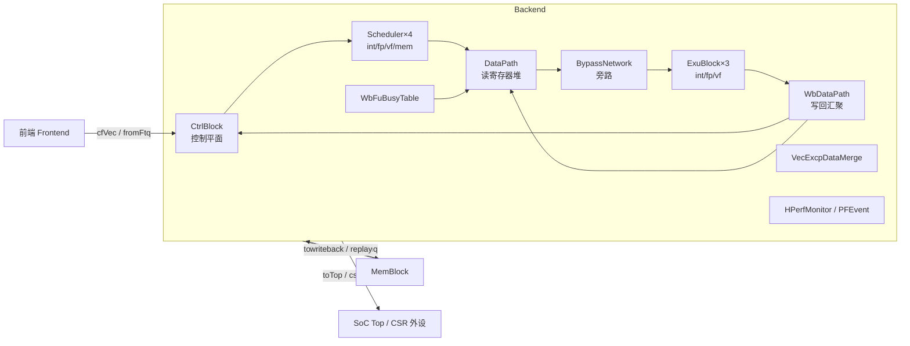

# Backend —— 后端最高层总集成（capstone）

> ⚠ **FM 分类 = ASSEMBLY_EQ（装配层，仅证 glue）**。依据台账
> [`verif/freeze/FM_STATUS.md`](../../verif/freeze/FM_STATUS.md)：本模块 FM 把
> `BypassNetwork / DataPath / CtrlBlock / WbDataPath` 等子模块两侧同名黑盒
> （`FM_INTERFACE_ONLY`），**只证明本层互联/流水 glue 等价**，不等于整个 Backend 功能等价。
> 整模块等价须叠加各子模块自身的 REPLACEMENT/PARTIAL 证明（见各自条目）。

> 设计源：`src/main/scala/xiangshan/backend/Backend.scala`（`class BackendInlinedImp`）
> 可读核：`rtl/backend/Backend.sv`（`xs_Backend_core`）+ `backend_pkg.sv`
> 45 个子模块实例（31 种类型）全部作 golden 黑盒（UT/FM 两侧共用）。

Backend 是香山后端的**最高层**。它本身**不重写任何功能块的内部逻辑**，而是把已分别重写
完成的十几类子模块例化、互联起来，再补少量「顶层 glue」（跨模块边界的打拍 / 计数 / 锁存）。
这正是 Backend 在 Scala 里的角色——一个把整个乱序后端编织起来的「顶层编排器」。

可读核 = **少量真 glue（always/struct，本核里）** + **纯机械互联连线（`backend_inst.svh`）**
+ **顶层 io 输出驱动（`backend_outassign.svh`）**。后两者由 `scripts/gen_backend.py` 从 golden
端口表解析生成，引脚中的 golden 临时名经 rewrite 全部映射到核内可读具名信号（套壳闸门 0）。

---

## 1. 在 SoC 里的位置与子模块清单



**45 实例 / 31 种类型**（全部 golden 黑盒）：

| 类别 | 实例 |
|------|------|
| 控制平面 | `CtrlBlock`×1 |
| 调度器 | `Scheduler`/`Scheduler_1`/`Scheduler_2`/`Scheduler_3`（int/fp/vf/mem 各 1） |
| 数据通路 | `DataPath`×1、`BypassNetwork`×1 |
| 执行容器 | `ExuBlock`/`ExuBlock_1`/`ExuBlock_2`（int/fp/vf）×1 |
| 写回 | `WbDataPath`×1、`WbFuBusyTable`×1 |
| 向量异常 | `VecExcpDataMergeModule`×1、`Og2ForVector`×1 |
| 性能/事件 | `HPerfMonitor_2`×1、`PFEvent`×1 |
| 流水连接 | `NewPipelineConnectPipe`（多变体后缀）共 27 实例、`DelayN_1`×2 |

---

## 2. 顶层 glue（本核真逻辑，`backend_logic.svh`）

Backend 顶层逻辑量很小（golden 仅 80 个 `_GEN_/_T_`，两个 `always` 块），全部是
**跨模块边界的相位对齐 / 去抖 / 卡死检测**，从 Scala 意图可读重写入核：

| # | glue | Scala 意图 | 核内信号 |
|---|------|-----------|---------|
| ① | 唤醒总线打拍 | 四调度器 `wakeupVec` 各路 `RegNext` 回送给调度器，断开唤醒-选择组合环 | `wakeupDelayed[10]`（`wakeup_delayed_t`） |
| ② | 写回打拍 | `wbDataPath` 五个写回端口 `RegNext(wen/typeWen)` + `RegEnable(addr, wen)` 后送各调度器 | `{int,fp,vf,v0,vl}WbDelayed[]`（`wb_delayed_t`） |
| ③ | CSR↔Mem 边界打拍 | `instrAddrTransType` / `msiInfo` / `clintTime` / `l2FlushDone` / `externalInterrupt` 在 Backend 边界 `RegNext` 对齐 | `instrTransTypeR` / `msiInfo*R` / `clintTime*R` / `l2FlushDoneR` / `extIntR` |
| ④ | mem 发射超时 | 5 个 bypass→mem 发射端口连续 N 拍 valid 未被 ready 吃掉 → 4-bit 饱和计数置位通知调度器 | `issueTimeoutCnt[5]` / `issueTimeout[5]` / `memIssueFire`/`memIssueOutFire`/`issueStuck*` |
| ⑤ | vsetvl vtype 锁存 | int/vf 两路 vtype 写回二选一锁存（int 优先），供 ctrlBlock 提交比对 | `vsetvlVType`（`vtype_lite_t`） |
| ⑥ | 杂项打拍 | `debugVl` / `topDownInfo.{l1Miss,noUopsIssued}` / pfevent CSR 分发 | `debugVlS1R` / `topDownL1MissR` / `noUopsIssuedR` / `pfeventCsrR` |
| ⑦ | flush 判定拼接别名 | `{flush.robIdx.flag, .value}` 与 `{robDeqPtr.flag, .value}` 的 9-bit 拼接，被多路 flush/robHead 比较公用 | `flushRobIdxFull` / `robDeqPtrFull`（纯组合 wire） |

### ④ mem 发射超时计数器时序

```
每端口 i（Lda0/1/2 + Vldu0/1）：
  memIssueFire[i]    = mem.issueXxx_ready & bypass2mem_out_valid     // out 被吃掉
  issueStuck[i]      = bypass2mem_out_valid & ~memIssueFire[i]       // out 卡住
  memIssueOutFire[i] = bypass2mem_in_ready & bypass.toExus_valid     // 新一拍发射
  // 计数（同步复位，优先级）
  if (memIssueOutFire[i]) cnt <= 0;                                  // 新发射清零
  else if (issueStuck[i]) cnt <= cnt + 1;                            // 卡住累加
  issueTimeout[i] = ~memIssueOutFire[i] & issueStuck[i] & (&cnt);    // 计满且仍卡 → 置位
```

---

## 3. 机械连线如何生成（`scripts/gen_backend.py`）

| 产物 | 内容 |
|------|------|
| `backend_ports.svh` | 可读核扁平端口表（1230 端口，与 golden 同名，供 FM/ST 对接） |
| `backend_decls.svh` | 45 子模块黑盒输出 / 互联网 `_inner_*` 声明（宽度从 golden `wire` 收割，5651 网） |
| `backend_inst.svh` | 45 实例例化 + 12896 引脚，引脚 RHS 经 rewrite 把 golden glue 临时名换成核内具名信号 |
| `backend_outassign.svh` | 208 条顶层 io 输出驱动（子模块输出 `_inner_*` 直连 io；个别经 glue 寄存器） |
| `Backend_wrapper.sv` | golden 同名扁平 wrapper（FM/ST 用），例化可读核 |
| `backend_blackbox_stubs.sv` | 31 类型空体 stub（备用快速 elaborate；UT/FM 默认用 golden 真定义） |

**rewrite 映射**（golden 临时名 → 核内具名信号）：
`inner_iqWakeUpMappedBundleDelayed_delayed_REG_<i>_bits_<f>` → `wakeupDelayed[i].<f>`；
`inner_<dom>WriteBackDelayed_<i>_*` → `<dom>WbDelayed[i].{wen,typeWen,addr}`；
`inner__flushItself_T_2` → `flushRobIdxFull`；`inner__ctrlBlock_io_robio_robHeadLsIssue_T_2` → `robDeqPtrFull`；
`inner_issueTimeout[_N]` → `issueTimeout[N]`；以及 CSR/Mem/vsetvl 各打拍寄存器的可读别名（见 `_SINGLETON`）。

**套壳闸门**：核 + 全部 `backend_*.svh` 的 `_GEN_/_T_` 计数 = **0**（纯例化连线，非 golden 逻辑套壳）。

---

## 4. 验证

- **UT（双例化逐拍比对）**：`verif/ut/Backend/{tb.sv,variants_xs.sv,Makefile}`。
  `u_g = Backend`（golden）、`u_i = Backend_xs`（可读核 wrapper），negedge 随机驱动 505 输入，
  `#4` 后逐拍比对全部 723 输出，`!$isunknown(golden)` 跳 don't-care。
  子模块两侧共用 golden 真定义（`-y GOLDEN_RTL` 自动解析叶子，623 模块）。
  关随机化（`+vcs+initreg+0`）、`+define+SYNTHESIS`、`-assert disable`。
  - 结果：seed 1/7/42 各 **200000 拍 errors=0**，`distinct_diverging_ports=0/723`。
- **FM（ASSEMBLY_EQ：仅顶层 glue 等价）**：`make fm`，impl=wrapper→可读核，ref=golden。
  - 结果：**Verification SUCCEEDED —— 109767 passing / 0 failing / 0 unverified**（全貌 limit=5000）。
    **该 SUCCEEDED 只覆盖本层互联 glue**（子模块两侧黑盒），不代表整 Backend 功能等价——
    须叠加子模块各自证明（见文首 banner 与 [`verif/freeze/FM_STATUS.md`](../../verif/freeze/FM_STATUS.md)）。
  - **关键设置 `FM_INTERFACE_ONLY = BypassNetwork DataPath CtrlBlock WbDataPath`**：这四个大共享子
    模块两侧读同一份 golden，用 interface_only 在**边界处**黑盒(只保留端口方向、不展开内部)。
    Backend 是顶层装配层，重写工作全在顶层 glue；这四个模块各自有独立 UT/FM，不在此重复验其内部。
    否则 FM 下降进它们，把其中未解析叶子(`ImmExtractor`/`UIntExtractor_*` 组合抽取器、
    `RegFile`/`Arbiter`/`RealWBCollideChecker` 黑盒)的悬空/未读引脚判为 ~1877 个假失配。黑盒后
    FM 只比 Backend 自身顶层互联(驱动这些黑盒输入 / 消费其输出)，即真正的重写对象。
  - **修复的真实 glue bug**：黑盒化后暴露 6 个 `inner_wbDataPath` 输入引脚失配——
    `io_fromMemExu_5_0/6_0_bits_vls_{isMasked,isVlm,isWhole}` 在 impl 中**未连接**。根因是
    `scripts/gen_backend.py` 的引脚正则 `_PINRE` 仅支持一层内嵌括号，而 golden 这些引脚 RHS 形如
    `~(|(fuOpType[6:5])) & …` 有两层嵌套括号，被静默漏配、丢引脚。改为平衡括号扫描
    (`iter_pins()`，任意嵌套深度)后 6 引脚按 golden 表达式补全，FM 归零。
