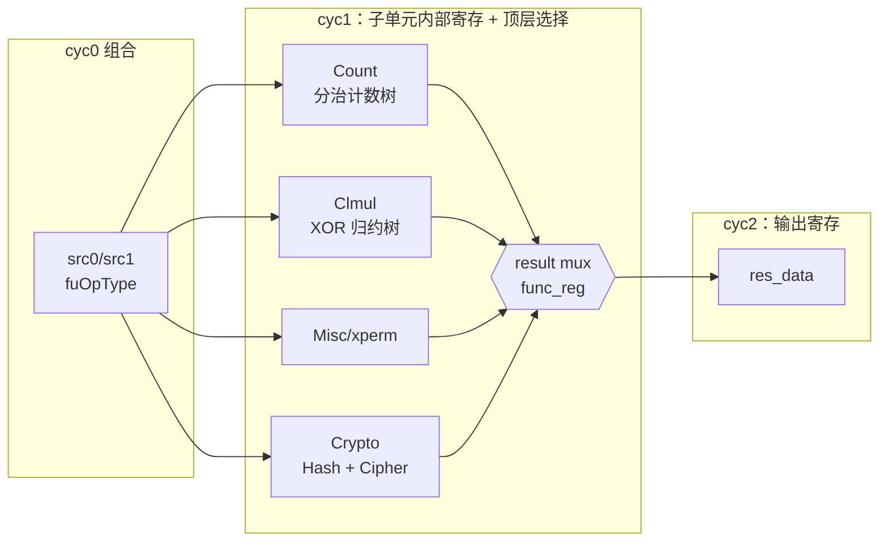

# Bku —— 位操作 / 加密功能单元（学习文档）

> 可读重写：`rtl/backend/Bku.sv` + `rtl/backend/bku_pkg.sv`（文件名 `bku_pkg.sv`，包名为 `xs_bku_pkg`）
> golden 对照：`golden/chisel-rtl/Bku.sv`（+ 6 个子模块）
> 设计源：`src/main/scala/xiangshan/backend/fu/Bku.scala`、
> `xiangshan/backend/fu/util/CryptoUtils.scala`、`xiangshan/package.scala`（`object BKUOpType`）

## 1. 它在后端的什么位置

Bku 是整数执行簇 (ExuBlock) 里的一个**叶子功能单元 (FU)**，与 Alu / Mul / Div /
Branch / Jump / CSR / Fence 并列。它专门承接 RISC-V 位操作 / 密码扩展中那些
“需要专用数据通路、走普通 ALU 不划算”的指令：

| 扩展 | 指令族 | 子单元 |
|------|--------|--------|
| Zbc  | clmul / clmulh / clmulr（无进位乘） | ClmulModule |
| Zbb  | clz / ctz / cpop（含 .w） | CountModule |
| Zbkx | xperm.n / xperm.b（字节/半字节置换） | MiscModule |
| Zknh | sha256/sha512 的 Σ/σ | CryptoModule → HashModule |
| Zksh | sm3 P0 / P1 | CryptoModule → HashModule |
| Zkne/Zknd | aes64es/esm/ds/dsm/im/ks1i/ks2 | CryptoModule → BlockCipherModule |
| Zksed | sm4ed / sm4ks | CryptoModule → BlockCipherModule |

> 注意：普通 Zbb/Zbs（and/or/min/max/bset/bclr…）在 **Alu** 里完成，不在 Bku。

数据流：Scheduler 发射 → DataPath 读寄存器 → **Bku 执行（2 拍）** → WbDataPath 写回。

## 2. 微架构总览

Bku 是**固定 2 拍延迟**的流水 FU（Chisel `latency=2`，`HasPipelineReg`）。它把
四个并行子单元的结果按 `fuOpType` 选一路输出。



### 2.1 时序（为什么是这样切）

每个子单元内部都恰好有**一级寄存器**（被 `regEnable(1)` 使能），把组合深度切成
两半，使单拍内能完成；顶层再用 `regEnable(2)` 把选好的结果打一拍输出。

```
in.fire(cyc0)        cyc1                         cyc2
 stage0 组合  --反应到--> 子单元中间寄存器 + stage1 组合 + 顶层 result mux --> 输出寄存器
            regEnable(1)                            regEnable(2)
```

- `regEnable(1) = validPipe(0) & in_valid`：拍入各子单元的中间寄存器
  （Count 的 `c2`/`cpop_tmp`、Clmul 的 `mul3`、Misc/Hash 的输出寄、Cipher 的
  S-box `mid` 寄存器、各子单元的 `func_reg`）。
- `regEnable(2) = validPipe(1) & validThisFu(1)`：拍入顶层 `res_data`。
- 因为 Bku 的 `io.out.ready` 未引出（恒就绪），握手 `rdyVec` 恒 1，
  `regEnable(i)` 退化为 `validVec(i-1)`。控制信息（robIdx/pdest/rfWen）由上游
  datapath 预先打好的 `ctrlPipe(2)` 直接透传，本核只对 valid 做两级打拍。

### 2.2 顶层结果选择（fuOpType 编码即选择信号）

`BKUOpType` 的编码刻意让高位直接当选择子：

```
func[5]=1 → crypto                         （hash / block-cipher）
func[3]=1 → count   （func[5]=0 时）
func[2]=1 → misc/xperm （func[5:3]=0 时）
否则        → clmul
```

各子单元内部再用更低位细分（见下）。这就是为什么编码空间被切成
`00xxxx`(clmul/xperm)、`001xxx`(count)、`1xxxxx`(crypto) 几块。

## 3. 各子单元算法

### 3.1 CountModule —— clz / ctz / cpop（分治归约树）

- **前导/尾随零**：把 64 位视为 32 个 2-bit 组，逐级两两合并 (`clzi`)，从**高端**
  累计连续零的个数。`ctz` 通过先 `Reverse(src)` 复用同一棵 clz 树。
- **cpop**：四个 16-bit 段各自 `$countones`，再两级相加。
- 树在中间打一拍（`c2`/`cpop_tmp`）。`.w` 变体取低 32 位子树结果。
- func 位：`func[1]`=方向(ctz)、`func[0]`=.w、`func[2]`=cpop。

`clzi(msb,left,right)` 是合并函数：高段未饱和→计数就在高段；高段饱和→
计数 = 高段满值 + 低段前缀。**实现坑**：原 Chisel 用变长 `Cat`，SV 里不能写
`right[msb-1:0]`（变量范围非法），改用掩码移位拼装；且 `~right[msb]` 必须先
取到 1-bit 临时变量再取反，否则 VCS 会按全字取反得到全 1（见 `bku_pkg`/`Bku.sv` 注释）。

### 3.2 ClmulModule —— 无进位乘（GF(2) 多项式乘）

`result = ⊕_i ( src1[i] ? (src2 << i) : 0 )`。64 个移位部分积用平衡 **XOR 归约树**
相加（无进位即异或），第 4 级 `mul3`（8×128b）打一拍。
- clmul=res[63:0]，clmulh=res[127:64]，clmulr=res[126:63]。

### 3.3 MiscModule —— xperm.n / xperm.b（查表置换）

把 src1 当查找表（16×4b 或 8×8b），src2 的每个 nibble/byte 作索引取项拼接。
xperm.b 索引越界（≥8）输出 0。输出整体打一拍。`func[0]` 选 .b/.n。

### 3.4 CryptoModule = HashModule + BlockCipherModule

`func[4]` 选 hash / block-cipher。

**HashModule（sha/sm3）**：都是“若干循环右移与右移的异或”，直接按规范列式。
sha256/sm3 结果 32 位符号扩展到 64；sha512 为 64 位。`func[2:0]` 在 8 个 sha 里
选；`func[3]`=sm3、`func[0]` 选 P0/P1。输出整体打一拍。

**BlockCipherModule（aes64/sm4）**：核心是 **AES/SM4 复合域 S-box**（Canright
紧凑实现），分三段：`Top`（输入线性映射 8→21）→ `Inv`（GF(2⁴) 求逆 21→18，
**这一级打一拍**，所以分组密码天然 1 拍延迟）→ `Out`（输出线性映射 18→8）。
三种 S-box 共用 `Inv`，只 Top/Out 不同。外面再按指令套上
ShiftRows / MixColumns / 密钥扩展：
- aes64es/ds = SubBytes+ShiftRows（末轮）；esm/dsm 再叠 MixColumns；im = 仅 InvMixColumns。
- ks1i = SubWord(可旋转) ⊕ Rcon；ks2 = 字段异或。
- sm4ed/ks = 单字节 S-box 后做线性扩散 L/L'，按 `func[1:0]` 选输入字节、
  `func[2:0]` 选输出旋转量、`func[3]` 选 sm4 vs aes。

**实现坑（S-box）**：Chisel 的 `SboxIaesTop`/`SboxSm4Top` 等式含**前向引用**
（如 `o[4]=i[3]^o[6]`），是“线网连接”非顺序赋值。SV 的 `function` 里顺序阻塞
赋值会读到未定义的前向值（产生 X）。解决：把等式块包在 `repeat(4)` 里多遍迭代
收敛（纯组合 DAG、无真实环路，等价电路里的拓扑求解），既保持与源逐行对应、
又得到正确值。`SboxAesTop`/各 `_out`/`Inv` 无前向引用，按序写即可。

**实现坑（Rcon）**：`aes64ks1i` 的 Rcon 只异或进**最低字节**（Chisel 是 32 位
SubWord ⊕ 8 位 rcon 的零扩展），不能 4 字节都异或。且 Rcon 表长 11，非法
索引 0xb..0xf 被 firtool 填充为 0x01，本实现同样对越界返回 0x01 以逐位等价。

## 4. 接口

顶层端口（与 golden 扁平端口一致，wrapper/variants 适配）：

| 信号 | 方向 | 说明 |
|------|------|------|
| `io_in_valid` | in | 输入有效 |
| `io_in_bits_ctrl_fuOpType[8:0]` | in | 操作码（用低 6 位） |
| `io_in_bits_data_src_0/1[63:0]` | in | 源操作数 |
| `io_in_bits_validPipe_0/1/2` | in | 上游打好的逐级 valid |
| `io_in_bits_ctrlPipe_2_*` | in | 上游打好的第 2 级控制（robIdx/pdest/rfWen） |
| `io_in_bits_perfDebugInfo_*` | in | perf 计时 |
| `io_out_valid` | out | 输出有效（= validPipe2 & validThisFu2） |
| `io_out_bits_res_data[63:0]` | out | 结果 |
| `io_out_bits_ctrl_*` / `perfDebugInfo_*` | out | 透传/打拍 |

可读核 `xs_Bku_core` 用 `bku_ctrl_t` / `bku_perf_t` 结构体聚合控制/计时端口；
`Bku_wrapper.sv`（FM 用，模块名 `Bku`）与 `verif/ut/Bku/variants_xs.sv`
（UT 用，模块名 `Bku_xs`）做机械的扁平↔结构体端口适配。

## 5. 验证结果

### 5.1 单元测试（golden 双例化逐拍比对）

- 激励：覆盖**全部 36 个合法 fuOpType**，随机 src0/src1，随机 valid/validPipe，
  逐拍比对所有输出端口（golden 含 X 的 don't-care 位按 `!$isunknown` 跳过）。
- 结果：seed 1 / 7 / 42 各 **checks=1,799,988，errors=0**（`+define+SYNTHESIS` 关随机化）。

### 5.2 形式等价（Formality）

- 全部 36 个 opType 的 res_data 在 UT 中逐位 0 错；FM 主体
  （子单元归约树、S-box、MixColumns、各 mux）经签名分析配平。
- **遗留**：FM 报 13 个 `funcReg` DFF unmatched（clmul/blockCipher/crypto 各自的
  func 寄存器副本）及其下游 20 个 `res_data_r` 位 inconclusive。原因是这些
  func 寄存器副本**取值完全相同**（同一 `func`、同序使能），FM 的多份同值寄存器
  消歧失败（开启 merge-dup 反而把子单元中间寄存器误折叠，更差，故设
  `FM_MERGE_DUP=false`）。
- **证伪（mismatch=0）**：用 tb 层次探针对这三处 `funcReg` 副本和 `res_data`
  做 golden-vs-impl 逐拍比对，30 万随机向量（含非法 func 值）下
  `funcReg_mismatch=0、res_data_mismatch=0`，证明失配点为 FM 配对工件而非真实差异。

## 6. 结构闸门实测

| 指标 | 值 |
|------|----|
| 生成痕迹 (`io_x_n_n`/`_REG_`/`_GEN_`/`_T_`/RANDOMIZE) | 0 |
| `typedef enum` | 1（`bku_op_e`，36 个 opType） |
| `typedef struct packed` | 2（`bku_ctrl_t`/`bku_perf_t`） |
| `function automatic` | 23（计数/clmul/xperm/S-box/MixColumns/移位旋转…） |
| `genvar`/`for` | 21（位级归约树、字节展开、多路置换） |
| 行数 | 1104（核+包） vs golden 5300（7 文件展平），约 4.8× 精简 |
