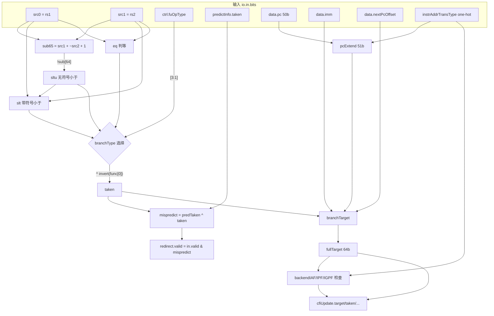

# BranchUnit —— 条件分支执行单元

> 香山 V2R2(昆明湖)后端整数执行簇里的 **0 延迟条件分支单元**。
> 设计源: `fu/wrapper/BranchUnit.scala`(class BranchUnit + AddrAddModule)、
> `fu/Branch.scala`(BranchModule)、`package.scala`(object BRUOpType)。
> 可读核: `rtl/backend/BranchUnit.sv` + `rtl/backend/branchunit_pkg.sv`。

## 1. 它在后端的位置与职责

后端经过 译码→重命名→派遣→发射→读寄存器/旁路 后, 条件分支微操作(uop)被送进
ExuBlock 的整数执行簇, 由 BranchUnit 在 **当拍** 完成:

1. **条件判定**: 对两个源操作数(rs1=src0, rs2=src1)按分支类型做带符号/无符号比较,
   得出本条分支 **实际是否跳转 (taken)**。
2. **预测校验**: 与前端 BPU 给出的预测 `predictInfo.taken` 比较, 得出
   **是否预测错误 (mispredict = predTaken ^ taken)**。
3. **重定向生成**: 仅当预测错误时, 计算正确目标地址并产生 **后端重定向 (redirect)**,
   冲刷错误路径(flushAfter), 并把正确目标/控制流信息回填前端 ftq 的 cfiUpdate。

它是 **纯组合 0 延迟 FU**: 无时钟/复位, `io.in` 进 `io.out` 同拍出。分支不写回通用
寄存器(`res.data = 0`)。

## 2. 分支编码 (BRUOpType, fuOpType 低位)

| 指令  | func[3:1] (类型) | func[0] (invert) | 含义                         |
|-------|------------------|------------------|------------------------------|
| beq   | `000` (EQ)       | 0                | taken = (src1 == src2)       |
| bne   | `000` (EQ)       | 1                | taken = !(src1 == src2)      |
| blt   | `010` (LT)       | 0                | taken = (src1 <ₛ src2)       |
| bge   | `010` (LT)       | 1                | taken = !(src1 <ₛ src2)      |
| bltu  | `100` (LTU)      | 0                | taken = (src1 <ᵤ src2)       |
| bgeu  | `100` (LTU)      | 1                | taken = !(src1 <ᵤ src2)      |

`getBranchType(func)=func[3:1]`, `isBranchInvert(func)=func[0]`。
invert 位优雅地把"取反类"分支(bne/bge/bgeu)复用同一个比较器结果再异或得到。

## 3. 数据流

## 4. 关键设计点

- **比较器复用一个减法器**: `sub65 = {0,src1} + {0,~src2} + 1`(65 位)。
  - 无符号小于 `sltu = !sub[64]`(无借位即 src1≥src2, 取反得 <)。
  - 带符号小于 `slt = src1[63] ^ src2[63] ^ sltu`(用符号位修正无符号比较)。
  - 这样 beq/blt/bltu 三类都共享同一加法器, 面积友好。见 `branchCmp` 函数。

- **目标地址 (branchTarget 函数)**:
  - `taken` 时 = `pcExtend + sext(imm[14:0])`(B 型 12 位偏移, 取 `imm[immMinWidth+2:0]`
    = imm[14:0], immMinWidth=12)。
  - `!taken` 时 = `pcExtend + (nextPcOffset << 1)`(顺序下一条 PC, 即 fallthrough)。
    预测 taken 但实际不 taken 时, 正确目标就是 fallthrough。
  - 全程在 51 位(VAddrBits+1)做加法保留进位, 最后符号扩展到 64 位 `fullTarget`。

- **pc 扩展方式取决于翻译模式**: 仅 Sv39/Sv48 一阶段按 `pc[49]` 做符号扩展(虚地址
  高位须为符号扩展), 其余补 0。见 `pc_should_sext`。

- **目标合法性检查**(取指阶段会用, 决定是否在目标处产生取指异常):
  - `backendIAF`: bare(物理寻址)时高 16 位非 0 → 访问错误。
  - `backendIPF`: Sv39 高 25 位 / Sv48 高 16 位非符号扩展(非 canonical) → 缺页。
  - `backendIGPF`: Sv39x4/Sv48x4 G-stage 客户物理地址高位非 0 → 客户缺页。

- **X 安全**: `branchCmp` 用 `unique case`(非法分支类型走 default→0), 目标加法器为
  纯算术三元 mux, 无优先级链。

## 5. 接口(可读核 `xs_BranchUnit_core`)

可读核端口名沿用 golden 扁平名(`io_*`), 便于 wrapper 透传与 FM 签名比对; 仅声明本
单元真正产生的字段。其余 cfiUpdate/折叠历史/afhob/ssp 等本单元不产生的字段, 由
`BranchUnit_wrapper.sv` 在端口适配层置 golden 常量(0)。

| 方向 | 关键端口 | 说明 |
|------|----------|------|
| in   | `io_in_bits_data_src_0/1` | rs1/rs2 |
| in   | `io_in_bits_ctrl_fuOpType[3:0]` | 分支类型 + invert |
| in   | `io_in_bits_ctrl_predictInfo_taken` | 前端预测 |
| in   | `io_in_bits_data_pc/imm/nextPcOffset` | 目标计算输入 |
| in   | `io_instrAddrTransType_*` | 翻译模式 one-hot |
| out  | `io_out_bits_res_redirect_valid` | = in.valid & mispredict |
| out  | `..._cfiUpdate_target/taken/isMisPred` | 重定向负载 |
| out  | `..._cfiUpdate_backendIAF/IPF/IGPF` | 目标异常 |
| out  | `io_out_bits_res_redirect_bits_fullTarget` | 64 位完整目标 |

## 6. 验证结果

- **结构闸门**: `typedef enum`=1(br_type_e), `typedef struct`=2(addr_trans_e/cfi_payload_t),
  `function automatic`=3(sub65/branchCmp/branchTarget); 生成痕迹 grep = 0。
- **UT**(golden `BranchUnit` vs 可读核 `BranchUnit_xs` 双例化逐拍比对全部 99 个输出,
  `$isunknown(golden)` 跳 don't-care):
  - seed 1 / 7 / 42 均 `checks=200000 errors=0` → TEST PASSED。
  - 激励覆盖: fuOpType 全 9 位随机(含非法编码)、src 全随机 + 高位收窄(触发 eq/lt 边界)、
    pc 高位偶亮(canonical 边界)、翻译模式 one-hot(0..5, 含无效)。
- **FM**(`make fm`): `FM_RESULT: Verification SUCCEEDED`,
  840 compare points matched, 0 unmatched(BranchModule/AddrAddModule/SubModule 作两侧
  共享黑盒)。非空判等, 证明可读核与 golden 逐位等价。
