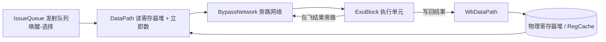
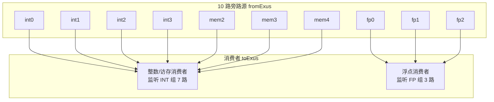
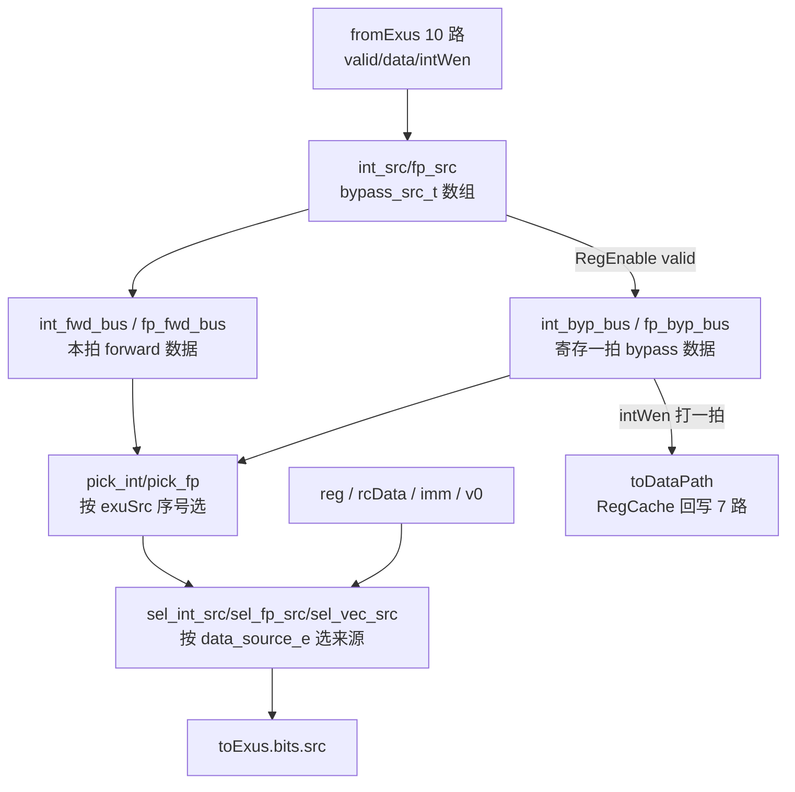

# BypassNetwork(旁路网络)—— 学习文档

> 设计源:`src/main/scala/xiangshan/backend/datapath/BypassNetwork.scala`(class BypassNetwork)
> 与 `DataSource.scala`。可读重写:`rtl/backend/BypassNetwork.sv` + `bypassnetwork_pkg.sv`。

## 1. 它在后端的什么位置、解决什么问题

后端乱序执行的数据通路大致是:

一条 uop 被选中发射时,它的某个源操作数所依赖的「生产者」可能**刚刚算完、还没写回
物理寄存器堆**。如果死等写回再读回,RAW(读后写)依赖会拉长关键路径。BypassNetwork
就是把生产者 EXU 的**在飞结果**直接转发给消费者源操作数,省掉「写回 → 读回」的往返。

关键认识:**旁路匹配不在这里做**。发射队列在唤醒阶段就已经决定了「某源操作数来自哪个
EXU、取本拍直出还是寄存一拍」,并把决策编码进 DataPath 透传过来的两个小字段。本网络
只是个**按这两个字段选择数据来源的大型多路选择器**(组合为主 + 少量寄存)。

## 2. 两个决策字段(来自 DataPath)

每个源操作数带两个字段(见 `data_source_e` 与 exuSources):

| 字段 | 含义 |
|------|------|
| `dataSources[s].value` | 该源取**哪种来源**:forward / bypass / imm / regcache / reg / v0 / zero |
| `exuSources[s].value`  | 若取 forward/bypass,**生产者 EXU 在唤醒源组内的序号**(从 1 起;0=无) |

`data_source_e` 编码(`DataSource.scala`):

| 值 | 名 | 含义 |
|----|----|----|
| 0000 | ZERO | 读 int 0 号寄存器,恒 0 |
| 0001 | FORWARD | 生产者 EXU **本拍**直出结果(同拍前递) |
| 0010 | BYPASS | 生产者 EXU **上一拍**结果(寄存一拍) |
| 0011 | BYPASS2 | 二级旁路(VF/Load 向量域);**本配置未接通** |
| 0100 | IMM | 立即数(经 ImmExtractor 黑盒,或 Load 的内联 U 型) |
| 0101 | V0 | 向量 v0 掩码寄存器(向量源专用) |
| 0110 | REGCACHE | 寄存器缓存读出 |
| 1000 | REG | 物理寄存器堆读出(最高位为 1 即「读寄存器」) |

## 3. 旁路源拓扑与「匹配退化为索引」

本 BackendParams 下,27 个 EXU 中只有 **10 路是旁路源**(会把结果旁路出去):

- **INT 组(7 路)**:`{int0,int1,int2,int3, mem2,mem3,mem4}` —— 整数与访存消费者监听。
- **FP 组(3 路)**:`{fp0,fp1,fp2}` —— 浮点消费者监听。

Chisel 里用 `forwardOrBypassValidVec3`(27 位 one-hot)+ `Mux1H` 表达匹配,firtool 把它
展平成长长的 OR-mux 链(`ext_io_out[bit] ? data : 0 | ...`)。但本质上 `exuSources.value`
就是「生产者在组内的序号」,one-hot = `1 << value` 散布。所以**匹配退化为按序号的一次
索引选择**:`value∈1..N → 选第 (value-1) 路`,`value==0 → 0`。可读核就是这么写的
(`pick_int` / `pick_fp`),比 OR-mux 链清晰得多,且 X 安全(越界给 0)。

## 4. 数据流(可读核结构)

- **`bypass_src_t`**(struct):把每个旁路源的 `valid/int_wen/data` 聚合,数组化按序号索引。
- **forward / bypass 总线**:forward = 本拍数据;bypass = `RegEnable(data, valid)`(只在
  有效时更新,省功耗)。两者打包成 packed 总线作函数实参(敏感性可靠、综合/FM 友好)。
- **`sel_*` 函数**:按 `data_source_e` 在 forward/bypass/imm/regcache/reg/v0/zero 间选一。
- **RegCache 回写(`toDataPath`)**:会写整数寄存器的 7 路旁路源,其 bypass 数据 + `intWen`
  各打一拍写回 DataPath 的寄存器缓存。

## 5. 几个特殊通道

- **分支单元(Brh)imm / nextPcOffset**(int_0_1 / 1_1 / 2_1):
  `immBJU = imm + (isJALR ? 0 : ftqOffset<<1)`、`nextPcOffset = ftqOffset + (isRVC?1:2)`。
  见 `brh_imm` / `brh_next_pc_off`。
- **Load EXU 的 src0 立即数**(mem2/3/4):不经 ImmExtractor,直接内联 U 型展开
  `{{32{imm[31]}}, imm[31:12], 12'h0}`(`load_imm_u`),对应有效地址偏移。
- **向量 v0 源**(vf / load-vec):某向量源取 v0 时,数据来自该 EXU 已解析好的 `src_3`
  载体(`src_3` 本身按其 `dataSources_3` 选 reg/imm)。见 `sel_vec_src` 与 body 里的接法。
- **bypass2**:Scala 为 VF/Load 向量域预留了二级旁路,但本配置 `readBypass2` 恒 false
  (golden 里无任何 `4'h3` 分支),故不实现。

## 6. 接口规模

| 类别 | 数量 | 说明 |
|------|------|------|
| 总端口 | 1451 | 808 输入 / 643 输出 |
| 源操作数输出(计算) | 71 | 调用 `sel_*` 旁路选择 |
| 直通输出(valid/bits) | 543 | `toExus.bits = fromDataPath.bits`(src 除外) |
| ready 反向 | 15 | `fromDataPath.ready = toExus.ready` |
| RegCache 回写 | 14 | 7 路 wen + data |

1451 个端口的机械互联拆进 `bypassnetwork_ports.svh` / `bypassnetwork_body.svh`,由
`scripts/gen_bypassnetwork.py` 从 golden 解析生成;旁路算法本体(enum/struct/function/
genvar)在手写可读核 `xs_BypassNetwork_core` 里。

## 7. 验证结果

| 项 | 结果 |
|----|------|
| 结构闸门 | typedef struct packed=1、typedef enum=1、function automatic=9、genvar/for=6、生成痕迹=0;可读核 225 行 vs golden 4229 行 |
| UT(seed 1/7/42) | 各 200000 拍,checks=200000,**errors=0**(逐拍比对全部 643 输出) |
| FM | **SUCCEEDED**(ImmExtractor/UIntExtractor 黑盒) |

- **黑盒子模块**:`ImmExtractor`(及 `_2/_12/_37/_57` 变体)立即数扩展;`UIntExtractor`
  仅 golden 顶层用(把 exuSources one-hot 散布到 27 位),可读核已还原成「按序号索引」故不
  实例化,仅作 golden 侧依赖。
- **关键坑**:
  1. **匹配=索引**:firtool 的 OR-mux 链还原成按 `exuSources.value` 的序号索引,X 安全。
  2. **函数敏感性 / FM 兼容**:旁路选择函数若在连续赋值里读模块级数组,部分仿真器敏感性
     不可靠、且 Formality 以「函数读非局部变量(FMR_VLOG-091)」拒读设计。解决:把
     forward/bypass 总线作 **packed 实参**整体传入,函数不读任何模块级变量;源操作数用
     `always_comb` 调用(敏感列表自动包含实参)。
  3. **来源子集异构**:每个 EXU 允许的来源不同(int 有 imm/regcache、fp 没有、vec 有 v0)。
     `sel_*` 把所有候选都作实参,调用点对不支持的来源传 0(如 vec 的 src_4 无 v0 → v0 传 0)。
  4. **Load src0 立即数**内联 U 型,不走 ImmExtractor 黑盒。
