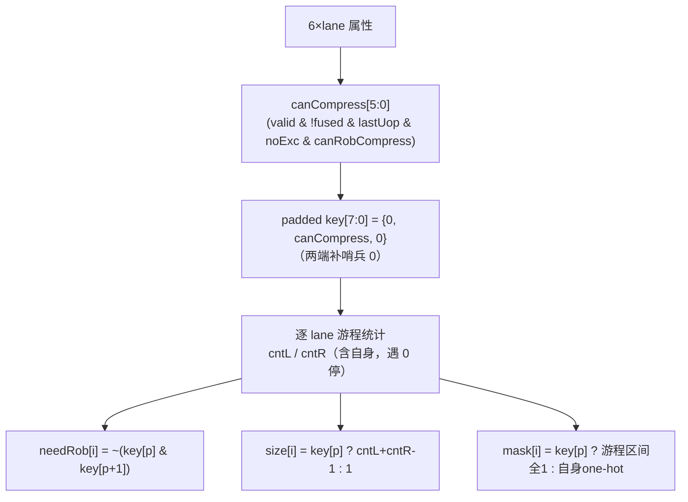

# CompressUnit —— ROB 压缩单元（昆明湖后端 / 重命名前置叶子）

> Scala 源：`xiangshan.backend.rename.CompressUnit`
> 可读核：`rtl/backend/CompressUnit.sv`（`xs_CompressUnit_core`）+ `rtl/backend/compressunit_pkg.sv`
> wrapper：`rtl/backend/CompressUnit_wrapper.sv`（golden 同名，机械生成）
> gen 脚本：`scripts/gen_compressunit.py`（生成 wrapper / xs 变体 / UT 桥接）
> golden：`golden/chisel-rtl/CompressUnit.sv`（662 行 / 198 端口，纯叶子）

## 1. 架构定位与"为什么要 ROB 压缩"

重命名阶段每拍最多吞 `RenameWidth=6` 条指令。某些**连续**且"可压缩"
（`canRobCompress`）的指令——典型是 fusion 融合产物、或同一宏指令拆出的微
操作——可以**共享一个 ROB 表项**提交，从而在不增加 ROB 物理表项的前提下
扩大有效指令窗口（思路见 CROB 论文，Latorre et al. 2011）。

CompressUnit 是纯组合叶子，在重命名前算出这 6 条里：哪些能压成一组、每组
多大、组的"最后一条"是谁（谁占 ROB 表项）。

## 2. 输出语义（对每条 lane i ∈ 0..5）

| 输出 | 含义 |
|------|------|
| `canCompressVec[i]` | 该 lane 本身是否可参与压缩（见 §3.1） |
| `needRobFlags[i]` | 该 lane 是否需**独占一个 ROB 表项**：压缩组里只有"组末"那条置 1，组内其余并入组末（置 0）；不可压缩指令各自置 1 |
| `instrSizes[i]` | 含该 lane 的压缩组大小（可压=连续 1 的游程长度；不可压=1） |
| `masks[i]` | 6 位掩码，标出和该 lane 同组的所有 lane（不可压=仅自身位） |

## 3. 算法（直接来自 Scala 设计意图）



### 3.1 canCompress 判定
```
canCompress[i] = valid[i] & !isFused(commitType[i]) & lastUop[i]
               & noExc[i] & canRobCompress[i]
noExc[i]       = (exceptionVec[i] == 0) & (trigger[i] != DebugMode)
isFused(c)     = c[2]
```
被 fusion 融合的指令本身已是合并结果、有异常/进调试模式的指令不能并组。

### 3.2 两端补 0 的 padded key
把 `canCompress`（6 位）两端各补一个哨兵 0，得 8 位 `key`，lane i 对应
padded 下标 `p=i+1`。这样游程统计在边界无需特判（哨兵 0 自然终止游程），
正是 Scala `0 +: key :+ 0` 的硬件对应。

### 3.3 游程统计 → 三组输出
- `cntL(p)`/`cntR(p)`：从 p 向左/右数连续 1 的个数（含自身），`key[p]=0` 时为 0；
- `needRob[i] = ~(key[p] & key[p+1])`：右邻也是 1 → 本条并入右边（0）；
- `size[i] = key[p] ? cntL+cntR-1 : 1`；
- `mask[i]`：可压缩时点亮游程区间 `[i-(cntL-1) , i+(cntR-1)]`，否则仅自身位。

> 注：Scala 把这一函数对 `2^6=64` 种 key 预计算成 `DecodeLogic` 真值表；可读
> 核用逐 lane 组合游程统计**等价重建**，无需查表，且与 golden 逐位等价（FM 通过）。

## 4. 验证

### UT（`verif/ut/CompressUnit/`）
golden vs 可读核双例化，每拍随机驱动 6 条 lane 全部属性，**重点制造各种
canCompress 游程**（全 1 / 全 0 / 单点 / 稀疏 / 全随机），逐拍比对全部 **24 个
输出**（needRobFlags×6 / instrSizes×6 / masks×6 / canCompressVec×6）。

| seed | checks | errors |
|------|--------|--------|
| 1  | 4,800,000 | 0 |
| 7  | 4,800,000 | 0 |
| 42 | 4,800,000 | 0 |

### FM
`make fm`：**SUCCEEDED**。可读核与 golden 的 64 项真值表逐位等价。

## 5. 结构闸门实测

| 指标 | 值 |
|------|----|
| `typedef struct` | 1（compress_in_t） |
| `function automatic` | 2（cnt_left / cnt_right） |
| `for` | 5 |
| `typedef enum` | 0（本模块无离散状态/cause，纯游程数学，故无） |
| 生成痕迹 grep | 0 |
| 核行数 | 122（golden 662） |

## 6. 关键坑

1. **Formality 不能展开运行时变界 `for`**：mask 构造若写
   `for (b=0; b<run_len; b++)`（`run_len` 是运行时值）会触发
   `FMR_ELAB-268 Loop exceeded the maximum iteration limit`，FM 无法 link。
   改成**固定上界**遍历 `for (b=0; b<RENAME_WIDTH; b++) if (lo<=b<=hi) m[b]=1`
   即可，UT 行为不变、FM 成功。
2. **198 端口 wrapper 手写易错**：用 `gen_compressunit.py` 机械生成
   wrapper / `--xs` 变体 / `--bridge`（UT 数组↔扁平端口桥接），保证端口名与
   golden 逐字一致。
