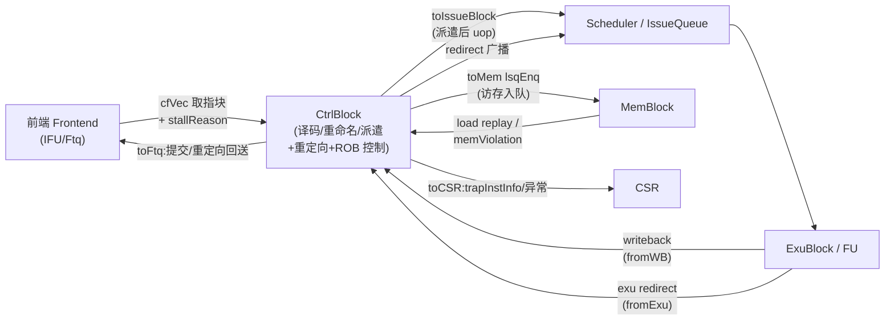
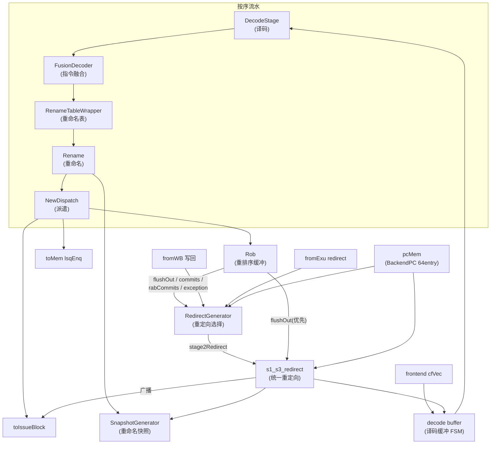
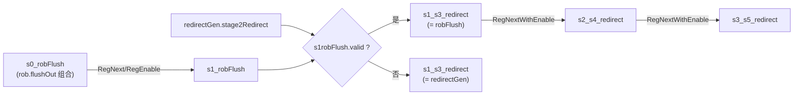
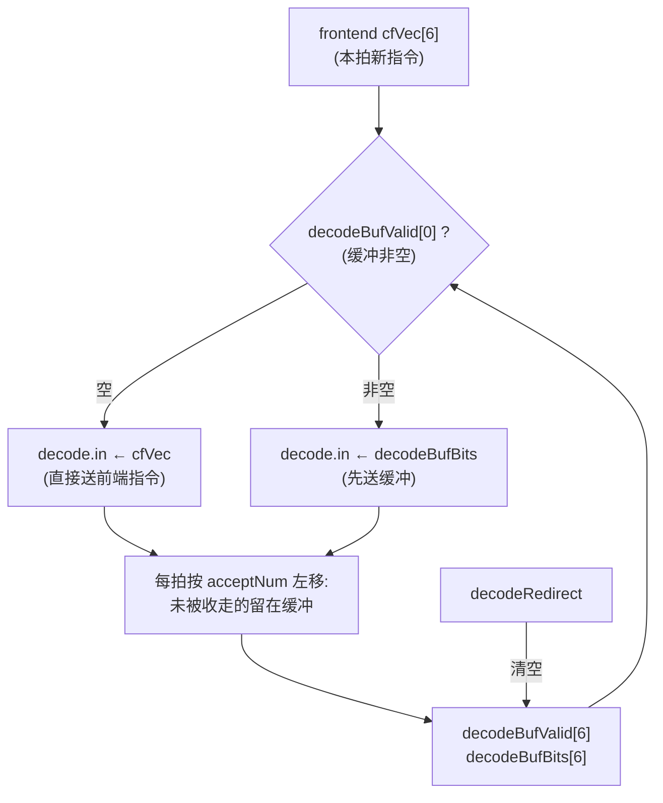
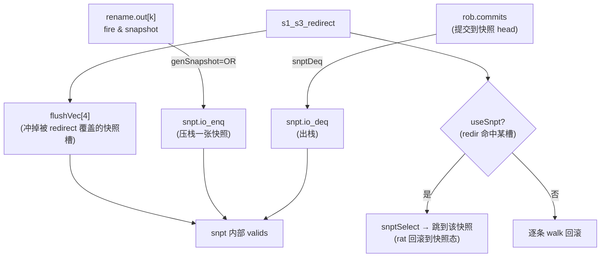

# CtrlBlock —— 后端控制平面(重定向 / decode-rename-dispatch 流水 / ROB 控制)

> 设计源:`src/main/scala/xiangshan/backend/CtrlBlock.scala`(`class CtrlBlockImp`)
> 可读核:`rtl/backend/CtrlBlock.sv`(`xs_CtrlBlock_core`)+ `ctrlblock_pkg.sv`
> 22 个子模块(Rob / NewDispatch / DecodeStage / FusionDecoder / RenameTableWrapper /
> Rename / RedirectGenerator / pcMem / MemCtrl / Trace / GPAMem / SnapshotGenerator /
> 6×PipelineConnect / PipeGroupConnect / DelayN×3)全部作 golden 黑盒。

CtrlBlock 是后端的**控制平面顶层**:它把「取指来的指令流」推过 **译码 → 重命名 → 派遣 → ROB 入队**
这条按序流水,同时维护**重定向(redirect)/冲刷(flush)** 的生成与广播、重命名**快照(snapshot)**
的生成/选择/回滚、写回(writeback)的打拍与压缩、以及给前端 FTQ 的提交/重定向回送。

可读核本身**不重写各功能块的内部逻辑**(译码表、重命名映射、ROB 队列、重定向选择都在子模块里),
而是聚焦于**子模块之间的控制 glue**:跨级打拍、相位对齐、优先级仲裁、环形指针比较、状态机移位。
这正是 CtrlBlock 在 Scala 里的角色——一个把十几个子模块编织起来的「控制编排器」。

---

## 1. 在后端流水里的位置



CtrlBlock 横跨后端按序段的全部流水级(对应 Rename/Dispatch 的 `s0…s5`),
向后(乱序段)输出派遣好的 uop 与统一的 redirect 广播,向前(前端)回送提交点与重定向目标。

---

## 2. 内部数据流总览



核内 glue 按 `CtrlBlock.sv` 的 include 顺序分为几大块(详见 §3–§8)。

---

## 3. 重定向流水(块 1,`ctrlblock_logic.svh`)

重定向是后端最关键的控制信号:它决定何时冲刷流水、回滚到哪个 robIdx/ftqIdx。
CtrlBlock 把两路重定向源合并成一条**统一重定向 `s1_s3_redirect`**,再逐级打拍广播。

两路源:
1. **ROB flush**(`rob.io.flushOut`):异常/中断/flushPipe/replay 触发的整机冲刷,**优先级最高**。
2. **RedirectGenerator stage2**(`redirectGen.io.stage2Redirect`):分支误预测、访存违例等
   由写回/EXU 重定向选出「最旧」后产生。



```
s1_s3_redirect = s1_robFlushValid ? s1_robFlush : redirectGen.stage2Redirect   // 三元 mux(X 铁律)
io.redirect(广播) = s1_s3_redirect           // 给 IssueQueue/ExuBlock,它们各自再 RegNext
s2_s4_redirect = RegNextWithEnable(s1_s3_redirect)   // 用于 flush 各子单元
s3_s5_redirect = RegNextWithEnable(s2_s4_redirect)
```

**要点**
- `s1_robFlush` 的 valid 用 `GatedValidRegNext`(复位为 0 的 `RegNext`),bits 用 `RegEnable`
  (仅在 `s0_robFlushValid` 时打入)——这样冲刷沿正确对齐到下一拍。
- `s2_s4_pendingRedirectValid`:`s1_s3_redirect` 一旦有效就置 1,直到 `io.frontend.toFtq.redirect`
  打一拍有效后清 0。它用于在重定向「在途」期间持续冲刷译码缓冲(`decodeRedirect`)。
- 环形指针比较:robIdx/ftqIdx 都是「flag + value」环形指针,比较用
  `a > b = (a.flag ^ b.flag) ^ (a.value > b.value)`(`ctrlblock_pkg::ptr_gt`),
  绝不能用朴素 `{flag,value}` 拼接比较(绕回后会错)。

### 3.1 exu redirect 选最旧(`ctrlblock_glue2.svh`)

RedirectGenerator 需要「所有 EXU 重定向里最旧的那条」。候选固定取写回口
`wbData[1/3/5/7]`(能产 redirect 的 4 个口)。核把每个候选收进 `exu_redir_cand_t` struct,
判有效(真改流 & 未被更老 redirect 杀),再两两环形比较选最旧:

```
exuOldestOH = 严格复刻 golden resultOnehot:robIdx 成环 → 无人当选(exuOldestValid=0)
cv_i_j      = (wbData_i.flag ^ wbData_j.flag ^ (val_i > val_j))   // 直接引顶层端口算,绕开 struct
```

> **历史教训(round8)**:`cv_*` 比较若直接读 `always_comb` clear-then-overwrite 的 struct 字段,
> VCS 可能读到中间 X 态。改为**直接引顶层端口** `io_fromWB_wbData_*_bits_redirect_bits_robIdx_*`
> 做比较即稳定。`oldestExuRedirect.debugIsCtrl = exuOldestValid`(选中拍恒 1);
> `IsCSR = (exuOldestOH==4'b1000)`(候选 3=wbData_7 是 CSR 源)。

---

## 4. 译码缓冲 FSM(块 2 / 2b,`ctrlblock_logic.svh`)

前端一次送来一个取指块(`cfVec`,DecodeWidth=6 条),但下游 DecodeStage 不一定每拍全收。
**decode buffer** 缓存「本拍没被收走」的指令,下一拍优先送缓冲里的、再补前端新来的。



- `decodeBufNotAccept[i] = decodeBufValid[i] & !decode.in[i].ready`
  → `decodeBufAcceptNum` = 第一个 notAccept 的下标(`first_set_idx`,即 PriorityMuxDefault)。
- `decodeFromFrontendNotAccept[i] = decodeBufValid[0] | (cfVec[i].valid & !ready)`
  → `decodeFromFrontendAcceptNum`。
- **valid 移位(块 2)**:每条按三分支优先级(priority case,X 铁律)更新:
  ① redirect 或本条是最后一个被接收 → 0;② 缓冲内有效且 drop(i) 还有 notAccept → 左移取
  `buf[i+acceptNum]`;③ 缓冲空且前端 drop(i) 还有 notAccept → `cfVec[i+feNum].valid`。
- **bits 移位(块 2b)**:`decodeBufBits[6]`(`decode_buf_bits_t`,逐字段具名)与 valid 同套
  **per-lane** 条件搬移(`buf_shift_bits`),前端来的指令由 `pack_cfvec()` 装进 struct。

> **历史教训(round7)**:bits 的搬移/装载条件必须**逐 lane**(用块 2 的 per-lane 条件
> `bufNotAcceptDropOr[i]/feNotAcceptDropOr[i]`),不能用全局条件,否则个别 lane 的 instr 会错。
> 另:DecodeStage 的 6 个 `io_in_k_ready` 是**标量**输出,FSM 读的是**向量** `_decode_io_in_ready[5:0]`,
> 须在 glue4 显式 `assign` 聚合,否则向量恒读 0(悬空)。

---

## 5. 写回打拍 / 压缩(块 3,`ctrlblock_datapath.svh`)

写回(writeback)送进 ROB 前要打拍对齐,并做**同 robIdx 压缩**(多个写回口指向同一条
ROB 项时合并计数)。同时**杀掉被更老 redirect 冲掉的写回**(`wbKilledByOlder`)。

```
wbDelayedBits[27]  = RegEnable(整 ExuOutput struct, en=输入 valid)        // 写回 bits 打一拍
wbDelayedValid[27] = GatedValidRegNext(valid & !killedByOlder)            // 杀掉被冲的
wbDelayedValidRaw  = GatedValidRegNext(valid)                             // 不杀(送 exuWriteback)
wbNumsBits/Valid   = 同 robIdx 压缩 PopCount(从 golden Nums 树精确反解的分组)
```

- 压缩分组表(组 A 11 路 / 组 B 16 路 / 组 C 7 路 / 组 D {self} / 组 E {23,24})从 golden 的
  `Nums` PopCount 树逐口反解;`count_group_*` 是纯 function automatic + PopCount。
- std FU(口 25/26,仅 robIdx)不参与杀/压缩。

### 5.1 enqRob 入队打拍(块 6)

```
enqRobValid[i] = RegNext(dispatch.req[i].valid & !s1_s3_redirect_valid)   // 重定向拍清掉入队
enqRobBits[i]  = RegEnable(dispatch.req[i].bits, en=dispatch.req[i].valid) // rob_enq_uop_t struct
```

---

## 6. 快照:生成 / 选择 / 回滚(块 4,`ctrlblock_logic.svh` + `glue3`)

重命名表(RAT)在每条带 `snapshot` 标记的指令处**拍一张快照**,redirect 时若能命中某张快照
就直接跳到它(`useSnpt`),省去逐条 walk 回滚,大幅缩短恢复延迟。
快照存储在 `SnapshotGenerator`(4 槽环形,`enqPtr/deqPtr`)。



- **genSnapshot**(= `snpt.io_enq`):`OR_k( decodeFusionAdv[k] & rename.out[k].snapshot )`,
  其中 `decodeFusionAdv[k] = renamePipeDispatch.in[k].ready & rename.out[k].valid`。
- **snptDeq**:`valids[deqPtr] & rob.commits.isCommit & OR(commit.robIdx == snapshots[deqPtr].head)`。
- **useSnpt**:对每槽判断 redirect.robIdx 是否落在该槽 head 之后(或同条且非 flushItself):
  `valids[s] & ( ptr_ge(redir, head) & redir!=head | ~flushItself & redir==head )`。
- **snptSelect**:按 `(enqPtr-1, -2, -3, -4)` 环形序的 priority case 选第一个命中的槽。

### 6.1 flushVec —— 快照逐槽冲刷(round9 修复点)

redirect 到来时,**每个快照槽**要判断是否整槽作废(`flushVec[s]`)。一张快照含 RenameWidth=6 条
uop 的 robIdx + isCFI;整槽冲刷的条件是「每条 uop 都满足 `shouldFlush | ~isCFI`」。

**关键(前缀 OR 语义)**:第 `k` 条 uop 的 `shouldFlush` 判据不是它**自身**是否 ≥ redirect,
而是「**0..k 条里有任一** ≥ redirect」——即一旦快照内某较早(或同位)的 uop 应被冲,
其后所有 uop 都视为被冲。这对应 XiangShan Scala 里的累积 mask:

```
shouldFlush[k] = (flag[k] ^ redir.flag ^ (value[k] >= redir.value)) | (value[k] == redir.value)
prefixOr[k]    = OR( shouldFlush[0 .. k] )                          // ★ 前缀 OR(累积)
flushVec[s]    = redirect.valid & AND_k( prefixOr[k] | ~isCFI[k] )
```

> **历史教训(round9)**:核早期实现漏了**前缀 OR**(只用 `shouldFlush[k]` 自身),在个别拍
> 算出的 `flushVec` 偏差 → SnapshotGenerator 的 `valids/enqPtr` 偏 1 拍 →
> `rob.rabCommits.isWalk` 偏 1 拍 →(经 Rename 透传)`io_frontend_stallReason_backReason_bits`
> 出现「g=0x21/0x22 i=0x25」的 1 拍瞬态,并连带 `io_toCSR_trapInstInfo`/`io_perf_*` 簇错。
> 加上前缀 OR(`slot_flush`/`should_flush_uop` 两个 function automatic)后全部归零。

> **历史教训(round8)**:SnapshotGenerator 的标量输出(`io_valids_0..3`/`snapshots_N_robIdx_M`)
> 必须在 glue4 聚合成核内消费的**向量/head 命名**(`_snpt_io_valids[3:0]` 等),否则向量声明
> 悬空 = X,经 useSnpt 毒化全核。

---

## 7. frontend flush 路由(块 5,`ctrlblock_logic.svh` + `outglue`)

CtrlBlock 把重定向/提交信息回送前端 FTQ:

- **commits → FTQ**:`valid = RegNext(s1_isCommit[k])`,`bits = RegEnable(commits.info[k].{commitType,ftqIdx,ftqOffset})`。
- **toFtq.redirect**:由 `s1_s3_redirect` 经 `s6_flushFromRob` 延迟链 + redirectGen 字段 + cfiUpdate 组成。
- **frontendFlushBits** / **newestTarget FSM**:为重定向目标 PC 选择(快照命中时用 newestTarget,
  否则用 pcMem 读出)。

---

## 8. 输出侧打拍 glue(`outglue.svh` / `outglue2.svh`)

- **io_perf**(62 路):`perfSrc[63]` 源表 → 两级打拍(stage0/stage1)→ 逐口具名输出。
- **s2_s4_redirect_next**:重定向流水输出(给 IssueBlock/DataPath/ExuBlock 的 flush)。
- **ratOldPest / traceCoreInterface / robio / wfi / io_error / retiredInstr** 等:
  ROB/RAT/Trace 子模块输出 → 顶层 io 的寄存器化转发。

---

## 9. 子模块(全部 golden 黑盒)

| 子模块 | 职责 |
|---|---|
| `DecodeStage` / `FusionDecoder` | 译码 + 指令融合 |
| `RenameTableWrapper` / `Rename` | 重命名表 + 重命名 |
| `NewDispatch` | 派遣(分发到 IQ / LSQ + ROB 入队请求) |
| `Rob` | 重排序缓冲(提交 / walk / 异常 / flushOut) |
| `RedirectGenerator` | 从 EXU/写回重定向选最旧 → stage2Redirect |
| `SnapshotGenerator` | 重命名快照(4 槽环形) |
| `pcMem`(SyncDataModule BackendPC) | 后端 PC 存储(robFlush/redirect 读口) |
| `MemCtrl` / `GPAMem` / `Trace` | 访存控制 / GPA 存储 / trace |
| `PipelineConnect×6` / `PipeGroupConnect` / `DelayN×3` | 流水寄存/延迟 |

可读核只重写**它们之间的控制 glue**,不重写子模块内部逻辑。

---

## 10. 验证

- **UT**(`verif/ut/CtrlBlock/`):双例化 `u_g`=golden CtrlBlock vs `u_i`=可读核(16 子模块两侧
  共用同一份 golden 黑盒,`-y` 自动解析叶子,`+SYNTHESIS`,运行期 `+vcs+initreg+0`)。
  逐拍比对 1736 个输出端口,`!$isunknown(golden)` 跳 don't-care。
  **seed 1/7/42 各 200000 拍 errors=0**。
- 探针:`+SRPROBE`(stallReason/snapshot/walk 链层次探针)、`+PROBE`(redirect/decode 链)、
  `+DUMP`/`+XDUMP`(exuOldest / snptValids X 早期态)——用「第一处分叉拍 + 上游逐级对照 golden」
  定位真 bug。
- **FM(如实)**:`make fm` 结果 **FAILED**——**72701 passing / 20 failing / 14753 unverified**。
  failing=20 恰为 Formality 默认 `verification_failing_point_limit=20`,verify 在 **83%** 处触限
  提前中止,尚有 14753 个 compare point 未验证。前 20 个 failing 中 **17 个是本核 glue 寄存器**
  (decodeBufValid×6 / ftqCommitValid×8(io_frontend_toFtq_rob_commits_*_valid_last,其中 6 个
  impl 侧被 FM 判为 DFF0X 常量寄存器)/ mdpVldLast×2 / s1_robFlushValid)+ 3 个 decoders BBPin
  (io_enq_ctrlFlow_foldpc)。这些 glue 寄存器在 UT 200k×3 中逐拍 0 错,但**未做 FM 逐点证伪**
  (未像 Bku 那样用层次探针闭环),失配是否纯属 FM 初值/黑盒 X 建模差异未定论。
  **结论口径:UT 为权威;FM 部分验证、未收敛。**
- **结构闸门**:核 + 所有手写 svh + pkg 的 `_GEN_/_T_[0-9]` = 0;struct/enum/function/genvar
  充分;无套壳。X 铁律(数组变量索引、clear-then-overwrite struct 进算术比较一律改三元/直引端口)。
