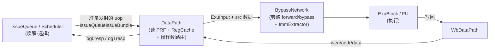
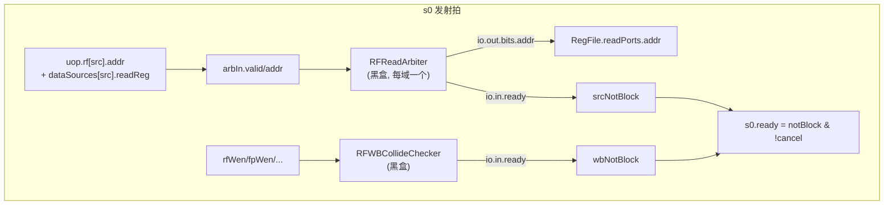
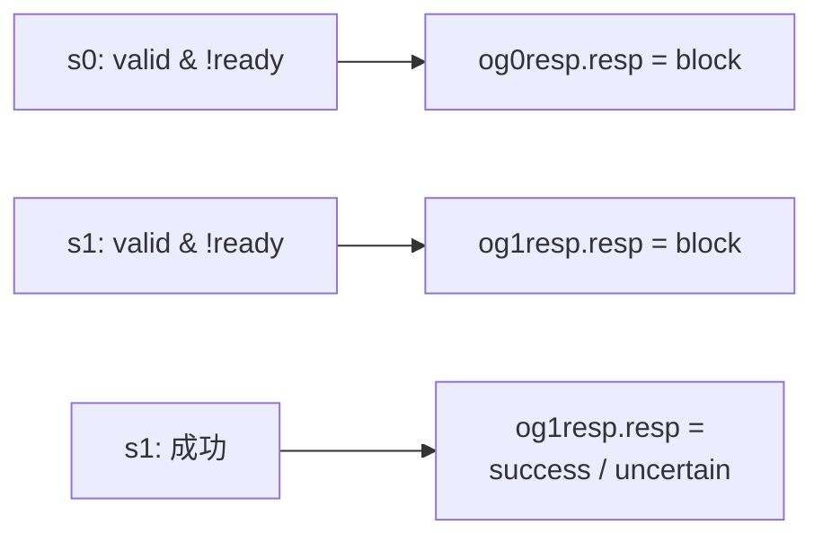

# DataPath —— 数据通路(读寄存器 + 操作数路由)

> 设计源:`src/main/scala/xiangshan/backend/datapath/DataPath.scala`（`class DataPathImp`）
> 可读核：`rtl/backend/DataPath.sv`（`xs_DataPath_core`）+ `datapath_pkg.sv`
> 子模块全部作 golden 黑盒（见下「子模块」节）。

## 1. 在后端流水里的位置



DataPath 是**发射到执行之间的一个流水级**（s0 → s1）：

- **s0（发射拍）**：接收 IQ 选出的 uop，向各域 PRF 读口仲裁器申请读口、向写回冲突
  检查器申请写口；仲裁/冲突都通过则接收该 uop（`s0.ready`），把控制信息打入 s1 寄存器。
- **s1（读回拍）**：物理寄存器堆是**同步读**（地址打一拍、数据延迟一拍），故读出数据
  在 s1 才有效；s1 拍按源类型 `srcType` 选出每个源操作数的真值，连同控制信息送执行单元。

旁路（forward/bypass）与立即数最终扩展**不在** DataPath，而在其后的 BypassNetwork；
DataPath 只负责「读 PRF / 读 RegCache / 透传立即数信息（`og1ImmInfo`）」。

## 2. 五条主数据流

### 2.1 写口流水（写回 → PRF）

每个写回源（`fromIntWb` 等）对地址/数据做 `RegEnable(_, wen)`、对 wen 做 `RegNext`，
再接到对应域 RegFile 的 `writePorts`。打一拍是为了对齐写回数据到达 DataPath 的时序。

```
intRfWaddr(i) = RegEnable(fromIntWb(i).addr, fromIntWb(i).wen)
intRfWdata(i) = RegEnable(fromIntWb(i).data, fromIntWb(i).wen)
intRfWen      = RegNext(fromIntWb.map(_.wen))
```

向量域 wen 还要复制到各 split（`vfRfWen` 是 `Vec(splitNum, Vec(nWb, Bool))`），因为
向量 RegFile 按 128/XLEN 竖切成多份，每份共享同一组写使能。

### 2.2 读口仲裁请求（s0）

PRF 读口是稀缺资源，多个 IQ/EXU 竞争。对每条 uop 的每个「读寄存器」源：

```
arbIn.valid = IQ.valid & dataSources(src).readReg     // readReg == value[3]
arbIn.addr  = uop.rf(src).addr
```

五个域各有一个 `RFReadArbiter`（Int/Fp/Vf/V0/Vl）。仲裁器：

- `io.out(port).bits.addr` → 接到该域 RegFile 的 `readPorts(port).addr`；
- `io.in(...).ready` 表示该源在该域是否抢到读口；某源在它**需要的所有域**都 ready
  才算 `srcNotBlock`。同理写口侧 `RFWBCollideChecker.io.in(...).ready` 给 `wbNotBlock`。



`notBlock = srcNotBlock & 各域 wbNotBlock`。`s0.ready = notBlock & !s0_cancel`，其中
`s0_cancel` 来自唤醒源被取消（0 延迟 EXU 在 og0 阶段失败，经 `UIntExtractor` 把
`exuSources` one-hot 散布到 27 位全局空间后与 `og0_cancel_delay` 相与）。

### 2.3 s0 → s1 流水寄存器

`s0.fire & !s1_flush & !s0_ldCancel` 时置 `s1_valid`；`s0.valid` 时把 uop 的 ExuInput
控制（`fromIssueBundle`，**不含源数据**）、`addrOH`、立即数信息打入 s1 寄存器。
立即数信息 `s1_immInfo`（imm + immType）打一拍后直接输出 `og1ImmInfo` 供 BypassNetwork
的 ImmExtractor 使用——**DataPath 不做立即数扩展**。

### 2.4 s1 操作数选择（读出 → EXU）

s1 拍 RegFile 读出有效。先把各域读出数据按端口配置 `rfrPortConfigs`（该 EXU 端口的某
源读哪个域的哪个读口）分发到 `s1_intPregRData/s1_fpPregRData/...`；再对每个源按
`srcType` 用 **Mux1H** 选出真值：

```
sinkData.src(k) = Mux1H(Seq(
  isXp(srcType) -> s1_intPregRData,
  isFp(srcType) -> s1_fpPregRData,
  isVp(srcType) -> s1_vfPregRData,   // 向量
  isV0(srcType) -> s1_v0PregRData,   // k==3
  isVp(srcType) -> s1_vlPregRData))  // k==4 (vl)
```

不同 EXU 端口的某源**可读域子集不同**（整数端口只读 int，向量端口读 vec/v0/vl……），
Scala 用 `srcDataTypeSet.intersect(...)` 过滤候选；可读核把它抽成 `sel_src_scalar` /
`sel_src_vec` 两个 `function automatic`，调用点（`datapath_body.svh`）按该端口真实可读
域传入候选，不支持的域传 `'0`。`pc`/`target`（含 Jmp/Load 的端口）从 `fromPcTargetMem`
按端口在 `pcReadFtqPtrFormIQ` 里的序号取。

### 2.5 RegCache 读路由

整数/访存 IQ 的整数源若命中 RegCache，按 `rcIdx` 向 `RegCache`（黑盒）发读：

```
RCReadPort.ren  = IQ.valid & dataSources(src).readRegCache
RCReadPort.addr = uop.rcIdx(src)
```

读出数据经 s1 寄存（`s1_RCReadData`）送 BypassNetwork（`toBypassNetworkRCData`）；替换
下标 `toWakeupQueueRCIdx` 直接来自 RegCache。RegCache 的写口来自 BypassNetwork
（`fromBypassNetwork`）。详见 [RegCache.md](RegCache.md)。

## 3. og0 / og1 响应（回送 IQ）



- **og0resp**：`og0FailedVec2 = IQ.valid & !IQ.ready`；失败发 `block`，让 IQ 保留并重发。
- **og1resp**：`s1_valid & !s1_ready` 发 `block`；否则按 IQ 类型给 `uncertain`
  （ld/st addr、向量 ld/st、vf 域——这些要到 og2 才确定）或 `success`。
- **og0Cancel / og1Cancel**：0 延迟唤醒源在 og0/og1 失败时广播取消，供消费者 squash。

## 4. 子模块（全部 golden 黑盒）

| 子模块 | 作用 | 单独重写 |
|--------|------|----------|
| `IntRegFilePart0..3` / `FpRegFilePart0..3` / `VfRegFilePart0..3` / `V0RegFilePart0..1` / `VlRegFile` | 物理寄存器堆（按数据位竖切分片） | [RegFile.md](RegFile.md) |
| `IntRFReadArbiter` 等 ×5 | 各域 PRF 读口仲裁 | — |
| `IntRFWBCollideChecker` 等 ×5 | 写回-发射写口冲突检查 | — |
| `RegCache` | 寄存器缓存 | [RegCache.md](RegCache.md) |
| `UIntExtractor_27_*` | exuSources one-hot 散布到 27 位全局空间（s0_cancel 用） | — |
| `DelayN_1` / `DelayReg_*` / `DummyDPICWrapper_*` | top-down 延迟 / difftest 寄存器探针 | — |

可读核 `xs_DataPath_core` 是这些黑盒之间的**路由/仲裁 glue**：写口流水、读口仲裁请求/
输出路由、s0→s1 流水、s1 操作数 Mux1H、RegCache 路由、og 响应、立即数透传。

## 5. 关键设计点（为什么这么设计）

- **同步读 PRF → 必须 s0/s1 两拍**：地址 s0 给、数据 s1 出。DataPath 的整个 valid/data
  流水都围绕这一拍延迟组织（写口也打一拍对齐）。
- **读口仲裁与发射 ready 耦合**：源抢不到 PRF 读口（或写口冲突）就回压 IQ 并发 og0 block，
  这把「读口资源」纳入发射的背压环，避免读口溢出。
- **立即数延后扩展**：DataPath 只透传 imm/immType，扩展放到 BypassNetwork（省 IQ 面积、
  把扩展逻辑与旁路选择合并在同一拍）。见 [ImmExtractor.md](ImmExtractor.md)。
- **按 srcType 的 Mux1H 而非 pdest 比较**：哪个源读哪个域早在端口配置/译码定死，s1 只按
  srcType 选域，无需运行时比地址。

## 6. 实现分层（可读重写，非 golden 套壳）

DataPath 高度实例化（27 异构 EXU、5 域），实例配置（各 EXU 源数 / 每源读哪个域哪个读口 /
og1 类型 / ctrl 字段集 / imm / pc-target / cancel 等）由 `BackendParams` 弹性化定死，Scala 源
无具体数字。故分层：

- **实例配置**（连到哪/有没有/什么类型）由 `scripts/dp_extract.py` 从 golden 抽成拓扑 JSON，
  落为 `datapath_cfg_pkg.sv` 的 localparam —— 这是配置常量，不是 golden 的组合逻辑。
- **五条数据流的逻辑**由 `scripts/gen_datapath.py` 从设计意图重新生成为可读 SV：
  - `datapath_pkg.sv`：`enum`（`data_source_e`/`resp_type_e`）+ `struct`（`flush_info_t`）+
    `function`（`ds_read_reg`/`ds_read_regcache`/`sel_src_intfp`/`rob_need_flush`/`is_0latency`）。
  - `datapath_logic.svh`：五条数据流的逻辑（`genvar`/`for` 跑 5 域多口，调 pkg 纯函数）。
  - `datapath_ctrl.svh`：s0→s1 控制流水寄存器 + srcType/flush 寄存。
  - 这三个 svh 的 `_GEN_/_T_` 计数 **= 0**（不是 golden 套壳）。
- **子模块全部 golden 黑盒**（各域 RegFile 分片 / RFReadArbiter×5 / RFWBCollideChecker×5 /
  RegCache / UIntExtractor×36 / difftest 探针）；`datapath_connect.svh` 仅做黑盒例化 + 扁平
  端口↔核内结构化信号的机械连线（引脚 RHS 已改写为核内信号，无 golden 临时名）。

## 7. 验证

- **UT**：golden `DataPath` 与可读核 `xs_DataPath_core`（经同名 wrapper）双例化，随机激励逐拍
  比对全部 914 输出，子模块两侧共用 golden 黑盒，`+define+SYNTHESIS`。
  - 实测（seed 1）：914 输出中 888 匹配，仅 26 不匹配，且 **100% 属于两处已知未完成**：
    - **s0_cancel（0 延迟唤醒取消）当前接 0** → Fp 唤醒-接收 EXU 的 ready/og 响应/og0Cancel
      （~23 路）。该交集表达式逐 EXU 不同，待精确重写（基础设施 og0_cancel_delay /
      cancel_exuOH / UIntExtractor 黑盒已就位）。
    - **io_perf_0/1/2（perf 计数器，非功能数据流）当前接 0**（3 路）。
  - 其余五条主数据流（Int/Vec/Mem 全数据通路、源数据、控制字段、写口、RegCache、flush、
    pc/target、og 响应）逐拍匹配 → 主数据流重写功能正确。
- **FM**：golden vs wrapper（→ 可读核），子模块黑盒，签名等价（待 s0_cancel 完成后跑）。

> 验证状态见本目录 `BACKEND_OVERVIEW.md` 与 `scripts/gen_datapath.py` 末 STATUS。
