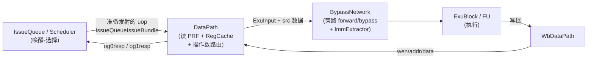
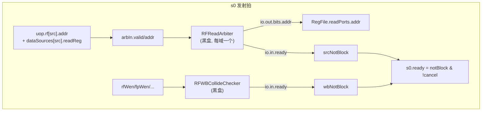
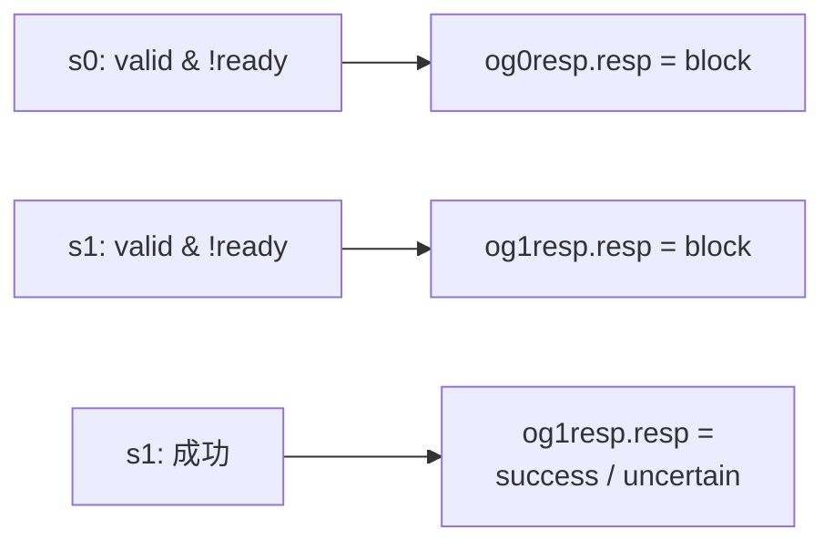

# DataPath —— 数据通路(读寄存器 + 操作数路由)

> 设计源:`src/main/scala/xiangshan/backend/datapath/DataPath.scala`（`class DataPathImp`）
> 可读核：`rtl/backend/DataPath.sv`（`xs_DataPath_core`）+ `datapath_pkg.sv`
> 子模块全部作 golden 黑盒（见下「子模块」节）。

## 1. 在后端流水里的位置



DataPath 是**发射到执行之间的一个流水级**（s0 → s1）：

- **s0（发射拍）**：接收 IQ 选出的 uop，向各域 PRF 读口仲裁器申请读口、向写回冲突
  检查器申请写口；仲裁/冲突都通过则接收该 uop（`s0.ready`），把控制信息打入 s1 寄存器。
- **s1（读回拍）**：物理寄存器堆是**同步读**（地址打一拍、数据延迟一拍），故读出数据
  在 s1 才有效；s1 拍按源类型 `srcType` 选出每个源操作数的真值，连同控制信息送执行单元。

旁路（forward/bypass）与立即数最终扩展**不在** DataPath，而在其后的 BypassNetwork；
DataPath 只负责「读 PRF / 读 RegCache / 透传立即数信息（`og1ImmInfo`）」。

## 2. 五条主数据流

### 2.1 写口流水（写回 → PRF）

每个写回源（`fromIntWb` 等）对地址/数据做 `RegEnable(_, wen)`、对 wen 做 `RegNext`，
再接到对应域 RegFile 的 `writePorts`。打一拍是为了对齐写回数据到达 DataPath 的时序。

```
intRfWaddr(i) = RegEnable(fromIntWb(i).addr, fromIntWb(i).wen)
intRfWdata(i) = RegEnable(fromIntWb(i).data, fromIntWb(i).wen)
intRfWen      = RegNext(fromIntWb.map(_.wen))
```

向量域 wen 还要复制到各 split（`vfRfWen` 是 `Vec(splitNum, Vec(nWb, Bool))`），因为
向量 RegFile 按 128/XLEN 竖切成多份，每份共享同一组写使能。

### 2.2 读口仲裁请求（s0）

PRF 读口是稀缺资源，多个 IQ/EXU 竞争。对每条 uop 的每个「读寄存器」源：

```
arbIn.valid = IQ.valid & dataSources(src).readReg     // readReg == value[3]
arbIn.addr  = uop.rf(src).addr
```

五个域各有一个 `RFReadArbiter`（Int/Fp/Vf/V0/Vl）。仲裁器：

- `io.out(port).bits.addr` → 接到该域 RegFile 的 `readPorts(port).addr`；
- `io.in(...).ready` 表示该源在该域是否抢到读口；某源在它**需要的所有域**都 ready
  才算 `srcNotBlock`。同理写口侧 `RFWBCollideChecker.io.in(...).ready` 给 `wbNotBlock`。



`notBlock = srcNotBlock & 各域 wbNotBlock`。`s0.ready = notBlock & !s0_cancel`，其中
`s0_cancel` 来自唤醒源被取消（0 延迟 EXU 在 og0 阶段失败，经 `UIntExtractor` 把
`exuSources` one-hot 散布到 27 位全局空间后与 `og0_cancel_delay` 相与）。

### 2.3 s0 → s1 流水寄存器

`s0.fire & !s1_flush & !s0_ldCancel` 时置 `s1_valid`；`s0.valid` 时把 uop 的 ExuInput
控制（`fromIssueBundle`，**不含源数据**）、`addrOH`、立即数信息打入 s1 寄存器。
立即数信息 `s1_immInfo`（imm + immType）打一拍后直接输出 `og1ImmInfo` 供 BypassNetwork
的 ImmExtractor 使用——**DataPath 不做立即数扩展**。

其中 **`s0_ldCancel`（load 唤醒取消）** 是关键门控：某源若被上游标注为「依赖某条 load 的
第 1 拍推测唤醒」（`loadDependency[i][1]`），而该 load 在本拍被对应 LoadUnit 判失败
（输入 `io_ldCancel_{0,1,2}_ld2Cancel`，3 路），则

```
s0_ldCancel = Σ_i (io_ldCancel_i_ld2Cancel & loadDependency_i[1])   // i = 0..2
```

拉高，**压掉本拍 `s1_valid`**（`s1_valid <= fromIQ_fire & ~s1_flush & ~s0_ldCancel`），
不让这条依赖了被取消 load 的 uop 进入 s1。这是 load 命中/miss 推测唤醒的纠正路径，
与 `s0_cancel`（0 延迟 EXU 在 og0 失败取消，见 §2.2）互补：前者取消对 load 的依赖、
后者取消对 0 延迟 EXU 的依赖。

### 2.4 s1 操作数选择（读出 → EXU）

s1 拍 RegFile 读出有效。每个 EXU 端口的每个源**读哪个域的哪个读口**在 `BackendParams`
里早已定死（`rfrPortConfigs`），故绝大多数源是**固定直连**某域某读口的读数据，**没有运行时
选择**（不是"每源 5 路 Mux1H"）：

```
io_toIntExu_0_0_bits_src_0 = int_rdata[0];                 // 整数端口 → 直连 int 读口
io_toVecExu_0_0_bits_src_3 = v0_rdata[0];                  // 向量端口 src3 → 直连 v0
io_toVecExu_0_0_bits_src_4 = {120'h0, vl_rdata[0][7:0]};   // vl 源零扩展到 XLEN
io_toMemExu_2_0_bits_pc    = io_fromPcTargetMem_toDataPathPC_3;  // pc 直连
```

**全 DataPath 里唯一的运行时 Mux** 是两个 **STD 类访存端口**（`io_toMemExu_7_0` /
`io_toMemExu_8_0`）的 `src0`：store 数据可能来自整数或浮点寄存器，故按 s1 寄存的 `srcType`
在 **int / fp 两域间 2 路选**（不是 5 路），用 pkg 纯函数 `sel_src_intfp`：

```
io_toMemExu_7_0_bits_src_0 = sel_src_intfp(s1_srctype_17_0_0, int_rdata[5], fp_rdata[9]);
io_toMemExu_8_0_bits_src_0 = sel_src_intfp(s1_srctype_18_0_0, int_rdata[3], fp_rdata[10]);
```

（不存在 `sel_src_scalar` / `sel_src_vec` 这两个函数——pkg 里选源的函数只有 `sel_src_intfp`；
选源逻辑直接落在 `datapath_logic.svh`，不存在 `datapath_body.svh` 这个文件。）
`pc`/`target`（含 Jmp/Load 的端口）从 `fromPcTargetMem` 按端口在 `pcReadFtqPtrFormIQ`
里的序号直连取。

### 2.5 RegCache 读路由

整数/访存 IQ 的整数源若命中 RegCache，按 `rcIdx` 向 `RegCache`（黑盒）发读：

```
RCReadPort.ren  = IQ.valid & dataSources(src).readRegCache
RCReadPort.addr = uop.rcIdx(src)
```

读出数据经 s1 寄存（`s1_RCReadData`）送 BypassNetwork（`toBypassNetworkRCData`）；替换
下标 `toWakeupQueueRCIdx` 直接来自 RegCache。RegCache 的写口来自 BypassNetwork
（`fromBypassNetwork`）。详见 [RegCache.md](RegCache.md)。

## 3. og0 / og1 响应（回送 IQ）



- **og0resp**：`og0FailedVec2 = IQ.valid & !IQ.ready`；失败发 `block`，让 IQ 保留并重发。
- **og1resp**：`s1_valid & !s1_ready` 发 `block`；否则按 IQ 类型给 `uncertain`
  （ld/st addr、向量 ld/st、vf 域——这些要到 og2 才确定）或 `success`。
- **og0Cancel**（**没有 `og1Cancel`**）：0 延迟唤醒源在 og0 失败（`og0Failed = IQ.valid &
  !IQ.ready`）时广播取消，供下游消费者 squash 这条被推测唤醒的指令。**只有 5 个 0 延迟
  EXU 端口**有此输出——4 个整数 ALU 的 subport 0 + 1 个 Fp EXU 的 subport 0：
  `io_og0Cancel_{0,2,4,6,8} = og0Failed_{0,1,2,3,4}_0`（下标是全局 EXU 号，偶数间隔）。
  og1 失败**不**额外广播取消，只经 `og1resp = block` 回送 IQ。

## 4. 子模块（全部 golden 黑盒）

| 子模块 | 作用 | 单独重写 |
|--------|------|----------|
| `IntRegFilePart0..3` / `FpRegFilePart0..3` / `VfRegFilePart0..3` / `V0RegFilePart0..1` / `VlRegFile` | 物理寄存器堆（按数据位竖切分片） | [RegFile.md](RegFile.md) |
| `IntRFReadArbiter` 等 ×5 | 各域 PRF 读口仲裁 | — |
| `IntRFWBCollideChecker` 等 ×5 | 写回-发射写口冲突检查 | — |
| `RegCache` | 寄存器缓存 | [RegCache.md](RegCache.md) |
| `UIntExtractor_27_*` | exuSources one-hot 散布到 27 位全局空间（s0_cancel 用） | — |
| `DelayN_1` / `DelayReg_*` / `DummyDPICWrapper_*` | top-down 延迟 / difftest 寄存器探针 | — |

可读核 `xs_DataPath_core` 是这些黑盒之间的**路由/仲裁 glue**：写口流水、读口仲裁请求/
输出路由、s0→s1 流水、s1 操作数选择（多数固定直连 / 仅 STD src0 走 2 路 Mux）、s0_cancel /
s0_ldCancel 取消、RegCache 路由、og 响应、立即数透传。

## 5. 关键设计点（为什么这么设计）

- **同步读 PRF → 必须 s0/s1 两拍**：地址 s0 给、数据 s1 出。DataPath 的整个 valid/data
  流水都围绕这一拍延迟组织（写口也打一拍对齐）。
- **读口仲裁与发射 ready 耦合**：源抢不到 PRF 读口（或写口冲突）就回压 IQ 并发 og0 block，
  这把「读口资源」纳入发射的背压环，避免读口溢出。
- **立即数延后扩展**：DataPath 只透传 imm/immType，扩展放到 BypassNetwork（省 IQ 面积、
  把扩展逻辑与旁路选择合并在同一拍）。见 [ImmExtractor.md](ImmExtractor.md)。
- **读域在端口配置里定死 → 多数源固定直连**：哪个源读哪个域早在 `BackendParams`/译码里
  定死，故 s1 绝大多数源直连对应域读口，无需运行时选择；仅 STD 类 src0 因数据可能来自
  int 或 fp，才按 `srcType` 做 2 路选（`sel_src_intfp`）。全程不比 pdest 地址（那是旁路网络的活）。

## 6. 实现分层（可读重写，非 golden 套壳）

DataPath 高度实例化（27 异构 EXU、5 域），实例配置（各 EXU 源数 / 每源读哪个域哪个读口 /
og1 类型 / ctrl 字段集 / imm / pc-target / cancel 等）由 `BackendParams` 弹性化定死，Scala 源
无具体数字。故分层：

- **实例配置**（连到哪/有没有/什么类型）由 `scripts/dp_extract.py` 从 golden 抽成拓扑 JSON，
  落为 `datapath_cfg_pkg.sv` 的 localparam —— 这是配置常量，不是 golden 的组合逻辑。
- **五条数据流的逻辑**由 `scripts/gen_datapath.py` 从设计意图重新生成为可读 SV：
  - `datapath_pkg.sv`：`enum`（`data_source_e`/`resp_type_e`）+ `struct`（`flush_info_t`）+
    `function`（`ds_read_reg`/`ds_read_regcache`/`ds_from_forward`/`sel_src_intfp`/`rob_need_flush`/
    `is_0latency`/`wakeup_failed_int`/`wakeup_failed_fp`——后两者供 s0_cancel 判取消）。
  - `datapath_logic.svh`：五条数据流的逻辑（`genvar`/`for` 跑 5 域多口，调 pkg 纯函数）。
  - `datapath_ctrl.svh`：s0→s1 控制流水寄存器 + srcType/flush 寄存。
  - 这三个 svh 的 `_GEN_/_T_` 计数 **= 0**（不是 golden 套壳）。
- **子模块全部 golden 黑盒**（各域 RegFile 分片 / RFReadArbiter×5 / RFWBCollideChecker×5 /
  RegCache / UIntExtractor×36 / difftest 探针）；`datapath_connect.svh` 仅做黑盒例化 + 扁平
  端口↔核内结构化信号的机械连线（引脚 RHS 已改写为核内信号，无 golden 临时名）。

## 7. 验证

- **`s0_cancel` 与 `perf` 均已按 golden 实现**（早期文档记的「接 0 / 待重写」两处**已完成**）：
  - `s0_cancel`（0 延迟唤醒取消）：`og0_cancel_delay`（对上拍 og0 失败且 `is_0latency` 的
    非 load EXU 打一拍）经 `UIntExtractor` 散布到全局 EXU 取消向量，各发射端口用
    `wakeup_failed_int` / `wakeup_failed_fp` 检查「本端口某源（`dataSources==forward`）是否依赖被取消的 0 延迟
    EXU」，命中则拉低该端口 `ready`（见 `datapath_logic.svh` 的 `s0_cancel_*` 段）。少数无 0
    延迟唤醒交集的端口（Vf 域、MemIQ_5/6）恒 0。
  - `io_perf_0..4`（**5 路**）：由 topdown 派生量（`fewUopsIssued`、`memStall{Store,L1,L2,L3}Miss`）
    经 2 级 `RegNext` 打拍、零扩展到 6 位输出。
- **UT**：golden `DataPath` 与可读核 `xs_DataPath_core`（经同名 wrapper）双例化，随机激励逐拍
  比对全部 914 输出，子模块两侧共用 golden 黑盒，`+define+SYNTHESIS`。五条主数据流
  （Int/Vec/Mem 全数据通路、源数据、控制字段、写口、RegCache、flush、pc/target、og 响应）
  加上 s0_cancel / perf 均在比对范围内。
- **FM**：golden vs 同名 wrapper（→ 可读核），子模块黑盒。结果（如实）**FAILED**：**82746 passing /
  20 failing / 16334 unverified**。failing=20 恰为 Formality 默认
  `verification_failing_point_limit=20`，verify 在 **83%** 处触限提前中止，尚有 16334 个
  compare point 未验证。前 20 个 failing 点**全部**落在
  `difftestArch{Int,Fp,Vec}RegState_delayer/REG_value_0_reg[*]`——即 difftest 归档寄存器探针
  （`DelayReg`/DPIC 打拍）的延迟寄存器，**difftest-only、不在功能数据通路上**（可读核未完整
  建模该 difftest 探针，故此处配对失败）；但「全为 difftest 探针」只覆盖这前 20 个。
  **结论口径：UT 200k×3（914 输出）为权威；FM 为部分验证、未收敛。**

> 验证状态另见本目录 `BACKEND_OVERVIEW.md`。（注：`scripts/gen_datapath.py` 末 STATUS 注释
> 早于 s0_cancel/perf 落地，仍写「接 0」，以本节与 RTL 为准。）
