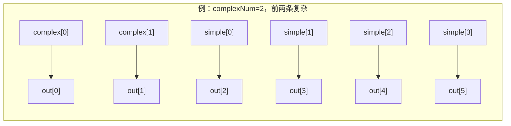

# DecodeStage —— 译码级（多指令并行译码 + 流水控制）

> 设计源：`src/main/scala/xiangshan/backend/decode/DecodeStage.scala`
> 可读核：`rtl/backend/DecodeStage.sv`（`xs_DecodeStage_core`）+ `decodestage_pkg.sv`
> golden：`golden/chisel-rtl/DecodeStage.sv`（9792 行 / 713 端口）
> 子模块全部作 golden 黑盒：`DecodeUnit ×6`、`DecodeUnitComp`、`VTypeGen`（及其传递闭包）

## 1. 在后端的位置

```mermaid
flowchart LR
    IB["前端 IBuffer<br/>(每拍 ≤6 条 StaticInst)"] -->|io_in[0..5]| DS["DecodeStage"]
    DS -->|io_out[0..5] DecodedInst| RN["Rename 重命名"]
    DS -->|intRat/fpRat/vecRat addr| RAT["RAT 别名表读口"]
    DS -->|trapInstInfo| CSR["CSR(非法指令上报)"]
    ROB["ROB"] -->|commitVType/walkVType/<br/>isResumeVType| DS
    CSRc["CSR"] -->|fromCSR/csrCtrl| DS
```

译码级把前端取好的指令包（DecodeWidth=6 条并行）译成微操作（uop）控制信息
（DecodedInst：fuType/fuOpType/源宿寄存器/立即数/各写回使能/向量&浮点控制位/异常向量），
交给乱序执行后端的重命名级。它是**前端顺序世界 → 后端乱序世界的入口**。

## 2. 三类译码器（黑盒）与本级 glue 的分工

```mermaid
flowchart TB
    subgraph DS["DecodeStage（本级只写 glue）"]
        direction TB
        VG["VTypeGen<br/>(维护 vtype)"]
        D0["DecodeUnit 0"]:::bb
        D1["DecodeUnit 1..5"]:::bb
        DC["DecodeUnitComp<br/>(复杂指令拆 uop)"]:::bb
        GL["glue：路由/握手/汇聚/修正/perf"]
    end
    IN["io_in[0..5]"] --> D0 & D1
    IN --> VG
    VG -->|vtype 旁路| D0 & D1 & DC
    D0 & D1 -->|simple[i] + isComplex| GL
    GL -->|首个复杂指令| DC
    DC -->|complex[0..5] + complexNum| GL
    GL --> OUT["io_out[0..5]"]
    classDef bb fill:#eef,stroke:#88a,stroke-dasharray:4 3;
```

- **DecodeUnit ×6**：每条入口指令一个，并行译码，产出 `simple[i]`（DecodedInst 主体）
  与 `isComplex`（是否需要拆成多条 uop）、`uopInfo`（拆分数量信息）。
- **DecodeUnitComp**：复杂指令（向量等需拆 uop）一拍只送**最靠前的一条**进来，
  拆成最多 6 条 uop `complex[0..5]`，并给出 `complexNum`（本拍产出的 uop 数）。
- **VTypeGen**：维护体系结构 / 投机 `vtype`，旁路给所有译码器（向量译码依赖 vtype）；
  当复杂译码器接收到一条 `vset` 且非重定向时更新。

本级真正手写的 glue（见 `DecodeStage.sv` 各分节）：路由、流水握手/反压、结果汇聚、
输出修正、RAT 读口、非法指令上报、性能事件。

## 3. 复杂/简单结果汇聚（核心数据通路）

复杂译码结果排在最终输出**最前面**（共 `complexNum` 条），简单译码结果填其后：

```
finalDecodedInst[i] = (complexNum > i) ? complex[i] : simple[i - complexNum]
```

其中 `(i - complexNum)` 是 3 位模运算下标（与 Scala 的 UInt 减法一致；当下标越界时，
`complexNum > i` 必然成立而走复杂分支，故越界项永不被有效选中）。



> **坑 1（firstUop 端口不对称）**：复杂译码器只在第 0 路输出 `firstUop`（一次复杂展开
> 只有第一条 uop 是 firstUop），golden 在 i>0 的 `complexDecodedInsts` 上没有
> `firstUop` 端口。因此复杂路径上 `out[i].firstUop`（i>0）恒为 0，简单路径恒为 1。
> 可读核对 `firstUop` 单独赋值，不读 `complex[i>0].firstUop`（其为悬空）。
>
> **坑 2（简单译码器缺字段）**：DecodeUnit 不产出 `uopIdx/firstUop/lastUop/numWB/
> v0Wen/vlWen/vpu_fpu_isFoldTo1` 这 9 个字段（这些仅对复杂 uop 有意义）。可读核在
> 简单路径用常量覆盖（`uopIdx=0/firstUop=lastUop=1/numWB=1/vlWen=0/isFoldTo1=0`），
> 从不读取 `simple[i]` 的这些字段。

## 4. 输出修正（fusion / 向量语义）

`out_inst[i]` 大部分字段直接取 `finalDecodedInst[i]`，少数需 glue 修正：

| 修正 | 逻辑 | 物理含义 |
|------|------|---------|
| 向量反序 | `vpu_isReverse` 时交换 `lsrc0↔lsrc1`、`srcType0↔srcType1` | 反序向量指令源操作数次序 |
| srcType3 修正 | 若 src0/1/2/3 任一以向量形式读 v0(lsrc==0) → src3 强制 `V0(4'h8)` | 隐式读 v0 掩码 |
| v0Wen/vecWen 分流 | `v0Wen = vecWen & (ldest==0)`；`vecWen' = vecWen & (ldest!=0)` | 写 v0 与写普通向量寄存器分流 |

> RAT 读口用「修正后」的 lsrc（含反序交换）读别名表，`hold = ~out_ready`（下游未就绪
> 时保持地址）。`v0Rat/vlRat` 在本 golden 配置里地址恒定、输出被优化掉（无端口）。

## 5. 流水握手与反压

下游 Rename 反压用简化模型：若 `io_out[0].ready` 则假设 Rename 整宽（RenameWidth=6）
可收，否则 0（`readyCounter`）。每路 `io_in[i].ready` 放行需满足（且无重定向、无 vtype 恢复）：

```
in_ready[i] = ~redirect & ~isResumeVType & (
    (前 i 条全简单)        & (i + complexNum  < readyCounter)        // 可整段直通
  | (第 i 条是首个复杂指令) & (i + complexNum <= readyCounter) & comp_ready
)
```

- `simplePrefix[i]`：前 i+1 路是否全为有效简单指令。
- `firstComplexOH[i]`：第 i 路是否是首个复杂指令（一拍只放一条复杂指令进复杂译码器）。
- 重定向 (`io_redirect`) 或 vtype 恢复期 (`isResumeVType`) 时全局禁止接收与输出。

## 6. 性能事件（6 路，各打两/三拍）

| perf | 含义 | 寄存器深度 |
|------|------|-----------|
| 0 | `PopCount(fusion)` 融合指令数 | 3 拍（fusion 先打一拍） |
| 1 | `PopCount(in valid & ~ready)` 等待数 | 3 拍 |
| 2 | `(任一 in valid) & ~out0.ready` stall | 2 拍 |
| 3 | `PopCount(in.valid)` 利用率 | 2 拍 |
| 4 | `PopCount(in.fire)` INST_SPEC | 2 拍 |
| 5 | `recoveryFlag` 恢复气泡 | 3 拍（recoveryFlag 本身为 reg） |

`recoveryFlag`：重定向后置位，直到有 `in.fire` 才清除（衡量重定向造成的译码气泡）。

> **坑 3（UT 采样竞争，非 RTL bug）**：perf 是寄存器输出。若 testbench 在「时钟沿
> 附近」采样寄存器输出，会与寄存器更新发生 delta-cycle 竞争，VCS 不同编译会解析出
> 不同的「1 拍偏差」假象。正确做法：**下降沿驱动激励、上升沿后 `#1` 再采样**，让组
> 合逻辑 + 黑盒内部寄存器全部稳定后两侧同点采样，偏差消失。

## 7. 接口要点

| 组 | 端口 | 说明 |
|----|------|------|
| 输入 | `io_in[0..5]`（Decoupled StaticInst） | 前端取指包 |
| 输出 | `io_out[0..5]`（Decoupled DecodedInst） | 送 Rename |
| RAT | `io_intRat/fpRat/vecRat[i][k].{addr,hold}` | 读别名表（addr 零扩展，仅低 6 位有效） |
| CSR | `io_fromCSR` / `io_csrCtrl` / `io_toCSR.trapInstInfo` | 非法指令判定上报 |
| ROB | `io_fromRob.{commitVType,walkVType,isResumeVType,walkToArchVType}` | vtype 提交/回滚/恢复 |
| 其他 | `io_redirect` / `io_fusion[0..4]` / `io_stallReason` / `io_vsetvlVType` / `io_vstart` | 重定向 / 融合标志 / 背压原因 / vset 旁路 / vstart |

## 8. 验证结果

- **结构闸门**（可读核 `xs_DecodeStage_core`）：`typedef struct packed`（decoded_inst_t /
  uop_info_t / vtype_t）、`function automatic`（simple_lookup / popcnt / src_is_vp 等）、
  `genvar`/`for`（6 译码通道并行、6 路 perf）、`typedef enum`（无离散状态机，未用）；
  `grep -E "io_[a-z_]+_[0-9]+_[0-9]+|_REG_[0-9]|_GEN_|_T_[0-9]|RANDOMIZE"` = 0（仅生成的
  扁平互联 svh 含 io_ 名，可读核本体无生成痕迹）；核本体行数 ≈ 450（golden 9792）。
- **UT**：可读核 vs golden DecodeStage 双例化逐拍比对全部 707 路输出端口；
  seed 1/7/42 各 250000 拍 errors=0（见报告）。激励为合法指令池 + 随机 don't-care +
  随机 valid/ready/redirect/vtype/csr/fromRob/stallReason/fusion。
- **FM**：golden DecodeStage vs 可读 wrapper（三类子模块两侧共享 golden 黑盒定义）。
  末次运行 **SUCCEEDED：4103 passing / 0 failing / 0 unverified（100% 完成）**，结果在
  `fm_work/DecodeStage/fm_long.log`（2026-06-17 03:57）。说明：同目录 `fm.log` 是更早
  一次 verify 中被超时 SIGTERM 杀掉的会话、**无结果行**；其间一次 verify 曾 12 个 DFF
  failing（fusion_r/invnr_r/recoveryFlag 复位方式未对齐 golden，见 failing.rpt），
  改为异步复位修复 RTL 后复跑即 SUCCEEDED（此坑另见 arch/0-BACKEND_OVERVIEW.md
  进度表 DecodeStage 行坑④）。
