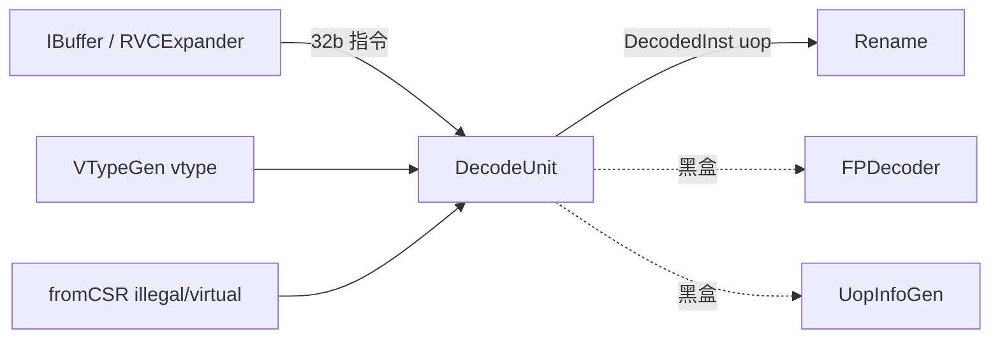
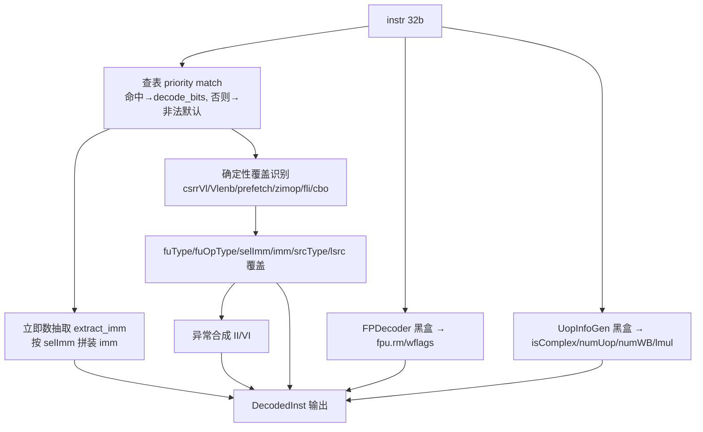

# DecodeUnit —— 后端单指令译码器（学习文档）

> 香山 V2R2（昆明湖）后端 Backend 第 2 层模块。把前端送来的一条 32 位（已 RVC
> 展开）指令译码成一条微操作 (uop) 的控制信息 `DecodedInst`，交给重命名 Rename。
> 本文是阅读 `rtl/backend/DecodeUnit.sv` + `decodeunit_pkg.sv` 的导读。

## 1. 在后端的位置与职责



DecodeUnit 对**每条**指令做一次纯组合译码（无时钟、无状态），产出：
- **功能单元** `fuType`（35 位 one-hot：alu/mul/div/csr/ldu/stu/各向量单元…）
- **操作类型** `fuOpType`（9 位，单元内的具体操作，如 ALUOpType.add）
- **源/宿** `srcType0..4` / `lsrc0..4` / `ldest`（操作数类型与逻辑寄存器号）
- **立即数** `selImm`（立即数类型）+ `imm`（22 位压缩立即数）
- **控制 flag** `rfWen/fpWen/vecWen/isXSTrap/waitForward/blockBackward/flushPipe/canRobCompress`
- **uop 拆分** `uopSplitType`（向量指令拆成多少个 uop 的类型）+ UopInfoGen 算出的
  `isComplex/numOfUop/numOfWB/lmul`
- **浮点控制位** `fpu.rm/wflags`（FPDecoder 黑盒）
- **异常** `exceptionVec`（非法指令 II / 虚拟指令 VI / 断点）

## 2. 译码核心：一张 ISA 真值表（学习重点）

香山的译码核心是 Chisel 的 `ListLookup` 真值表：把每条指令的编码 pattern 映射到
一组 15 列控制位。源在 Scala 里按 ISA 扩展分成 13 张子表（XDecode/BitmanipDecode/
ScalarCryptoDecode/FpDecode/VecDecoder/…），共 717 条 pattern（`DECODE_TABLE_SIZE`）：

```
  指令编码 pattern        →  src1 src2 src3 fuType fuOpType  rfWen fpWen vecWen
  LW  -> XSDecode(reg, imm, X, ldu, lw, IMM_I, xWen=T)         ...  uopSplit selImm
  ADD -> XSDecode(reg, reg, X, alu, add, X,    xWen=T, canRobCompress=T)
  ...
```

这张表是**纯 ISA 数据**，不是逻辑。本工程把它规整成 `decodeunit_pkg.sv` 里的
可读具名结构（每条 pattern 一行，带指令名注释）：

```systemverilog
typedef struct packed {            // 一条 pattern 的 15 列控制位
  logic [3:0]  src_type0/1/2;
  logic [34:0] fu_type;            // one-hot
  logic [8:0]  fu_op_type;
  logic        rf_wen/fp_wen/vec_wen/is_xs_trap/...;
  logic [5:0]  uop_split_type;
  logic [3:0]  sel_imm;
} decode_bits_t;

localparam logic [31:0]  DECODE_MASK  [717];  // (instr & mask) == match 即命中
localparam logic [31:0]  DECODE_MATCH [717];
localparam decode_bits_t DECODE_BITS  [717];  // 命中后取这一行控制位
```

`FuType` 35 个 one-hot 位（`FU_ALU=6`、`FU_LDU=15`、`FU_VLDU=31` …）、`SrcType`
（`SRC_XP=1` 整型寄存器 / `SRC_FP=2` / `SRC_VP=4` / `SRC_V0=8`）、`SelImm`
（`SEL_I/S/SB/U/UJ/Z/...`）都用具名 enum/localparam，位序与香山 Scala 源一致。

### 译码表怎么来的：gen 脚本（`scripts/gen_decodeunit.py`）

手敲 717×15 的表无法可靠校验，照抄 golden 生成名又违规。正确做法是**用脚本从
golden 真值表可靠提取这张数据表**：

1. **解析编码**：golden（firtool 输出）把真值表展平成 717 个
   `_decodedInst_decoder_T_n = (指令切片 == 常量)` 比较项。脚本解析每个切片
   `_GENx = {instr[hi:lo],...}` 的位组成 + 常量，算出每条 pattern 的
   `(mask, match)`（32 位指令掩码/匹配）。
2. **自验证**：把每条 `(mask,match)` 反查 rocket-chip / XiangShan 的指令 BitPat，
   **716/717 条都能对上一个具名指令**（唯一例外是一个覆盖用中间项，非 pattern）。
   这独立证明了编码提取正确。
3. **提取控制位**：脚本把 golden 的组合译码逻辑（仅用到 `== | & ~ ?: {} []` 这一
   受限算子集）解析成表达式 DAG，对每条指令的 canonical 编码（don't-care 位置 1
   以揭示操作数门控）**直接驱动 golden 自身的 raw 译码线网**，读出 15 列控制位。
   等价于跑 golden 仿真取结果，天然可靠。已验证：don't-care 置 0/置 1 下值列完全
   一致（0 不稳定），说明提取的值与 pattern 一一对应。
4. **生成**：把 716 行规整成上面的具名结构写入 `decodeunit_pkg.sv`。

> 这是把真值表数据规整成可读结构，是**数据提取**而非逻辑转写。

## 3. 可读核 `xs_DecodeUnit_core` 的流程



### 关键设计点

- **查表用 priority + default=非法**：`always_comb` 倒序遍历表、后命中覆盖，等效
  「表序优先」；未命中落 `DECODE_DEFAULT`（`selImm=INVALID`）→ 触发非法指令异常。
  这样数组索引永不产生 X（X 铁律）。
- **立即数抽取**是按 `selImm` 的 `unique case`，把指令各位段重新拼装成 RISC-V 各
  立即数格式（I/S/B/U/J/Z/向量 imm5/vsetvli zimm 等），对应 Scala `ImmUnion`。
- **确定性覆盖逻辑**（与 Scala `when` 链一一对应，常量取自 golden 最终赋值）：
  | 覆盖 | 条件 | 效果 |
  |------|------|------|
  | csrr vl | csrr 且 csr==vl | fuType→vsetfwf, fuOpType→0x16, srcType 全 no |
  | csrr vlenb | csrr 且 csr==vlenb | fuType→alu, fuOpType→add, imm=VLEN/8, 当 addi |
  | softprefetch | ori x0,rs1,imm 且 funct3=110 | fuType→ldu, fuOpType→prefetch_r/w/i, selImm→S |
  | zimop | 两段 BitPat | 当 move：src0=reg/src1=imm, lsrc0=x0, imm=0 |
  | fli.s/d/h | OP_FP 特定编码 | fuOpType→{1, fmt, rs1} |
  | cbo.inval | CBO_INVAL 且 cboI2F | fuOpType→cbo_flush |
  | vlsu→vseglsu | NF≠0 的分段访存 | fuType→vsegldu/vsegstu |
- **黑盒子模块**：`FPDecoder`（浮点 typeTag/wflags/typ/fmt/rm，649 行）和
  `UopInfoGen`（向量/AMOCAS 拆 uop 数，含 2 张查表子模块）按 golden 黑盒例化，
  其输入预解析信息全部由指令编码 + vtype 决定（与 golden 例化完全一致）。

## 4. 接口（核心字段）

| 信号 | 方向 | 含义 |
|------|------|------|
| `instr[31:0]` | in | 已 RVC 展开的指令 |
| `vtype` | in | 向量类型（vsew/vlmul/vma/vta/illegal），透传进 vpu |
| `csr_illegal/csr_virtual` | in | CSR 的非法/虚拟指令判定位（fence/fs-vs-off/hlsv…） |
| `dec` | out | `xs_du_decode_out_t`：聚合译码结果（见 svh） |

顶层 wrapper `DecodeUnit`（golden 同名）把扁平的 157 个端口拆/拼到本核的 struct
端口。

## 5. 验证结果

- **UT（主验证）**：`verif/ut/DecodeUnit/` 双例化 golden vs 可读核，逐拍比对
  **全部 157 输出端口**对应的译码字段。激励 = 717 条合法指令编码池（don't-care
  随机化）+ 20% 纯随机；vtype/vstart/CSR illegal/virtual/preDecodeInfo_brType/
  trigger/exceptionVec_2/singlestep/cboI2F/isLastInFtqEntry 全部随机，同一激励同时
  驱动两侧。golden 端 `!$isunknown` 才比（跳 don't-care）。
  - **seed 1 / 7 / 42 各 250000 拍 / 11M checks / errors = 0**。
  - 比对字段（44 项）：srcType0-4、lsrc0-2/ldest、fuType、fuOpType、rfWen、fpWen、
    vecWen、isXSTrap、waitForward、blockBackward、flushPipe、canRobCompress、
    selImm、imm、uopSplitType、fpu_rm、fpu_wflags、isComplex、numOfUop、numOfWB、
    lmul，以及补完的 exceptionVec[2]/[3]/[22]、wfflags、isMove、isVset、commitType、
    vlsInstr、vpu_isReverse/isExt/isNarrow/isDstMask/isOpMask/isDependOldVd/
    isWritePartVd/isVleff。
  - 覆盖指令类：RV64I/M/A、Zba/Zbb/Zbc/Zbs/Zbk*、Zicond/Zimop/Zfa、浮点、
    向量算术/访存/vset、系统/CSR/fence、Svinval、Hypervisor、CBO、softprefetch、
    香山自定义 TRAP/SIM_TRIG。
- **gen 脚本自验证**：717/717 个真值表项可对上具名 BitPat（加入 DecodeUnit.scala
  的自定义 BitPat 后由 716→717）。
- **FM**：**全模块 SUCCEEDED**（黑盒 FPDecoder/UopInfoGen，两侧用同一份 golden
  子模块定义使端口方向已知）。**289 个比对点全过、0 失败、0 未匹配**。

## 6. 进度（已全部完成）

| 部分 | 状态 |
|------|------|
| 译码表提取（717 条，gen 脚本） | ✅ 完成，自验证 717/717 |
| 查表 + 立即数抽取 | ✅ UT 0 错 / FM 等价 |
| 确定性覆盖（csrrVl/Vlenb/prefetch/zimop/fli/cbo/vseglsu） | ✅ UT 0 错 / FM 等价 |
| 异常 exceptionVec[2]/[3]/[22]（II/VI 全细分：frm/fs-off/vs-off/hlsv/wfi/wrs/cbo…） | ✅ UT 0 错 / FM 等价 |
| FPDecoder / UopInfoGen 黑盒 → fpu(rm/wflags/typeTagOut/typ/fmt)/uopInfo | ✅ UT 0 错 / FM 等价 |
| vpu 明细成员（isReverse/isExt/isNarrow/isDstMask/isOpMask/isDependOldVd/isWritePartVd/isVleff） | ✅ UT 0 错 / FM 等价 |
| wfflags / isMove / isVset / commitType / vlsInstr | ✅ UT 0 错 / FM 等价 |
| 全模块 FM SUCCEEDED | ✅ 完成（289 比对点全过） |

派生字段实现方式：gen 脚本从 golden 抽取目标字段表达式的引用闭包，机械改名生成
`rtl/backend/decodeunit_derived.svh`（核内 `include`），边界信号映射到核内 `instr/
fu_mid/op_raw/uop_split/sel_ov/fp_rm/vtype/vstart/csr_*`。其中 `fu_mid` = golden 的
`decodedInst_fuType`（纯表 + 软件预取→ldu 前置覆盖，不含 csrrVl/Vlenb/vseglsu），
与最终输出 `fu_ov`、纯表 `fu_raw` 区分使用。
