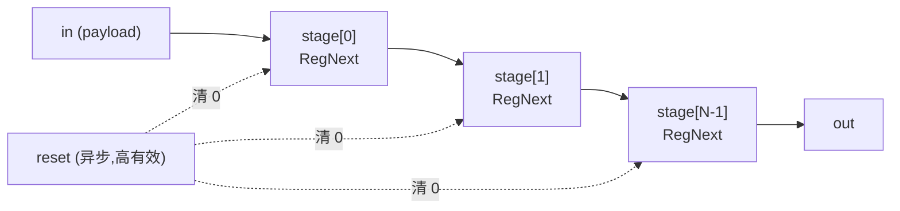

# DelayReg —— 通用「延迟 N 拍」移位链

## 1. 架构定位

`DelayReg` 是一个**纯打拍的移位寄存器链**:把输入 payload 经 N 个背靠背寄存器
延迟 N 个时钟拍后原样输出,无握手、无使能、每拍无条件前移。

设计源:
- `utility/src/main/scala/utility/Hold.scala` 的 `class DelayN[T <: Data](gen, n)`:
  对任意 bundle 做 `n` 次 `RegNext`。
- golden `DelayReg` 是 `DifftestModule(new DiffInstrCommit, delay = 3)` 生成的实例
  (见 `src/main/scala/xiangshan/backend/rob/Rob.scala`),即把一条「指令提交信息」
  difftest payload 延迟 3 拍。

可读核 / 包装:
- 核:`rtl/backend/DelayReg.sv`(`xs_delay_reg_core`)+ `rtl/backend/delayreg_pkg.sv`
- 包装(golden 同名,FM 用):`rtl/backend/DelayReg_wrapper.sv`

## 2. 它是做什么用的

DelayReg 属于 **difftest(差分测试)专用**逻辑,综合后会被优化掉。香山在 ROB
提交指令时,要把该指令的提交信息(是否提交、写哪个寄存器、是否压缩指令、coreid、
提交端口号等)送给差分测试框架,与参考模型(NEMU/Spike)逐指令比对。

由于参考模型与 RTL 的观察时序存在固定偏差,香山用 `delay = 3` 把这份信息延迟
3 拍再交给比对逻辑,使两边时序对齐。功能上就是一条「输入打 3 拍」的延迟线:

```
out(t) = in(t - 3)        // 复位后前 3 拍输出 0
```

## 3. payload:DiffInstrCommit

被延迟的 payload 是一条指令提交的 difftest 信息,用 `diff_commit_t` struct 表达
(golden 把它展平成 42 个端口):

| 字段          | 宽度 | 含义 |
|---------------|------|------|
| valid         | 1    | 本拍是否有有效提交 |
| skip          | 1    | difftest 是否跳过该指令 |
| isRVC         | 1    | 是否压缩指令 |
| rfwen         | 1    | 写整数寄存器 |
| fpwen         | 1    | 写浮点寄存器 |
| vecwen        | 1    | 写向量寄存器 |
| v0wen         | 1    | 写 v0 掩码寄存器 |
| wpdest        | 8    | 写物理寄存器号 |
| wdest         | 8    | 写逻辑寄存器号 |
| otherwpdest[0..7] | 8×8 | 向量指令的其它写目的 pdest |
| nFused        | 8    | 融合指令条数 |
| coreid        | 8    | 核 id |
| index         | 8    | 提交端口序号 |

## 4. 结构(从设计意图重写)

golden 把每个字段展平成独立 `reg`,再手工复制成 3 份(`REG_*` / `REG_1_*` /
`REG_2_*`),共几十个寄存器声明 + 三段相同的赋值。可读核回到 `DelayN` 的本意:
**payload 整体打拍,用 `genvar` 生成 N 级**,与字段无关。



- 每级 `always_ff @(posedge clock or posedge reset)`:异步复位清 0,否则取前一级
  (第 0 级取模块输入)。与 golden 的 `RegNext(init = 0)` 等价。
- `N == 0` 时 generate 分支退化为直通(对齐 `DelayN(in, 0)` = 直连)。
- 核对 payload 不做任何字段级处理,只看总位宽 `WIDTH` —— 体现「延迟任意 bundle」
  的通用性。wrapper 负责 payload 字段 <-> 展平端口的机械适配。

## 5. 验证结果

- **UT**:`verif/ut/DelayReg/`。golden `DelayReg` 与可读核 `DelayReg_xs` 双例化,
  每拍随机驱动全部 payload 字段 + 随机复位,上升沿后逐输出比对全部 42 个输出。
  - seed 1 / 7 / 42 各 200000 拍(× 20 输出 = 4000000 checks),**errors=0**。
- **FM**:`make fm`,`DelayReg` `Verification SUCCEEDED`(签名分析,3 级寄存器配对)。
- **结构闸门**:`typedef struct packed` 有、`genvar`/`generate` 有;生成痕迹
  grep(`io_*_N_N`/`_REG_N`/`_GEN_`/`_T_N`/`RANDOMIZE`)= 0。
  (无 enum/function:纯延迟线无离散状态、无组合编解码,故不需要。)

## 6. 关键坑

- **tb 采样竞争**:延迟链是时序模块,若在上升沿附近驱动 `reset`/输入,golden 与
  可读核的异步复位/采样可能出现单拍 off-by-one 的虚假 mismatch。解决:输入与复位
  统一在 **negedge 驱动**(远离上升采样沿),上升沿后 `#1` 再比对。改后 4M checks
  全过。这是**测试平台**问题,不是 DUT 逻辑问题(FM 也证两边逻辑等价)。
