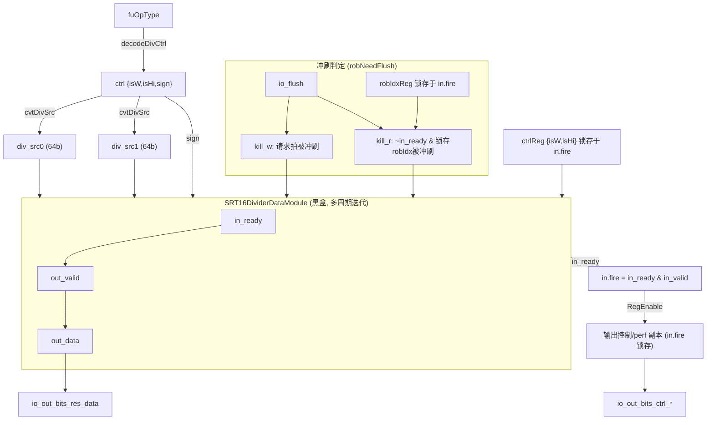

# DivUnit —— 整数除法功能单元（学习文档）

> 设计意图来源：`src/main/scala/xiangshan/backend/fu/wrapper/DivUnit.scala`
> （`class DivUnit extends FuncUnit`，多周期、可迭代，非定长流水）
> 可读重写：`rtl/backend/DivUnit.sv`（核 `xs_DivUnit_core`）+ `rtl/backend/divunit_pkg.sv`

## 1. 架构定位

DivUnit 是后端整数执行簇里的一个 **功能单元（FU）**，承担 RV64 M 扩展的除法 / 取余：
`div / divu / rem / remu` 及其字（W）变体 `divw / divuw / remw / remuw`。

与 MulUnit 的定长流水不同，除法是**多周期、可迭代**的：内部黑盒
`SRT16DividerDataModule`（基-16 SRT 除法器）一旦接受一条指令就要独占若干拍才出结果，
期间拉低 `in_ready` 形成背压。因此 DivUnit 是一个**非定长流水 FU**：

- 有真正的 **`in.ready` / `out.ready` 握手**（`in.ready` 即除法器的 `in_ready`）；
- 有 **`flush` 端口**：迭代途中若该指令被重定向冲刷，需要 kill 掉正在算的除法，
  避免冲刷后还写回脏结果。

DivUnit 这层 wrapper 只做：① 译码 + 字操作源扩展（符号处理）；② `in.fire` 锁存
robIdx/ctrl；③ 算 `kill_w` / `kill_r` 两条冲刷路径；④ `connectNonPipedCtrlSingal`
（`in.fire` 时把输出控制 / perf 打一拍寄存，迭代期间保持到结果产出）。

## 2. 数据流图

## 3. opType 编码与译码（divunit_pkg）

`fuOpType` 除法类编码：`| type(2)=10 | isWord(1)=bit2 | isSign(1)=bit1 | opcode(1)=bit0 |`

| 指令   | fuOpType | isW=`f[2]` | sign=`!f[1]` | isHi=`f[0]` |
|--------|----------|-----------|-------------|-------------|
| div    | 10000    | 0 | 1 | 0 |
| rem    | 10001    | 0 | 1 | 1 |
| divu   | 10010    | 0 | 0 | 0 |
| remu   | 10011    | 0 | 0 | 1 |
| divw   | 10100    | 1 | 1 | 0 |
| remw   | 10101    | 1 | 1 | 1 |
| divuw  | 10110    | 1 | 0 | 0 |
| remuw  | 10111    | 1 | 0 | 1 |

与 Mul 不同，除法**不按子操作做多路选择**，而是把 fuOpType 的 3 个位直接拆成三个
**正交控制位**：`isW`（字操作）、`sign`（有无符号）、`isHi`（取余）。`divunit_pkg` 里另有
一个 `div_op_e` 枚举仅作“编码字典”，方便阅读者/波形对照指令名（`DIV_DIVW` 等）。

**符号处理（字操作源扩展）** `cvtDivSrc(isW, sign, x)`：
- 非字操作：原样 64bit 送除法器；
- 字操作：取低 32bit，按 `sign` 决定符号/零扩展回 64bit。
  golden 写成 `{32{sign & x[31]}, x[31:0]}`：`sign=0` 恒零（零扩展），`sign=1` 复制
  原符号位（符号扩展），与此等价。

## 4. 冲刷（kill）与握手

除法器一旦接受指令独占多拍，冲刷分两种情形（`robNeedFlush` = `RobPtr.needFlush` 的
展平实现）：

- **`kill_w`（请求拍）**：本拍正要进入除法器的请求指令是否被冲刷（用进来的 robIdx 判）。
- **`kill_r`（迭代中）**：除法器已忙（`~in_ready`）且 `in.fire` 时锁存的 robIdx 被冲刷。

`robNeedFlush = flush.valid && ( (flush.level && this==flush.robIdx) || isAfter(this, flush.robIdx) )`，
其中 RobPtr 是循环队列指针 `{flag,value}`，`isAfter(a,b) = a.flag ^ b.flag ^ (a.value > b.value)`。

`in.fire = in_ready & in_valid` 时锁存两套独立寄存：
- `robIdxReg` + `ctrlReg{isW,isHi}`：供 `kill_r` 判定与喂给除法器 `io_isHi/io_isW`
  （结果在迭代末尾产出，取余/字处理依据被接受那拍的控制）；
- 输出控制副本 `out_*_r` + perf 副本：`connectNonPipedCtrlSingal` 的 RegEnable，
  迭代期间保持，到 `out_valid` 时正好对应。

> 注意 `io_sign` 用的是**当拍** `ctrl.sign`（请求拍即决定有无符号），而 `io_isHi/io_isW`
> 用**锁存值**——这与 golden 一致，是本模块容易写错的点。

## 5. 接口（与 golden `DivUnit` 完全一致）

| 方向 | 信号 | 说明 |
|------|------|------|
| in  | `io_flush_{valid,bits_robIdx_flag,bits_robIdx_value,bits_level}` | 重定向冲刷 |
| out | `io_in_ready` | = 除法器 `in_ready`（忙时拉低背压） |
| in  | `io_in_valid` | 发射有效 |
| in  | `io_in_bits_ctrl_fuOpType[8:0]` | 除法子操作 |
| in  | `io_in_bits_ctrl_{robIdx_flag,robIdx_value,pdest,rfWen}` | 控制 |
| in  | `io_in_bits_data_src_{0,1}[63:0]` | 被除数 / 除数 |
| in  | `io_in_bits_perfDebugInfo_*` | perf |
| in  | `io_out_ready` | 下游可收（输出背压） |
| out | `io_out_valid` | 结果有效（来自除法器） |
| out | `io_out_bits_ctrl_*` | `in.fire` 锁存的控制副本 |
| out | `io_out_bits_res_data[63:0]` | 商或余数（除法器内按 isHi 选） |
| out | `io_out_bits_perfDebugInfo_*` | perf 副本 |

黑盒子模块：`SRT16DividerDataModule`（叶子单元 `CSA3_2_3956/3960/3962`、`RightShifter`）。

## 6. 验证结果

- **结构闸门**（pkg+core 合计）：`typedef struct = 1`，`typedef enum = 1`，
  `function automatic = 3`，核内生成痕迹 grep = 0。
- **UT**（双例化 `DivUnit` vs `DivUnit_xs`，共用 golden 除法器黑盒；随机发射 + 输出
  背压 + 偶发 flush 覆盖 kill_w/kill_r + 8 种 fuOpType；robIdx 压到 0..15 提高冲刷命中）：
  seed 1 / 7 / 42 各 `checks=200000, errors=0`。
- **FM**（`make fm`，除法器黑盒两侧共享，默认 merge=true）：`SUCCEEDED`，
  1712 by name + 201 by signature，0 unmatched。

### 关键坑

1. **`io_sign` 用当拍、`io_isHi/io_isW` 用锁存值**：混用会在迭代边界出错。
2. **`kill_r` 必须与 `~in_ready` 相与**：只有除法器正在迭代时才需要杀已锁存的指令；
   忘了相与会把空闲态也误杀。
3. **两套 `in.fire` 锁存相互独立**：`robIdxReg/ctrlReg`（kill + 喂除法器）与
   `out_*_r`（输出控制透传）是 golden 里分开的两组寄存器，重写时不要合并。
