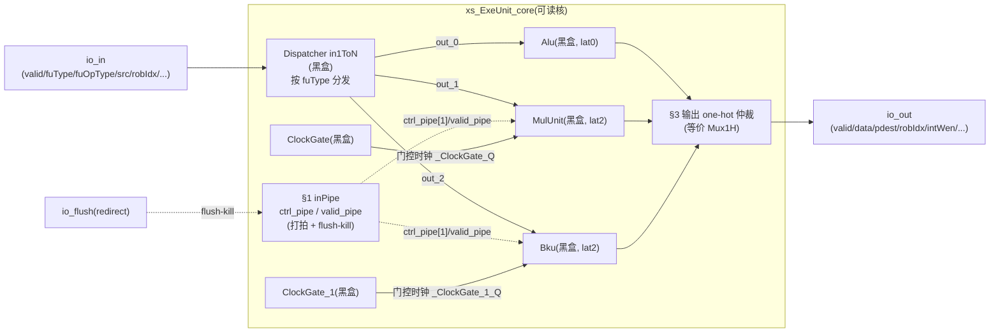
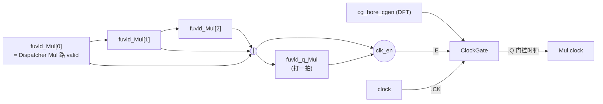

# 执行单元包装 ExeUnit(可读重写)

设计源:`src/main/scala/xiangshan/backend/exu/ExeUnit.scala`（`class ExeUnit`）
golden 对照:`golden/chisel-rtl/ExeUnit*.sv`
可读核:`rtl/backend/ExeUnit_4.sv` / `ExeUnit.sv` / `ExeUnit_8.sv`
（核体 = `xs_ExeUnit*_core`,逻辑分散于 `exeunit*_{pkg.sv, decls.svh, logic.svh, connect.svh, ports.svh}`)

---

## 1. 这是什么 —— ExeUnit 在后端的位置

后端乱序流水的主干是:

```
Rename → Dispatch → IssueQueue(唤醒-选择) → DataPath(读寄存器+旁路) → ExeUnit → WbDataPath(写回)
```

**ExeUnit 是「发射 → 执行 → 写回」三段里的执行段容器**。它本身**不做任何运算**,
只是把一个或多个**功能单元(FU,如 Alu/Mul/Bku/FAlu/FCVT/FMA)** 包在一起,负责 FU 周围
全部的 glue 逻辑:

| 职责 | 一句话 | 本文 |
|---|---|---|
| §0 输入分发 | 按 `fuType` 把唯一的 `io_in` 路由到正确的那个 FU | `Dispatcher`(黑盒) |
| §1 inPipe | 控制位/有效位随 uop 打拍对齐,供有延迟 FU 在「出结果那拍」取到原始 uop 控制位;有效位每拍做 flush-kill | §3 |
| §2 时钟门控 | 每个有延迟 FU 一条「在飞」有效链,链上有 uop 才让时钟翻转,省功耗 | §4 |
| §3 输出仲裁 | 同一拍至多一个 FU 出结果,把各 FU 输出逐字段 one-hot 或归约成唯一 `io_out` | §5 |

为什么一个 ExeUnit 里要放多个 FU?因为它们**共享同一个发射端口**(IssueQueue 的一条 deq):
同一拍这条端口只会发射一条 uop,这条 uop 的 `fuType` 决定它进哪个 FU,所以多个 FU 在「输入」
上天然互斥,在「输出」上也至多一个有效——这正是 §3 能用 one-hot 或归约的前提。

> 重写边界:FU(Alu/Mul/...)、分发器 `Dispatcher`、时钟门控单元 `ClockGate` 在 UT/FM
> 两侧均为 **golden 黑盒**(它们是真正的运算/分发/物理 cell 实体)。可读核重写的是把它们
> 接起来的**全部 glue**:inPipe 流水、门控使能链、输出仲裁。

---

## 2. 结构图(以 ExeUnit = Alu+Mul+Bku 为例)



- Alu 是 **lat0**(组合出结果),不挂 ClockGate、不需要 inPipe 控制位(它直接用 `io_in` 的控制位)。
- Mul/Bku 是 **lat2**(发射后第 2 拍出结果),时钟由各自的 ClockGate 门控,出结果拍要用的
  控制位由 inPipe 提供(`ctrl_pipe[1]` = 进入后第 2 拍的控制位)。

---

## 3. §1 inPipe —— 控制位/有效位打拍 + flush-kill

### 3.1 为什么需要 inPipe

有延迟 FU(Mul lat2)在「发射拍」收到运算数据,但要到「第 2 拍」才出结果。出结果时
写回需要的控制位(`robIdx`/`pdest`/`rfWen` 等)必须是**那条 uop 自己的**控制位。Alu lat0
当拍就出结果,直接用 `io_in` 的控制位即可;有延迟 FU 则需要把控制位**跟着 uop 一起延迟**——
这就是 inPipe 控制位链。同时有效位也要延迟,且每一级都要检查这条在飞 uop 是否被
重定向(redirect)冲刷掉,这就是有效位链的 **flush-kill**。

### 3.2 ctrl_t struct + genvar 移位(控制位链)

控制位字段集合在单态化后是定值,用一个 packed struct 表达(`exeunit_pkg.sv`):

```systemverilog
typedef struct packed {
  logic       robIdx_flag;
  logic [7:0] robIdx_value;
  logic [7:0] pdest;
  logic       rfWen;
} ctrl_t;                                  // 整数变体 ExeUnit

ctrl_t ctrl_pipe [LAT_MAX];                // 深度 = 各 FU 最大延迟(decls.svh)
```

控制位链就是一条纯移位寄存器,用 `genvar` for 展开(`exeunit_logic.svh`):

```systemverilog
for (genvar k = 0; k < LAT_MAX; k++) begin : g_inpipe
  always_ff @(posedge clock) begin
    if (k == 0) ctrl_pipe[0] <= ctrl_in;       // 入口:本拍 io_in 控制位
    else        ctrl_pipe[k] <= ctrl_pipe[k-1];// 后级:逐级移位
  end
end
```

`ctrl_pipe[k]` 的语义是「进入后第 (k+1) 拍的控制位」。例如 Mul lat2 在第 2 拍出结果,
取 `ctrl_pipe[1]`(见 connect.svh 把 `ctrl_pipe[1].*` 接到 `Mul.io_in_bits_ctrlPipe_2_*`)。

### 3.3 need_flush / stage_alive 两个纯函数(有效位链 flush-kill)

有效位链每拍除移位外,还要把「已被冲刷」的在飞 uop 清 0。判断一条 uop 是否被本次
redirect 冲刷,用 `need_flush`(`exeunit_pkg.sv`),它把 Chisel `robIdx.needFlush` 展开成
环形比较:

```systemverilog
function automatic logic need_flush(
    logic flush_valid, logic flush_level,
    logic flush_flag,  logic [7:0] flush_value,
    logic rob_flag,    logic [7:0] rob_value);
  need_flush = flush_valid &
    ( (flush_level & ({rob_flag, rob_value} == {flush_flag, flush_value}))  // flushItself:自身
      | (rob_flag ^ flush_flag ^ (rob_value > flush_value)) );              // 比 flush 更年轻
endfunction
```

一级有效推进封装成 `stage_alive`(`exeunit_logic.svh`):

```systemverilog
function automatic logic stage_alive(
    logic v, logic rflag, logic [7:0] rval,
    logic fl_valid, logic fl_level, logic fl_flag, logic [7:0] fl_value);
  stage_alive = v & ~need_flush(fl_valid, fl_level, fl_flag, fl_value, rflag, rval);
endfunction
```

> **关键点 / FM 踩坑(详见 §6)**:这两个 function **不捕获任何模块级信号**,所有 flush/robIdx
> 都是**显式入参**。早期版本让 `stage_alive` 直接读模块级 `io_flush_*`,触发 Formality 的
> `FMR_VLOG-091`(function 内引用模块信号导致 sim/synth 语义不一致),impl 被阻断。改成纯
> 函数(全入参)后过线。

有效位链本体(`exeunit_logic.svh`):

```systemverilog
always_ff @(posedge clock or posedge reset) begin
  if (reset) begin
    for (int k = 0; k < LAT_MAX; k++) valid_pipe[k] <= 1'b0;
  end else begin
    valid_pipe[0] <= stage_alive(io_in_valid,
                       io_in_bits_robIdx_flag, io_in_bits_robIdx_value, /*flush...*/);
    for (int k = 1; k < LAT_MAX; k++)
      valid_pipe[k] <= stage_alive(valid_pipe[k-1],
                         ctrl_pipe[k-1].robIdx_flag, ctrl_pipe[k-1].robIdx_value, /*flush...*/);
  end
end
```

注意第 k 级的 robIdx 取自**上一级的控制位链** `ctrl_pipe[k-1]`,与 golden 一致(因为有效位
和控制位是同一条 uop 在同一拍的两个分量)。

### 3.4 数据流时序示意(Mul lat2,在第 N 拍发射)

```mermaid
sequenceDiagram
    autonumber
    participant D as Dispatcher
    participant P as inPipe
    participant M as Mul(黑盒)
    participant A as §3 仲裁
    Note over D,A: 第 N 拍(发射)
    D->>M: out_1.valid=1 + data(src) + fuOpType
    D->>P: ctrl_in=本拍控制位 → ctrl_pipe[0]
    Note over P: valid_pipe[0] = stage_alive(io_in_valid, ...)
    Note over D,A: 第 N+1 拍
    P->>P: ctrl_pipe[0]→ctrl_pipe[1]; valid_pipe[0]→valid_pipe[1](再 flush-kill)
    Note over D,A: 第 N+2 拍(出结果)
    P->>M: ctrl_pipe[1].{robIdx,pdest,rfWen} + validPipe(0/1/2)
    M->>A: io_out.valid + res_data + ctrl(回灌的控制位)
    A->>A: 仅 Mul 有效 → io_out = Mul 输出
```

---

## 4. §2 时钟门控有效链

### 4.1 思想

有延迟 FU 的内部流水寄存器只有在「流水里还有在飞 uop」时才需要翻转;空闲时关掉时钟省功耗。
ExeUnit 为每个有延迟 FU 维护一条**有效移位链 `fuvld`**:链入口 = 该 FU 被分发选中,
链长 = 该 FU 的延迟级数。链上**任一级有效**就说明流水里有 uop,需要保持时钟。

### 4.2 clk_en = |链(以 Mul lat2 为例,`exeunit_logic.svh` / `decls.svh`)

```systemverilog
logic [2:0] fuvld_Mul;   // [0]=入口(被选中), [1..2]=在飞各级
logic       fuvld_q_Mul; // clk_en 再打一拍

always_ff @(posedge clock or posedge reset) begin
  if (reset) begin fuvld_Mul[2:1] <= '0; fuvld_q_Mul <= 1'b0; end
  else begin
    for (int s = 1; s <= 2; s++) fuvld_Mul[s] <= fuvld_Mul[s-1];  // 移位
    fuvld_q_Mul <= |fuvld_Mul;                                    // 延迟一拍合并
  end
end
wire clk_en_Mul = (|fuvld_Mul) | fuvld_q_Mul;                     // 链上任一级有效 | 上一拍使能
```

链入口由 connect.svh 接到「该 FU 被分发选中」:

```systemverilog
assign fuvld_Mul[0] = _in1ToN_io_out_1_valid;   // Dispatcher 的 Mul 路 valid
```

`clk_en` 再多或一个 `fuvld_q`(上一拍使能)是为了让门控时钟多保持一拍,覆盖结果拍的寄存器
更新边界,与 golden 的 `clk_en | clk_en_reg` 一致。

### 4.3 接到 ClockGate(connect.svh)

```systemverilog
ClockGate ClockGate (
  .TE (cg_bore_cgen),   // test-enable:来自顶层 DFT 信号(扫描旁路用)
  .E  (clk_en_Mul),     // function-enable:本 FU 是否需要时钟
  .CK (clock),
  .Q  (_ClockGate_Q)    // 门控后时钟 → Mul.clock
);
```

> **真问题 / FM 踩坑(详见 §6)**:`TE`(test-enable)必须接顶层透传进来的 DFT 信号
> `cg_bore_cgen`(golden 里叫 `Mul_clock_te_cgen = cg_bore_cgen`),**不是** `clk_en` 这条
> 功能使能。早期版本把 `TE` 误连成 `clk_en` 的别名,FM 在 `ClockGate/TE` 这个黑盒 pin 上报
> failing。改回 `TE=cg_bore_cgen`、`E=clk_en_*` 后过线。

### 4.4 门控有效链示意



---

## 5. §3 输出按位或仲裁(等价 Mux1H)

同一拍至多一个 FU 有效(§1 已论证),所以可以对每个输出字段做「选中则取该 FU 值、否则取 0」
的**或归约**——这正是 Chisel `Mux1H` 的展开,综合成与-或选择网,无优先级歧义。

```systemverilog
// 有效位:各 FU valid 的或
assign io_out_valid = |{_Alu_io_out_valid, _Mul_io_out_valid, _Bku_io_out_valid};

// 多 bit 字段(数据/pdest/robIdx_value):(valid ? field : 0) 的或
wire [63:0] arb_w0 = (_Alu_io_out_valid ? _Alu_io_out_bits_res_data : 64'h0)
                   | (_Mul_io_out_valid ? _Mul_io_out_bits_res_data : 64'h0)
                   | (_Bku_io_out_valid ? _Bku_io_out_bits_res_data : 64'h0);
assign io_out_bits_data_0 = arb_w0;
assign io_out_bits_data_1 = arb_w0;   // 同源:golden 把 res_data 复制到两个 data 端口

// 1 bit 字段(robIdx_flag/intWen):(valid & field) 的或
assign io_out_bits_intWen =
    _Alu_io_out_valid & _Alu_io_out_bits_ctrl_rfWen
  | _Mul_io_out_valid & _Mul_io_out_bits_ctrl_rfWen
  | _Bku_io_out_valid & _Bku_io_out_bits_ctrl_rfWen;
```

浮点变体 ExeUnit_8 的数据宽到 128b(向量),仲裁要按 golden 的切片宽度对齐(`exeunit_8_connect.svh`):

```systemverilog
wire [63:0]  arb_w0 = (_Falu...res_data:64'h0) | (_Fcvt...res_data:64'h0);  // 标量浮点
wire [127:0] arb_w1 = {64'h0, arb_w0} | (_f2v...res_data:128'h0);           // 并入 f2v 128b
wire [127:0] arb_w2 = {arb_w1[127:64], arb_w1[63:0] | (_Fmac...res_data:64'h0)};
assign io_out_bits_data_0 = arb_w2;          // 全 FU 合流
assign io_out_bits_data_3 = _f2v_io_out_bits_res_data;  // 仅 f2v 写的端口直连
```

`fflags`(浮点异常标志)同样或归约,`fpWen/vecWen/v0Wen/intWen/wflags` 各按「哪些 FU 会写
该寄存器域」选择参与的 FU(例如 `vecWen` 只有 f2v 产生,`intWen` 只有 Falu/Fcvt 产生)。

---

## 6. 变体差异表

单态化(昆明湖)后 FU 个数 / 各 FU 延迟 / 控制位集合 / 数据宽全是定值,可读核据此参数化。
本项目已完成并验证三个代表变体:

| 维度 | **ExeUnit_4**(纯整数最简) | **ExeUnit**(整数多 FU) | **ExeUnit_8**(浮点) |
|---|---|---|---|
| FU 组合 | Alu | Alu + Mul + Bku | FAlu + FCVT + f2v(IntFPToVec) + FMA |
| `NUM_FU` | 1 | 3 | 4 |
| 各 FU 延迟 | Alu lat0 | Alu0 / Mul2 / Bku2 | Falu1 / Fcvt2 / f2v0 / Fmac3 |
| `LAT_MAX`(inPipe 深度) | — (无打拍/门控) | 2 | 3 |
| ClockGate 个数 | 0 | 2(Mul/Bku) | 3(Falu/Fcvt/Fmac;f2v lat0 无) |
| ctrl_t 字段 | (无 inPipe) | robIdx/pdest/rfWen | + fuOpType/fpWen/fpu_wflags |
| 输出控制位 | intWen | intWen | intWen/fpWen/vecWen/v0Wen/fflags/wflags |
| 数据端口宽 | 64b ×2 | 64b ×2 | 128b ×5 |
| 额外输入 | — | — | src_2(三源乘加)/fpu_fmt/fpu_rm/io_frm(舍入模式) |

> ExeUnit_4 是「极简对照样本」:只有一个 lat0 的 Alu,**既无 inPipe 也无时钟门控**,
> connect.svh 里仅有 Dispatcher + Alu + §3 仲裁(其 logic.svh 实际为空),用来印证「ExeUnit 的
> 复杂度全来自有延迟 FU」。

**其余变体同构,未单独重写但方法学完全覆盖:**

| 变体 | FU 组合 | 与已重写哪个同构 |
|---|---|---|
| ExeUnit_1 | BranchUnit + JumpUnit | 整数,同 ExeUnit 的多 FU 仲裁 |
| ExeUnit_5 | BranchUnit + JumpUnit + IntFPToVec | 同上 + f2v 切片 |
| ExeUnit_7 | DivUnit + Fence | 整数有延迟 FU,同 ExeUnit |
| ExeUnit_9 | FDivSqrt | 单 FU 有延迟,同 ExeUnit_8 子集 |
| ExeUnit_10 | FAlu + FMA | 浮点,ExeUnit_8 子集 |
| ExeUnit_13..17 | 向量 FU(VFMA/VIAluFix/VFAlu/VPPU/VFDivSqrt/...) | 同构于浮点变体,只是 FU 黑盒换成向量、数据宽 128b |

差异只在「FU 列表 / 各 FU 延迟 / 控制位集合 / 数据宽」这几个参数,§1–§5 的骨架(inPipe 打拍 +
flush-kill、门控有效链、one-hot 仲裁)逐字相同,由生成器 `scripts/gen_exeunit.py` 按 golden
端口自动展开。

---

## 7. 验证

### 7.1 双例化 UT

每个变体一个 tb(`verif/ut/ExeUnit{_4,,_8}/tb.sv`),把 golden(`u_g`)与可读核 wrapper
(`u_i = ExeUnit*_xs`)并排例化,同激励逐拍比对全部输出端口。激励含随机 `io_in`(fuType/
fuOpType/src/robIdx)与随机 `io_flush`(覆盖 flush-kill 路径)。

- **seed 1 / 7 / 42 × NCYCLES=200000 拍,errors=0,TEST PASSED**(三变体均一次收敛)。

### 7.2 FM(Formality 等价验证)

FU(Alu/Mul/Bku/FAlu/FCVT/FMA/IntFPToVec)、`Dispatcher*`、`ClockGate` 设为黑盒,
验证可读核 glue 与 golden glue 等价。

| 变体 | 结果 | compare points |
|---|---|---|
| ExeUnit_4 | **SUCCEEDED** | 1128 passing(789 BBPin + 339 Port),0 failing |
| ExeUnit | **SUCCEEDED** | 2292 passing(含 44 DFF + 2 BBNet),0 failing |
| ExeUnit_8 | **SUCCEEDED** | 3513 passing(2561 BBPin + 860 Port + 89 DFF + 3 BBNet),0 failing |

### 7.3 收敛过程中修过的两个真问题

1. **`stage_alive` 致 `FMR_VLOG-091`**:有效位链推进函数最初直接读模块级 `io_flush_*`,
   Formality 判定 function 内引用模块信号会造成 sim/synth 语义不一致,阻断 impl。改成
   **全入参纯函数**(flush/robIdx 都从参数传入,不捕获外部信号)后过线。

2. **`ClockGate.TE` 误连别名**:门控单元的 test-enable 引脚 `TE` 最初被接成功能使能 `clk_en`
   的别名,FM 在黑盒 pin `ClockGate*/TE` 上报 failing。golden 里 `TE = cg_bore_cgen`(顶层
   透传的 DFT 扫描使能),与功能使能 `E = clk_en` 是两条独立信号。改回
   `.TE(cg_bore_cgen) / .E(clk_en_*)` 后,三个 ClockGate 的 TE pin 全部对齐,FM SUCCEEDED。
   (注:`verif/ut/ExeUnit_8/fm_work/.../failing.rpt` 是此问题修复前的旧快照,以最终 `fm.log`
   的 `FM_RESULT: SUCCEEDED` 与 0 failing 为准。)

### 7.4 硬性闸门

可读核体无 golden 生成痕迹:`grep -E "_GEN_|_T_[0-9]|_REG_|RANDOMIZE|io_[a-z_]+_[0-9]+_[0-9]+"`
在 core/pkg/svh 上为 0;wrapper 仅作扁平↔核透传,无中间网命名。pkg 用 struct + 2 个纯函数
(`need_flush`/`stage_alive`)+ genvar 表达全部逻辑,无套壳,中文注释齐全。
