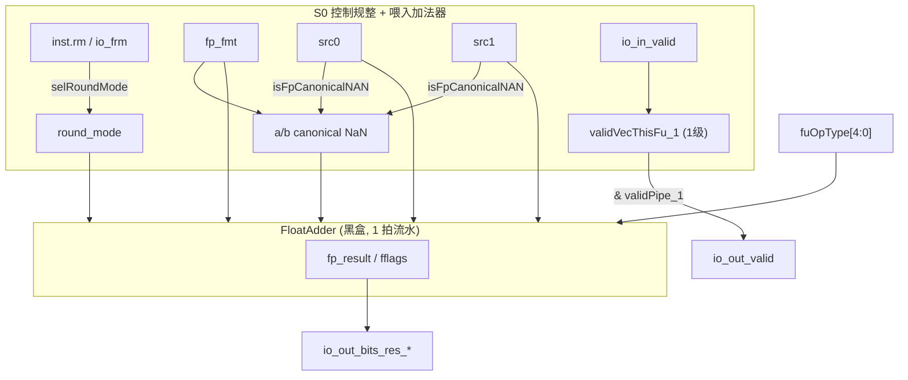

# FAlu —— 浮点加法/比较功能单元（学习文档）

> 设计意图来源：`src/main/scala/xiangshan/backend/fu/wrapper/FALU.scala`
> （`class FAlu extends FpPipedFuncUnit`，`latency = 1`）
> 可读重写：`rtl/backend/FAlu.sv`（核 `xs_FAlu_core`）+ `rtl/backend/falu_pkg.sv`

## 1. 架构定位

FAlu 是后端浮点执行簇（ExuBlock）里的一个 **功能单元（FU）**，承担标量浮点的
加 / 减 / 比较（feq/flt/fle/...）/ 选最值（fmin/fmax）/ 符号注入（fsgnj*）/ 分类
（fclass）/ 移动等。它是一个 **1 拍定长流水**（piped FU），吞吐 1 条/拍。

它本身 **不实现浮点加法器**，真正的对阶 / 加减 / 规格化 / 圆整在黑盒 `FloatAdder`
（内部分 F64 与 F32-F16 混合两条 1 拍流水）里完成。FAlu 这层 wrapper 只做四件
「控制 + 格式规整」的事：

1. **圆整模式选择**：指令携带 rm，若为 `3'b111`（动态）则改用 CSR `fcsr.frm`；
2. **浮点格式透传**：`fp_fmt`（e16/e32/e64，VSew 编码）给加法器；
3. **规范 NaN 检测**：窄浮点未正确 NaN-box（高位非全 1）时按规范 NaN 处理；
4. **流水 + 输出**：1 级 valid/perf 打拍，输出控制取外部 `ctrlPipe_1`。

## 2. 数据流图

## 3. 流水与握手（HasPipelineReg, latency=1）

控制/数据流水（`ctrlPipe` / `validPipe`）由发射队列 + 数据通路在 FU **外部**预先打拍，
随加法器 1 拍时延平移送入；FAlu 端口里看到的是 `io_in_bits_validPipe_1` 与
`io_in_bits_ctrlPipe_1_*`。FAlu 内部只额外维护：

- **本 FU 内部 valid 流水** `validVecThisFu_1`：复位敏感的 1 级寄存器，起点 `io_in_valid`；
- **perf 调试信息流水**（1 级，使能 `io_in_valid`，不参与运算）。

输出有效 = `validPipe_1 & validVecThisFu_1`；输出控制直接取外部 `ctrlPipe_1`。
定长流水、无背压、不自管冲刷，故 **无 in.ready / out.ready / flush 端口**。

## 4. 关键设计点

- **圆整模式三态**：`rm==7` 表示动态，硬件改读 CSR frm；见 `falu_pkg::selRoundMode`。
- **NaN-boxing 校验**：RV 把窄浮点装进 64bit 时高位要求全 1。若实际不是全 1，
  `isFpCanonicalNAN` 置位，加法器据此把该源当规范 NaN 处理。e64 占满，无需检测。

## 5. 接口（与 golden `FAlu` 完全一致）

| 方向 | 信号 | 说明 |
|------|------|------|
| in  | `io_in_valid` | 本拍发射有效 |
| in  | `io_in_bits_ctrl_fuOpType[8:0]` | 浮点子操作（低 5bit 给加法器） |
| in  | `io_in_bits_ctrl_fpu_fmt[1:0]` | 浮点格式 |
| in  | `io_in_bits_ctrl_fpu_rm[2:0]` | 指令圆整模式（7=动态） |
| in  | `io_in_bits_validPipe_1` / `io_in_bits_ctrlPipe_1_*` | 外部第 1 级流水 |
| in  | `io_in_bits_data_src_{0,1}[63:0]` | 两源操作数 |
| in  | `io_frm[2:0]` | CSR 动态圆整 |
| out | `io_out_valid` | `validPipe_1 & validVecThisFu_1` |
| out | `io_out_bits_res_data[63:0]` / `io_out_bits_res_fflags[4:0]` | 结果 / 异常标志 |
| out | `io_out_bits_ctrl_*` / `io_out_bits_perfDebugInfo_*` | 透传 / perf 末级 |

黑盒子模块：`FloatAdder`（含 F64 / F32-F16 混合两条流水及其叶子加法器）。

## 6. 验证结果

- **结构闸门**（pkg+core）：`typedef enum = 1`，`function automatic = 2`，
  生成痕迹 grep = 0（struct/genvar 不适用：本 FU 无数组/复合 payload）。
- **UT**（双例化 `FAlu` vs `FAlu_xs`，共用 golden FloatAdder 黑盒；随机背靠背 +
  10 种合法 fuOpType + 随机 validPipe/rm/fmt）：seed 1 / 7 / 42 各 `checks=200000, errors=0`。
- **FM**（`make fm`，加法器黑盒两侧共享，`FM_MERGE_DUP=false`）：`SUCCEEDED`。

### 关键坑

1. **FM merge-dup 与黑盒**：FloatAdder 内部流水寄存器在 golden 顶层 vs 手写
   `wrapper→u_core` 两种层次下，默认合并 pass 会做不对称常量传播误判失配；
   `FM_MERGE_DUP=false` 即干净通过（同 MulUnit）。
