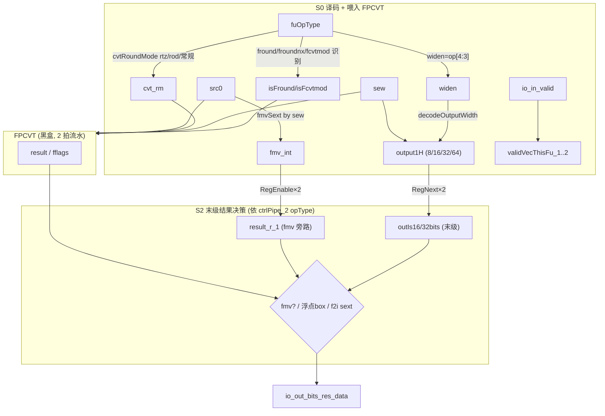

# FCVT —— 浮点转换功能单元（学习文档）

> 设计意图来源：`src/main/scala/xiangshan/backend/fu/wrapper/FCVT.scala`
> （`class FCVT extends FpPipedFuncUnit`，`latency = 2`）
> 可读重写：`rtl/backend/FCVT.sv`（核 `xs_FCVT_core`）+ `rtl/backend/fcvt_pkg.sv`

## 1. 架构定位

FCVT 是后端浮点执行簇里的 **浮点转换 FU**，承担：f2i / i2f / f2f（变宽 widen /
变窄 narrow）/ `fround` / `froundnx` / `fcvtmod` / `fmv_x_w/d`。**2 拍定长流水**。

真正的转换在黑盒 `FPCVT`（2 拍流水）。本 wrapper 层做的决策比其它 FP FU 更多——
转换涉及输入/输出格式与宽度、特殊圆整、NaN-box 与符号扩展，这些都在 wrapper 决定。

## 2. 数据流图

## 3. 关键译码（fcvt_pkg）

- **圆整模式 `cvtRoundMode`**：`isRtz = op[2]&op[1] | isFcvtmod`（截断，码 1）、
  `isRod = op[2]&!op[1]&op[0]`（就近奇，码 6），否则用常规 rm（动态→frm）。三者互斥 OR 合成。
- **输出宽度 `decodeOutputWidth(widen, sew)`**：`widen=op[4:3]`（0 同宽 / 1 widen /
  2 narrow / 3 半精度互转特例），查真值表得 4bit one-hot（8/16/32/64bit）。
- **fmv 整数化 `fmvSext`**：`fmv_x_*` 不经 FPCVT，直接把源按 sew 符号扩展为 64bit 整数，
  打两拍旁路到末级。

## 4. 流水细节（HasPipelineReg, latency=2）

控制/数据流水由 FU 外预打拍送入（`validPipe_2` / `ctrlPipe_2`）。FCVT 内部维护几条与
FPCVT 2 拍对齐的本地流水：

- **本 FU valid 流水** `validVecThisFu_1..2`（2 级）；
- **perf 流水**（2 级）；
- **输出宽度流水** `outIs16bits / outIs32bits`：把 `output1H` 的 bit 经 2 级寄存器对齐到末级
  （每拍无条件搬运，对应 golden 的 `RegNext(RegNext(...))`）；
- **fmv 旁路流水** `result_r → result_r_1`：使能依次为 `io_in_valid` 与 `fire_last`
  （`fire_last` 是 fire 的门控延迟有效，对应 `GatedValidRegNext`）。

输出有效 = `validPipe_2 & validVecThisFu_2`。无 in.ready / out.ready / flush。

## 5. 末级结果决策（依 `ctrlPipe_2` 的 opType / 宽度 / 整浮点）

按 `outIsInt = !ctrlPipe_2.fuOpType[6]`、`outIsMvInst = ctrlPipe_2.fuOpType==FMVXF` 选择：

1. **fmv** → 取旁路整数化结果 `result_r_1`；
2. **32bit 浮点结果** → 高 32 位补 1（NaN-box）；**16bit 浮点结果** → 高 48 位补 1；
3. 否则 → FPCVT 原结果；
4. 最后：**f2i 且 32bit 整数结果** → 低 32 位符号扩展回 64bit。

> X 铁律：以上多分支用 `always_comb` 的 if/else 链（三元 mux 语义），复刻 golden 的
> 嵌套三元，避免非法 opType 上出现 X 或不等价。

## 6. 接口（与 golden `FCVT` 完全一致，节选）

| 方向 | 信号 | 说明 |
|------|------|------|
| in  | `io_in_bits_ctrl_fuOpType[8:0]` / `_fpu_fmt`(sew) / `_fpu_rm` / `io_frm` | 子操作 / 格式 / 圆整 |
| in  | `io_in_bits_ctrlPipe_2_fuOpType[8:0]` | 末级结果决策依据（输出端 opType） |
| in  | `io_in_bits_validPipe_2` / `io_in_bits_ctrlPipe_2_*` | 外部第 2 级流水 |
| in  | `io_in_bits_data_src_0[63:0]` | 单源 |
| out | `io_out_bits_res_data` / `_res_fflags`（fmv 清 0） | 结果 / 异常标志 |

黑盒子模块：`FPCVT`（含 `CVT64` / `FP_INCVT` / `CLZ_6` / `RoundingUnit_*` / `ShiftRightJam`）。

## 7. 验证结果

- **结构闸门**（pkg+core）：`typedef enum = 1`，`function automatic = 4`，生成痕迹 = 0。
- **UT**（双例化共用 FPCVT 黑盒；随机背靠背 + 14 种合法 fuOpType（含 fround/froundnx/
  fcvtmod/fmv）+ 随机 ctrlPipe_2 opType）：seed 1 / 7 / 42 各 `checks=200000, errors=0`。
- **FM**（`make fm`，`FM_MERGE_DUP=false`）：`SUCCEEDED`。

### 关键坑

1. **outIsInt / outIsMvInst 取自输出端 opType**：用 `ctrlPipe_2.fuOpType`（已对齐到末级的
   那条指令），而非当拍输入 opType。
2. **fmv 旁路的双使能不同源**：`result_r` 用 `io_in_valid`、`result_r_1` 用 `fire_last`
   （门控延迟有效），保持与 golden 严格一致。
3. **FM merge-dup**：同其它 FP FU，`FM_MERGE_DUP=false`。
