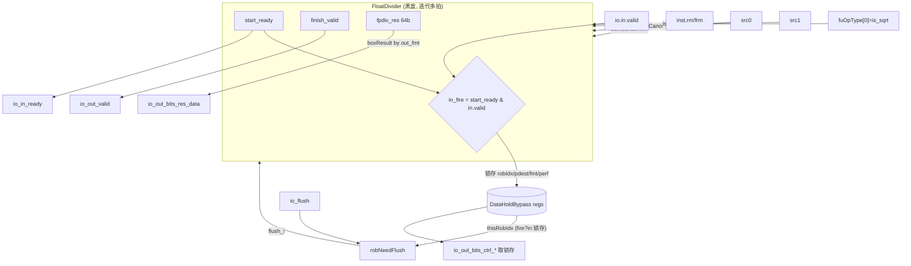

# FDivSqrt —— 浮点除/开方功能单元（学习文档）

> 设计意图来源：`src/main/scala/xiangshan/backend/fu/wrapper/FDivSqrt.scala`
> （`class FDivSqrt extends FpNonPipedFuncUnit`）
> 可读重写：`rtl/backend/FDivSqrt.sv`（核 `xs_FDivSqrt_core`）+ `rtl/backend/fdivsqrt_pkg.sv`

## 1. 架构定位

FDivSqrt 是后端浮点执行簇里 **唯一的非定长流水（迭代）浮点 FU**，承担 `fdiv`
（`is_sqrt=0`）与 `fsqrt`（`is_sqrt=1`）。除法/开方是 SRT 迭代，需多拍才出结果、吞吐 <1，
因此它带 **完整握手（in.ready / out.ready）与 flush**（可被重定向冲刷正在进行的迭代）——
这与定长流水的 FAlu/FMA/FCVT（无握手/无 flush）形成鲜明对比。

真正的迭代在黑盒 `FloatDivider`（内部 R64 除法块 + R16 开方块）。本 wrapper 层做：

1. **握手桥接**：`start_valid=io.in.valid`，`io.in.ready=start_ready`；
   `io.out.valid=finish_valid`，`finish_ready=io.out.ready & io.out.valid`；
2. **输出控制锁存**（DataHoldBypass）：在 `io.in.fire` 那拍记下 robIdx/pdest/fpWen/
   wflags/fmt/perf，迭代结束写回时取锁存值（因为迭代跨多拍，输入端口早已变化）；
3. **flush 判定**：用「正在处理的 robIdx」与重定向比较 `needFlush`；
4. **rm 选择、两源 NaN 检测**（同 FAlu）；
5. **结果 NaN-box**：迭代器给 64bit 结果，按输出 fmt 取低段并高位补 1。

## 2. 数据流图



## 3. 生命周期与握手（FpNonPipedFuncUnit）

- **入**：`start_valid=io.in.valid`；`io.in.ready=start_ready`（迭代器空闲才接受新请求）。
- **出**：`io.out.valid=finish_valid`；`finish_ready=io.out.ready & io.out.valid`。
- **输出控制不外部预打拍**（与定长流水不同），而是本 FU 在 `io.in.fire` 那拍用
  DataHoldBypass 锁存，结束写回取锁存值。`out_fmt` 用组合旁路（fire 当拍看输入、
  否则看锁存）以便接受请求的当拍也能正确组合 fmt。

## 4. flush 判定（`fdivsqrt_pkg::robNeedFlush`）

`RobPtr = {flag, value}`（flag 是回绕标志）。重定向携带 `robIdx` 与 `level`：

```
needFlush = flush_valid & ( (level & 同号同值) | (flag^fflag ^ (value>fvalue)) )
```

- `level==1`（异常级冲刷）：robIdx 相等也冲（含自身）；
- 否则只冲环形意义上「晚于 flush.robIdx」的指令（`flag^fflag ^ (value>fvalue)`）。

「正在处理的 robIdx」= `io.in.fire ? 输入robIdx : 锁存robIdx`（当前占用迭代器那条）。

## 5. 结果 NaN-box（`boxResult`）

迭代器给 64bit `fpdiv_res`，按输出 fmt 取低 16/32/64 位、高位补 1（NaN-boxing）：
e16→`{48'h..F, res[15:0]}`、e32→`{32'h..F, res[31:0]}`、e64→`res`；非法格式（e8）→0
（复刻 Chisel `Mux1H` 无命中即 0）。

## 6. 接口（与 golden `FDivSqrt` 完全一致，节选）

| 方向 | 信号 | 说明 |
|------|------|------|
| in  | `io_flush_valid` / `io_flush_bits_{robIdx_flag,robIdx_value,level}` | 重定向冲刷 |
| out | `io_in_ready` | = start_ready |
| in  | `io_in_valid` / `io_in_bits_ctrl_fuOpType[8:0]`(bit0=is_sqrt) | 请求 / 子操作 |
| in  | `io_in_bits_ctrl_{robIdx_*,pdest,fpWen,fpu_wflags,fpu_fmt,fpu_rm}` | 控制（锁存用） |
| in  | `io_in_bits_data_src_{0,1}` / `io_frm` | 两源 / 动态圆整 |
| in  | `io_out_ready` | 出口握手 |
| out | `io_out_valid` / `io_out_bits_res_data` / `_res_fflags` | 写回有效 / 结果 / 标志 |
| out | `io_out_bits_ctrl_*`（取锁存） / `_perfDebugInfo_*`（取锁存） | 输出控制 / perf |

黑盒子模块：`FloatDivider`（含 `FloatDividerR64` / `fpdiv_r64_block` / `fpsqrt_r16(_block)` /
`r4_qds*` / `lzc` / `ShiftLeftPriorityWithLZDResult` 等叶子）。

## 7. 验证结果

- **结构闸门**（pkg+core）：`typedef enum = 1`，`function automatic = 4`，生成痕迹 = 0。
- **UT**（双例化共用 FloatDivider 黑盒；随机背靠背 + is_sqrt 两态 + **随机 flush（1/16 概率）
  + 随机 out_ready（3/4 概率）**，覆盖握手反压与冲刷）：seed 1 / 7 / 42 各
  `checks=200000, errors=0`。
- **FM**（`make fm`）：`SUCCEEDED`（`FM_MERGE_DUP=true`，见下）。

### 关键坑

1. **FM 必须开启 merge-dup（与定长流水 FU 相反）**：golden 把 robIdx 锁存成 **两份同值
   副本**——`outCtrl_r_robIdx_*`（给 flush 比较）与 `io_out_bits_ctrl_robIdx_r_*`（给输出端）。
   可读核合并为单份。开启「合并同值重复寄存器」(默认 true) 后 FM 才能把两份归并到
   单份；关掉则输出端那份无对应、9 个 robIdx 比对点失配。FloatDivider 黑盒两侧同名
   共享，merge=true 不动其内部，故安全。
2. **DataHoldBypass 的组合旁路**：`out_fmt` 在 `io.in.fire` 当拍直接看输入、否则看锁存，
   不是纯寄存器输出；结果 box 用它，保证接受请求当拍即正确。
3. **needFlush 的运算符优先级**：golden 展平为 `flag^fflag ^ value>fvalue`，其中 `>`
   先于 `^` 求值，即 `flag ^ fflag ^ (value>fvalue)`，对应 RobPtr 的环形「晚于」比较。
