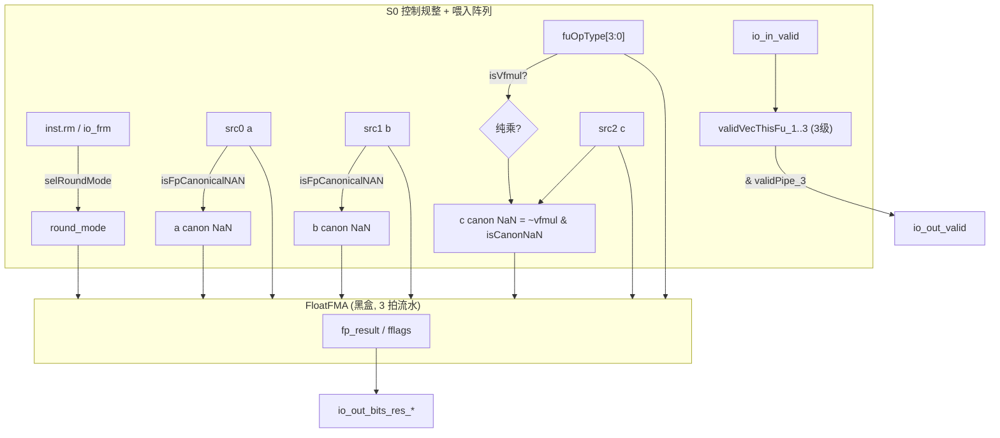

# FMA —— 浮点乘加功能单元（学习文档）

> 设计意图来源：`src/main/scala/xiangshan/backend/fu/wrapper/FMA.scala`
> （`class FMA extends FpPipedFuncUnit`，`latency = 3`）
> 可读重写：`rtl/backend/FMA.sv`（核 `xs_FMA_core`）+ `rtl/backend/fma_pkg.sv`

## 1. 架构定位

FMA 是后端浮点执行簇里的 **融合乘加 FU**，承担标量浮点 `a*b±c`
（fmadd / fmsub / fnmadd / fnmsub）与纯乘 `fmul`。它是 **3 拍定长流水**（piped FU），
吞吐 1 条/拍。

真正的部分积压缩（Booth + CSA 树）+ 加法 + 规格化 + 圆整在黑盒 `FloatFMA`
（内部 3 拍流水）里。FMA 这层 wrapper 只做：

1. **圆整模式选择**（同 FAlu）；
2. **三源规范 NaN 检测**：a/b 恒检测；**c 源仅在「非纯乘」时检测**——纯乘 `fmul`
   不读 c，故不对 c 做 NaN-box 校验；
3. **op_code 透传**：`fuOpType[3:0]` 给阵列；
4. **3 级 valid/perf 打拍 + 输出控制透传**（取外部 `ctrlPipe_3`）。

## 2. 数据流图

## 3. 流水与握手（HasPipelineReg, latency=3）

控制/数据流水由 FU 外预打拍送入（`validPipe_3` / `ctrlPipe_3`）。FMA 内部维护：

- **本 FU 内部 valid 流水** `validVecThisFu_1..3`（3 级，复位敏感，起点 `io_in_valid`）；
- **perf 流水**（3 级，逐级使能用本 FU valid，不与外部 validPipe）。

输出有效 = `validPipe_3 & validVecThisFu_3`；输出控制取外部 `ctrlPipe_3`。
无 in.ready / out.ready / flush。

## 4. 关键设计点

- **c 源 NaN 检测的条件性**：`fp_cIsFpCanonicalNAN = ~isVfmul(opcode) & isCanonNaN(c)`。
  `VfmaType.vfmul = 4'b0000`，故「纯乘」判定即 `opcode[3:0]==0`。纯乘不读 c，
  对 c 不做 box 检测（否则 FM 会在 c 的 box 输入上判不等价）。

## 5. 接口（与 golden `FMA` 完全一致）

| 方向 | 信号 | 说明 |
|------|------|------|
| in  | `io_in_valid` / `io_in_bits_ctrl_fuOpType[8:0]` | 发射有效 / 子操作（低 4bit 给阵列） |
| in  | `io_in_bits_ctrl_fpu_fmt` / `_fpu_rm` / `io_frm` | 格式 / 圆整 |
| in  | `io_in_bits_validPipe_3` / `io_in_bits_ctrlPipe_3_*` | 外部第 3 级流水 |
| in  | `io_in_bits_data_src_{0,1,2}[63:0]` | a / b / c |
| out | `io_out_valid` | `validPipe_3 & validVecThisFu_3` |
| out | `io_out_bits_res_data` / `_res_fflags` | 结果 / 异常标志 |
| out | `io_out_bits_ctrl_*` / `_perfDebugInfo_*` | 透传 / perf 末级 |

黑盒子模块：`FloatFMA`（含 `BoothEncoderF64F32F16` / `CSA3to2` / `CSA4to2` /
`CSA_Nto2With3to2MainPipeline`）。

## 6. 验证结果

- **结构闸门**（pkg+core）：`typedef enum = 1`，`function automatic = 3`，生成痕迹 = 0。
- **UT**（双例化共用 FloatFMA 黑盒；随机背靠背 + 6 种合法 fuOpType，含 vfmul=0）：
  seed 1 / 7 / 42 各 `checks=200000, errors=0`。
- **FM**（`make fm`，`FM_MERGE_DUP=false`）：`SUCCEEDED`。

### 关键坑

1. **vfmul 编码**：`VfmaType.vfmul = 4'b0000`，c 源 box 检测必须乘上 `opcode != 0`。
2. **FM merge-dup**：同 MulUnit/FAlu，阵列黑盒需 `FM_MERGE_DUP=false`。
