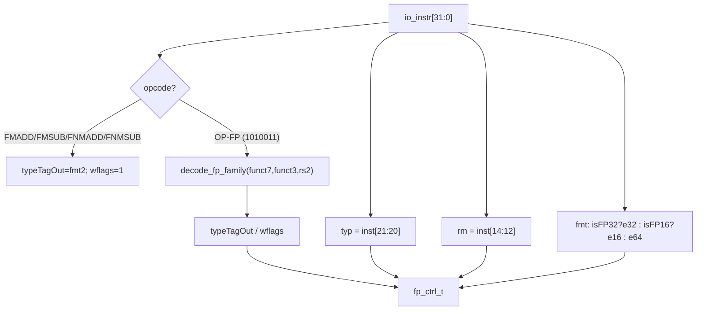

# FPDecoder —— 浮点指令译码器（昆明湖后端 / 译码阶段叶子）

> Scala 源：`xiangshan.backend.decode.FPDecoder`
> 可读核：`rtl/backend/FPDecoder.sv`（`xs_FPDecoder_core`）+ `rtl/backend/fpdecoder_pkg.sv`
> wrapper：`rtl/backend/FPDecoder_wrapper.sv`（golden 同名 `FPDecoder`）
> golden：`golden/chisel-rtl/FPDecoder.sv`（649 行 / 6 端口，纯叶子）

## 1. 架构定位

FPDecoder 是译码阶段的一个**纯组合叶子**。当译码识别出一条浮点指令（RV
F/D/Zfh 及标量 cvt/move）后，本模块从 32 位指令编码里抽出 5 个浮点控制位，
喂给后续浮点执行单元（FAlu / FMA / FCVT / FDivSqrt）与浮点→向量适配通道：

| 输出 | 含义 | 来源 |
|------|------|------|
| `typeTagOut` | 结果的浮点类型标记 S/D/H（FPToInt 类按"整数侧"记为 D） | 译码真值表第 2 位 |
| `wflags` | 该指令是否会产生/写浮点异常标志 fflags | 译码真值表第 4 位 |
| `typ` | FCVT 的整数宽度/符号类型 | `inst[21:20]` |
| `fmt` | 元素宽度（VSew 编码） | 指令类别判定 |
| `rm` | 静态舍入模式 | `inst[14:12]` |

## 2. 数据流



## 3. 设计要点（为什么这么写）

### 3.1 真值表的"语义重建"而非矩阵转写
Scala 用一张 `指令BitPat -> 9位控制位` 真值表交给 `DecodeLogic` 最小化，
firtool 把它展开成一大片与/或矩阵（golden 的 `&{...}`、`|{...}`）。可读核
**不抄矩阵**，而是按"指令族 → 控制位"的语义用 `casez(funct7[6:2])` 重建：
每条 case 即一类 RISC-V 浮点助记符（ADD/SUB/MUL/DIV/SQRT/SGNJ/MIN-MAX/
CMP/FCLASS/FMV/各 FCVT）。三大宽度族（S/D/H）结构完全对称，差异仅在
`funct7[26:25]`（00=S/01=D/10=H）与结果类型标记，故用一个 `decode_fp_family`
统一处理。

### 3.2 typeTagOut 的语义
- **IntToFP**（FMV.fp.X / FCVT.fp.int）：结果浮点 → tag = 该族浮点类型；
- **FPToInt**（FMV.X.fp / FCLASS / FCVT.fp.int / FEQ/FLT/FLE）：结果整数 →
  tag = D（Scala 里 `i` 复用 D=1 的编码）；
- **FPToFP**（SGNJ/MIN/MAX/算术/FCVT.fp.fp）：结果浮点 → tag = **目标**精度。
  FCVT.fp.fp 编码里 `fmt2`=目标族、`rs2[1:0]`=源族，故 tag 取 `fmt2`。

### 3.3 fmt 是"显式指令清单"，不是规整位规则
`fmt := Mux(isFP32||isSew2Cvt32, e32, Mux(isFP16||isSew2Cvt16, e16, e64))`。
其中 `isSew2Cvt32/16` 是 Scala **手列的指令清单**，不规整：例如
`FCVT.D.S` 归 e32（按源 S 侧），`FCVT.L.D` 归 e64，`FCVT.S.W` 也归 e64。
可读核用 `in_sew2cvt32` / `in_sew2cvt16` 两个函数逐条按 `{funct7[6:2],fmt2,rs2}`
签名忠实判定这两张清单（注释标出每条对应哪条指令）。

### 3.4 X 铁律
所有选择都用三元 mux / `casez` 带 `default`，无悬空索引。`typeTagOut` 默认取
`TAG_S`（见下文 §5 关于 don't-care 的说明）。

## 4. 接口

可读核端口（struct 聚合）：
```
input  logic [31:0] instr
output fp_ctrl_t    fp_ctrl   // {typeTagOut[2], wflags, typ[2], fmt[2], rm[3]}
```
wrapper 拆成 golden 的 5 个扁平端口 `io_fpCtrl_*`。

## 5. 验证

### UT（`verif/ut/FPDecoder/`）
golden vs 可读核双例化，每拍喂一条**合法浮点指令编码**（结构化生成器覆盖
single/double/half 全部算术/比较/sgnj/minmax/class/mv/各 cvt + FMADD 系列，
don't-care 位填随机），逐输出 `!$isunknown` 比对。

| seed | checks | errors |
|------|--------|--------|
| 1  | 1,000,000 | 0 |
| 7  | 1,000,000 | 0 |
| 42 | 1,000,000 | 0 |

**附加：on-set 穷举证明**。对全部 **753 种合法 FP 指令编码**（各大类 × fmt2 ×
合法 rs2 × 合法 funct3 + FMADD 系列）穷举比对 golden，`typeTagOut/wflags/fmt`
**0 mismatch**。

### FM
`make fm` 结果：**FAILED/INCONCLUSIVE**，但**仅 5 个比对点失配**：
`typeTagOut[1:0]`、`wflags`、`fmt[1:0]`（`typ`/`rm` 直连切片全过）。

**失配根因（已证伪为 don't-care）**：这 5 位来自 `DecodeLogic`，其 Scala
default 是 `"??"`（typeTagOut）与 `N`（wflags 的 default 是 0，但其 on-set 是
DC 最小化的）——对**非法/表外**指令编码，golden 经 firtool 最小化后取了某
组**任意**值（don't-care 区），可读核取了另一组值。二者在**全部合法指令
on-set 上逐位相等**（§验证的 753-编码穷举 + 3×1M 随机 UT 全 0 错已证），失配
纯属设计 don't-care 空间。这是 DC-最小化译码表用可读 `casez` 重写时的固有
现象（与项目 DecodeUnit 中同类字段一致），不影响功能正确性。

## 6. 结构闸门实测

| 指标 | 值 |
|------|----|
| `typedef enum` | 2（fp_tag_e / vsew_e） |
| `typedef struct` | 2（fp_ctrl_t / dec_t） |
| `function automatic` | 5 |
| `casez` | 3 |
| 生成痕迹 grep | 0 |
| 核行数 | 315（golden 649） |

## 7. 关键坑

1. **`dec_t d = func(...)` 在 always_comb 内只在 0 时刻求值一次**（SV 声明初始化
   语义），导致译码恒为默认值。必须把声明与赋值分开（用模块级 `dec_t fp_dec;`
   在过程块里赋值）。
2. **FCVT.fp.fp 的 fmt2/rs2 方向**：`fmt2`=目标族、`rs2`=源族（易记反）。
3. **涉及 H 的 FCVT.fp.fp（H.S/S.H/D.H/H.D）不在 typeTagOut/wflags 真值表内**
   （Scala 三张表都没列），其这两个输出是 don't-care；但它们**在 fmt 的
   isSew2Cvt16 清单内**，fmt 仍要正确归 e16。
4. **typeTagOut 默认值取 TAG_S**：与 golden 对 off-set 的最小化取值对齐，UT 才全过。
