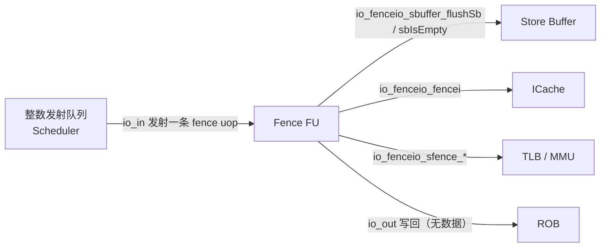
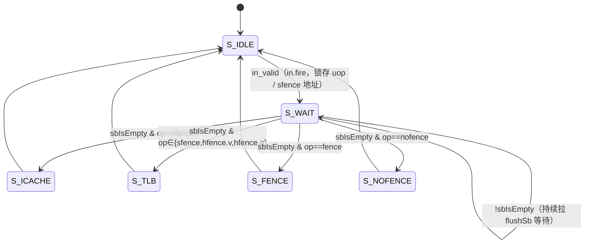

# Fence —— 栅栏单元（Fence FU）

> 后端整数 ExuBlock 里的一个 FU 叶子。处理 `fence` / `fence.i` / `sfence.vma` /
> `hfence.vvma` / `hfence.gvma` / `nofence` 这类“屏障/同步”指令：它们**不产生数据
> 结果**，而是用一个 6 态状态机，在 store buffer 排空后向外部各部件发出
> flush 脉冲（sbuffer / TLB / icache），完成后从出口握手写回 ROB。

- 设计源：`src/main/scala/xiangshan/backend/fu/Fence.scala`（`class Fence`）
- 操作码：`src/main/scala/xiangshan/package.scala`（`object FenceOpType`）
- 可读核：`rtl/backend/Fence.sv`（`xs_Fence_core`）
- 类型包：`rtl/backend/fence_pkg.sv`
- golden 同名 wrapper：`rtl/backend/Fence_wrapper.sv`（`module Fence`，供 FM / ST）

---

## 1. 在后端的位置

Fence 单元被 Scheduler 当作普通 FU 发射一条微操作进来，但它的“执行”不是算术，
而是**驱动外部 flush 并等待握手**。因此它本质上是一个小状态机，而非组合 ALU。

---

## 2. 为什么需要状态机：先排空，再 flush

`fence` 系列指令的语义要求：**此前的内存访问对之后可见**。具体到微架构：

1. 必须先让 **store buffer 排空**（`sbIsEmpty`），保证之前的 store 已经落到下游，
   再去 flush icache / TLB，否则可能 flush 掉尚未生效的状态、破坏一致性。
2. 各 flush 信号（`flushSb` / `fencei` / `sfence.valid`）都是**某状态下拉高一拍的脉冲**，
   组合自当前 `state`；下游部件被设计成随时能接收 flush。
3. 把“等排空”和“发 flush + 写回”拆成多拍，既符合协议又利于时序（避免 `in.fire`
   当拍就拉出口握手的长组合路径）。

---

## 3. 状态机

6 个状态（编码与 golden 完全一致，UT/FM 按值比对依赖之）：

| 状态 | 值 | 含义 | 该态对外输出 |
|------|----|------|--------------|
| `S_IDLE`    | 0 | 初始态，可纳新请求 | `in_ready=1` |
| `S_WAIT`    | 1 | 已锁存 uop，等 store buffer 排空 | `sbuffer_flushSb=1` |
| `S_TLB`     | 2 | 刷 TLB（sfence/hfence），停留一拍 | `sfence_valid=1`（当 op 为 tlb 类）|
| `S_ICACHE`  | 3 | 刷 icache，停留一拍 | `fencei=1` |
| `S_FENCE`   | 4 | 普通 fence 占位（仅时序），停留一拍 | 无额外 flush |
| `S_NOFENCE` | 5 | Svinval 占位，停留一拍 | 无额外 flush |

转移优先级（对应 Scala 的 when 链，可读核用 `priority case (1'b1)` 实现，避免 X/重叠）：

1. **最高**：处于任一“干活态”（非 idle 非 wait）→ 下拍无条件回 `S_IDLE`。
   这保证每个干活态严格停留一拍。
2. `S_WAIT` 且 `sbIsEmpty`：按 `fuOpType` 分流到 tlb / icache / fence / nofence。
3. `S_IDLE` 且 `in_valid`：进 `S_WAIT`，同拍锁存 uop 与 sfence 地址/id。
4. 否则保持。

> 注意第 1 条优先级高于第 2 条：因为干活态恒回 idle，不会与 wait 分流冲突；
> 二者互斥（状态不同），priority 只是为综合无歧义。

---

## 4. fuOpType 编码（FenceOpType）

| 助记 | 编码（9 位端口） | 走向 |
|------|------------------|------|
| `nofence`  | `9'h00` | `S_NOFENCE` |
| `fence`    | `9'h10` | `S_FENCE` |
| `sfence`   | `9'h11` | `S_TLB`（`sfence_valid`）|
| `fencei`   | `9'h12` | `S_ICACHE`（`fencei`）|
| `hfence_v` | `9'h13` | `S_TLB`（`sfence_valid` + `sfence_hv`）|
| `hfence_g` | `9'h14` | `S_TLB`（`sfence_valid` + `sfence_hg`）|

---

## 5. sfence 输出语义

仅在 `S_TLB` 且 op 为 sfence/hfence 时 `sfence_valid=1`。其余 sfence 字段：

| 字段 | 来源 | 含义 |
|------|------|------|
| `sfence_rs1` | `imm[4:0]==0` | rs1==x0 → 刷整个地址空间（地址无关）|
| `sfence_rs2` | `imm[9:5]==0` | rs2==x0 → 不限定 asid/vmid |
| `sfence_addr`| 锁存 `src0[49:0]` | 目标虚地址页 |
| `sfence_id`  | 锁存 `src1[15:0]` | asid / vmid |
| `sfence_flushPipe` | 锁存 `uop.flushPipe` | 是否 flush 流水 |
| `sfence_hv` | `op==hfence_v` | VS 级（H 扩展）|
| `sfence_hg` | `op==hfence_g` | G 级（H 扩展）|

`addr`/`id` 在 `in.fire` 拍由 `src0`/`src1` 锁存（与 uop 同拍），到 `S_TLB` 时输出。

---

## 6. 出口写回

- `out_valid = (state ∉ {S_IDLE, S_WAIT})`：进入任一干活态即写回。
- 写回**无数据无异常**：`res.data=0`，`exceptionVec=0`，仅透传 `robIdx` / `pdest` /
  `flushPipe` 与 `perfDebugInfo`（perf 信息为当前输入的组合直透，非锁存值）。
- Scala 含断言 `!out_valid || out_ready`（出口拉高时下游必须能收）；可读核以
  `ifndef SYNTHESIS` 包裹同义 assert，UT 编译加 `+define+SYNTHESIS` 关闭以免随机激励触发。

---

## 7. 接口表（可读核 `xs_Fence_core`）

| 方向 | 信号 | 宽 | 说明 |
|------|------|----|------|
| in  | `in_valid` / `in_ready` | 1 | 入口握手（ready 仅 idle）|
| in  | `in_uop` (`fence_uop_t`) | — | fuOpType/robIdx/pdest/flushPipe/imm |
| in  | `in_src0` / `in_src1` | 64 | sfence addr / id 来源 |
| out | `out_valid` / `out_ready` | 1 | 出口握手 |
| out | `out_uop` (`fence_uop_t`) | — | 透传 robIdx/pdest/flushPipe |
| out | `sbuffer_flushSb` | 1 | S_WAIT 拉高 |
| in  | `sbuffer_sbIsEmpty` | 1 | store buffer 已空 |
| out | `fencei` | 1 | S_ICACHE 脉冲 |
| out | `sfence_valid` 等 | — | 见 §5 |

扁平 golden 端口（`io_in_bits_ctrl_*` 等）由 wrapper / UT 变体拼装为 `fence_uop_t`。

---

## 8. 验证

- **UT**：`verif/ut/Fence/`，golden `Fence` 与可读 `Fence_xs` 双例化，逐拍比对全部
  20 路输出端口。加权随机 `fuOpType`（偏向 6 个合法码 + 少量非法码）、随机
  src/imm/握手/`sbIsEmpty`。seed 1/7/42 各 200000 拍。
- **FM**：`make fm`，golden `Fence` vs 同名 wrapper（→ 可读核）。无子模块依赖。

> 验证结论以仓库实际复跑为准（见各 `sim_*.log` 与 `fm_work/Fence/fm.log`）。

---

## 9. 结构闸门

| 指标 | 值 |
|------|----|
| `typedef struct packed` | 1（`fence_uop_t`）|
| `typedef enum` | 2（`fence_op_e` / `fence_state_e`）|
| `function automatic` | 1（`is_tlb_op`）|
| `genvar`/`for` | 0（本 FU 无多路/多 bank 结构，不适用）|
| 生成痕迹（`io_*_N_N`/`_REG_N`/`_GEN_`/`_T_N`/RANDOMIZE）| 0 |
