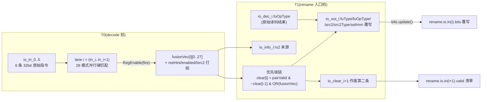

# FusionDecoder —— 指令宏融合解码器

| | |
|---|---|
| 手写 SV | `rtl/backend/FusionDecoder_core.sv`(可读核 `xs_FusionDecoder`,genvar 5 lane)+ `FusionDecoder_wrapper.sv`(golden 同名扁平端口壳) |
| Scala 来源 | `xiangshan/backend/decode/FusionDecoder.scala`(`BaseFusionCase` + 28 个 `Fused*` 子类) |
| golden | `golden/chisel-rtl/FusionDecoder.sv`(2539 行) |
| 依赖 | 无子模块(纯组合 LUT + 一级流水寄存器) |
| 验证 | UT seed 1/7/42 各 199992 checks errors=0;FM strict SUCCEEDED(335 点 / 0 failing / 0 unread) |

## 1. 架构定位:宏融合是什么、为什么值得做

编译器产出的代码里充满两条一组的**惯用序列**:清高位取低位(`slli+srli`)、
移位加(`slli+add`,数组寻址)、合成 32 位立即数(`lui+addi`)……每组的第二条指令
只消费第一条的结果,且二者写同一个目的寄存器。**宏融合(macro-op fusion)** 在
decode 末尾识别这些指令对,把它们合成**一个 uop**:

- **省一整套后端资源**:少占一个 rename 口、一个 ROB/RAB 项、一个发射队列项、
  一个写回口——6 宽机器的聚合带宽等效变宽;
- **砍断依赖链**:原本两拍串行的 `slli→add` 变成单拍的 `sh1add`,关键路径缩短一拍。

代价是 ALU 要认识一批"融合专用"扩展算子(`szewl*`/`sh4add`/`oddadd`/`lui32add` 等
自定义 `fuOpType`,见 `package.scala` ALUOpType 0b101_xxxx/0b110_xxxx 段)。
FusionDecoder 位于 DecodeStage 与 Rename 之间(CtrlBlock 内),对 decode 出的
6 条指令的 5 个**相邻对**并行匹配;命中后它不自己改写 uop,而是输出"覆写指令"
(`FusionDecodeReplace`)由 CtrlBlock 打到 rename 入口的 uop 上,并用 `clear`
把第二条指令作废。

融合的通用前提(所有模式共有):两条指令**同目的寄存器**(`rd1==rd2`)、
第二条读第一条的结果(`rd1==rs1_2` 或 `rd1==rs2_2`)、两条 `rd` 都非 x0
(rd=x0 是 HINT 编码空间,不碰)、指令无异常、`disableFusion` CSR 未关断。

## 2. 数据流(两拍流水)



为什么切两拍:28 个模式每个都要对两条 32 位指令做全字段比较,组合逻辑很厚;
把匹配放 T0 与 decode 并行、结果打一拍,T1 只剩"OR + 优先级 + Mux 覆写"的薄逻辑,
恰与 decode→rename 的流水寄存器(decodePipeRename)对齐。打拍使能 `fire = in_valid[i]
& inReady[i]`(下游 stall 时保持,与被 hold 的指令同步)。

## 3. 28 种融合模式清单

`fv[k]` 下标 = Scala `fusionList` 顺序 = 可读核 `fusionVec` 位号。
覆写列:所有模式都覆写 `fuOpType`;仅 fv19 改 `fuType`(ALU→MUL);
fv26/27 改 `selImm`;`src2` 列指对 lsrc2/src2Type 的处理(Zero=接 x0,
Mux=接第二条指令"另一个"源寄存器,见 §4.3)。

| fv | fusionName | 指令对(前 + 后) | 融合语义 | 新 fuOpType | src2 |
|----|------------|------------------|----------|-------------|------|
| 0 | slli32_srli32 | `slli r,s,32` + `srli r,r,32` | zext.w(取低 32 位零扩展) | adduw | Zero |
| 1 | slli48_srli48 | `slli r,s,48` + `srli r,r,48` | zext.h(取低 16 位零扩展) | packw(src2=x0 即 zext.h) | Zero |
| 2 | slliw16_srliw16 | `slliw r,s,16` + `srliw r,r,16` | zext.h(另一种写法) | packw | Zero |
| 3 | slliw16_sraiw16 | `slliw r,s,16` + `sraiw r,r,16` | sext.h(16 位符号扩展) | sexth | Zero |
| 4 | slli1_add | `slli r,s,1` + `add r,r,t` | sh1add(Zba:`(s<<1)+t`) | sh1add | Mux |
| 5 | slli2_add | `slli r,s,2` + `add r,r,t` | sh2add | sh2add | Mux |
| 6 | slli3_add | `slli r,s,3` + `add r,r,t` | sh3add | sh3add | Mux |
| 7 | slli32_srli31 | `slli r,s,32` + `srli r,r,31` | szewl1:`ZEXT32(s)<<1` | szewl1(自定义) | — |
| 8 | slli32_srli30 | `slli r,s,32` + `srli r,r,30` | szewl2:`ZEXT32(s)<<2` | szewl2 | — |
| 9 | slli32_srli29 | `slli r,s,32` + `srli r,r,29` | szewl3:`ZEXT32(s)<<3` | szewl3 | — |
| 10 | srli8_andi255 | `srli r,s,8` + `andi r,r,255` | byte2:取第 2 字节 `(s>>8)&0xFF` | byte2 | — |
| 11 | slli4_add | `slli r,s,4` + `add r,r,t` | sh4add:`(s<<4)+t` | sh4add(自定义) | Mux |
| 12 | srli29_add | `srli r,s,29` + `add r,r,t` | sr29add:`(s>>29)+t` | sr29add | Mux |
| 13 | srli30_add | `srli r,s,30` + `add r,r,t` | sr30add | sr30add | Mux |
| 14 | srli31_add | `srli r,s,31` + `add r,r,t` | sr31add | sr31add | Mux |
| 15 | srli32_add | `srli r,s,32` + `add r,r,t` | sr32add | sr32add | Mux |
| 16 | andi1_add | `andi r,s,1` + `add r,r,t` | oddadd:`s[0]+t`(奇数加一) | oddadd | Mux |
| 17 | andi1_addw | `andi r,s,1` + `addw r,r,t` | oddaddw:`SEXT((s[0]+t)[31:0])` | oddaddw | Mux |
| 18 | andi_f00_or | `andi r,s,-256` + `or r,r,t` | orh48:`(s&~0xFF)\|t` | orh48 | Mux |
| 19 | andi127_mulw | `andi r,s,127` + `mulw r,r,t` | mulw7:7bit×32bit 乘 | **fuType→MUL**,mulw7 | Mux |
| 20 | addw_andi255 | `addw/addiw` + `andi r,r,255` | addwbyte:`(s1+s2)[7:0]` | addwbyte | — |
| 21 | addw_andi1 | `addw/addiw` + `andi r,r,1` | addwbit:`(s1+s2)[0]` | addwbit | — |
| 22 | addw_zexth | `addw/addiw` + `zext.h r,r` | addwzexth:`ZEXT((s1+s2)[15:0])` | addwzexth | — |
| 23 | addw_sexth | `addw/addiw` + `sext.h r,r` | addwsexth:`SEXT((s1+s2)[15:0])` | addwsexth | — |
| 24 | logic_andi1 | 逻辑运算† + `andi r,r,1` | 逻辑结果取 LSB | `{3'b110, 原op[3:1], 1'b0}`(动态) | — |
| 25 | logic_zexth | 逻辑运算† + `zext.h r,r` | 逻辑结果取低 16 位零扩展 | `{3'b110, 原op[3:1], 1'b1}`(动态) | — |
| 26 | lui_addi | `lui r,imm20` + `addi r,r,imm12` | 合成 32 位立即数 | lui32add,**selImm=IMM_LUI32(4'hB)** | — |
| 27 | lui_addiw | `lui r,imm20` + `addiw r,r,imm12` | 同上 word 版 | lui32addw,selImm=IMM_LUI32 | — |

† 逻辑运算 = {andi, and, ori, or, xori, xor, orc.b} 七种之一。

两点值得注意的"为什么":
- **fv24/25 的 fuOpType 是动态的**:第一条是 7 种逻辑指令之一,融合结果必须记住
  "原来是哪种逻辑运算"——所以从 `io_dec_i.fuOpType`(流水下来的原始译码结果)取
  `[3:1]` 段拼进新 opcode(`ALUOpType.logicToLsb/logicToZexth`),其余 26 种都是常数。
  这也是模块需要 `io_dec` 输入的唯一原因。
- **fv19 是唯一改 fuType 的模式**(ALU→MUL,派往乘法器)。golden 里
  `io_out_*_bits_fuType_bits` 端口消失了——单一常数被 firtool 裁剪,只留 valid。

## 4. 关键机制

### 4.1 优先级链与 io_clear 语义

5 个 lane 的指令对**共享中间指令**(lane i = {in_i, in_{i+1}}, lane i+1 = {in_{i+1},
in_{i+2}})。若 lane i 命中,in_{i+1} 已被吃掉,lane i+1 的"对"就不存在了,必须让位:

```
clear[1] = pairValid[0] & |fusionVec[0] & notHint[0] & enabled[0]        // lane0 无前驱
clear[i+1] = pairValid[i] & ~clear[i] & |fusionVec[i] & notHint[i] & enabled[i]
```

`io_clear_{i+1}=1` 同时承担两个语义:对 CtrlBlock,`rename.io.in(i+1).valid` 清零
(第二条作废);它也是 `io_out_i.valid`(第 i 条的 uop 要按 out.bits 覆写)。
`io_clear_0` 恒 0(第一条永远不可能是"被融合的第二条"),golden 里被裁掉。
注意让位判断用的是**前一 lane 的最终 clear**(已含它自己的让位),所以链是严格串行的
ripple——这限制了融合宽度不能太大,5 个 lane 的链在 T1 薄逻辑里放得下。

被清的指令在 ROB 视角消失了,但它占着一个 PC。CtrlBlock 在融合命中时按两条指令的
ftqOffset 差把融合 uop 的 `commitType` 改写为 4..7,让提交/trace 知道这个 uop
覆盖两条指令,PC 语义(如异常/单步)不丢。

### 4.2 notHint:rd=x0 一律不融合

`notHint = (rd1!=0) & (rd2!=0)`。rd=x0 的算术指令是 RISC-V 的 HINT 编码空间
(如 prefetch 提示),语义上是 nop——融合会错误地赋予它真实行为;
而且所有模式都依赖 rd 链条,x0 链本身无意义。

### 4.3 融合后的 src2 从哪来(lsrc2 / info)

融合 uop 的 src1 恒为第一条的 rs1;src2 分两类:
- **Zero 类**(fv0..3,zext/sext 单操作数语义):`lsrc2 = x0`;src2Type 按译码差异
  覆写为寄存器型(fv3 例外:SEXT_H 与 SLLIW 该字段相同,无需覆写)。
- **Mux 类**(移位加/oddadd/orh48/mulw7 等三操作数语义):src2 应为第二条指令
  "**不在 rd 链上的那个源**":`lsrc2 = (rd1==rs1_2) ? rs2_2 : rs1_2`(T0 打拍锁存)。
  同时要求 `rs1_2 != rs2_2`(否则无法区分哪只脚是链)。

`io_info_i.rs2From{Rs1,Rs2,Zero}` 把"src2 实际取了第二条的哪只脚"告诉 Rename,
供其修正源就绪跟踪。注意命名:`rs2FromRs2` 意为"取了 inst2.rs2"(即 rd 链在 rs1 上)。

### 4.4 打拍细节(与 golden 对齐)

`fusionVec/notHint/enabled/lsrc2/rs2From*` 用 `RegEnable(fire)`(stall 保持);
`instrPairValid` 用 `RegEnable(v1&v2, false, inReady)`——使能是 `inReady` 而非 fire,
下游 ready 而本 lane 无效时要把 0 采进去(否则残留上一对的 valid)。
`enabled = RegEnable(!disableFusion, fire)` 把 CSR 关断也对齐到同一拍。
28 个模式互斥(Scala 有 `PopCount<=1` 断言),故 fuOpType 的 Mux1H 无仲裁问题。

## 5. 与 golden / Chisel 的对应

- golden 把 5 个 lane × 28 模式完全展开;可读核用 `genvar` 折成一个 lane 模板,
  `fv[k]` 位号即 §3 表的行号。
- 匹配式里的 `loA/loB/loC/loD`(及 hi 系)是指令字段拼接
  `{funct6|funct7|·, funct3, opcode}`,常数即指令编码:如 `hiB==17'h43B` ⇔ MULW,
  `hiD==22'h2023B` ⇔ ZEXT.H。对照 §3 表可逐条读懂 golden 的 `_GEN_` 比较网。
- fuOpType 输出的逐层 or-accumulate(`cr26/cr33/...`)复刻 golden 按常数值
  分组聚合(Scala `connectByUIntFunc` 的 "constant values are grouped for timing")。

## 6. 验证状态

UT seed 1/7/42 各 199992 checks errors=0;FM strict SUCCEEDED 335 点 / 0 failing /
0 unread(5 个对称死寄存器 lastFire[N]↔golden REG_N 经 vmucp 实际比较证等价)。
