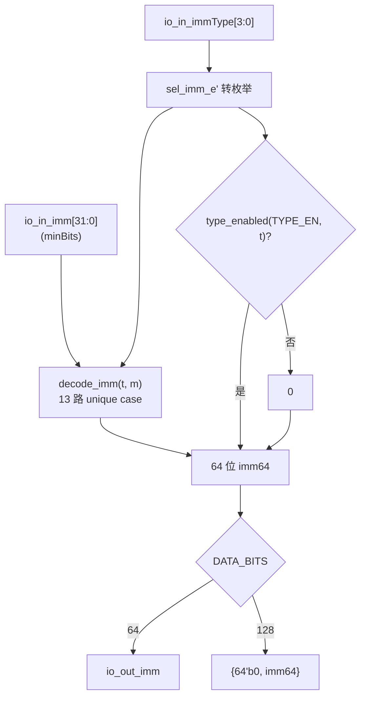

# ImmExtractor —— 立即数抽取/符号扩展单元

## 1. 架构定位

`ImmExtractor` 是后端发射(Issue)到执行(Execute)之间的一个**纯组合叶子**,
负责把发射队列(Issue Queue, IQ)里随 uop 携带的"压缩立即数"还原成数据通路位宽
(整数 64 位 / 向量 128 位)的真值立即数,送入执行单元作为操作数。

设计源:
- `src/main/scala/xiangshan/backend/issue/ImmExtractor.scala`
- `src/main/scala/xiangshan/backend/decode/DecodeUnit.scala`(`object ImmUnion` 及各 `Imm_*`)
- `src/main/scala/xiangshan/package.scala`(`object SelImm` 的 4 位类型编码)

可读核 / 包装:
- 核:`rtl/backend/ImmExtractor.sv`(`xs_imm_extractor_core`)+ `rtl/backend/immextractor_pkg.sv`
- 包装(golden 同名,FM 用):`rtl/backend/ImmExtractor_wrapper.sv`、`ImmExtractor_12_wrapper.sv`

## 2. 为什么要"两段式"处理立即数

RISC-V 各指令格式把立即数的各个位**散落**在指令不同字段里,而且位宽各异
(I/S 12 位、B/J 加最低位 0、U 高 20 位、CSR 的 Z 型 22 位、向量 5/6/11/15 位...)。

香山为省 IQ 面积,把立即数处理拆成两段:

- **第一段(译码,不在本模块)** `minBitsFromInstr`:把散落的立即数位抽出并紧凑拼接成
  一个最小宽度的值,随 uop 进 IQ。IQ 每条目只需存 20 位,而不是 64 位。
- **第二段(本模块)** `do_toImm32` + `SignExt`:发射后才按该 uop 的 `selImm` 类型,
  把压缩立即数补回低位 0、按格式符号/零扩展到 32 位,再扩展到数据通路位宽。

> 关键点:**本模块的输入 `io_in_imm` 不是原始指令,而是译码已打包好的 minBits**。
> 所以本模块只做 `do_toImm32`,不做 `minBitsFromInstr`。

## 3. 各 selImm 类型的还原规则

`io_in_immType` 是 4 位类型码(`object SelImm`)。下表给出每种类型的 `do_toImm32`
语义(`m` = 输入 minBits,扩展到 64 位整数通路):

| 类型 (码)        | 还原规则                                  | 扩展方式 | 含义 |
|------------------|-------------------------------------------|----------|------|
| IMM_I (0x4)      | `m[11:0]`                                 | 符号     | I 型 |
| IMM_S (0xE)      | `m[11:0]`                                 | 符号     | S 型存储 |
| IMM_SB (0x1)     | `{m[11:0], 1'b0}`                         | 符号     | B 型分支(最低位恒 0) |
| IMM_U (0x2)      | `{m[19:0], 12'b0}`                        | 按 bit19 | U 型(lui/auipc 高 20 位) |
| IMM_UJ (0x3)     | `{m[19:0], 1'b0}`                         | 符号     | J 型跳转(最低位恒 0) |
| IMM_Z (0x5)      | `m[21:0]`                                 | 零       | CSR 类(rd|rs1|csr 共 22 位) |
| IMM_B6 (0x8)     | `m[5:0]`                                  | 零       | 6 位无符号 |
| IMM_OPIVIS (0x9) | `m[4:0]`                                  | 符号     | 向量 OPIVI 有符号 5 位 |
| IMM_OPIVIU (0xA) | `m[4:0]`                                  | 零       | 向量 OPIVI 无符号 5 位 |
| IMM_LUI32 (0xB)  | `m[31:0]`                                 | 按 bit31 | 32 位立即数 |
| IMM_VSETVLI (0xC)| `m[10:0]`                                 | 符号     | vsetvli 的 vtypei |
| IMM_VSETIVLI (0xD)| `m[14:0]`                                | 符号     | vsetivli(uimm5|vtype8) |
| IMM_VRORVI (0xF) | `m[5:0]`                                  | 零       | 向量 ror 立即 |

> 注意 U 型的 `do_toImm32` 是 `Cat(m[19:0], 12'b0)`,本身恰好 32 位,无显式 SignExt,
> 但再扩到 64 位时按 bit31(= m[19])符号扩展;LUI32 同理按 bit31(= m[31])。

## 4. 参数化:一份核覆盖所有变体

不同执行单元的 IQ 只会出现其指令子集对应的立即数类型。Scala 用 `immTypeSet` 过滤
`MuxLookup` 的分支(未用到的类型不生成、查表落 `default 0.U`)。本可读核用
`TYPE_EN` 16 位掩码表达同一意图:

- 核内对**全部 13 种**类型都能解码(`decode_imm` 函数);
- 但只有 `TYPE_EN[type]` 置 1 的类型才输出其值,其余落 0;
- `DATA_BITS` 参数选 64(整数)/128(向量,高 64 位零扩展)。

这样**一份核**即可实例化出 golden 的所有 `ImmExtractor*` 变体。本仓库验证了两个代表:

| 包装 / golden       | DATA_BITS | TYPE_EN  | 使能类型 |
|---------------------|-----------|----------|----------|
| `ImmExtractor`      | 64        | `0x0814` | I, U, LUI32(整数最小集) |
| `ImmExtractor_12`   | 128       | `0xB61E` | SB,U,UJ,I,OPIVIS,OPIVIU,VSETVLI,VSETIVLI,VRORVI(向量全集) |

## 5. 数据流

## 6. 验证结果

- **UT**:`verif/ut/ImmExtractor/`。golden `ImmExtractor` / `ImmExtractor_12` 与可读核
  双例化,每拍随机 `imm`(混边界值)+ `immType`(全类型 + 随机非法码),组合稳定后逐输出比对。
  - seed 1 / 7 / 42 各 200000 拍(× 2 变体 = 400000 checks),**errors=0**。
- **FM**:`make fm`,两变体均 `Verification SUCCEEDED`(签名分析,不靠命名)。
- **结构闸门**:`typedef enum` 1、`function automatic` 2、`generate` 有;
  生成痕迹 grep(`io_*_N_N`/`_REG_N`/`_GEN_`/`_T_N`/`RANDOMIZE`)= 0。
  (无 `typedef struct`:本模块为无状态组合叶子,无流水寄存器/条目,故不需要 struct。)

## 7. 关键坑

- `always_comb` 内 `sel_imm_e t = <expr>;`(声明带初始化)只在 time 0 求值一次,
  不随输入更新 → 导致输出恒 0。须把**声明与赋值分开**(声明放过程块外或块首,赋值在块内)。
