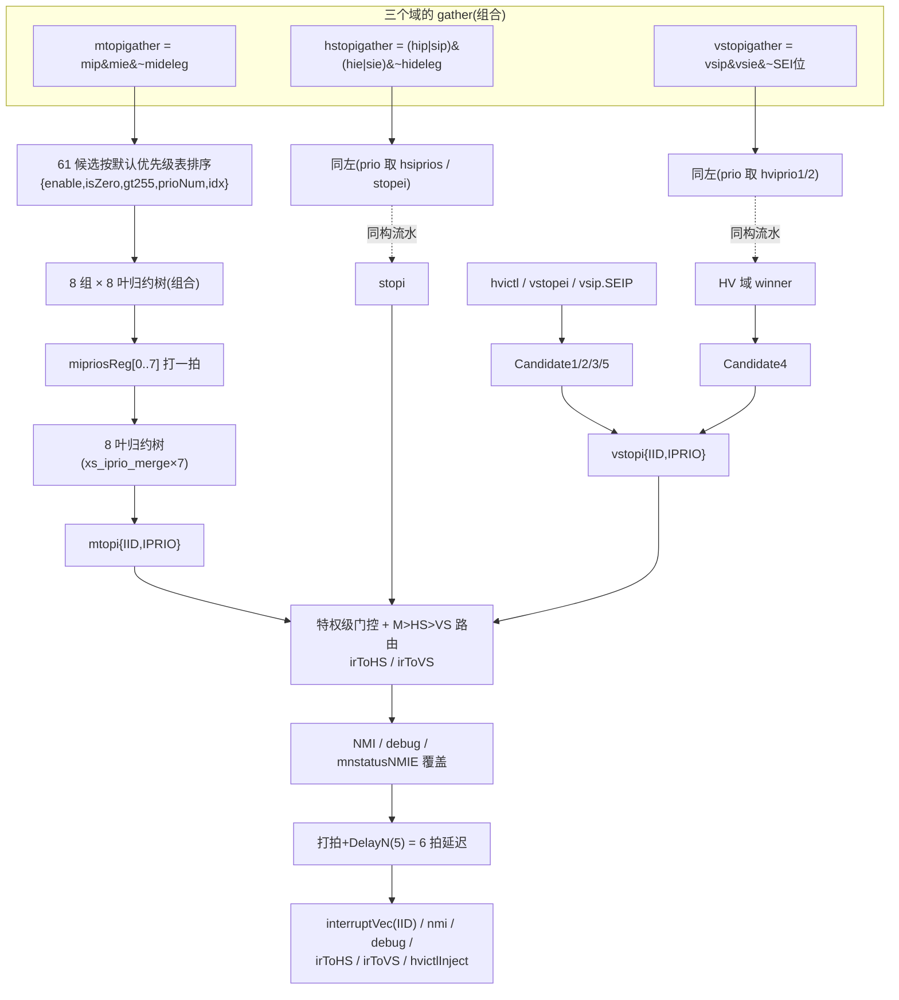

# InterruptFilter —— AIA 中断优先级仲裁器(NewCSR 子模块)

| | |
|---|---|
| 手写 SV | `rtl/backend/InterruptFilter.sv`(可读核,golden 同名、312 端口,FM impl 侧直读)+ `newcsr_intrfilter_prims.sv`(`xs_iprio_merge`/`xs_delay_n` 原语)+ `InterruptFilter_xs.sv`(UT 双例化孪生) |
| 生成器 | `scripts/sidecar/gen_intrfilter.py`(从 golden 机器去混淆,逐表达式位级保真) |
| Scala 来源 | `xiangshan/backend/fu/NewCSR/InterruptFilter.scala`(优先级表在 `InterruptBundle.scala` 的 `InterruptNO`) |
| golden | `golden/chisel-rtl/InterruptFilter.sv`(12816 行,CIRCT 全展平) |
| 依赖 | 无黑盒(DelayN 单元两侧 elaborate) |
| 验证 | UT seed 1/7/42 各 199988 checks errors=0;FM native SUCCEEDED 0 failing(4 个 golden-only 常 0 死寄存器 → PASS_DEAD_REF) |

## 1. 架构定位:AIA 之后,中断仲裁为什么变成一台机器

传统 RISC-V 的中断选择很简单:`mip & mie` 按固定优先级挑一个。**AIA
(Advanced Interrupt Architecture,Smaia/Ssaia)** 把它变成了一个真正的仲裁问题:

- 每个中断源有**可编程 8 位优先级**(iprio 数组 CSR,数值小者优先,0 有特殊含义);
- 外部中断(MEI/SEI/VSEI)的优先级不来自 iprio 数组,而来自 **IMSIC** 报告的
  `mtopei/stopei/vstopei`(11 位,可能超过 255);
- H 扩展要求为 **M / HS / VS 三个特权级各自**算出"当前最高优先级的待处理中断",
  写进 `mtopi / stopi / vstopi` CSR(软件读一下就知道该处理谁,不用扫 mip);
- hvictl 允许 hypervisor 向 VS 级**注入根本不存在 pending 位的虚拟中断**。

InterruptFilter 就是这台仲裁机:输入 NewCSR 的全部相关状态(mip/mie/mideleg、
sip/sie/hip/hie/hideleg、vsip/vsie、hvictl/hstatus、mtopei/stopei/vstopei、
miprios/hsiprios/hviprio1/2、privState/xIE、nmi/debug),输出三个 `xtopi`、
最终注入流水线的中断请求 `interruptVec`(注意:**bits 是 8 位中断号 IID,不是位图**,
命名有误导)以及路由信息 `irToHS/irToVS/virtualInterruptIsHvictlInject`。

## 2. 结构总览



## 3. 关键机制

### 3.1 三个域的 gather 与委托屏蔽

- M 域:`mip & mie & ~mideleg` —— 被委托给 S 的位不参与 M 的仲裁;
- HS 域:`(hip|sip) & (hie|sie) & ~hideleg` —— hip/sip 合并成"HS 可见"集合,
  再被 hideleg 屏蔽掉委托给 VS 的位;
- VS 域:`vsip & vsie & ~(1<<SEI)` —— **刻意去掉 SEI**:VS 的外部中断不走普通
  归约树,而走 §3.5 的 5 候选特殊路径(它可能来自 IMSIC guest 文件或 hvictl 注入)。

### 3.2 默认优先级表(idx 小 = 优先级高)

AIA 规定:当可编程优先级分不出胜负时,按**默认优先级序**裁决。香山把 61 个实现的
中断源排成一张表(`InterruptNO.interruptDefaultPrio`),每个候选带着自己的表内下标
`idx[5:0]` 进入归约树:

| idx 区间 | 组 | 内容(左高右低) |
|---|---|---|
| 0..5 | custom highest | 63, 31, 62, 61, 30, 60 |
| 6..17 | local high | 47, 23, 46, 45, 22, 44, **43(HPRASEI)**, 21, 42, 41, 20, 40 |
| 18..23 | custom mid-high | 59, 29, 58, 57, 28, 56 |
| 24..36 | **标准组** | **MEI > MSI > MTI > SEI > SSI > STI > SGEI > VSEI > VSSI > VSTI > COI(LCOFI) > 14 > 15** |
| 37..42 | custom mid-low | 55, 27, 54, 53, 26, 52 |
| 43..54 | local low | 39, 19, 38, 37, 18, 36, **35(LPRASEI)**, 17, 34, 33, 16, 32 |
| 55..60 | custom lowest | 51, 25, 50, 49, 24, 48 |

外部中断的位置是三棵树各自的**分界点**:MEI 的 idx=24(0x18)、SEI=27(0x1B)、
VSEI=31(0x1F)。RTL 里比较写成 `idx < THRESH`,THRESH = 分界+1,
即 M 树 6'h19、HS 树 6'h1C、HV 树 6'h20 —— 这就是 `xs_iprio_merge` 的参数。

### 3.3 iprio 数组语义与"0 号优先级"规则

`miprios/hsiprios` 是 64×8bit 打包输入(每个中断源一个字节,来自 NewCSR 的 iprio
数组 CSR);VS 域用 `hviprio1/hviprio2` 提供 SSI、STI 与 13..23 号的优先级。
每个候选归一化为 `{enable, isZero, greaterThan255, prioNum[7:0], idx[5:0]}`:

- **数值小者优先**;同值时 idx 小者(默认序)赢。
- **prioNum=0(isZero)= "使用默认优先级"**,且相对位置以外部中断为参照
  (AIA 规定):默认序**高于** MEI/SEI/VSEI 的 0 号候选 → 高于一切数字优先级
  (xtopi.IPRIO 报 0);默认序**低于**外部中断的 0 号候选 → 视作 256,低于一切
  (报 255)。这就是归约节点里 isZero 分支要比较 `idx < THRESH` 的原因。
- **greaterThan255**:只有外部中断叶可置(mtopei/stopei.IPRIO 是 11 位,
  bits[10:8] 非零即 >255)→ 与任何 ≤255 的数字候选比都输,IPRIO 报 255。
  每棵树最多一个叶带 gt255(第 3 组 bucket,即 `mipriosReg_3`),不会出现两个
  gt255 相遇的未定义分支。
- **platform 外部中断**(PLIC 式 wire,非 AIA 源,没有 IPRIO):`flag` 寄存器
  记住"当前外部中断来自 platform"(platformValid 置位、AIA 源到来清零),
  此时外部叶按 isZero 处理(用默认序裁决)。

### 3.4 两级流水归约树(为什么切一拍)

61 候选补零到 64,切成 8 组×8:
- **stage1(组合)**:每组一棵 8 叶二叉归约树(7 个 merge 节点)选出组内 winner;
- **打一拍**:8 个组 winner 存入 `mipriosReg_0..7`(HS/HV 同构);
- **stage2(组合)**:8 叶树(7 个 `xs_iprio_merge` 实例)选出全域 winner。

64 入口的 6 层比较树一拍走完太深,在中点打拍平衡时序;代价是 xtopi 晚一拍——
CSR 读路径允许。最终 `mtopi.IID = findNum(winner.idx)`(从表下标反查中断号),
`mtopi.IPRIO` 按 §3.3 三分支(prioNum / 255 / 0),外层再用**当拍**的
`mtopiIsNotZero`(gather 非零)门控:没有待处理中断时整个 topi 读 0。

`xs_iprio_merge` 是把 golden 展平网中**每个归约节点完全相同的 2 入比较逻辑**
(onlyA/onlyB/bothZero/单零看 idx/双非零看 gt255+prioNum)收敛成的参数化原语,
19 个 stage2 节点直接例化它;stage1 网络被 CIRCT 按节点特化常量折叠过,
忠实转写改名保位级一致(M/HS 树顶节点的谓词被 IPRIO 输出复用,故未抽原语)。

### 3.5 vstopi:hvictl 虚拟中断注入的 5 候选仲裁

VS 级外部/注入中断的来源有 5 种(AIA 6.3.3),必须仲裁出一个:

| 候选 | 条件 | 含义 |
|---|---|---|
| C1 | `vsip.SEIP & vsie.SEIE & VGEIN≠0 & vstopei≠0` | 真 guest 外部中断:hstatus.VGEIN 选中的 IMSIC guest 中断文件,优先级=vstopei.IPRIO(11 位,可 gt255) |
| C2 | `vsip.SEIP & vsie.SEIE & VGEIN=0 & hvictl.IID=9 & hvictl.IPRIO≠0` | hypervisor 用 hvictl 模拟的 SEI(带指定优先级) |
| C3 | `vsip.SEIP & vsie.SEIE` 且非 C1/C2 | 其它途径置起的 SEIP(如 hvip),优先级按 255 |
| C4 | `hvictl.VTI=0` 且 vstopigather≠0 | 常规 VS 中断(vsip&vsie,去 SEI),优先级来自 hviprio,走 §3.4 的 HV 归约树 |
| C5 | `hvictl.VTI=1 & hvictl.IID≠9` | 纯注入:hvictl 直接指定 {IID,IPRIO},**没有任何真实 pending 位** |

C1/C2/C3 互斥、C4/C5 互斥、C2 与 C5 互斥(断言保证),所以真正要仲裁的是
"SEI 类 × 常规/注入类"的两两组合(C1C4/C1C5/C2C4/C3C4/C3C5):比 IPRIO 数值,
同值时用默认序(SEI idx 对 C4 winner idx)或 `hvictl.DPR` 位(Default Priority
Rank:注入中断相对 SEI 排上还是排下)裁决。`hvictl.IPRIOM=0` 时 IPRIO 一律报 1。

胜者若是 C5(`SelectCandidate5`,含 C1C5 中 C5 赢的情形)→ 输出
`virtualInterruptIsHvictlInject`:告诉 CSR trap 逻辑这次进 VS 的中断**没有
pending 位可清**,别去写 vsip。

### 3.6 特权级门控、M>HS>VS 路由与编号映射

每个域的中断能不能"打进流水线"取决于当前特权级(经典 RISC-V 规则):

```
mIRVecTmp  = (M 态 && mstatusMIE)  || 当前特权级 < M  ? mtopi.IID  : 0   // 低特权级时 M 中断恒开
hsIRVecTmp = (HS 态 && sstatusSIE) || 当前特权级 < HS ? stopi.IID  : 0
vsIRVecTmp = (VS 态 && vsstatusSIE)|| 当前特权级 < VS ? vstopi.IID : 0
```

三者严格排序:M 有则取 M;否则 HS(`irToHS`);否则 VS(`irToVS`)。
VS 胜出时还要做**编号映射**:vstopi.IID 用的是 VS 视角的 S 编号(SSI=1/STI=5/SEI=9),
交给宿主 trap 逻辑前把 bit 1/5/9 搬到 2/6/10(VSSI/VSTI/VSEI),`vsMapHostIRVec`。

### 3.7 NMI、debug 与全局禁止

- **NMI**(Smrnmi):`nmiVec` 按 NMI 自己的默认序(43 > 31)选一个;
  `io.in.nmi` 有效时**覆盖**普通中断,且压掉 hvictlInject/irToHS/irToVS 输出;
- **debug 中断**:`debugIntr` 且不在 debugMode、非 `dcsr.STEP&&!STEPIE` 单步屏蔽;
- **mnstatusNMIE=0**(NMI 处理中)→ 所有中断(含 debug 路径外的普通中断)禁止。

### 3.8 输出为什么延迟 6 拍

最终结果先进 `intrVecReg` 等一批寄存器,再过 `DelayN(·,5)`,共 **6 拍**才输出——
Chisel 注释:*delay at least 6 cycles to maintain the atomic of sret/mret*。
`sret/mret` 改特权级/xIE 的瞬间,若中断判定用的还是旧状态,会出现"回到旧特权级的
半路上被旧判定的中断打断"的非原子窗口;固定延迟保证注入流水线的中断请求总是
基于足够老、已稳定的状态,trap 时再按当前 CSR 重新求精确 cause。
注意 golden 的 `DelayN_17/DelayN_210` **不是** 17/210 拍延迟——模块体都是 5 级
移位寄存器,后缀只是 CIRCT 去重编号;可读版用参数化 `xs_delay_n` 统一表达。

## 4. 与 golden / Chisel 的对应

- 可读核由 `gen_intrfilter.py` 从 golden **机器去混淆**:19 个 stage2 归约节点
  → `xs_iprio_merge` 实例(THRESH 参数区分三棵树);stage1 排序网忠实转写、
  `_T_/_GEN_/_WIRE` 全部改为表意名(核内三类 token 为 0);每个表达式位级保真,
  所以 FM strict 无黑盒直接可证。
- 对照阅读入口:`mipriosReg_3_*` 就是携带 gt255 的外部中断 bucket(§3.3);
  `flag` 寄存器即 platform/AIA 源切换(§3.3);Candidate 命名与 Scala 一致。

## 5. 验证状态

UT(`verif/ut/InterruptFilter`,双例化 golden vs `InterruptFilter_xs`,随机驱动全部
306 个中断输入、逐拍比对 13 个输出):seed 1/7/42 各 checks=199988 errors=0。
FM native SUCCEEDED 0 failing / 0 unmatched_impl;SYNTHESIS 展开下仅 4 个
golden-only 常 0 寄存器(intrVec bit6 延迟链,规范上中断号不置 bit6/7)→
良性 PASS_DEAD_REF 类。
