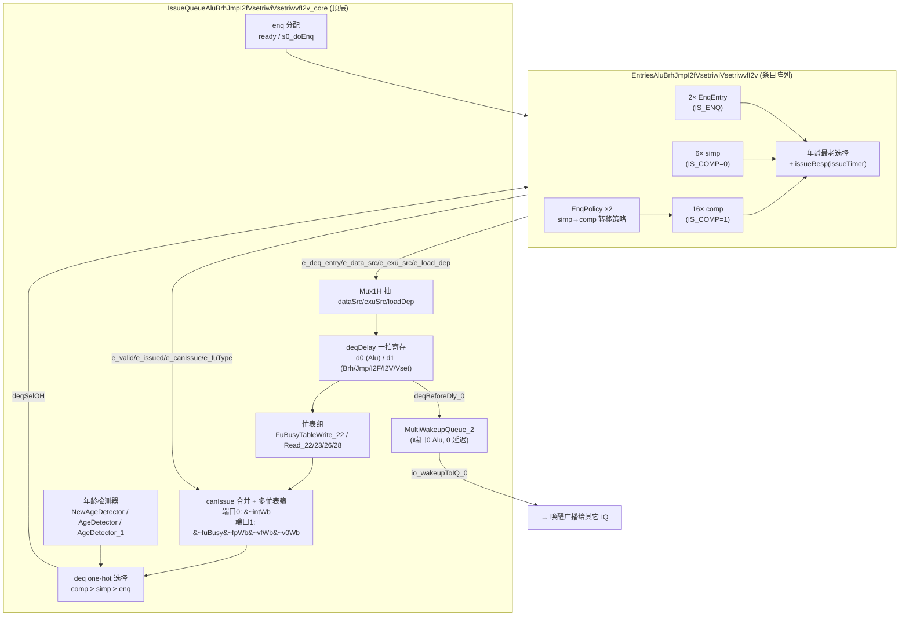
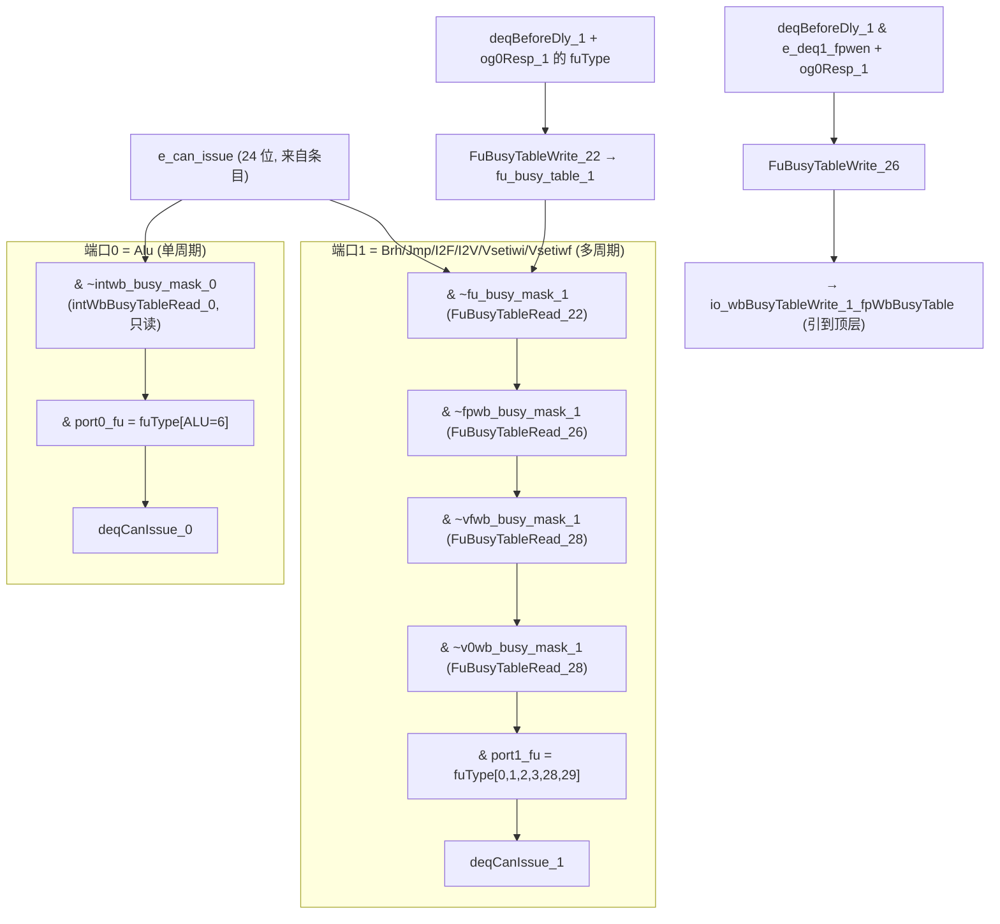

# IssueQueueAluBrhJmpI2fVsetriwiVsetriwvfI2v —— 整数侧最大发射队列变体 可读 SV 重写

## 1. 这是什么 / 设计意图与定位

香山 V2R2(昆明湖)乱序后端「调度心脏」整数侧最大的一个发射队列(IssueQueue)变体。
它在一颗发射队列里同时服务 **7 类功能单元 / 整数侧的几乎全部「轻量」指令**:

| 指令类别 | 功能单元 (FuType) | 位号 | 落在哪个发射端口 |
|----------|-------------------|------|------------------|
| 算术逻辑 | `alu`              | 6  | 端口0 |
| 跳转     | `jmp`              | 0  | 端口1 |
| 分支     | `brh`              | 1  | 端口1 |
| 整→浮点  | `i2f`(int→float) | 2  | 端口1 |
| 整→向量  | `i2v`(int→vec)   | 3  | 端口1 |
| 整数 vset| `vsetiwi`          | 28 | 端口1 |
| 整数 vset| `vsetiwf`          | 29 | 端口1 |

它与样板 `IssueQueueAluMulBkuBrhJmp`(见 `IssueQueueAluMulBkuBrhJmp.md`)以及更早的样板
`IssueQueueAluCsrFenceDiv` **同骨架**:`numEntries=24 / numEnq=2 / numSimp=6 /
numComp=16 / numDeq=2 / numRegSrc=2`,`hasCompAndSimp` 路,7 路 IQ 唤醒 + 4 路 WB 唤醒
(纯整数 rfWen),LoadPipelineWidth=3。发射队列的通用机理(条目阵列 + 唤醒-选择 + 年龄
最老仲裁 + 一拍 deqDelay + 唤醒广播 + 在队统计)在那两篇样板文档里已详述。

本变体之所以是「最大变体」:golden Entries 约 35000 行,功能单元种类最多(7 类),
payload 透传字段最丰(分支预测 + fp/vec 写使能 + 浮点控制),忙表最多(端口1 一口气挂
4 张表)。本文聚焦讲清这些**变体特色**,通用机理只在数据流图里点到。

## 2. 文件清单

| 文件 | 角色 |
|------|------|
| `rtl/backend/iq_abjivvi_pkg.sv` | 类型/参数包(struct/enum/维度/FuType 位号常量) |
| `rtl/backend/IqEntryAbjivvi.sv` | 单条目「唤醒-选择」核(参数化 enq/simp/comp) |
| `rtl/backend/EntriesAluBrhJmpI2fVsetriwiVsetriwvfI2v.sv` | 条目阵列 + 转移策略 + 年龄选择 + issueResp 核 |
| `rtl/backend/IssueQueueAluBrhJmpI2fVsetriwiVsetriwvfI2v.sv` | IQ 顶层核 + golden 同名穿透 wrapper |
| `rtl/backend/EntriesAluBrhJmpI2fVsetriwiVsetriwvfI2v_wrapper.sv` | golden 同名扁平 wrapper(FM 用) |
| `rtl/backend/issuequeue_abjivvi_{ports,connect}.svh` | IQ 顶层端口/连线 |
| `scripts/gen_iq_abjivvi.py` | wrapper/svh/tb 生成器 |
| `verif/ut/IssueQueueAluBrhJmpI2fVsetriwiVsetriwvfI2v/` | 双例化 UT(entries_tb / iq_tb)+ Makefile{,.iq} |

设计源:`src/main/scala/xiangshan/backend/issue/{IssueQueue,Entries,EntryBundles,
EnqEntry,OthersEntry}.scala`。

## 3. 结构总览(Entries + IQ 双层)

发射队列分两层:外层 IQ 顶层核负责 enq 握手、canIssue 多忙表合并、年龄检测器、Mux1H
出队、一拍 deqDelay、唤醒广播;内层 Entries 是 24 个单条目的阵列 + 转移策略 + 年龄最老
选择 + issueResp 生成。每个条目又是一颗 `IqEntryAbjivvi` 实例。



## 4. 唤醒-选择数据流

一条 uop 从入队到发射,经历「唤醒匹配 → canIssue → 多忙表筛 → 端口 FU 筛 → 三段年龄
仲裁 → Mux1H 出队 → 一拍 deqDelay → 唤醒广播」。下图给出端口0(Alu)的主路径:

```mermaid
flowchart LR
  WB["WB 唤醒 ×4<br/>(rfWen+pdest)"] --> M
  IQW["IQ 唤醒 ×7<br/>(rfWen+pdest+ldDep+is0Lat)"] --> M
  M["条目内逐源匹配<br/>match_iq / match_wb<br/>pdest==psrc & srcType.isXp & rfWen"] --> ST["src_state 置就绪<br/>dataSrc←Bypass"]
  ST --> CI["o_can_issue<br/>= valid & 全源就绪 & ~issued & ~flushed"]
  CI -->|e_can_issue| MB["canIssueMergeAllBusy_0<br/>= canIssue & ~intWbBusy[0]"]
  MB --> PF["& port0_fu<br/>(fuType[ALU])"]
  PF -->|deqCanIssue_0| AGE["三段年龄: enqReq/simpReq/compReq<br/>→ NewAge/Age/Age_1"]
  AGE -->|age_*_out| OH["deqSelOH_0<br/>(comp>simp>enq)"]
  OH --> MX["Mux1H 选条目<br/>dataSrc/exuSrc/loadDep"]
  MX --> CDLY["~cancelDeqVec_0 → deqBeforeDly_0_valid"]
  CDLY --> REG["deqDelay d0 一拍寄存"]
  REG --> DP["→ DataPath"]
  CDLY --> WQ["MultiWakeupQueue_2<br/>(0 延迟, 无 is0Lat)"]
  WQ --> BC["io_wakeupToIQ_0 唤醒广播"]
```



## 5. 双发射端口分工 + 三重忙表

本变体最鲜明的特色:两个发射端口分工**严重不对称**——端口0 只放 Alu(单周期、0 延迟、
无任何 FU 独占),端口1 把其余 6 类 FU 全包了(多周期、要查 4 张忙表)。



要点(均与 RTL 逐行核实):
- **端口0 忙表**:只有一张 `intWbBusyTable`,且**只读不写**(`FuBusyTableRead_23
  intWbBusyTableRead_0`,读输入 `io_wbBusyTableRead_0_intWbBusyTable` 来自顶层 io)。
  Alu 单周期无独占,故端口0 **没有 FU 忙表写口**,顶层也无 intWbBusyTable 写口。
- **端口1 三重(实为四张)忙表**:
  - `fu_busy_mask_1`:I2F/I2V/Vset 多周期独占,写表(`FuBusyTableWrite_22`)吃
    「本拍端口1 发射 `deqBeforeDly_1_valid` + `og0Resp_1`」的 fuType,内部表
    `fu_busy_table_1` 再喂读表 `FuBusyTableRead_22` 吐 24 位 mask。
  - `fpwb_busy_mask_1`:fp 写回口冲突。写口条件多一个 `e_deq1_fpwen`(只有真要写
    浮点寄存器的 uop 才占 fp 写回口),写输出 `io_wbBusyTableWrite_1_fpWbBusyTable`
    引到 IQ 顶层(与上层写回总线对接)。
  - `vfwb_busy_mask_1` / `v0wb_busy_mask_1`:vf / v0 写回口冲突,均**只读**
    (`FuBusyTableRead_28`,输入来自顶层 `io_wbBusyTableRead_1_{vfWbBusyTable,
    v0WbBusyTable}`)。
- 端口1 的 canIssue 一口气 `& ~fu_busy_mask_1 & ~fpwb_busy_mask_1 & ~vfwb_busy_mask_1
  & ~v0wb_busy_mask_1`(代码 `canIssueMergeAllBusy_1`)。

## 6. 可读核讲解(结合实际代码)

### 6.1 唤醒匹配(`IqEntryAbjivvi.sv`)
逐源匹配在单条目核里完成。WB / IQ 两类唤醒各有匹配函数:
```
match_wb(w,s) = (w.pdest==s.psrc) & s.src_type[0] & w.rf_wen & w.valid
match_iq(w,s) = (w.pdest==s.psrc) & s.src_type[0] & w.rf_wen
```
IQ 唤醒还要先去掉被 og0 取消的位:`iq_cancel_sel[0]=og0cancel[0]&is0lat`、
`[1]=og0cancel[2]&is0lat`、`[2]=og0cancel[4]`、`[3]=og0cancel[6]`(命中位 `{0,2,4,6}`,
且只有源 0/1 看 `is0lat`——与样板完全一致)。命中后 `src_state` 置就绪、`data_src` 改写
为 `DS_BYPASS`,`exu_src` 由黑盒 `UIntCompressor_27_…` 编码。

### 6.2 canIssue + 多忙表合并
单条目吐 `o_can_issue = (全源就绪 & valid & ~issued) & ~flushed`(comp 条目额外有
`can_issue_bypass`,即靠本拍 IQ 唤醒前递也能算就绪)。阵列把 24 个 `o_can_issue` 汇成
`e_can_issue`,顶层再按端口与各忙表 AND(见第 5 节 `canIssueMergeAllBusy_{0,1}`),
最后 `& port{0,1}_fu` 得到每端口的 `deqCanIssue_{0,1}`。

### 6.3 转移策略(simp→comp)
`hasCompAndSimp` 路:simp 区(条目 2..7)的未发射 uop 在出队的同时可被搬到 comp 区
(条目 8..23)腾位。`requestForTrans[i] = e_valid[2+i] & ~e_issued[2+i]`,
`simpReq_3 = requestForTrans & ~age_simp_out[2]`(扣掉本拍已被 simp 年龄选中要出队的)。
阵列内 `EnqPolicy ×2`(`u_simp_trans_policy` / `u_comp_trans_policy`)产生搬运 one-hot。

### 6.4 双端口三段年龄选择
每个发射端口都做「comp > simp > enq」三级优先的最老仲裁:
- `NewAgeDetector age`:enq 区 2 条目;
- `AgeDetector age_1`:simp 区 6 条目(4 路 canIssue 含 2 个端口 + 2 个转移请求);
- `AgeDetector_1 age_2`:comp 区 16 条目。

顶层据 `(|compReq)/(|simpReq)` 做优先级掩码:
```
deqSimpOH_0 = {6{~(|compReq_0)}}              & age_simp_out[0]
deqEnqOH_0  = {2{~(|compReq_0)&~(|simpReq_0)}}& age_enq_out[0]
deqSelOH_0  = {age_comp_out[0], deqSimpOH_0, deqEnqOH_0}   // 24 位 one-hot
```
随后 `always_comb` 用 `deqSelOH` 做 Mux1H(`sel ? val : 0` 累加,杜绝 X 传播)抽出
`finalDataSources/finalExuSources/finalLoadDependency`。

### 6.5 deqPortIdx
条目里记一位 `deq_port`:出队时由 `deq_port_write = dv[1]`(被端口1 选中即写 1)写入,
之后用于在 `issueResp` 里选 og0/og1 哪个端口的 resp_valid——见下。

### 6.6 issueResp(`Entries` 核)
本变体 Entries 顶层**无** `og1Resp.bits.resp` 端口,resp 完全由 `issue_timer` 决定:
```
timer==0 → valid=og0resp_valid[port], resp=BLOCK     // resps[0]=og0=block
timer==1 → valid=og1resp_valid[port], resp=SUCCESS   // resps[1]=og1=success
其余     → valid=0,                  resp=BLOCK      // resps[2]=resps[3]=0
```
其中 `port = ety_deq_port_read[e]`(即上面记的 deqPortIdx)。条目据此知道自己上拍发出的
uop 在 og0/og1 阶段是成功(清条目)还是被 block(留下重发)。

## 7. 变体特色小结(重点)

| 维度 | 本变体 | 对比样板 AMBB |
|------|--------|----------------|
| FU 种类 | 7 类:alu/jmp/brh/i2f/i2v/vsetiwi/vsetiwf | 5 类:brh/jmp/alu/mul/bku |
| 端口0 | 纯 `alu`(fuType{6}),单周期,0 延迟 | {alu,mul,bku} |
| 端口1 | {brh,jmp,i2f,i2v,vsetiwi,vsetiwf} | {brh,jmp} |
| 端口0 忙表 | 仅 intWbBusyTable(只读) | fuBusy(Mul)+ intWb |
| 端口1 忙表 | **fuBusy + fpWb + vfWb + v0Wb(4 张)** | 仅 intWbBusyTable |
| 0 周期唤醒 | 唤醒队列取端口0(Alu 恒 0 延迟),`MultiWakeupQueue_2` **无 lat/og0Fail/is0Lat**,`io_wakeupToIQ_0` **无 is0Lat 输出** | 有 Mul/Bku,需 is0Lat |
| payload | 分支预测(isRVC/predTaken/ftq) + **fp/vec 写使能(fpWen/vecWen/v0Wen/vlWen)** + **浮点控制 fpu.{typeTagOut,wflags,typ,rm}** | 仅分支预测 |

### 7.1 payload fp/vec 透传字段
端口1 的 I2F/I2V/Vset 指令需要把一批控制位透传到下游执行单元。`payload_t` 比样板多带:
`fp_wen / vec_wen / v0_wen / vl_wen`(写浮点/向量/v0/vl 寄存器的使能)与
`fpu_type_tag_out / fpu_wflags / fpu_typ / fpu_rm`(浮点格式/标志/舍入控制)。
这些字段**纯透传**——在单条目核里 `entry_update.payload <= entry_reg.payload` 整体搬运,
不参与任何唤醒/选择逻辑;最终在 `deqDelay` 的 `d1` 结构里寄存一拍后绑到
`io_deqDelay_1_bits_common_{fpWen,vecWen,v0Wen,vlWen,fpu_*}`。
端口0(Alu)的 `d0` 结构则只有普通整数 uop 字段(无 ftq/predict/fp/vec)。

### 7.2 0 周期唤醒
端口0 是纯 Alu,恒 0 延迟。唤醒队列 `MultiWakeupQueue_2 wakeUpQueues_0` 从
`deqBeforeDly_0`(端口0 发射)取数,因 Alu 无多周期,该 golden 队列**不带** lat /
og0Fail / is0Lat。于是顶层唤醒广播口 `io_wakeupToIQ_0` 没有 `is0Lat` 输出(已与
`ports.svh` 核实——该 svh 中无 `io_wakeupToIQ_0_bits_is0Lat`)。这是与样板 AMBB 的
显著区别:AMBB 因端口0 含 Mul/Bku 多周期,广播口必须带 is0Lat。

### 7.3 validCntDeqVec 双端口
两个发射端口各自统计「在队且本端口可接(`port{0,1}_fu`)」的 uop 数,减去本拍出队消耗:
```
validCntDeqVec0_reg <= cnt_valid_p0 - (io_deqDelay_0_ready & d0_valid)
validCntDeqVec1_reg <= cnt_valid_p1 - (io_deqDelay_1_ready & d1_valid)
```
输出到 `io_validCntDeqVec_{0,1}`,供上层 dispatch 做负载均衡。

## 8. X 与位宽纪律(沿用样板)
- 空条目 / 被冲刷条目的 don't-care 派生输出:golden firtool 寄存器无 reset 上电为 X,
  UT 用 `+vcs+initreg+0`(两侧从 0 上电)+ `!$isunknown` 掩蔽假阳性。
- Mux1H / 年龄选择 / 转移选择一律「sel ? val : 0」累加(OR),sel=0 不引 X。
- PopCount 类计数用逻辑非而非定宽取反(避免下溢)。
- `deqDelay` bits 仅在「队列非空」(`|e_valid`)时更新,valid 每拍无条件更新。

## 9. 验证结果

### 9.1 双例化 UT(golden vs 可读核,逐拍比对全部输出)
3 种子(seed 1 / 7 / 42)各 200000 拍,均 `errors=0 / TEST PASSED`:

| 测试 | 拍数 / 结果 |
|------|-------------|
| Entries(条目阵列) | 200000 / errors=0 / TEST PASSED |
| IssueQueue(顶层) | 200000 / errors=0 / TEST PASSED |

(`+vcs+initreg+random` 编译,`+vcs+initreg+0` 运行)

### 9.2 形式等价(Formality)双 SUCCEEDED

| 变体 | 结果 | compare points |
|------|------|----------------|
| EntriesAluBrhJmpI2fVsetriwiVsetriwvfI2v | **SUCCEEDED** | 5628 passing,0 failing |
| IssueQueueAluBrhJmpI2fVsetriwiVsetriwvfI2v | **SUCCEEDED** | 4744 passing(4508 by name + 236 by signature),0 unmatched |

## 10. 复跑
```
cd verif/ut/IssueQueueAluBrhJmpI2fVsetriwiVsetriwvfI2v
source ../../../scripts/env.sh
make compile && make run SEED=1                  # Entries UT
make -f Makefile.iq compile && make -f Makefile.iq run SEED=1   # IQ UT
make fm                                          # Entries FM
make -f Makefile.iq fm                           # IQ FM
```
重生成 wrapper/svh/tb:`python3 scripts/gen_iq_abjivvi.py --entries`。
