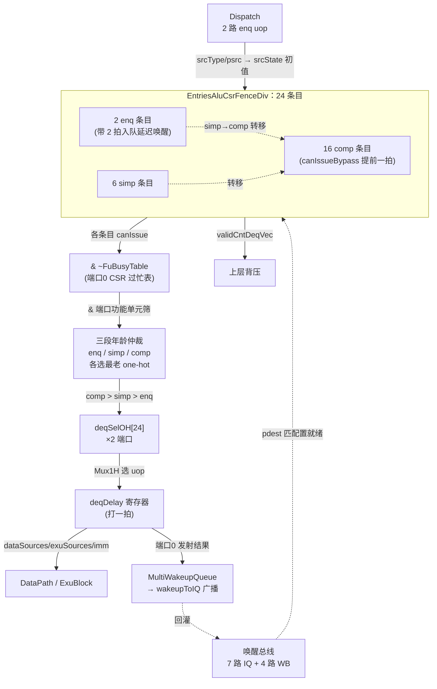

# IssueQueueAluCsrFenceDiv —— 整数发射队列(ALU/CSR/Fence/Div 变体，**样板**)可读 SV 重写

## 1. 这是什么

香山 V2R2(昆明湖)乱序后端的「调度心脏」：**发射队列(IssueQueue)**。它坐在派遣
(Dispatch)与执行(ExuBlock)之间，把已重命名的 uop 存进条目阵列，等它们的源操作数
全部就绪后，按**年龄最老优先**从两个发射端口发出去。

本变体承载 4 个整数功能单元：**ALU / CSR / Fence / Div**，由 **Int Scheduler** 例化
(`scheduler_int_iq_connect.svh`，吃 Dispatch 的第 7 路 uop `io_fromDispatch_uops_6` +
一路旁路 enq，共 2 个入队口)。

> 本文是所有 `IssueQueue*` 变体的**样板文档**：发射队列的通用机理(条目阵列 + 单条目
> 唤醒-选择 + 三段年龄仲裁 + 一拍 deqDelay + 唤醒广播 + 在队统计)在此详述，其余变体
> (`IssueQueueAluMulBkuBrhJmp` / `IssueQueueFalu*` / `IssueQueueVfma*` / 访存 IQ 等)
> 只讲各自相对本样板的增量。

## 2. 层级与文件清单

三层可读核，自底向上：**单条目 → 条目阵列 → 发射队列顶层**。

```
IssueQueueAluCsrFenceDiv (顶层核)
  └─ EntriesAluCsrFenceDiv (条目阵列核)
       └─ IqEntryAcfd ×24 (单条目核：2 enq + 6 simp + 16 comp)
```

| 文件 | 角色 |
|------|------|
| `rtl/backend/iq_acfd_pkg.sv` | 类型/参数包(维度 localparam / FuType 位号 / struct / enum) |
| `rtl/backend/IqEntryAcfd.sv` | 单条目「唤醒-选择」核(`xs_iq_entry_acfd`，参数化 enq/simp/comp) |
| `rtl/backend/EntriesAluCsrFenceDiv.sv` | 条目阵列核：24 条目 genvar 例化 + 转移策略 + 年龄请求打包 |
| `rtl/backend/IssueQueueAluCsrFenceDiv.sv` | IQ 顶层核(`xs_IssueQueueAluCsrFenceDiv_core`) + golden 同名穿透 wrapper |
| `rtl/backend/EntriesAluCsrFenceDiv_wrapper.sv` | golden 同名扁平 wrapper(FM 用，gen 生成) |
| `rtl/backend/issuequeue_acfd_{ports,connect}.svh` | IQ 顶层端口/连线(gen 生成) |
| `scripts/gen_iq_acfd.py` | wrapper/svh/tb 生成器 |
| `verif/ut/IssueQueueAluCsrFenceDiv/` | 双例化 UT(`entries_tb` + `iq_tb`)+ `Makefile{,.iq}` |

**关键维度**(`iq_acfd_pkg.sv`，从 golden 端口实测)：

| 参数 | 值 | 含义 |
|------|----|------|
| `NUM_ENTRIES` | 24 | 条目总数 |
| `NUM_ENQ` | 2 | 入队端口/入队条目(idx 0..1) |
| `NUM_SIMP` | 6 | 简单条目(idx 2..7) |
| `NUM_COMP` | 16 | 复杂条目(idx 8..23) |
| `NUM_DEQ` | 2 | 发射端口 |
| `NUM_REGSRC` | 2 | 每 uop 源寄存器数(整数最多 2 源，无向量/浮点源) |
| `NUM_WK_IQ` / `NUM_WK_WB` | 7 / 4 | IQ 唤醒源 / WB 唤醒源 |
| `LDPW` / `LDW` | 3 / 2 | LoadPipelineWidth / LoadDependencyWidth |

功能单元 one-hot 位：`FU_ALU=5`、`FU_CSR=6`、`FU_FENCE=8`、`FU_DIV=9`。

## 3. 发射队列机理(样板核心)



### 3.1 条目阵列(`EntriesAluCsrFenceDiv`)

24 个条目用 genvar 例化同一颗单条目核 `xs_iq_entry_acfd`，按角色分三段：
**2 enq(idx 0..1)+ 6 simp(idx 2..7)+ 16 comp(idx 8..23)**。阵列层只做「装配 + 路由」：
把外部唤醒/取消广播喂给每个条目、收集各条目的 `valid/canIssue/dataSources` 打包成向量、
执行**转移策略**(simp 条目被选中转移时把内容搬到空 comp 条目，腾出 simp 区给新入队)。

### 3.2 单条目「唤醒-选择」(`IqEntryAcfd`，最小单元)

每个条目持有一拍寄存的 uop 状态 `entry_reg`，每拍做三件事：

1. **唤醒(wakeup)**：监听 WB(写回总线)+ IQ(发射总线)广播的 pdest。若本条目某源
   `psrc == 该 pdest` 且类型匹配(整数 `rfWen`)，该源置就绪(`srcState`)。
2. **取消(cancel)**：被唤醒的源若依赖了一条随后被判失败的 load(load 推测唤醒)，按
   load 依赖移位寄存器 + `ldCancel` 撤销就绪；**0 周期旁路源还要看 `og0Cancel`**
   (命中位固定 `{0,2,4,6}`)。
3. **发射/响应(issue/resp)**：被选中发射(`deqSel`)则置 `issued`；发射响应失败(block)
   或被 load 取消则把 `issued` 退回，允许重发。

当条目**全部源就绪 && 未发射 && 未阻塞**时自报 `canIssue`。三种变体由参数选择，对应
golden 的三个 leaf(`EnqEntry_6` / `OthersEntry_66` simp / `OthersEntry_72` comp)：

| 参数 | 条目类型 | 特征 |
|------|----------|------|
| `IS_ENQ=1` | 入队条目 | 带 2 拍入队延迟唤醒流水(`enqDelayIn1/In2`)，处理进队气泡期到达的唤醒 |
| `IS_ENQ=0,IS_COMP=0` | 简单条目 | 无 canIssueBypass，输出用「已取消」的唤醒 |
| `IS_ENQ=0,IS_COMP=1` | 复杂条目 | 有 `canIssueBypass`：用**未取消**的唤醒提前一拍宣告可发射，组合口即时前递 |

> `exuSources` 的「唤醒源 one-hot → 源序号」编码用 golden `UIntCompressor`(把 27 位全局
> EXU one-hot 压成本 IQ 的 7 路再优先编码)，与 `BackendParams` 拓扑绑定，作黑盒例化，
> 只重写其外围的唤醒匹配/选择逻辑。

### 3.3 canIssue + FU busy 表 + 端口功能单元筛

- `canIssueMergeAllBusy_0 = canIssue & ~busyMask`(**端口0 走 FuBusyTable**，CSR 类可能
  多周期独占)；`canIssueMergeAllBusy_1 = canIssue`(端口1 不过 busy 表)。
- 再按各端口能承担的功能单元筛：
  - **端口0 = CSR**：`deqCanIssue_0 = merge0 & fuType[6]`；
  - **端口1 = ALU / Fence / Div**：`deqCanIssue_1 = merge1 & (fuType[5]|fuType[8]|fuType[9])`。

### 3.4 三段年龄仲裁 + 转移策略

年龄检测器分三段跑(各自一颗)，在各段可发射集合里选**最老**的 one-hot：
`enq=[1:0]` / `simp=[7:2]` / `comp=[23:8]`。转移请求(simp→comp)：简单条目有效且未发射
→ 请求转移到复杂区；`simpReq_3 = simpReq_2 & ~(年龄端口0已选中)`，避免两路选同一条。

### 3.5 deq 发射(one-hot Mux1H)+ deqDelay + 唤醒广播

- **优先级 comp > simp > enq**：comp 集合非空则选 comp，否则 simp，否则 enq，拼成 24 位
  发射 one-hot `{comp[15:0], simp[5:0], enq[1:0]}`(每个发射端口一份)。
- 用 one-hot 对条目阵列 `Mux1H`，选出发射 uop 的 `dataSources/loadDependency/exuSources/
  imm` 等，经**一拍 `deqDelay` 寄存器**送 DataPath(用 struct 表达一条发射 uop 的全部下游
  字段，替代 golden 几十条平铺 reg)。
- 端口0 的发射结果进 `MultiWakeupQueue` 形成 `wakeupToIQ` 广播，回灌唤醒总线。

### 3.6 在队统计 `validCntDeqVec`

统计「在队且端口0 可接(`deqCanAccept`)」的同类 uop 数，减去本拍出队消耗，供上层背压参考。

## 4. X 与位宽纪律

- 空条目/被冲刷条目的 don't-care 派生输出：golden firtool 寄存器无 reset、上电为 X。
  UT 用 `+vcs+initreg+0`(两侧从 0 上电)+ `!$isunknown` 掩蔽假阳性。
- PopCount 类计数用逻辑非 `!`(单比特)而非 `~`(定宽取反会下溢)。
- Mux1H / 年龄选择 / 转移选择一律「`sel ? val : 0`」累加(OR)，`sel=0` 不引 X。
- 5 个子模块(`EntriesAluCsrFenceDiv` 在 IQ-UT 侧、`FuBusyTableRead_23` /
  `MultiWakeupQueue_2` / `NewAgeDetector` / `AgeDetector` / `AgeDetector_1` /
  `UIntCompressor`)均作 golden 黑盒直接例化，端口已扁平，由本核连线。

## 5. 验证结果

### 5.1 双例化 UT(golden vs 可读核，逐拍比对全部输出)

| 测试 | seed1 | seed7 | seed42 |
|------|-------|-------|--------|
| Entries(条目阵列) | 200000 / errors=0 | 200000 / errors=0 | 200000 / errors=0 |
| IssueQueue(顶层) | 200000 / errors=0 | 200000 / errors=0 | 200000 / errors=0 |

(`+define+SYNTHESIS`，`+vcs+initreg+random` 编译，`+vcs+initreg+0` 运行)

### 5.2 形式等价(Formality)

| 变体 | 结果 | compare points |
|------|------|----------------|
| EntriesAluCsrFenceDiv | SUCCEEDED | 5221 passing / 0 failing |
| IssueQueueAluCsrFenceDiv | SUCCEEDED | 4303 passing / 0 failing |

### 5.3 套壳闸门

4 个手写核(pkg / IqEntry / Entries / IssueQueue)代码区(去注释)
`grep -E "io_[a-z_]+_[0-9]+_[0-9]+|_REG_[0-9]|_GEN_|_T_[0-9]|RANDOMIZE"` = **0**。

## 6. 复跑

```
cd verif/ut/IssueQueueAluCsrFenceDiv
source ../../../scripts/env.sh
make compile && make run SEED=1                 # Entries UT
make -f Makefile.iq compile && make -f Makefile.iq run SEED=1   # IQ UT
make fm                                          # Entries FM
make -f Makefile.iq fm                           # IQ FM
```
重生成 wrapper/svh/tb：`python3 scripts/gen_iq_acfd.py`。
