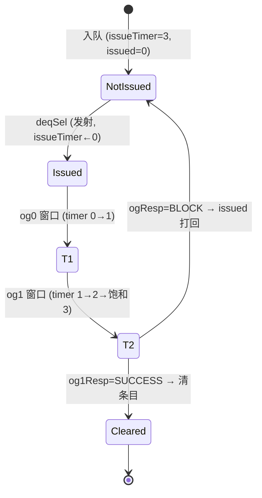

# IssueQueueStdMoud —— store-data 发射队列(StdMoud 变体)可读 SV 重写

## 1. 这是什么

香山 V2R2(昆明湖)乱序后端「调度心脏」之一:**store 数据(store-data)** 发射队列。
本变体 **StdMoud = Std(store-data,store 的数据操作数)+ Moud(原子/杂项的数据通路)**。
它把等待发射的 store-data uop 缓存在条目阵列里,唤醒就绪后按年龄最老仲裁发射到单条
**StdExeUnit**(store 数据流水),把 store 要写的数据连同 robIdx/sqIdx 送往 StoreQueue 的
数据域。

设计源:`src/main/scala/xiangshan/backend/issue/IssueQueue.scala`。注意 **StdMoud 派生自
普通整数 `IssueQueueImp`,而非访存子类 `IssueQueueMemAddrImp`**——它处理的是「数据」而非
「地址」,不做地址翻译,所以没有任何 mem feedback 通路。

与访存样板 `IssueQueueStaMou`(store 地址,见 `IssueQueueStaMou.md`)、整数样板
`IssueQueueAluCsrFenceDiv` 同骨架(条目阵列 + 唤醒-选择 + 年龄最老仲裁 + 一拍 deqDelay),
但它是一个**被「裁瘦」的整数 IQ**:

```
numEntries=16 / numEnq=2 / numSimp=2 / numComp=12 / numDeq=1 / numRegSrc=1
numWakeupFromIQ=7 / numWakeupFromWB=10 / LoadPipelineWidth=3 / LoadDependencyWidth=2
fuType 仅用 bit16/bit17 / sqIdx 6 位 / robIdx 8 位
```

发射队列的通用机理在样板文档已详述。**本文只讲 StdMoud 相对样板的「减法」**:它去掉了
访存 IQ 的全部地址特征,只保留把数据送出去所需的最薄通路。

## 2. 选型说明:为什么 StdMoud 是「裁瘦整数 IQ」

访存类 golden 变体有 `Ldu / StaMou / StdMoud / VlduVstu`。前三者中:

- `Ldu` / `StaMou` 处理的是**地址**:发射后执行端要做地址翻译 / store-set 冲突检查,结果
  通过 **mem feedback**(`feedbackSlow` / `fromLoad`)按 sqIdx/lqIdx 回灌进 IQ,把被阻塞
  的 issued 条目打回重发。这是访存 IQ 的核心特征。
- **`StdMoud` 处理的是「数据」**:store 的数据操作数一旦就绪就能发射,执行端不会因为地址
  冲突而打回数据发射。因此它**没有 mem feedback、没有 isFirstIssue、没有 FuBusyTable、
  没有 wakeupToIQ**——这些在 StaMou/Ldu 里都有的访存机制,它一概没有。

结果:StdMoud 的 IQ 核与「整数样板去掉双源/双端口」后**几乎逐行同构**,只是端口语义换成
store-data。它是验证「整数核能否换语义复用到访存调度域」的最小样本。

## 3. 文件清单

| 文件 | 角色 |
|------|------|
| `rtl/backend/iq_stdmoud_pkg.sv` | 类型/参数包(struct/enum/维度,含 store-data 极薄 payload) |
| `rtl/backend/IssueQueueStdMoud.sv` | IQ 顶层核 `xs_IssueQueueStdMoud_core` + golden 同名穿透 wrapper |
| `rtl/backend/issuequeue_stdmoud_{ports,entries,connect}.svh` | IQ 顶层端口 / 条目阵列例化 / 连线(gen 生成) |
| `verif/ut/IssueQueueStdMoud/{iq_tb.sv,iq_variant_xs.sv,Makefile.iq}` | 双例化 UT + FM Makefile |

条目阵列 `EntriesStdMoud`(及其 16 个单条目 `EnqEntry`/`OthersEntry`、`EnqPolicy` 转移
策略、`UIntCompressor` exuSources 编码器)与 3 个年龄检测器(`NewAgeDetector_6` /
`AgeDetector_12` / `AgeDetector_21`)均作 **golden 黑盒**直接例化,由可读核连线。重写的是
**IQ 核的 enq 分配 / canIssue 合并 / 年龄三段仲裁 / deq 发射 / deqDelay 寄存**胶合逻辑。

## 4. 结构图

```mermaid
flowchart TB
  subgraph ENQ["enq 分配 (§1)"]
    EQ0["io_enq_0/1 (store-data uop)"] --> RDY["enq_ready<br/>= (~simpCanotIn | ~enqHasValid)<br/>&amp; ~enqHasIssued"]
    RDY --> DOENQ["s0_doEnq = valid &amp; ready &amp; ~flush"]
  end
  DOENQ --> ARR
  subgraph ARR["EntriesStdMoud 条目阵列 (golden 黑盒)"]
    direction TB
    E0["enq 条目 ×2 (idx0..1)"]
    E1["simp 条目 ×2 (idx2..3)"]
    E2["comp 条目 ×12 (idx4..15)"]
    E0 -. "simp→comp 转移策略<br/>(EnqPolicy 黑盒, 内部)" .-> E1 --> E2
  end
  WB["WB 唤醒 ×10 (含 fpWen)"] --> ARR
  IQW["IQ 唤醒 ×7 (delayed)"] --> ARR
  ARR -->|e_valid/issued/canIssue<br/>fuType/dataSrc/exuSrc/loadDep| SEL
  subgraph SEL["唤醒-选择 + 年龄仲裁 (§2,3)"]
    direction TB
    CI["deqCanIssue = canIssue &amp; (fuType[16]|fuType[17])"] --> SEG["分三段:<br/>enq[1:0] / simp[3:2] / comp[15:4]"]
    SEG --> AGE["年龄检测器 ×3<br/>NewAgeDetector_6 / AgeDetector_12 / AgeDetector_21"]
    AGE --> OH["deqSelOH (16位)<br/>= {comp, simp, enq}<br/>优先级 comp&gt;simp&gt;enq"]
  end
  ARR -->|e_deq0_* (最老条目读出)| MUX
  OH --> MUX["Mux1H: 按 deqSelOH 选<br/>dataSources/exuSources/loadDependency (单源)"]
  MUX --> DLY["deqDelay 一拍寄存 (§6)<br/>|e_valid 门控 bits"]
  DLY --> OUT["io_deqDelay_0 → StdExeUnit / DataPath<br/>(rf_addr/srcType/rcIdx + common.{fuType,fuOpType,robIdx,sqIdx,dataSrc,exuSrc,loadDep})"]
```

叶子(条目阵列、转移策略、年龄检测器)全为 golden 黑盒;可读核实现外圈的 enq/仲裁/deq/
寄存胶合。

## 5. 数据流 / 唤醒-选择流


**关键**:StdMoud 没有 mem feedback,issued 条目仅靠条目阵列内部对 `og0Resp/og1Resp`
(普通发射响应)的处理推进,和整数 IQ 完全一致——没有按 sqIdx 回灌打回的访存特例。

## 6. issueTimer → og*Resp 时序



条目内 `issue_timer` 在发射当拍清 0,逐拍 0→1→2→3 饱和,用来选择当拍消费哪一路
og 响应窗口。**store-data 是较短延迟通路,真响应落在 og1**(对比向量除法的 og2)。
此时序逻辑在条目黑盒内,IQ 核只负责把发射选中信号送进去、把响应连进去。

## 7. 可读核讲解(对照代码)

### 7.1 enq 分配:`enq_ready`(`IssueQueueStdMoud.sv:81-91`)

```
simpCanotIn = (simp_valid==2'h2)|(simp_valid==2'h1)|(e_valid[2]&e_valid[3])  // 简单区将满
enqHasIssued = (e_valid[0]&e_issued[0]) | (e_valid[1]&e_issued[1])
enq_ready = (~simpCanotIn | ~enqHasValid) & ~enqHasIssued
s0_doEnq_k = io_enq_k_valid & enq_ready & ~io_flush_valid
```

两个入队端口共用一个 `enq_ready`:入队槽要么本身空、要么简单区还能容纳;且入队槽里没有
已发射等响应的条目。这与整数/StaMou 样板逐字同构。

### 7.2 enq.bits 折算:`enq_data_src` / `enq_src_state`(`:95-104`)

单源(`numRegSrc=1`),enq 时根据 `srcType` + `psrc 是否为 0` 决定该源的初始
`dataSources` 与 `srcState`(对照 golden):

```
srcType[0] & psrc==0 → dataSources=ZERO(0号物理寄存器恒0)
srcType==0           → dataSources=IMM(4, 纯 reg 等 WB)
srcType[2] & psrc==0 → dataSources=5
否则                 → dataSources=REG(8, 立即就绪)
src_state = (srcType[2] & psrc==0) | 外部 srcState
```

### 7.3 canIssue + 端口功能单元筛(`:114-122`)

```
port_fu[k]      = e_fu_type[k][16] | e_fu_type[k][17]   // deqCanAccept
deqCanIssue_0   = e_can_issue & port_fu
```

**[E] 无 FuBusyTable**:canIssue 直接与「端口功能单元位」相与即进年龄仲裁,没有 StaMou/Ldu
里的忙表 mask 相与。**[G] 端口功能单元**:store-data uop 复用 STA/MOU 的 FuType 槽位号
(bit16/bit17)编码,故 `deqCanAccept = fuType[16] | fuType[17]`。

### 7.4 年龄三段仲裁 + 转移请求(`:124-153`)

发射请求按条目分区切成三段:`enq=[1:0]`、`simp=[3:2]`、`comp=[15:4]`,各自送进对应年龄
检测器。转移请求(simp→comp)由「简单条目有效且未发射」产生:

```
requestForTrans[i] = e_valid[2+i] & ~e_issued[2+i]
simpReq_2 = requestForTrans            // 转移端口0
simpReq_3 = requestForTrans & ~age_simp_out[1]   // 端口1 排除端口0 已选中, 避免重选
```

发射 one-hot 拼成 16 位,优先级 **comp > simp > enq**:

```
deqValid_0   = (|compReq) | (|simpReq) | (|enqReq)
deqSimpOH_0  = {2{~(|compReq)}} & age_simp_out[0]          // comp 空时 simp 才有效
deqEnqOH_0   = {2{~(|compReq) & ~(|simpReq)}} & age_enq_out // comp/simp 都空时 enq 才有效
deqSelOH_0   = {age_comp_out, deqSimpOH_0, deqEnqOH_0}      // {comp[11:0], simp[1:0], enq[1:0]}
```

### 7.5 Mux1H 选数据(单源 / 单端口)(`:160-175`)

用 16 位发射 one-hot 在 16 条目里按位与 OR 归约,**只对源 0、端口 0 做一次**(无样板的
双源双端口展开),X 安全:

```
finalDataSources_0_0 |= {4{deqSelOH_0[k]}} & e_data_src[k]   // k=0..15
finalExuSources_0_0  |= {3{deqSelOH_0[k]}} & e_exu_src[k]
finalLoadDependency_0[p] |= {2{deqSelOH_0[k]}} & e_load_dep[k][p]  // p=0..2
```

### 7.6 deqDelay 一拍寄存(`:180-225`)

```
deqBeforeDly_0_valid = deqValid_0 & ~e_cancel_deq   // 选中且未被撤销
```

寄存器 `d0` 的 **bits 仅在「队列非空」(`|e_valid`)时更新**(golden 同款门控),`d0_valid`
每拍无条件更新。输出 `io_deqDelay_0_*` 把发射 uop 送往 StdExeUnit / DataPath。

## 8. 变体特色:store-data 的「减法」与 deqDelay 新增 `srcType_0`

| 维度 | 整数/StaMou 样板 | StdMoud(本变体) |
|---|---|---|
| **[A] mem feedback** | StaMou 有 `feedbackSlow`(sqIdx 回灌打回) | **完全没有**(派生自整数 IQ) |
| **isFirstIssue 输出** | StaMou 有 | **没有** |
| **[B] 源/端口** | 整数 2 源 2 端口 | **单源 / 单发射端口** |
| **[E] FuBusyTable** | Ldu 有 | **没有** |
| **wakeupToIQ** | Ldu 有(loadWakeUp) | **没有** |
| **validCntDeqVec 输出** | 整数有 | **没有** |
| **deqDelay payload** | 整数含 imm/pdest/rfWen/ftq | **极薄**:无 imm/immType/pdest/rfWen/ftq/isFirstIssue |
| **[C] deqDelay 新增 `srcType_0`** | StaMou 无此输出 | **有**(StdExeUnit 据此区分 int/fp 数据源) |
| **[D] sqIdx 透传** | StaMou 有(地址匹配用) | **有**(数据写回 StoreQueue 数据域用) |
| **[F] FP 唤醒** | StaMou: WB 全 rfWen | **WB[4..9]/IQ[4..6] 带 fpWen**(数据源可能来自 FP 写回) |

两处「保留」最值得注意:

- **[C] `srcType_0` 输出**(`:213` `io_deqDelay_0_bits_srcType_0`):store 的数据源既可能
  来自整数寄存器堆、也可能来自浮点寄存器堆,**StdExeUnit 必须靠 srcType 判别从哪个 RF
  取数**。这是 StaMou(地址 IQ,只读整数基址)所没有的输出字段。
- **[D] `sqIdx` 透传**(`:219-220`):store-data 把数据写回 StoreQueue 时要按 sqIdx 定位
  数据域,所以 robIdx/sqIdx 随发射送出——这是它唯一保留的「队列指针」语义,但**不参与任何
  回灌匹配**(与 StaMou 用 sqIdx 做 feedback 匹配截然不同)。

## 9. X 与位宽纪律(沿用样板)

- 发射 one-hot 选择全部用三元 mux / 按位与归约(`{N{sel}} & data` 后 OR),X 安全。
- 队列空(`~|e_valid`)时 deqDelay 的 bits 寄存器保持(golden 同款门控),valid 仍每拍更新。
- enq 折算用 `if/else if` 显式优先级表达意图(纯 reg→IMM、imm/pc→REG 立即就绪),无歧义。

## 10. 验证结果

### 10.1 双例化 UT(IQ 顶层级:golden vs 可读核)

`iq_tb.sv` 同时例化 golden `IssueQueueStdMoud`(`u_g`,`:220`)与可读核顶层
`IssueQueueStdMoud_xs`(`u_i`,`:418`),每拍随机激励全部输入(含 WB/IQ 唤醒、og0/og1
响应、ldCancel、flush、背压),`#1` 后比对全部输出(`!$isunknown(g) && g!==i`)。
`+define+SYNTHESIS`、`+vcs+initreg+0` 让两侧寄存器从 0 上电。

| seed | checks | errors |
|------|--------|--------|
| 1  | 200000 | **0** |
| 7  | 200000 | **0** |
| 42 | 200000 | **0** |

三种子各 200000 拍 `errors=0` / `TEST PASSED`,为最终 simv 二进制复跑确认。

### 10.2 形式等价(Formality)

`make -f Makefile.iq fm`:ref = golden `IssueQueueStdMoud` + 全部黑盒依赖,impl = 可读核
(顶层 wrapper)+ 同一批 golden 黑盒。

```
FM_RESULT: Verification SUCCEEDED for IssueQueueStdMoud
Passing (equivalent)    1243   (93 + 1150 两类比对点)
Failing (not equivalent)   0
Unmatched reference(implementation) compare points  0(0)
Matched primary inputs, black-box outputs  581
```

1243 个比对点全 passing,0 unmatched、0 failing——真实全等价,非降级通过。

### 10.3 套壳闸门

`IssueQueueStdMoud.sv / iq_stdmoud_pkg.sv / *.svh` 代码区(去注释)对
`_GEN_ / _T_[0-9] / _REG_[0-9] / RANDOMIZE` 实测全 0。核里用 struct(`deq_common_t`)、
enum(`resp_type_e / data_source_e / src_state_e`)、function(`enq_data_src / enq_src_state`)、
genvar(`g_portfu / g_trans`)与 `always_comb` Mux1H 表达意图,非把 golden 模块体抽进套壳。

## 11. 复跑

```
cd verif/ut/IssueQueueStdMoud
make -f Makefile.iq compile
make -f Makefile.iq run SEED=1      # 同理 SEED=7 / 42
make -f Makefile.iq fm
```

许可证 DOWN 时先 `lmstat -a` 检查,必要时 `lmgrd` 起 license server。
