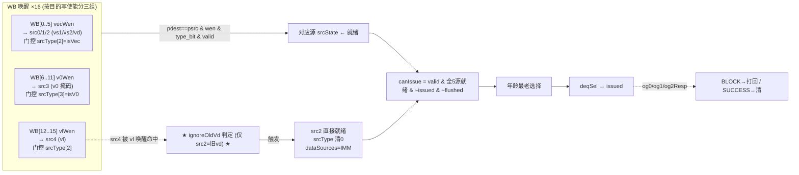
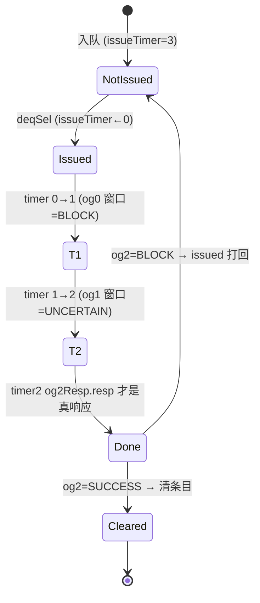

# IssueQueueVfdivVidiv —— 向量除法发射队列(VfdivVidiv 变体)可读 SV 重写 ★向量开荒★

## 1. 这是什么

香山 V2R2(昆明湖)乱序后端「调度心脏」之一,也是 **「向量类」发射队列的开荒变体**。
本变体 **VfdivVidiv = VFDIV(向量浮点除/开方)+ VIDIV(向量整数除)**。它把等待发射的向量
除法 uop 缓存在条目阵列里,唤醒就绪后按年龄最老仲裁发射到单条向量除法流水。

设计源:`src/main/scala/xiangshan/backend/issue/{Entries,EntryBundles,EnqEntry,
OthersEntry,IssueQueue}.scala`。golden 对照:`EntriesVfdivVidiv.sv`(叶子 `EnqEntry_18`
/ `OthersEntry_164`(simp)/ `OthersEntry_166`(comp)/ `EnqPolicy_18`)。

它是向量 IQ 里**最小的变体**,用来给后续所有向量变体(VfmaVialuFixVfalu / VlduVstu …)
打样。本文重点讲**向量调度相对标量/浮点的全新机制**:5 源语义、按目的类型分组的 WB 唤醒、
以及向量调度最核心的 **ignoreOldVd**。

```
numEntries=10 / numEnq=2 / numSimp=2 / numComp=6 / numDeq=1
numRegSrc=5 (vs1/vs2/vd/v0/vl) / numWakeupFromWB=16 / 无 IQ 唤醒
fuType 仅用 bit22(VFDIV)/bit26(VIDIV) / psrc 7 位 / pdest 8 位
```

## 2. 重写边界:为何在「条目阵列」层做

与 StdMoud/StaMou/Ldu(在 **IQ 顶层** 重写、把 Entries 当黑盒)不同,向量开荒选择在
**条目阵列(Entries)层** 重写,把向量调度的全部新机制(唤醒分组、ignoreOldVd、issueResp
多周期)真正写进可读核,而把更外层的 IQ 顶层胶合留给 golden 聚合:

- **单条目核** `rtl/backend/IqEntryVfdiv.sv`(`xs_iq_entry_vfdiv`):向量「唤醒-选择」的最小
  单元,参数 `IS_ENQ/IS_TRANS` 选 enq/simp/comp 三类条目。
- **阵列核** `rtl/backend/EntriesVfdivVidiv.sv`(`xs_EntriesVfdivVidiv_core`):例化 10 个
  单条目 + 转移策略(simp→comp)+ 年龄最老选择(三级 Mux)+ issueResp 折算。
- **类型包** `rtl/backend/iq_vfdiv_pkg.sv`:5 源 `src_status_t`、向量 `vpu_t`、`vl_info_t`。

`EnqPolicy_18`(转移选择)是唯一 golden 黑盒;两个单条目核 + 阵列核全为可读重写。

## 3. 文件清单

| 文件 | 角色 |
|------|------|
| `rtl/backend/iq_vfdiv_pkg.sv` | 类型/参数包(5 源 struct、vpu、vl_info、WB 分组边界) |
| `rtl/backend/IqEntryVfdiv.sv` | 单条目核 `xs_iq_entry_vfdiv`(向量唤醒 + ignoreOldVd) |
| `rtl/backend/EntriesVfdivVidiv.sv` | 阵列核 `xs_EntriesVfdivVidiv_core`(转移策略 + 年龄 mux + issueResp) |
| `verif/ut/IssueQueueVfdivVidiv/{entries_tb.sv,entries_variant_xs.sv,Makefile}` | 双例化 UT + FM |

## 4. 结构图

```mermaid
flowchart TB
  ENQ["enq ×2 (向量 uop, entry_t)"] --> ARR
  subgraph ARR["xs_EntriesVfdivVidiv_core (条目阵列, 可读核)"]
    direction TB
    E0["enq 条目 ×2 (IS_ENQ)"]
    E1["simp 条目 ×2 (IS_TRANS)"]
    E2["comp 条目 ×6 (终端)"]
    E0 -- "转移策略 (EnqPolicy_18 黑盒)<br/>simp→comp 提级" --> E1 --> E2
  end
  WB["WB 唤醒 ×16 (无 IQ 唤醒)"] --> ARR
  WBD["WB 延迟唤醒 ×16 (enqDelay)"] --> ARR
  VL["vl_info: vlFromInt/Vf 的 {isZero,isVlmax}"] --> ARR
  ARR -->|每条目 valid/issued/canIssue<br/>fuType/dataSources| AGG["阵列状态汇聚"]
  ARR -->|ety_entry (最老条目读出)| MUX
  SEL["enq/simp/comp Oldest Sel (上层 IQ 给)"] --> MUX
  MUX["三级年龄 mux (numDeq=1)<br/>compSel ? compOldest :<br/>(simpSel ? simpOldest : enqOldest)"] --> DEQ["o_deq_entry → 向量除法流水"]
  RESP["og0/og1/og2 Resp"] --> ARR
```

每个 enq/simp/comp 条目内部都是一个 `xs_iq_entry_vfdiv` 实例;阵列核做条目间的转移、
年龄选择、issueResp 折算。

## 5. 向量唤醒-选择数据流



**核心理解**:向量 uop 的 5 个源里,`vd`(src2,旧目的寄存器)是 read-modify-write 语义,
本应等旧值就绪;但在 tail/mask agnostic 配置下旧值根本不会被用到——ignoreOldVd 就在这时
把 src2 提前置就绪,**让向量除法不必干等无意义的旧 vd 依赖**。

## 6. issueTimer → og*Resp 时序(向量多周期,真响应推迟到 og2)



阵列核 `issueRespVec`(`EntriesVfdivVidiv.sv:109-126`)按 issueTimer 折算响应:

```
timer==0 → valid=og0resp_valid, resp=BLOCK
timer==1 → valid=og1resp_valid, resp=UNCERTAIN
timer==2 → valid=og2resp_valid, resp=og2resp_resp   ★ 向量除法真响应在 og2 ★
```

**这是向量除法与浮点(FaluFmac:timer1→SUCCESS)的关键时序差异**:向量除法是多周期长延迟
通路,真正的成功/阻塞结论要等到 og2 窗口才下,前两拍只是占位(BLOCK/UNCERTAIN)。

## 7. 可读核讲解(对照代码)

### 7.1 ★ 向量唤醒匹配:按源分三组 ★(`IqEntryVfdiv.sv:103-131`)

唤醒的本质是 `pdest==psrc & wen & srcType门控位 & valid`。向量的关键在于**不同源用不同的
组、不同的 srcType 位、不同的写使能含义**:

```
wb_hit(w,s,type_bit) = ({1'b0,s.psrc}==w.pdest) & type_bit & w.wen & w.valid  // psrc 零扩到 8 位

src0/1/2 (vs1/vs2/vd) → group_hit(WB[0..5],  srcType[2], vecWen)  // 向量数据
src3     (v0 掩码)    → group_hit(WB[6..11], srcType[3], v0Wen)   // 掩码
src4     (vl 长度)    → group_hit(WB[12..15],srcType[2], vlWen)   // vl 用 srcType[2] 但看 vlWen
```

注意 **vl 源(src4)的 srcType 门控用 bit2(同向量数据),但写使能看的是 vlWen**——这是
向量调度的精细之处:vl 本身像一个「源」参与就绪判定,但它由独立的 vlWen 写回唤醒。

### 7.2 ★ ignoreOldVd —— 向量调度最核心机制 ★(`IqEntryVfdiv.sv:140-158`)

逐字对照 golden `EnqEntry_18.sv` 的 `ignoreOldVd_2`:

```
wakeup_vl_int = wb_hit(WB[12], src4, srcType[2])   // src4 被 Int 来源 vl 唤醒
wakeup_vl_vf  = wb_hit(WB[13], src4, srcType[2])   // src4 被 Vf  来源 vl 唤醒

ignore_old_vd2 =
    src2.srcType[2]                                                  // src2 是向量数据源(旧 vd)
  & ((~vl_info.int_is_zero & wakeup_vl_int) | (~vl_info.vf_is_zero & wakeup_vl_vf))  // vl 非零且被唤醒
  & ~vpu.is_depend_old_vd                                            // 指令不强依赖旧 vd
  & ( ((vl_info.int_is_vlmax & wakeup_vl_int) | (vl_info.vf_is_vlmax & wakeup_vl_vf))
        & (vpu.vm | vpu.vma) & ~vpu.is_write_part_vd                 // vl==vlmax & mask agnostic & 整写
      | (vpu.vm | vpu.vma) & vpu.vta )                               // 或 tail agnostic
```

**物理意义**:向量指令的 vd 被当源读旧值(读改写);但若 vl 满(vlmax)且整个 vd 都会被新结果
覆盖(`vm|vma` 无掩码/掩码无关 且 非部分写),或 tail agnostic(尾元素不保留),那么旧 vd
的内容**完全无意义**。这时即使 vd 物理寄存器还没就绪,也可以「忽略旧 vd 依赖」。触发后
(`IqEntryVfdiv.sv:188-204`):

```
src2.srcState   ← 置就绪 (current | wb_hit | ignore_old_vd2)
src2.srcType    ← 清 0   (不再当向量源)
src2.dataSources ← IMM   (旧 vd 不必再等, 视作无源/立即)
```

`vl_info`(`vlFromInt/Vf` 的 `isZero/isVlmax`)由顶层四个输入提供。这是向量调度区别于标量/
浮点的**最核心增量**,后续所有向量变体复用。

### 7.3 转移策略(simp→comp)与浮点同构(`EntriesVfdivVidiv.sv:136-289`)

转移策略沿用浮点样板骨架:`EnqPolicy_18`(黑盒)给出 simp/comp 的入队 one-hot,核里算
`enqCanTrans2Comp/Simp`、`finalSimpTransSel/finalCompTransSel`,再 Mux1H 选出每个 simp/comp
条目的入队来源。simp 是「转移源」(可被提级到 comp),comp 为终端。

⚠ 位宽坑(`:177` 注释):统计空 comp 数用 `+= !ety_valid[...]`(逻辑非,单比特),**不能用
`~`**——`~` 是定宽运算符,在 32 位加法上下文会按 32 位取反致下溢。

### 7.4 canIssue:comp 与 simp 同构(`IqEntryVfdiv.sv:300-307`)

```
all_src_rdy = & 所有 5 源 srcState   (EnqEntry 用 current_status 含 enqDelay; Others 用 entry_reg)
o_can_issue = valid & all_src_rdy & ~issued & ~flushed
```

**向量除法没有 IQ 即时前递**,所以 **comp 条目和 simp 条目的 canIssue / 输出完全相同**
(差别仅「simp 能转移、comp 不能」)。这与浮点变体(comp 带 bypass 即时前递)不同。

### 7.5 年龄最老选择(三级 mux,numDeq=1)(`EntriesVfdivVidiv.sv:375-386`)

```
deqEntry = compSel.valid ? compOldest
         : (simpSel.valid ? simpOldest : enqOldest)
```

每段内用 `if(sel[i]) oldest |= ety_entry[...]` 的 one-hot OR 累加(sel=0 不引 X),优先级
comp > simp > enq。

## 8. 变体特色总览(向量 vs 浮点/标量)

| 维度 | 浮点 FaluFmac | **VfdivVidiv(向量开荒)** |
|---|---|---|
| numRegSrc | 3(rs1/rs2/rs3) | **5(vs1/vs2/vd/v0/vl)** |
| 唤醒源 | WB + IQ | **仅 WB ×16,无 IQ 唤醒** |
| exuSources / UIntCompressor / og0Cancel / forward | 有 | **全无**(多周期不做 0 周期前递) |
| WB 唤醒分组 | 单一(fpWen + srcType[1]) | **三组**:vec(srcType[2]/vecWen)、v0(srcType[3]/v0Wen)、vl(srcType[2]/vlWen) |
| srcType 位语义 | bit1=isFp | **bit2=isVecVf、bit3=isV0** |
| **ignoreOldVd** | 无 | **有(向量核心)**:vl 唤醒且 tail/mask agnostic → 旧 vd 置就绪、srcType 清0、dataSrc=IMM |
| issueResp 真响应窗口 | og1(timer1→SUCCESS) | **og2(timer2)**——向量除法多周期 |
| comp 即时前递 bypass | 有 | **无**(comp 与 simp 同构) |
| payload | fpu_fmt/rm/rfWen/fpWen | **vpu_* 一族 + uopIdx + vecWen/v0Wen**(无 fpu_fmt/rm) |
| numEntries | 18 | **10(2/2/6)** |

## 9. X 与位宽纪律

- 唤醒匹配纯组合;全源就绪用 `&` 归约;状态全在 `entry_reg`(综合下复位无关,firtool 随机
  初始化,UT 用 `!$isunknown` 跳过未写过的条目)。
- oldest / Mux1H 用 `sel[i] ? entry[i] : 0` 的 OR 累加,sel=0 不引 X。
- 统计空 comp 数用 `!`(逻辑非单比特)而非 `~`(定宽取反),避免 32 位加法下溢。
- ignoreOldVd 用三元 + 逻辑与/或显式表达 tail/mask agnostic 条件,逐字对照 golden。

## 10. 验证结果

### 10.1 双例化 UT(条目阵列级:golden vs 可读核 wrapper)

`entries_tb.sv` 同时例化 golden `EntriesVfdivVidiv`(`u_g`)与可读核 wrapper
`EntriesVfdivVidiv_xs`(`u_i`,内含 `xs_EntriesVfdivVidiv_core` + 黑盒 `EnqPolicy_18`),
每拍随机激励全部输入(含 16 路 WB 唤醒 + 延迟唤醒、vl_info、og0/og1/og2 响应、转移选择、
flush、背压),`#1` 后比对全部 97 路输出(`!$isunknown(g) && g!==i`)。入队 srcType 偏置
isVec/isV0 以覆盖三组唤醒路径与 ignoreOldVd。`+define+SYNTHESIS`、`+vcs+initreg+0` 上电归零。

| seed | checks | errors |
|------|--------|--------|
| 1  | 200000 | **0** |
| 7  | 200000 | **0** |
| 42 | 200000 | **0** |

三种子各 200000 拍 `errors=0` / `TEST PASSED`。

### 10.2 形式等价(Formality)

`make fm`:ref = golden `EntriesVfdivVidiv` + 全部黑盒(含 golden 单条目叶子),
impl = 可读核 wrapper + 同一批黑盒。

```
FM_RESULT: Verification SUCCEEDED for EntriesVfdivVidiv
Passing (equivalent)    2151   (709 + 1442 两类比对点)
Failing (not equivalent)   0
Unmatched reference(implementation) compare points  0(0)
Matched primary inputs, black-box outputs  651
```

2151 个比对点全 passing,0 unmatched、0 failing——真实全等价,非降级通过。

### 10.3 套壳闸门

`IqEntryVfdiv.sv / EntriesVfdivVidiv.sv / iq_vfdiv_pkg.sv` 代码区(去注释)对
`_GEN_ / _T_[0-9] / _REG_[0-9] / RANDOMIZE` 实测全 0。核里用 struct(`entry_t /
status_t / src_status_t / vpu_t / vl_info_t / wk_wb_t / deq_resp_t`)、enum
(`src_state_e / data_source_e / resp_type_e`)、function(`wb_hit / group_hit`)、
genvar(`g_entry`)、`always_comb` Mux1H + `for` 展开 5 源/三组唤醒表达意图,非套壳。

## 11. 复跑

```
cd verif/ut/IssueQueueVfdivVidiv
make compile
make run SEED=1      # 同理 SEED=7 / 42
make fm
```

许可证 DOWN 时先 `lmstat -a` 检查,必要时 `lmgrd` 起 license server。
