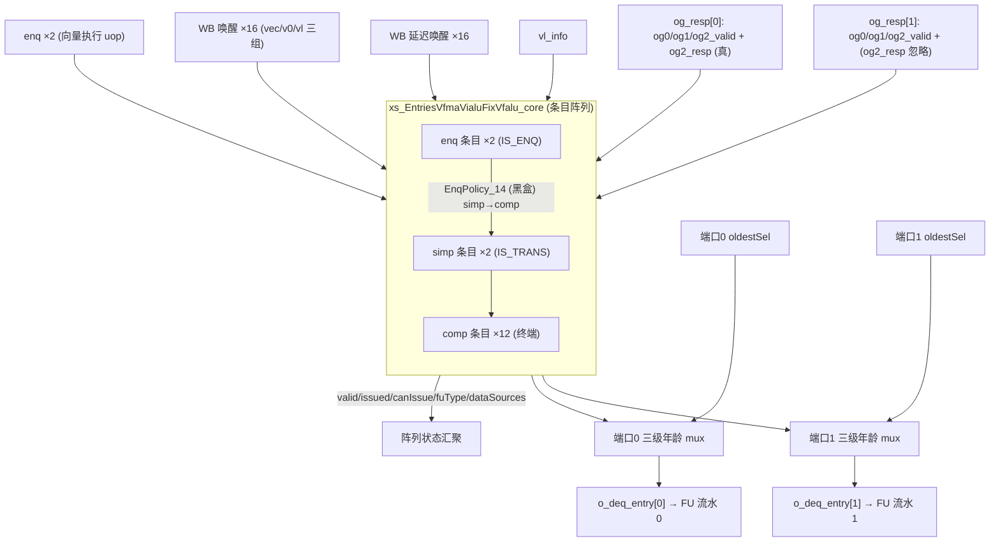
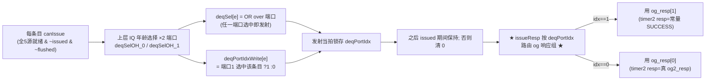
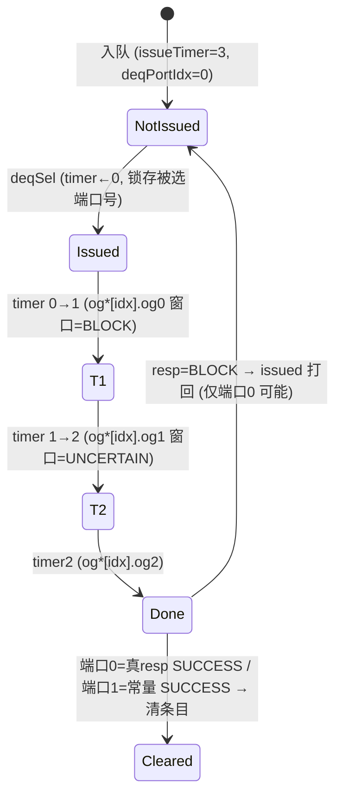

# IssueQueueVfmaVialuFixVfalu —— 向量执行发射队列(多 FU / 双发射)可读 SV 重写

## 1. 这是什么

香山 V2R2(昆明湖)乱序后端「调度心脏」之一,是**向量执行类发射队列的多 FU / 双发射变体**。

本变体 **VfmaVialuFixVfalu** = 一条发射队列上挂三种向量执行功能单元:

| FuType 位 | 功能单元 | 含义 |
|---|---|---|
| `bit19` | vialuF | 向量整数定点 ALU |
| `bit24` | vfalu  | 向量浮点 ALU |
| `bit25` | vfma   | 向量浮点 FMA(乘加) |

它从向量样板 **VfdivVidiv** 派生:核心的 5 源唤醒、WB 三组分组、ignoreOldVd、issueTimer→
og 响应窗口、simp→comp 转移策略、入队延迟唤醒**完全相同**。差异只集中在「多功能单元」
带来的两点结构升级:**numDeq=2(双发射 + deqPortIdx)** 与 **payload 多带 FMA 字段**。

设计源:`src/main/scala/xiangshan/backend/issue/{Entries,EntryBundles,EnqEntry,
OthersEntry,IssueQueue}.scala`。golden 对照:`EntriesVfmaVialuFixVfalu.sv`(叶子
`EnqEntry_16` / `OthersEntry_150`(simp)/ `OthersEntry_152`(comp)/ `EnqPolicy_14`)。

```
numEntries=16 / numEnq=2 / numSimp=2 / numComp=12 / numDeq=2 ★
numRegSrc=5 (vs1/vs2/vd/v0/vl) / numWakeupFromWB=16 / 无 IQ 唤醒
fuType: vialuF=19 / vfalu=24 / vfma=25
```

本文重点讲两个增量,以及一个隐蔽的拓扑常量坑——**og2Resp_1 端口 timer2 用常量 SUCCESS**。

## 2. 重写边界

延续向量类做法,在**条目阵列(Entries)层**重写;`EnqPolicy_14`(转移选择)作 golden 黑盒。

- **单条目核** `rtl/backend/IqEntryVfmaVialuFixVfalu.sv`(`xs_iq_entry_vfmavialufixvfalu`):
  在 VfdivVidiv 单条目上加 `deq_port_idx` 状态(numDeq=2)+ FMA payload 透传。
- **阵列核** `rtl/backend/EntriesVfmaVialuFixVfalu.sv`(`xs_EntriesVfmaVialuFixVfalu_core`):
  例化 16 个单条目 + 转移策略 + **双端口年龄选择** + **issueResp 按 deqPortIdx 路由折算**。
- **类型包** `rtl/backend/iq_vfmavialufixvfalu_pkg.sv`:status 含 `deq_port_idx`,
  payload 含 `fp_wen/last_uop`,vpu 含 `fpu_is_fold_to_1_{2,4,8}`,新增 `og_resp_t`。

## 3. 文件清单

| 文件 | 角色 |
|------|------|
| `rtl/backend/iq_vfmavialufixvfalu_pkg.sv` | 类型/参数包(deqPortIdx、og_resp_t、FMA 字段) |
| `rtl/backend/IqEntryVfmaVialuFixVfalu.sv` | 单条目核(向量唤醒 + ignoreOldVd + deqPortIdx) |
| `rtl/backend/EntriesVfmaVialuFixVfalu.sv` | 阵列核(双端口年龄选择 + issueResp 端口路由) |
| `rtl/backend/EntriesVfmaVialuFixVfalu_wrapper.sv` | flat↔struct glue(双例化 UT/FM 用) |
| `verif/ut/IssueQueueVfmaVialuFixVfalu/{entries_tb.sv,entries_variant_xs.sv,Makefile}` | 双例化 UT + FM |

## 4. 结构图



## 5. 双发射唤醒-选择数据流(deqPortIdx 机制)



## 6. issueTimer → og 响应(按记录的端口路由)



## 7. 可读核讲解(对照代码)

### 7.1 唤醒匹配 / ignoreOldVd(与 VfdivVidiv 逐字相同)

唤醒分三组(`IqEntryVfmaVialuFixVfalu.sv:115-127`)、ignoreOldVd(`:137-151`)与向量样板
完全一致,此处不赘述,详见 `IssueQueueVfdivVidiv.md` §7。canIssue(`:294-302`)同样是
`valid & 全5源就绪 & ~issued & ~flushed`,comp 与 simp 同构(无 IQ 即时前递)。

### 7.2 ★ 增量 1:deqPortIdx(numDeq=2)★

**条目侧**(`IqEntryVfmaVialuFixVfalu.sv:209-212`):每个条目用 1 bit 寄存器记录「自己被
哪个 deq 端口选中发射」:

```
deqPortIdx_next = deqSel ? deq_port_idx_write                       // 发射当拍锁存
                         : (issued & entry_reg.deq_port_idx);       // 之后保持; 否则清 0
```

**阵列侧**(`EntriesVfmaVialuFixVfalu.sv:113-122`)生成 deqSel / 端口号:

```
deqSel[e]          = OR over 端口 p: (deqSelOH_p.valid & deqSelOH_p.bits[e])  // 任一端口选中
deqPortIdxWrite[e] = deqSelOH_1.valid & deqSelOH_1.bits[e]                    // 端口1 选中=1
```

入队时 EnqEntry 强制 `deqPortIdx=0`(新 uop 从未发射过,`:233`)。

### 7.3 ★★ 坑:og2Resp_1 端口 timer2 用常量 SUCCESS ★★(`EntriesVfmaVialuFixVfalu.sv:129-156`)

issueResp 折算先按条目记录的 `deqPortIdx` **选端口的 og 响应组**,再按 issueTimer 选窗口:

```
idx  = ety_deq_port_idx[e];
og0v = idx ? og_resp[1].og0_valid : og_resp[0].og0_valid;   // 同理 og1v / og2v
og2r = idx ? 2'(RESP_SUCCESS)     : og_resp[0].og2_resp;     // ★ 端口1 用常量 SUCCESS ★

timer0 → valid=og0v, resp=BLOCK
timer1 → valid=og1v, resp=UNCERTAIN
timer2 → valid=og2v, resp=og2r       // 端口0=真 og2_resp; 端口1=常量 SUCCESS(2'h3)
```

**这是 golden 的拓扑常量,不是简化**:只有**端口0** 在 golden 顶层引出
`og2Resp_0_bits_resp`(真响应,可被 RegFile/总线背压打回);**端口1 的 og2Resp_1 只有
valid 端口,没有 bits_resp**,所以端口1 一旦走到 timer2 窗口,resp 恒为 SUCCESS。物理含义:
端口1 不会在 og2 阶段被背压,走到 og2 即必定发射成功。`og_resp_t` 里 `og2_resp` 字段也注明
「仅端口0 有意义」(`iq_vfmavialufixvfalu_pkg.sv:204-206`)。漏掉这个常量、误把端口1 也接
真 resp,UT/FM 会发散。

### 7.4 ★ 增量 2:payload 多带 FMA 字段(仅透传)★

`fp_wen`、`last_uop`、`vpu.fpu_is_fold_to_1_{2,4,8}`(FMA 归约折叠)只随条目寄存透传
(`payload_t` / `vpu_t`,见 pkg `:139-169`),不参与唤醒/选择/ignoreOldVd 判定;在
entry/transEntry 上引出,供下游执行单元使用。

### 7.5 双端口年龄选择(`EntriesVfmaVialuFixVfalu.sv:401-414`)

每个 deq 端口独立做一遍 comp>simp>enq 三级 oldest mux,各用自己端口的 oldestSel:

```
for p in [0,1]:
  deqEntry[p] = compSel[p].valid ? compOldest[p]
              : (simpSel[p].valid ? simpOldest[p] : enqOldest[p])
```

转移策略(`:158-312`)与 VfdivVidiv 逐字同构(仅 comp 数 6→12),仍用 `!`(单比特)统计
空 comp 数避免 32 位定宽下溢。

## 8. 变体特色总览(VfmaVialuFixVfalu vs VfdivVidiv)

| 维度 | VfdivVidiv(样板) | **VfmaVialuFixVfalu** |
|---|---|---|
| numEntries / Comp | 10 / 6 | **16 / 12** |
| numDeq(发射端口) | 1 | **2(双发射)** |
| deqPortIdx 状态 | 无 | **有(每条目记录被哪个端口选中)** |
| issueResp 路由 | 单口直接折算 | **按 deqPortIdx 选 og 响应组** |
| og2 resp | timer2 出真响应 | **端口0=真 og2_resp;端口1=常量 SUCCESS★** |
| fuType 位 | 22/26 | **19(vialuF)/24(vfalu)/25(vfma)** |
| payload 额外字段 | 无 | **fpWen / lastUop / fpu 折叠×3(仅透传)** |

## 9. X 与位宽纪律

- 唤醒/ignoreOldVd 纯组合;全源就绪用 `&` 归约;状态全在 `entry_reg`。
- deqSel 用 OR over 端口;deqPortIdx 用三元保持;issueResp 按 idx 三元选端口组。
- 端口1 的 og2 resp 显式写常量 `2'(RESP_SUCCESS)`,逐字对照 golden 拓扑。
- 双端口 oldest mux 各自 `sel[i] ? entry[i] : 0` OR 累加,sel=0 不引 X。
- 空 comp 统计用 `!`(单比特)而非 `~`(定宽),避免 32 位加法下溢。

## 10. 验证结果

### 10.1 双例化 UT

`entries_tb.sv` 同时例化 golden `EntriesVfmaVialuFixVfalu`(`u_g`)与可读核 wrapper
`EntriesVfmaVialuFixVfalu_xs`(`u_i`),每拍随机激励全部输入(16 路 WB + 延迟唤醒、vl_info、
**两端口 og0/1/2 响应**、两端口 deqSelOH + oldestSel、转移选择、flush、背压),`#1` 后比对
全部输出。入队 srcType 偏置 isVec/isV0;两端口随机选中以覆盖 deqPortIdx 路由与端口1 常量
SUCCESS 路径。`+define+SYNTHESIS`、`+vcs+initreg+0`。

| seed | checks | errors |
|------|--------|--------|
| 1  | 200000 | **0** |
| 7  | 200000 | **0** |
| 42 | 200000 | **0** |

三种子各 200000 拍 `errors=0` / `TEST PASSED`。

### 10.2 形式等价(Formality)

`make fm`:

```
FM_RESULT: Verification SUCCEEDED for EntriesVfmaVialuFixVfalu
Passing compare points  3605
Failing compare points  0
Unmatched reference(implementation) compare points  0(0)
Matched primary inputs, black-box outputs  713
```

3605 个比对点全 passing,0 unmatched、0 failing——真实全等价。

### 10.3 套壳闸门

核与 pkg 代码区(去注释)对 `_GEN_ / _T_[0-9] / _REG_[0-9] / RANDOMIZE` 全 0。核里用
struct(`entry_t/status_t/src_status_t/vpu_t/payload_t/og_resp_t/wk_wb_t/vl_info_t/
deq_resp_t`)、enum(`src_state_e/data_source_e/resp_type_e`)、function
(`wb_hit/group_hit`)、genvar(`g_entry`)、`always_comb` Mux1H + `for` 展开表达意图,非套壳。

## 11. 复跑

```
cd verif/ut/IssueQueueVfmaVialuFixVfalu
make compile
make run SEED=1      # 同理 SEED=7 / 42
make fm
```

许可证 DOWN 时先 `lmstat -a` 检查,必要时 `lmgrd` 起 license server。
