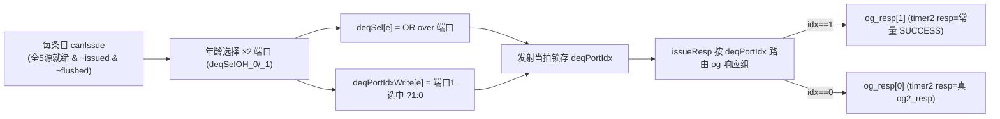

# IssueQueueVfmaVialuFixVimacVppuVfaluVfcvtVipuVsetrvfwvf —— 大向量执行发射队列可读 SV 重写

## 1. 这是什么

香山 V2R2(昆明湖)乱序后端「调度心脏」之一,是**向量执行类发射队列里挂功能单元最多的
双发射变体**。一条发射队列上挂 **8 种向量执行功能单元**:

| FuType 位 | 功能单元 | 含义 |
|---|---|---|
| `bit18` | vipu    | 向量整数置换/规约 |
| `bit19` | vialuF  | 向量整数定点 ALU |
| `bit20` | vppu    | 向量置换 |
| `bit21` | vimac   | 向量整数乘累加 |
| `bit24` | vfalu   | 向量浮点 ALU |
| `bit25` | vfma    | 向量浮点 FMA |
| `bit27` | vfcvt   | 向量浮点转换 |
| `bit30` | vsetfwf | vset 读旧 vl 写 vconfig(名字里的 Vsetrvfwvf) |

它从 **VfmaVialuFixVfalu**(向量执行 3-FU 双发射)派生:numDeq=2 的 deqPortIdx 机制、
端口1 og2 常量 SUCCESS、5 源唤醒、WB 三组、ignoreOldVd、转移策略——**全部原样继承**。
本变体的增量只有「字段扩充」:fuType 3→8 位、payload 多 3 个透传字段、EntryBundle 顶层
多 imm。这些增量字段**只透传、不参与唤醒/选择判定**。

设计源:`src/main/scala/xiangshan/backend/issue/{Entries,EntryBundles,EnqEntry,
OthersEntry,IssueQueue}.scala`。golden 对照:
`EntriesVfmaVialuFixVimacVppuVfaluVfcvtVipuVsetrvfwvf.sv`(叶子 `EnqEntry_14` /
`OthersEntry_136`(simp)/ `OthersEntry_138`(comp)/ `EnqPolicy_14`)。

```
numEntries=16 / numEnq=2 / numSimp=2 / numComp=12 / numDeq=2
numRegSrc=5 (vs1/vs2/vd/v0/vl) / numWakeupFromWB=16 / 无 IQ 唤醒
fuType 8 位: 18/19/20/21/24/25/27/30 / imm 15 位 / selImm 4 位
```

## 2. 重写边界 / 文件清单

延续向量类做法,条目阵列层重写;`EnqPolicy_14` 作 golden 黑盒。

| 文件 | 角色 |
|------|------|
| `rtl/backend/iq_vfmavialufixvimacvppuvfaluvfcvtvipuvsetrvfwvf_pkg.sv` | 类型/参数包(8 位 FU、imm、selImm、rf/vl_wen、deqPortIdx、og_resp_t) |
| `rtl/backend/IqEntryVfmaVialuFixVimacVppuVfaluVfcvtVipuVsetrvfwvf.sv` | 单条目核(向量唤醒 + ignoreOldVd + deqPortIdx + 8 位 FU/imm 透传) |
| `rtl/backend/EntriesVfmaVialuFixVimacVppuVfaluVfcvtVipuVsetrvfwvf.sv` | 阵列核(双端口年龄选择 + issueResp 端口路由) |
| `rtl/backend/EntriesVfmaVialuFixVimacVppuVfaluVfcvtVipuVsetrvfwvf_wrapper.sv` | flat↔struct glue |
| `verif/ut/IssueQueueVfmaVialuFixVimacVppuVfaluVfcvtVipuVsetrvfwvf/{entries_tb.sv,entries_variant_xs.sv,Makefile}` | 双例化 UT + FM |

## 3. 结构图

```mermaid
flowchart TB
  ENQ["enq ×2 (向量执行 uop, entry_t = imm + status + payload)"] --> ARR
  subgraph ARR["xs_EntriesVfmaVialuFixVimac…_core (条目阵列)"]
    direction TB
    E0["enq 条目 ×2 (IS_ENQ)"]
    E1["simp 条目 ×2 (IS_TRANS)"]
    E2["comp 条目 ×12 (终端)"]
    E0 -- "EnqPolicy_14 (黑盒) simp→comp" --> E1 --> E2
  end
  WB["WB 唤醒 ×16 (vec/v0/vl 三组)"] --> ARR
  WBD["WB 延迟唤醒 ×16"] --> ARR
  VL["vl_info"] --> ARR
  OG0["og_resp[0]: og0/1/2_valid + og2_resp (真)"] --> ARR
  OG1["og_resp[1]: og0/1/2_valid + (og2_resp 忽略)"] --> ARR
  ARR -->|valid/issued/canIssue/<b>fuType(8位)</b>/dataSources| AGG
  ARR --> MUX0["端口0 三级年龄 mux"] --> DEQ0["o_deq_entry[0] → FU 流水 0"]
  ARR --> MUX1["端口1 三级年龄 mux"] --> DEQ1["o_deq_entry[1] → FU 流水 1"]
```

## 4. 双发射唤醒-选择数据流(与样板同)



## 5. 字段透传数据流(本变体增量)

```mermaid
flowchart LR
  ENQ["enq.entry_t = imm(15) + status(8位FU…) + payload(rfWen/vlWen/selImm…)"] --> REG["entry_reg"]
  REG --> UPD["entry_update"]
  UPD -->|imm 透传 :221| REG
  UPD -->|8 位 fuType 各自透传 :175-182| REG
  UPD -->|payload 整体透传 (含 rfWen/vlWen/selImm)| REG
  REG -->|o_fu_type[18/19/20/21/24/25/27/30] :315-322| OUT["阵列 / 年龄 mux / deqEntry"]
  REG -->|transEntry 携带 imm+status+payload| TRANS["转移到 comp"]
```

## 6. 可读核讲解(对照代码)

### 6.1 与样板 VfmaVialuFixVfalu 完全相同的机制

唤醒分三组、ignoreOldVd、canIssue、deqPortIdx 锁存/保持、issueResp 按端口路由 + 端口1 og2
常量 SUCCESS、双端口年龄 mux、转移策略——**逐字一致**,详见 `IssueQueueVfmaVialuFixVfalu.md`
§7。阵列核 `:113-156`(deqSel/deqPortIdxWrite + issueResp 端口路由)与
`:142`(`og2r = idx ? 2'(RESP_SUCCESS) : og_resp[0].og2_resp`)同样照搬样板拓扑常量。

### 6.2 ★ 增量 A:fuType 由 3 位扩为 8 位 ★

status 把 8 个功能单元各存一个 `logic` 位(`pkg:132-147`),`entry_update` 逐位透传
(`IqEntry…:175-182`),输出 `o_fu_type` 逐位赋(`:315-322`):

```
o_fu_type[FU_VIPU]    = fu_type_vipu;    // 18
o_fu_type[FU_VIALUF]  = fu_type_vialuf;  // 19
o_fu_type[FU_VPPU]    = fu_type_vppu;    // 20
o_fu_type[FU_VIMAC]   = fu_type_vimac;   // 21
o_fu_type[FU_VFALU]   = fu_type_vfalu;   // 24
o_fu_type[FU_VFMA]    = fu_type_vfma;    // 25
o_fu_type[FU_VFCVT]   = fu_type_vfcvt;   // 27
o_fu_type[FU_VSETFWF] = fu_type_vsetfwf; // 30
```

8 位之间互不影响,年龄选择 mux 对它们完全平行(与段访存的 33/34 同理)。

### 6.3 ★ 增量 B:payload 多带 rf_wen / vl_wen / sel_imm(透传)★

`payload_t`(`pkg:170-183`)相对样板多 3 个字段:`rf_wen`(整数寄存器写使能)、`vl_wen`
(vl 写使能)、`sel_imm`(立即数选择,4 bit)。只随条目寄存透传,不参与任何调度判定。

### 6.4 ★ 增量 C:EntryBundle 顶层多带 imm(15 bit,透传)★

`entry_t`(`pkg:187-191`)把 `imm` 提到与 `status/payload` 平级:

```
entry_t { logic [14:0] imm; status_t status; payload_t payload; }
```

`entry_update.imm = entry_reg.imm`(`IqEntry…:221`)纯透传,转移 `transEntry` 也携带它。

### 6.5 deqEntry 子集裁剪(firtool 行为)

deqEntry(发射出口)的字段由 firtool 按下游消费裁剪:**端口0 裁得多**(无 imm/fpWen/
lastUop/rfWen/vlWen/selImm/fold/isDependOldVd/isWritePartVd),**端口1 几乎全引出**。wrapper
只引出 golden 存在的端口,裁剪自动完成,可读核内部仍把完整 entry 透传,无需手工裁剪。

## 7. 变体特色总览(大向量 vs 样板 VfmaVialuFixVfalu)

| 维度 | VfmaVialuFixVfalu(样板) | **本变体(8 FU)** |
|---|---|---|
| 功能单元数 / fuType 位 | 3(19/24/25) | **8(18/19/20/21/24/25/27/30)** |
| status FU 字段 | 3 | **8** |
| payload 额外字段 | fpWen/lastUop | **+ rfWen / vlWen / selImm** |
| EntryBundle 顶层 imm | 无 | **有(15 bit 透传)** |
| numDeq / deqPortIdx / 端口1 og2 常量 SUCCESS | 有 | **完全相同(继承)** |
| 唤醒 / ignoreOldVd / 转移 / 双端口年龄选择 | —— | **逐字一致** |

## 8. X 与位宽纪律

与样板一致:唤醒/ignoreOldVd 纯组合;deqSel 用 OR over 端口;issueResp 按 idx 三元选端口组、
端口1 og2 显式写常量 `2'(RESP_SUCCESS)`;双端口 oldest mux 各自 `sel?entry:0` OR 累加;
空 comp 统计用 `!`(单比特)避免 32 位下溢。新增的 8 位 FU / imm / 3 个 payload 字段只是更多
`logic` 透传,无额外 X 风险。

## 9. 验证结果

### 9.1 双例化 UT

`entries_tb.sv` 同时例化 golden `EntriesVfmaVialuFixVimacVppuVfaluVfcvtVipuVsetrvfwvf`
(`u_g`)与可读核 wrapper(`u_i`),每拍随机激励全部输入(16 路 WB + 延迟唤醒、vl_info、
两端口 og0/1/2、两端口 deqSelOH + oldestSel、转移选择、flush、背压),随机置 8 位 fuType /
imm / selImm 以覆盖透传路径,`#1` 后比对全部输出。`+define+SYNTHESIS`、`+vcs+initreg+0`。

| seed | checks | errors |
|------|--------|--------|
| 1  | 200000 | **0** |
| 7  | 200000 | **0** |
| 42 | 200000 | **0** |

三种子各 200000 拍 `errors=0` / `TEST PASSED`。

### 9.2 形式等价(Formality)

`make fm`:

```
FM_RESULT: Verification SUCCEEDED for EntriesVfmaVialuFixVimacVppuVfaluVfcvtVipuVsetrvfwvf
Passing compare points  4052
Failing compare points  0
Unmatched reference(implementation) compare points  0(0)
Matched primary inputs, black-box outputs  765
```

4052 个比对点全 passing(比样板 VfmaVialuFixVfalu 的 3605 多,正对应 5 位额外 FU + imm +
rfWen/vlWen/selImm 透传产生的额外比对点),0 unmatched、0 failing——真实全等价。

### 9.3 套壳闸门

核与 pkg 代码区(去注释)对 `_GEN_ / _T_[0-9] / _REG_[0-9] / RANDOMIZE` 全 0。复用样板
全套 struct/enum/function/genvar,仅 `status_t`(8 位 FU)、`payload_t`(+3 字段)、`entry_t`
(+imm)扩字段,非套壳。

## 10. 复跑

```
cd verif/ut/IssueQueueVfmaVialuFixVimacVppuVfaluVfcvtVipuVsetrvfwvf
make compile
make run SEED=1      # 同理 SEED=7 / 42
make fm
```

许可证 DOWN 时先 `lmstat -a` 检查,必要时 `lmgrd` 起 license server。
