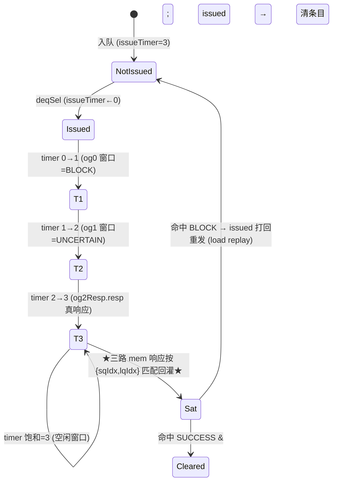

# IssueQueueVlduVstu —— 向量访存发射队列(VlduVstu 变体)可读 SV 重写 ★向量+访存融合★

## 1. 这是什么

香山 V2R2(昆明湖)乱序后端「调度心脏」之一,也是 **「向量访存」融合变体**:它把
**向量调度**(参 VfdivVidiv)与**访存反馈**(参 StaMou/Ldu)两套机制揉到一条发射队列里。

本变体 **VlduVstu = VLDU(向量 load)+ VSTU(向量 store)**,功能单元在 FuType one-hot
里占 `bit31`(VLDU)/ `bit32`(VSTU)。它把等待发射的向量访存 uop 缓存在 16 条目阵列里,
唤醒就绪(且未被 blocked)后按年龄最老仲裁发射到单条向量访存流水。

设计源:`src/main/scala/xiangshan/backend/issue/{Entries,EntryBundles,EnqEntry,
OthersEntry,IssueQueue}.scala`,其中向量访存 IQ 是 **`class IssueQueueVecMemImp`**。
golden 对照:`EntriesVlduVstu.sv`(叶子 `EnqEntryVecMem_2`(入队)/ `OthersEntryVecMem_14`
(simp,转移源)/ `OthersEntryVecMem_16`(comp,终端)/ `EnqPolicy_14`(转移策略))。

```
numEntries=16 / numEnq=2 / numSimp=2 / numComp=12 / numDeq=1
numRegSrc=5 (vs1/vs2/vd/v0/vl) / numWakeupFromWB=16 / 无 IQ 唤醒
fuType: VLDU=31 / VSTU=32 / psrc 7 位 / pdest 8 位 / sqIdx 6 位 / lqIdx 7 位
```

它在向量样板 VfdivVidiv 之上叠加了**访存三件套**:`blocked`(vleff 阻塞)、`vecMem`
(sqIdx/lqIdx/numLsElem)、**三路按 {sqIdx,lqIdx} 匹配的 mem 响应回灌**。本文重点讲这些
访存增量,以及一个隐蔽但致命的功能坑——**deqSuccess 必须由 issued 门控**。

## 2. 重写边界:在「条目阵列」层重写

与标量访存(StaMou/Ldu 在 IQ 顶层重写、Entries 当黑盒)不同,向量类延续 VfdivVidiv 的
做法,在**条目阵列(Entries)层**重写,把唤醒/ignoreOldVd/blocked/mem 响应折算真正写进
可读核,只把 `EnqPolicy_14`(转移选择)留作 golden 黑盒。

- **单条目核** `rtl/backend/IqEntryVlduVstu.sv`(`xs_iq_entry_vlduvstu`):向量访存「唤醒-
  选择」最小单元,参数 `IS_ENQ/IS_TRANS` 选 enq/simp/comp 三类条目。
- **阵列核** `rtl/backend/EntriesVlduVstu.sv`(`xs_EntriesVlduVstu_core`):例化 16 个
  单条目 + 转移策略(simp→comp)+ 年龄最老选择 + **issueResp 折算(og 窗口 + mem 回灌)**。
- **类型包** `rtl/backend/iq_vlduvstu_pkg.sv`:5 源 `src_status_t`、`status_t`(含 `blocked`/
  `vec_mem`)、向量访存全集 `vpu_t`、`payload_t`、`mem_resp_t`。

## 3. 文件清单

| 文件 | 角色 |
|------|------|
| `rtl/backend/iq_vlduvstu_pkg.sv` | 类型/参数包(5 源、blocked、vecMem、mem_resp、WB 三组边界) |
| `rtl/backend/IqEntryVlduVstu.sv` | 单条目核(向量唤醒 + ignoreOldVd + blocked 重算) |
| `rtl/backend/EntriesVlduVstu.sv` | 阵列核(转移策略 + 年龄 mux + ★issueResp 折算★) |
| `rtl/backend/EntriesVlduVstu_wrapper.sv` | flat↔struct glue(双例化 UT/FM 用) |
| `verif/ut/IssueQueueVlduVstu/{entries_tb.sv,entries_variant_xs.sv,Makefile}` | 双例化 UT + FM |

## 4. 结构图

```mermaid
flowchart TB
  ENQ["enq ×2 (向量访存 uop, entry_t)"] --> ARR
  subgraph ARR["xs_EntriesVlduVstu_core (条目阵列, 可读核)"]
    direction TB
    E0["enq 条目 ×2 (IS_ENQ, 带 enqDelay)"]
    E1["simp 条目 ×2 (IS_TRANS, 转移源)"]
    E2["comp 条目 ×12 (终端)"]
    E0 -- "EnqPolicy_14 (黑盒)<br/>simp→comp 提级" --> E1 --> E2
  end
  WB["WB 唤醒 ×16 (vec/v0/vl 三组, 无 IQ 唤醒)"] --> ARR
  WBD["WB 延迟唤醒 ×16 (enqDelay)"] --> ARR
  VL["vl_info: vlFromInt/Vf 的 {isZero,isVlmax}"] --> ARR
  LQP["lqDeqPtr (LoadQueue 出队指针)"] --> ARR
  OG["og0/og1/og2 Resp (timer 0/1/2 窗口)"] --> ARR
  MEM["★三路 mem 响应 (vecLd.resp / slowResp / finalIssueResp)<br/>按 {sqIdx,lqIdx} 匹配 (timer 饱和窗口)★"] --> ARR
  ARR -->|valid/issued/canIssue/fuType/dataSources| AGG["阵列状态汇聚"]
  SEL["enq/simp/comp Oldest Sel (上层 IQ 给)"] --> MUX
  ARR -->|ety_entry (各条目读出)| MUX
  MUX["三级年龄 mux (numDeq=1)<br/>comp > simp > enq"] --> DEQ["o_deq_entry → 向量访存流水"]
```

每个 enq/simp/comp 条目内部都是一个 `xs_iq_entry_vlduvstu` 实例;阵列核做条目间转移、
年龄选择、以及**两种来源的 issueResp 折算**。

## 5. 唤醒-选择数据流(向量唤醒 + blocked 门控)

```mermaid
flowchart LR
  subgraph WB16["WB 唤醒 ×16 (按目的写使能分三组)"]
    direction TB
    G1["WB[0..5] vecWen → src0/1/2 (vs1/vs2/vd)<br/>门控 srcType[2]"]
    G2["WB[6..11] v0Wen → src3 (v0 掩码)<br/>门控 srcType[3]"]
    G3["WB[12..15] vlWen → src4 (vl)<br/>门控 srcType[2]"]
  end
  WB16 -->|pdest==psrc &amp; wen &amp; type_bit &amp; valid| RDY["对应源 srcState ← 就绪"]
  G3 -.->|src4 被 WB[12]/WB[13] 命中| IGV["ignoreOldVd 判定 (仅 src2)"]
  IGV -->|触发| VD["src2 就绪 / srcType=0 / dataSrc=IMM"]
  LQP["lqDeqPtr"] --> BLK["★ blocked 重算<br/>(lqIdx != lqDeqPtr) &amp; isVleff ★"]
  RDY --> CANI["canIssue = valid &amp; 全5源就绪<br/>&amp; ~issued &amp; <b>~blocked</b> &amp; ~flushed"]
  VD --> CANI
  BLK --> CANI
  CANI --> OLD["年龄最老选择"] --> DEQ["deqSel → issued"]
```

**关键:** canIssue 比纯向量变体多一个 `& ~blocked` 门控(`IqEntryVlduVstu.sv:325-326`)。

## 6. issueTimer → 响应(og 窗口 + mem 回灌融合时序)



## 7. 可读核讲解(对照代码)

### 7.1 向量唤醒匹配:按源分三组(`IqEntryVlduVstu.sv:107-134`)

唤醒本质是 `pdest==psrc & wen & srcType门控位 & valid`,不同源用不同组/门控位/写使能含义:

```
wb_hit(w,s,type_bit) = ({1'b0,s.psrc}==w.pdest) & type_bit & w.wen & w.valid  // psrc 零扩到 8 位

src0/1/2 (vs1/vs2/vd) → group_hit(WB[0..5],  srcType[2], vecWen)
src3     (v0 掩码)    → group_hit(WB[6..11], srcType[3], v0Wen)
src4     (vl 长度)    → group_hit(WB[12..15],srcType[2], vlWen)
```

与 VfdivVidiv 逐字同构(vl 源门控用 bit2 但写使能看 vlWen)。

### 7.2 ignoreOldVd(`IqEntryVlduVstu.sv:144-158`)

与向量样板逐字一致:src4(vl)被 WB[12](Int 来源)/WB[13](Vf 来源)命中,且 vl 满
(vlmax)整写覆盖、或 tail agnostic 时,旧 vd(src2)无意义,直接置就绪、srcType 清 0、
dataSrc=IMM。这是向量调度核心,访存变体原样复用。

### 7.3 ★ blocked 重算(向量访存专属)★(`IqEntryVlduVstu.sv:167-173`)

```
blocked_update = ({status.vec_mem.lqIdx} != {lqDeqPtr}) & vpu.is_vleff
```

`vleff`(fault-only-first load)必须在它成为 LoadQueue 队头(`lqIdx==lqDeqPtr`)前**阻塞**,
以保证按序处理可能的访存异常;队头推进到它时(相等)解除阻塞。注意 golden 用的是
**状态侧 `vec_mem.lqIdx`**(而非 `payload.lqIdx`),每拍随 `lqDeqPtr` 重算后写回
`entry_update.status.blocked`(`:221`)。canIssue 据此门控。

### 7.4 ★ issueResp 折算:og 窗口 + 三路 mem 回灌 ★(`EntriesVlduVstu.sv:128-161`)

这是本变体最核心的阵列逻辑。响应来源按 `issueTimer` 二选一:

```
timer==0 → valid=og0resp_valid, resp=BLOCK
timer==1 → valid=og1resp_valid, resp=UNCERTAIN
timer==2 → valid=og2resp_valid, resp=og2resp_resp
timer==3 (饱和空闲窗口) → 三路 mem 响应按 {sqIdx,lqIdx} 与本条目匹配:
    valid = hit0 | hit1 | hit2
    resp  = (hit0?vecLd.resp:0) | (hit1?slow.resp:0) | (hit2?final.resp:0)
```

匹配函数(`:128-132`)用条目 **payload 的 sqIdx/lqIdx**:

```
mem_hit(r,e) = r.valid
  & ({r.sqIdx} == {e.payload.sqIdx})
  & ({r.lqIdx} == {e.payload.lqIdx})
```

三路 = `vecLdIn.resp`(向量 load 发射响应)、`fromMem.slowResp`(慢响应)、
`vecLdIn.finalIssueResp`(最终发射响应)。**与 VfdivVidiv 的差异**:VfDiv 在 timer2 出 og2
真响应、timer3 给 0;本变体把真正的「成功/重发」结论**推迟到饱和窗口由按索引匹配的 mem
响应给出**——向量访存长延迟,执行端按 {sqIdx,lqIdx} 回灌,而非按固定 timer 窗口。

### 7.5 ★★ 致命坑:deqSuccess 必须由 issued 门控 ★★(`IqEntryVlduVstu.sv:180-191`)

```
deq_success = entry_reg.status.issued      // ★ 这个 issued 门控不能省 ★
            & issue_resp.valid & (issue_resp.resp == RESP_SUCCESS);
```

golden `common_clear = flushed | (issued & issueResp.valid & &resp)`。原因:mem 响应按
`{sqIdx,lqIdx}` 匹配,**可能命中一个尚未发射(issued=0)的条目**(同 sqIdx/lqIdx 的另一
uop)。若不用 `issued` 门控,这个未发射条目会被误判 deqSuccess 而被清空——直接丢指令。
只有**真正已发射**的条目收到 SUCCESS 才允许清空。这是访存按索引回灌相对标量(按 timer
窗口、天然只对已发射条目)新引入的隐患,UT 随机激励能把它打出来。

### 7.6 转移策略 / 年龄选择(`EntriesVlduVstu.sv:163-423`)

转移策略(simp→comp)、三级年龄 mux(comp>simp>enq,numDeq=1)与 VfdivVidiv 同骨架,
仅维度 8→14 / 6→12。仍踩同一个**位宽坑**(`:211-212`):统计空 comp 数用 `+= !ety_valid`
(逻辑非单比特),不能用 `~`(定宽取反在 32 位加法上下文会下溢)。

## 8. 变体特色总览(VlduVstu vs VfdivVidiv)

| 维度 | VfdivVidiv(向量样板) | **VlduVstu(向量+访存)** |
|---|---|---|
| numEntries / Comp | 10 / 6 | **16 / 12** |
| fuType 位 | 22(VFDIV)/26(VIDIV) | **31(VLDU)/32(VSTU)** |
| status 额外字段 | 无 | **blocked + vecMem(sqIdx/lqIdx/numLsElem)** |
| canIssue 门控 | valid & rdy & ~issued & ~flushed | **+ & ~blocked** |
| blocked 重算输入 | 无 | **lqDeqPtr(每拍 lqIdx vs lqDeqPtr & isVleff)** |
| 真响应来源 | timer2 出 og2、timer3 给 0 | **timer3 饱和窗口三路 mem 按 {sqIdx,lqIdx} 回灌** |
| deqSuccess | issueResp.valid & SUCCESS | **+ issued 门控(防误清未发射条目)★** |
| payload | vpu 子集 + uopIdx | **向量访存全集(vmask/nf/veew/isVleff/lastUop/lqIdx/sqIdx)** |

## 9. X 与位宽纪律

- 唤醒/ignoreOldVd/blocked 纯组合;全源就绪用 `&` 归约;状态全在 `entry_reg`。
- oldest / Mux1H 用 `sel[i] ? entry[i] : 0` OR 累加,sel=0 不引 X。
- issueResp 折算用 `if/else` 选 timer 窗口,饱和窗口三路命中用 `h?resp:0` OR 合并。
- 空 comp 统计用 `!`(单比特)而非 `~`(定宽),避免 32 位加法下溢。
- deqSuccess 显式带 `issued` 门控,逐字对照 golden `common_clear`。

## 10. 验证结果

### 10.1 双例化 UT(条目阵列级:golden vs 可读核 wrapper)

`entries_tb.sv` 同时例化 golden `EntriesVlduVstu`(`u_g`)与可读核 wrapper
`EntriesVlduVstu_xs`(`u_i`,内含 `xs_EntriesVlduVstu_core` + 黑盒 `EnqPolicy_14`),每拍
随机激励全部输入(16 路 WB + 延迟唤醒、vl_info、og0/1/2、三路 mem 响应、lqDeqPtr、
转移选择、flush、背压),`#1` 后比对全部输出(`!$isunknown(g) && g!==i`)。入队 srcType
偏置 isVec/isV0,并构造 sqIdx/lqIdx 命中以覆盖 mem 回灌与 deqSuccess 门控坑。
`+define+SYNTHESIS`、`+vcs+initreg+0` 上电归零。

| seed | checks | errors |
|------|--------|--------|
| 1  | 200000 | **0** |
| 7  | 200000 | **0** |
| 42 | 200000 | **0** |

三种子各 200000 拍 `errors=0` / `TEST PASSED`。

### 10.2 形式等价(Formality)

`make fm`:ref = golden `EntriesVlduVstu` + 全部黑盒,impl = 可读核 wrapper + 同一批黑盒。

```
FM_RESULT: Verification SUCCEEDED for EntriesVlduVstu
Passing compare points  6385
Failing compare points  0
Unmatched reference(implementation) compare points  0(0)
Matched primary inputs, black-box outputs  1081
```

6385 个比对点全 passing,0 unmatched、0 failing——真实全等价,非降级通过。

### 10.3 套壳闸门

核与 pkg 代码区(去注释)对 `_GEN_ / _T_[0-9] / _REG_[0-9] / RANDOMIZE` 全 0。核里用
struct(`entry_t/status_t/src_status_t/vec_mem_t/vpu_t/payload_t/mem_resp_t/wk_wb_t/
vl_info_t/deq_resp_t`)、enum(`src_state_e/data_source_e/resp_type_e`)、function
(`wb_hit/group_hit/mem_hit`)、genvar(`g_entry`)、`always_comb` Mux1H + `for` 展开表达
意图,非套壳。

## 11. 复跑

```
cd verif/ut/IssueQueueVlduVstu
make compile
make run SEED=1      # 同理 SEED=7 / 42
make fm
```

许可证 DOWN 时先 `lmstat -a` 检查,必要时 `lmgrd` 起 license server。
