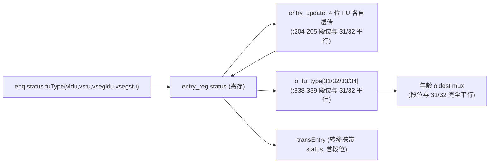

# IssueQueueVlduVstuVseglduVsegstu —— 向量+段访存发射队列可读 SV 重写

## 1. 这是什么

香山 V2R2(昆明湖)乱序后端「调度心脏」之一,是在 **VlduVstu(向量访存)** 之上增加
**段访存(segment load/store)** 的变体。

本变体 **VlduVstuVseglduVsegstu** = 4 种功能单元同挂一条向量访存发射流水:

| FuType 位 | 功能单元 | 含义 |
|---|---|---|
| `bit31` | VLDU    | 向量 load |
| `bit32` | VSTU    | 向量 store |
| `bit33` | VSEGLDU | ★ 段 load(本变体新增)★ |
| `bit34` | VSEGSTU | ★ 段 store(本变体新增)★ |

它从 **VlduVstu** 派生:5 源唤醒、ignoreOldVd、blocked(vleff 阻塞)、vecMem、三路 mem
响应按 {sqIdx,lqIdx} 回灌、deqSuccess 须 issued 门控——**全部机制原样继承**。本变体相对
VlduVstu 的**唯一差异**就是 fuType one-hot 多出 33/34 两位(纯随条目透传)。

设计源:`src/main/scala/xiangshan/backend/issue/{Entries,EntryBundles,EnqEntry,
OthersEntry,IssueQueue}.scala`,向量访存 IQ = `class IssueQueueVecMemImp`。golden 对照:
`EntriesVlduVstuVseglduVsegstu.sv`(叶子 `EnqEntryVecMem` / `OthersEntryVecMem`(simp/comp)/
`EnqPolicy_14`)。

```
numEntries=16 / numEnq=2 / numSimp=2 / numComp=12 / numDeq=1
numRegSrc=5 (vs1/vs2/vd/v0/vl) / numWakeupFromWB=16 / 无 IQ 唤醒
fuType: VLDU=31 / VSTU=32 / VSEGLDU=33 / VSEGSTU=34
```

## 2. 为何段访存几乎零增量

段访存(unit-stride / strided / indexed **segment** load/store)在 IQ **调度层面**与普通
向量访存几乎无差异:

- 段数 `nf` 早已在 `vpu_t.nf`(VlduVstu 就有);
- 访存指针 `sqIdx/lqIdx/numLsElem`(`vecMem`)早已在状态里;
- 段访存与普通向量访存**共用同一条发射流水、同一套 mem 反馈机制**(三路按 {sqIdx,lqIdx}
  匹配)。

因此在发射队列里,段访存与向量访存的**唯一可见差异**就是 FuType one-hot 多两位标识。它们在
条目里随 `status` 透传(入队→转移→deqEntry 输出),在年龄选择 mux 里与 31/32 位**完全平行**。

## 3. 重写边界 / 文件清单

延续向量访存做法,在条目阵列层重写;`EnqPolicy_14` 作 golden 黑盒。

| 文件 | 角色 |
|------|------|
| `rtl/backend/iq_vlduvstuseg_pkg.sv` | 类型/参数包(在 VlduVstu 包上加 FU_VSEGLDU=33 / FU_VSEGSTU=34 + status 两字段) |
| `rtl/backend/IqEntryVlduVstuSeg.sv` | 单条目核 `xs_iq_entry_vlduvstuseg`(= VlduVstu 单条目 + 两位 FU 透传) |
| `rtl/backend/EntriesVlduVstuSeg.sv` | 阵列核 `xs_EntriesVlduVstuSeg_core`(= VlduVstu 阵列,逻辑逐字一致) |
| `rtl/backend/EntriesVlduVstuVseglduVsegstu_wrapper.sv` | flat↔struct glue |
| `verif/ut/IssueQueueVlduVstuVseglduVsegstu/{entries_tb.sv,entries_variant_xs.sv,Makefile}` | 双例化 UT + FM |

> 注意命名:RTL 文件用简称 `…Seg`,而 golden/UT 目录用全称 `…VlduVstuVseglduVsegstu`。

## 4. 结构图

```mermaid
flowchart TB
  ENQ["enq ×2 (向量/段 访存 uop)"] --> ARR
  subgraph ARR["xs_EntriesVlduVstuSeg_core (条目阵列)"]
    direction TB
    E0["enq 条目 ×2 (IS_ENQ)"]
    E1["simp 条目 ×2 (IS_TRANS)"]
    E2["comp 条目 ×12 (终端)"]
    E0 -- "EnqPolicy_14 (黑盒) simp→comp" --> E1 --> E2
  end
  WB["WB 唤醒 ×16 (vec/v0/vl 三组)"] --> ARR
  VL["vl_info"] --> ARR
  LQP["lqDeqPtr → blocked 重算"] --> ARR
  OG["og0/og1/og2 Resp (timer 0/1/2)"] --> ARR
  MEM["三路 mem 响应 (按 {sqIdx,lqIdx} 匹配, timer 饱和窗口)"] --> ARR
  ARR -->|valid/issued/canIssue/<b>fuType(含 33/34)</b>/dataSources| AGG
  ARR --> MUX["三级年龄 mux (numDeq=1, comp>simp>enq)"] --> DEQ["o_deq_entry → 向量/段访存流水"]
```

## 5. fuType 透传(段访存的唯一增量)



## 6. 可读核讲解(对照代码)

向量唤醒匹配、ignoreOldVd、blocked 重算、issueResp 折算(og 窗口 + 三路 mem 回灌)、
deqSuccess 须 issued 门控、转移策略、年龄选择——**全部与 VlduVstu 逐字一致**,详见
`IssueQueueVlduVstu.md` §5–§7。本节只列段访存增量的代码落点。

### 6.1 status 多两位 FU(`iq_vlduvstuseg_pkg.sv:150-162`)

```
status_t {
  ... rob_flag/rob_value ...
  fu_type_vldu;     // FuType[31]
  fu_type_vstu;     // FuType[32]
  fu_type_vsegldu;  // FuType[33] ★段 load,本变体新增★
  fu_type_vsegstu;  // FuType[34] ★段 store,本变体新增★
  src[5]; blocked; issued; issue_timer; vec_mem;   // 其余与 VlduVstu 相同
}
```

### 6.2 entry_update 透传(`IqEntryVlduVstuSeg.sv:204-205`)

```
entry_update.status.fu_type_vsegldu = entry_reg.status.fu_type_vsegldu; // ★段 load 透传★
entry_update.status.fu_type_vsegstu = entry_reg.status.fu_type_vsegstu; // ★段 store 透传★
```

与 `fu_type_vldu/vstu` 完全并列,无任何特殊逻辑。

### 6.3 fuType 输出(`IqEntryVlduVstuSeg.sv:338-339`)

```
o_fu_type[FU_VLDU]    = entry_reg.status.fu_type_vldu;
o_fu_type[FU_VSTU]    = entry_reg.status.fu_type_vstu;
o_fu_type[FU_VSEGLDU] = entry_reg.status.fu_type_vsegldu; // ★段 load★
o_fu_type[FU_VSEGSTU] = entry_reg.status.fu_type_vsegstu; // ★段 store★
```

阵列核 `EntriesVlduVstuSeg.sv`(`xs_EntriesVlduVstuSeg_core`)与 VlduVstu 阵列核逐行相同
(同样例化 `EnqPolicy_14` 黑盒、同样的转移/年龄 mux/mem 响应折算),仅 `fu_type` 端口宽度
由透传更宽的 `status_t` 自动带过 33/34 位。

## 7. 变体特色总览(VlduVstuSeg vs VlduVstu)

| 维度 | VlduVstu | **VlduVstuVseglduVsegstu** |
|---|---|---|
| fuType 位 | 31/32 | **31/32 + 33(VSEGLDU)/34(VSEGSTU)** |
| status FU 字段 | 2 | **4** |
| blocked / vecMem / mem 回灌 / deqSuccess 门控 | 有 | **完全相同(继承)** |
| 唤醒 / ignoreOldVd / 转移 / 年龄选择 | —— | **逐字一致** |
| 段数 nf | vpu.nf(已有) | vpu.nf(共用,无新增) |

## 8. X 与位宽纪律

与 VlduVstu 完全一致:唤醒/ignoreOldVd/blocked 纯组合;oldest/Mux1H 用 `sel?entry:0` OR
累加;issueResp 饱和窗口三路命中 OR 合并;deqSuccess 带 issued 门控;空 comp 统计用 `!`
单比特避免 32 位下溢。段 FU 两位只是 `status_t` 多两个 `logic` 字段,无额外 X 风险。

## 9. 验证结果

### 9.1 双例化 UT

`entries_tb.sv` 同时例化 golden `EntriesVlduVstuVseglduVsegstu`(`u_g`)与可读核 wrapper
(`u_i`),每拍随机激励全部输入(16 路 WB + 延迟唤醒、vl_info、og0/1/2、三路 mem 响应、
lqDeqPtr、转移选择、flush、背压),并随机置 fuType 的 33/34 位以覆盖段访存透传路径,`#1`
后比对全部输出。`+define+SYNTHESIS`、`+vcs+initreg+0`。

| seed | checks | errors |
|------|--------|--------|
| 1  | 200000 | **0** |
| 7  | 200000 | **0** |
| 42 | 200000 | **0** |

三种子各 200000 拍 `errors=0` / `TEST PASSED`。

### 9.2 形式等价(Formality)

`make fm`:

```
FM_RESULT: Verification SUCCEEDED for EntriesVlduVstuVseglduVsegstu
Passing compare points  6419
Failing compare points  0
Unmatched reference(implementation) compare points  0(0)
Matched primary inputs, black-box outputs  1085
```

6419 个比对点全 passing(比 VlduVstu 的 6385 多 34 个,正对应段 FU 两位透传产生的额外
比对点),0 unmatched、0 failing——真实全等价。

### 9.3 套壳闸门

核与 pkg 代码区(去注释)对 `_GEN_ / _T_[0-9] / _REG_[0-9] / RANDOMIZE` 全 0。复用
VlduVstu 的全套 struct/enum/function/genvar 结构,仅 `status_t` 多两位 FU,非套壳。

## 10. 复跑

```
cd verif/ut/IssueQueueVlduVstuVseglduVsegstu
make compile
make run SEED=1      # 同理 SEED=7 / 42
make fm
```

许可证 DOWN 时先 `lmstat -a` 检查,必要时 `lmgrd` 起 license server。
