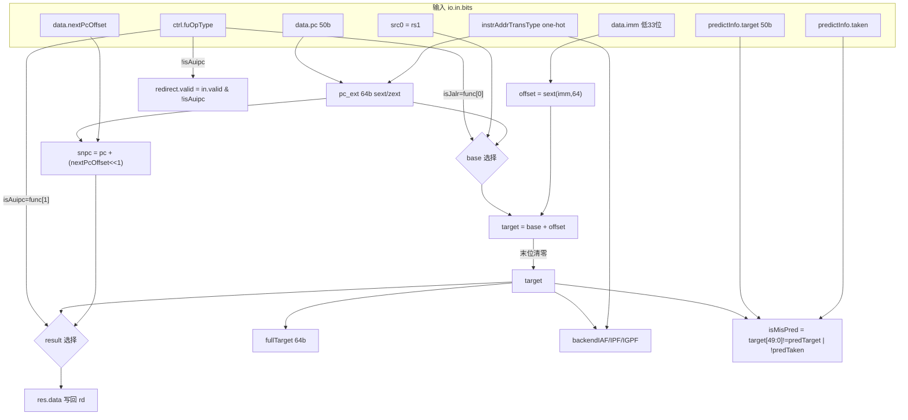

# JumpUnit —— 无条件跳转执行单元 (jal / jalr / auipc)

> 香山 V2R2(昆明湖)后端整数执行簇里的 **0 延迟跳转单元**。
> 设计源: `fu/wrapper/JumpUnit.scala`(class JumpUnit)、`fu/Jump.scala`(JumpDataModule)、
> `package.scala`(object JumpOpType)。
> 可读核: `rtl/backend/JumpUnit.sv` + `rtl/backend/jumpunit_pkg.sv`。

## 1. 职责

处理三种"PC 类"指令, 当拍完成(纯组合):

| 指令  | fuOpType[1:0] | 写回 rd (res.data) | 跳转目标 (fullTarget) | 是否重定向 |
|-------|---------------|--------------------|------------------------|-----------|
| jal   | `00`          | snpc(返回地址)     | pc + sext(imm)         | 是        |
| jalr  | `01`          | snpc(返回地址)     | rs1 + sext(imm), 末位清零 | 是     |
| auipc | `10`          | pc + sext(imm)     | (不跳转)               | 否        |

- `func[0] = isJalr`(基址用 rs1 还是 pc), `func[1] = isAuipc`。
- `snpc`(static next pc)= `pc + (nextPcOffset << 1)`, 即顺序下一条指令地址, jal/jalr
  写回 rd 的链接地址就是它。

## 2. 与 BranchUnit 的关键区别: 恒重定向校验

条件分支只在预测错误时重定向; 而 jal/jalr 的目标(尤其 jalr 依赖运行期 rs1)在前端只能
**预测**, 后端必须用真实计算的目标 **校验**, 所以:

```
redirect.valid = in.valid & !isAuipc          // 除 auipc 外恒重定向
cfiUpdate.taken     = 1                        // 跳转必定 taken
cfiUpdate.predTaken = 1
cfiUpdate.isMisPred = (target[49:0] != predictInfo.target) | !predictInfo.taken
```

即:即便每条都送重定向, 只有 `isMisPred=1`(目标不符或前端没预测 taken)才真正算预测
错误。auipc 不是控制流转移, 不重定向。

## 3. 数据流



## 4. 关键设计点

- **核心计算 `jumpCalc`(对应 JumpDataModule)** 一次算出 `{result, target, isAuipc}`:
  - `offset = sext(imm[32:0], 64)`(imm-U 需 32 位 + 1 符号位)。
  - `target = (isJalr ? rs1 : pc) + offset`, 再 **末位清零**(RISC-V jalr 规范:
    目标地址最低位置 0)。
  - `snpc  = pc + (nextPcOffset << 1)`。
  - `result = isAuipc ? target : snpc`(auipc 把"pc+imm"当结果, 其余写链接地址)。

- **pc 扩展**: 同 BranchUnit, 仅 Sv39/Sv48 一阶段按 `pc[49]` 符号扩展, 其余补 0;
  这里直接扩到 64 位(JumpDataModule 的 pc 端口是 64 位)。

- **目标合法性检查** `backendIAF/IPF/IGPF`: 与 BranchUnit 完全同语义(bare 高位非 0、
  Sv39/48 非 canonical、Sv39x4/48x4 G-stage 高位非 0)。

- **X 安全**: 全部三元 mux / 算术加法, 无优先级链; `jmp_type_e` 枚举仅作可读标注。

## 5. 接口(可读核 `xs_JumpUnit_core`)

端口名沿用 golden 扁平名, 仅声明本单元产生的字段; 其余常量字段(含 `cfiUpdate.taken`/
`predTaken` 恒 1)由 `JumpUnit_wrapper.sv` 端口适配层置 golden 常量。比 BranchUnit 多
出 `io_in_bits_ctrl_rfWen`(jal/jalr/auipc 都写 rd)与 `predictInfo_target`(目标校验)。

## 6. 验证结果

- **结构闸门**: `typedef enum`=1(jmp_type_e), `typedef struct`=2(addr_trans_e/jump_calc_t),
  `function automatic`=3(jumpIsJalr/jumpIsAuipc/jumpCalc); 生成痕迹 grep = 0。
- **UT**(golden `JumpUnit` vs `JumpUnit_xs` 双例化逐拍比对全部 100 个输出, 跳 don't-care):
  - seed 1 / 7 / 42 均 `checks=200000 errors=0` → TEST PASSED。
  - 激励覆盖: fuOpType 全随机(覆盖 jal/jalr/auipc 及非法值)、src/pc 随机、imm 随机、
    翻译模式 one-hot、predictInfo.target/taken 随机(覆盖 isMisPred 两个分量)。
- **FM**(`make fm`): `FM_RESULT: Verification SUCCEEDED`,
  841 compare points matched, 0 unmatched(JumpDataModule 作两侧共享黑盒)。
  非空判等, 证明可读核与 golden 逐位等价。
