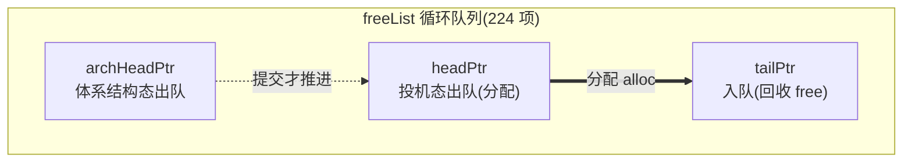
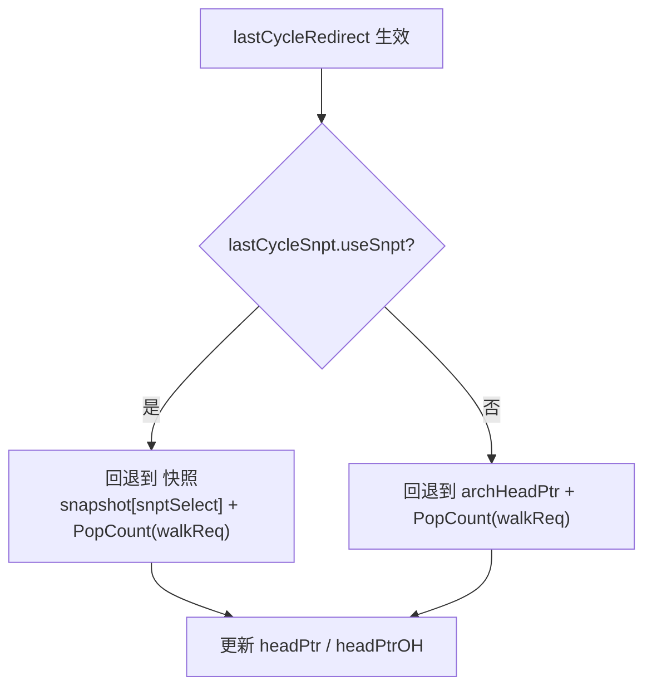

# MEFreeList —— 重命名「Move-Elimination 空闲列表」(整数物理寄存器分配/回收)

> 可读核：`rtl/backend/MEFreeList.sv`（`xs_MEFreeList_core`）+ `rtl/backend/mefreelist_pkg.sv`
> 包装层：`rtl/backend/MEFreeList_wrapper.sv`（golden 同名 `MEFreeList`，扁平端口 → 核）
> 设计源：`src/main/scala/xiangshan/backend/rename/freelist/{BaseFreeList,MEFreeList}.scala`
> golden：`golden/chisel-rtl/MEFreeList.sv`（4961 行 / 67 端口；整数物理寄存器池 size=224）

## 1. 它在后端的位置

后端流水：取指 → 译码 → **重命名(Rename)** → 派遣 → 发射 → 执行 → 写回 → 提交(ROB/RAB)。

重命名要消除 WAR/WAW 假相关：把逻辑寄存器映射到一个**新的物理寄存器**。这需要一个
「空闲物理寄存器池」。香山按寄存器类型分了几条独立空闲列表：

| 实例 | 类型 | 空闲列表实现 | 说明 |
|------|------|-------------|------|
| **intFreeList** | **整数** | **`MEFreeList`** | **本工程重写：支持 move-elimination** |
| fpFreeList | 浮点 Reg_F | `StdFreeList` | 见 [StdFreeList.md](StdFreeList.md) |
| vecFreeList | 向量 Reg_V | `StdFreeList` | |
| v0/vlFreeList | Reg_V0/Vl | `StdFreeList` | |

`MEFreeList` 与 `StdFreeList` 继承同一 `BaseFreeList`，分配/回退主逻辑一致。**唯一的语义增量
是 move-elimination**：一条 `mv rd, rs`（move）指令可被消除——重命名时让 `rd` 直接复用 `rs`
的物理寄存器，不分配新物理寄存器。因此提交时，被消除的 move **不推进体系结构 head**
（它没占用新物理寄存器）。这就是 “ME”（Move Elimination）的来历。

> 注：MEFreeList 本身只负责"空闲池的指针/计数"；引用计数(RefCounter，判断某物理寄存器
> 是否还被多条逻辑寄存器共享、能否回收)在外部模块完成，回收信号经 `io.freeReq/freePhyReg`
> 送进来。本核不含引用计数。

## 2. 核心数据结构：循环队列 + 三个指针

空闲池 `freeList[224]` 是一个**循环队列**，三个指针(均为 `fl_ptr_t = {flag, value}`，
`value` 8 bit，`flag` 区分绕过几圈)：



- **headPtr**：投机态分配指针(出队端)。每拍按"实际分配个数"前移；分配的物理寄存器号
  从 `freeList[headPtr ... headPtr+k]` 取出。
- **archHeadPtr**：体系结构态分配指针。仅在 commit 拍按"提交且写整数寄存器且**非 move**"的
  指令数前移，代表"真正用掉、不会再回退"的分配进度。redirect 后 head 可回退到它。
- **tailPtr**：回收指针(入队端)。按本拍 `freeReq` 个数前移；回收的物理寄存器号写入
  `freeList[tailPtr ... tailPtr+m]`。

空闲寄存器数 = `distance(tailPtr, headPtr)`。`SIZE=224` 不是 2 的幂，故指针加法要手动
检测越界回绕、翻转 flag（见 `mefreelist_pkg::ptr_add`）。

### 初值（与 StdFreeList 的差异点之一）

- `freeList[i] = i+1`（i = 0..222），`freeList[223] = 0`。
- `headPtr = (flag=0, value=0)`，`archHeadPtr = (flag=0, value=0)`。
- `tailPtr = (flag=0, value=223)`（落在最后一格）。

含义：x0..x31 都映射到物理寄存器 0（RISC-V 的 x0 恒零，所有逻辑零寄存器共用物理 0）。
所以**初始时物理寄存器 {1,2,...,223} 都空闲**，物理 0 被"占用"——把 0 放到队尾那一格、
让 tailPtr 指向它，使初始空闲数 = `distance(tailPtr, headPtr) = 223 = size-1`，恰好排除掉
被占用的物理 0。

## 3. 分配(alloc)：headPtrOH 循环移位 + Mux1H

为改善时序，`headPtr` 同时维护一个 one-hot 冗余表示 `headPtrOH`。每拍把它循环左移
`0..RenameWidth`(=6) 步，得到 7 个候选 one-hot；对每个 one-hot 做 `Mux1H(freeList)` 选出
对应位置的空闲物理寄存器，得到 7 个候选 `phyRegCandidates[0..6]`。

第 `i` 个分配口取第 `(前 i 口 allocateReq 的置位数)` 个候选：

```
io_allocatePhyReg[i] = phyRegCandidates[ popcount(allocateReq[0..i-1]) ]
```

这样多个口在同一拍按各自的"前缀分配偏移"各取一个不同的空闲寄存器，无需变量下标译码。

## 4. 回收(free)：写回 freeList + 推进 tailPtr

第 `i` 个回收口的写入位置 = `tailPtr + (前 i 口 freeReq 的置位数)`。本核对每个条目 E 做
**常量地址译码**（"若某口要写且其写入下标 == E 则写入 E"），避免变量下标越界产生 X。

> **与 StdFreeList 的差异点之二**：StdFreeList 用 `lastTailPtr`（上拍 tail）做写入地址、
> 空闲计数用当前 tail；MEFreeList 直接用**当前 tailPtr** 做写入地址，空闲计数 `freeRegCnt`
> 用**下一拍 tailPtrNext**(= tailPtr + freeReq 数)。本核严格按 MEFreeList golden 实现。

## 5. 重定向 / 回滚(redirect / walk)

分支预测错误时分两拍打拍生效（`lastCycleRedirect = RegNext(RegNext(io.redirect))`）。回退目标：



- 若错误点之前打过快照(`useSnpt`)，head 回退到 `snapshot + 已 walk 数`；
- 否则回退到 `archHeadPtr + 已 walk 数`。
- 随后若 `io.walk`，按 `walkReq`（而非 `allocateReq`）逐条重放分配。

`SnapshotGenerator` 作为黑盒例化（golden 同名子模块），只复用其快照存储/选择。

## 6. 是否允许分配：canAllocate

```
freeRegCntReg = RegNext(freeRegCnt)        // 打一拍
io.canAllocate = (freeRegCntReg >= RenameWidth)   // 组合输出, golden: > 5
```

打一拍 + 只有空闲数 ≥ RenameWidth(=6) 才允许分配，保证"本拍回收的寄存器下一拍才可能被
分配"，使 free 路径可安全打拍。

> ⚠️ 实现坑：golden 是 `freeRegCntReg > 8'h5`，即 `>= 6 = >= RenameWidth`。首版误写成
> `> RenameWidth`（= `>= 7`）导致 canAllocate 提前判 0，引起 headPtr 推进偏差并级联失配。
> 已修正为 `>= RenameWidth`。

## 7. 体系结构 head 推进：move-elimination

```
archAlloc[i] = commitValid[i] & info[i].rfWen & !info[i].isMove
archHeadPtr += PopCount(archAlloc)   // 仅在 io.commit.isCommit 拍
```

被消除的 move（`isMove=1`）不占用新物理寄存器，故**不计入** archHead 推进——这是
MEFreeList 相对 StdFreeList（用 `fpWen`、无 `!isMove`）的核心语义差异。

## 8. 性能事件（空闲度四分位）

对 `freeRegCntReg` 分四档（边界 size/4=56、size/2=112、3·size/4=168），两级打拍输出，
匹配 golden 的 `io_perf_*_value`。

## 9. 关键参数（mefreelist_pkg）

| 参数 | 值 | 含义 |
|------|----|------|
| SIZE | 224 | 整数物理寄存器空闲池容量(非 2 的幂) |
| PHYREG_W | 8 | 物理寄存器号位宽 PhyRegIdxWidth |
| RENAME_WIDTH | 6 | 每拍重命名(分配)口数 |
| COMMIT_WIDTH | 6 | 每拍提交/回滚(回收)口数 RabCommitWidth |
| SNAPSHOT_NUM | 4 | 快照个数 RenameSnapshotNum |
| PTR_W | 8 | 指针 value 位宽 = clog2(224) |

## 10. 接口表（核 `xs_MEFreeList_core`，wrapper 拆成 golden 扁平端口）

| 信号 | 方向 | 含义 |
|------|------|------|
| io_redirect / io_walk | in | 重定向 / 回滚重放 |
| io_allocateReq[6] | in | 各口本拍是否要分配 |
| io_walkReq[6] | in | walk 期间各口的分配请求 |
| io_allocatePhyReg[6] | out | 各口分配到的物理寄存器号 |
| io_canAllocate | out | 空闲数足够，允许分配 |
| io_doAllocate | in | 上游确认本拍做分配 |
| io_freeReq[6] / io_freePhyReg[6] | in | 回收请求 + 回收的物理寄存器号 |
| io_commit_isCommit | in | 本拍是 commit |
| io_commit_commitValid[6] | in | 各口提交有效 |
| io_commit_info_rfWen[6] | in | 各口写整数寄存器 |
| io_commit_info_isMove[6] | in | 各口是被消除的 move |
| io_snpt_* | in | 快照端口(转发 SnapshotGenerator 黑盒) |
| io_perf_value[4] | out | 空闲度四分位性能事件 |

## 11. 验证结果

- **结构闸门**：`typedef struct packed` 1（pkg 内 `fl_ptr_t`）、`function automatic` 5、
  `for`/genvar 16；行数 338（golden 4961）；
  `grep -E "io_[a-z_]+_[0-9]+_[0-9]+|_REG_[0-9]|_GEN_|_T_[0-9]|RANDOMIZE"` = **0**。
- **UT**（golden vs 手写双例化，逐拍比对全部输出 + 内部 headPtr/archHeadPtr/tailPtr 层次探针，
  覆盖 alloc/free/commit 推进/redirect+walk 回滚/快照）：
  seed 1 / 7 / 42 各 **200000 拍 checks=200000 errors=0**。
- **FM**（golden `MEFreeList` vs 手写 wrapper→核，SnapshotGenerator 两侧同一黑盒）：
  `FM_RESULT: Verification SUCCEEDED`（`FM_MERGE_DUP=true`：headPtr/headPtrOH 同值冗余归并）。
