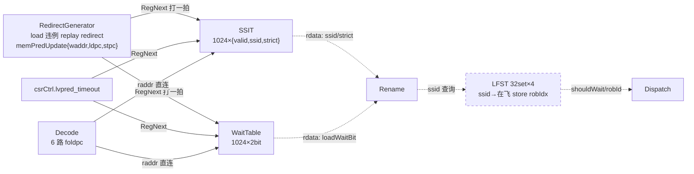

# MemCtrl —— 内存依赖预测(MDP)表的持有者与更新打拍级

| | |
|---|---|
| 手写 SV | `rtl/backend/MemCtrl_core.sv`(可读核 `xs_MemCtrl`)+ `MemCtrl_wrapper.sv`(golden 同名壳,例化 SSIT/WaitTable) |
| Scala 来源 | `xiangshan/backend/ctrlblock/MemCtrl.scala`;预测表本体 `xiangshan/mem/mdp/StoreSet.scala`(SSIT/LFST)、`xiangshan/mem/mdp/WaitTable.scala` |
| golden | `golden/chisel-rtl/MemCtrl.sv`(163 行,本 config 已被 firtool 深度裁剪,见 §5) |
| 依赖 | SSIT / WaitTable 子模块两侧读同一份 golden 源(纯寄存器逻辑,FM 两侧真 elaborate,非黑盒) |
| 验证 | UT seed 1/7/42 各 199992 checks errors=0;FM native strict SUCCEEDED(16634 点 / 0 failing / 0 unmatched / 0 unread) |

## 1. 架构定位:为什么需要内存依赖预测

乱序核允许 load 越过**地址未知的更老 store** 提前投机执行——这是访存性能的重要来源
(多数 load 与前面的 store 并不冲突)。但一旦冲突真的发生(store 写的地址恰好是 load
读过的地址),load 已经把**错的旧值**送给了后续指令,只能触发 **load 违例 redirect**:
从违例 load 处整条流水线冲刷重放,代价几十拍。

内存依赖预测(MDP, Memory Dependence Prediction)就是用历史违例记录学习
"哪些 load 将来还会冲突、该等谁",在 dispatch 之前主动让它等待,用小的等待代价
换掉大的 flush 代价。香山实现了两个经典预测器,由 MemCtrl 统一持有:

| 预测器 | 出处 | 粒度 | 内容 |
|---|---|---|---|
| **WaitTable** | Alpha 21264 | 粗:该 load 等**所有**更老 store | 1024 项 × 2bit,按 load 折叠 PC 索引 |
| **StoreSet (SSIT + LFST)** | Chrysos & Emer, ISCA'98 | 细:该 load 只等它历史上冲突过的**那批 store** | SSIT 1024 项(PC→store set 编号 ssid),LFST 32 set(ssid→最后一条在飞 store 的 robIdx) |

MemCtrl 位于 CtrlBlock 内。它自身**几乎没有逻辑**:真正的表都在 SSIT / WaitTable /
LFST 子模块里,MemCtrl 只做「更新路径打一拍 + 读端口直连」的胶合。

## 2. 数据流



> 虚线路径(读结果消费、LFST)在本 config 中被禁用,详见 §5。

工作闭环(设计意图,Scala 全貌):
1. **训练**:load 违例 redirect 时,RedirectGenerator 送来违例 load 与 store 的
   XOR 折叠 PC(`ldpc`/`stpc`,只在 `s1_isReplay && flushItself` 时有效)。
   SSIT 把这对 load/store 归入同一个 store set;WaitTable 给该 load PC 的计数器移入 1。
2. **预测**:decode 拍把每条指令的 foldpc 送 SSIT/WaitTable 读(同步读,rename 拍出数据);
   rename 拿到 loadWaitBit(粗)与 {valid,ssid,strict}(细)。
3. **执行等待**:dispatch 用 ssid 查 LFST——若该 store set 还有 store 在飞,
   load 记下它的 robIdx,等它发射后自己才能发射。store dispatch 时把自己登记进 LFST,
   发射后注销。

## 3. 关键机制

### 3.1 更新路径为什么打一拍(MemCtrl 的全部逻辑)

SSIT/WaitTable 的 Chisel 端口注释明确写着 *"RegNext should be added outside"*:
更新请求来自 RedirectGenerator,是一条**跨块长线**;而训练路径毫不着急——此刻流水线
正在为这次违例冲刷,晚一拍训练不损失任何东西。于是 MemCtrl 把
`memPredUpdate`(valid/waddr/ldpc/stpc)与 `csrCtrl.lvpred_timeout` 各打一拍再分发,
用零成本换长线时序。这就是可读核 `xs_MemCtrl` 的全部内容——**7 个无复位流水寄存器**:

| 可读核寄存器 | golden 对应 | 去向 |
|---|---|---|
| `ssit_update_REG_{valid,ldpc,stpc}` | `ssit_io_update_REG_*` | SSIT 更新口 |
| `waittable_update_REG_{valid,waddr}` | `waittable_io_update_REG_*` | WaitTable 更新口 |
| `{ssit,waittable}_csrCtrl_REG_lvpred_timeout` | 同名 | 两表的老化周期配置 |

### 3.2 索引方式:XOR 折叠 PC,无 tag 直接索引

两张表都是 1024 项、以 `XORFold(pc[VAddrBits-1:1], 10)` 为地址(`MemPredPCWidth=10`):
把 PC 有效位按 10 位一段逐段异或压缩。**无 tag**——别名冲突被接受,因为 MDP 只是
性能提示,预测错(多等/少等)不影响正确性,少等会由违例机制兜底再训练。

### 3.3 WaitTable:两次违例才置位的 2bit 移位计数

- 更新:`data[waddr] <= {data[waddr][0], 1'b1}`——移位插 1,第一次违例后 `01`,第二次 `11`。
- 读出:`loadWaitBit = data[raddr][1]`(`LWTUse2BitCounter=true` 取 bit1)——
  即**连续两次违例**才让 load 进入"等所有老 store"的保守模式,单次偶发不惩罚。
- CSR 修饰:`|| no_spec_load`(全部 load 保守)、`&& !lvpred_disable`(整体关断)。

### 3.4 SSIT:store set 合并规则(ISCA'98 四象限)

SSIT 每项 `{valid, ssid[4:0], strict}`,物理上拆成 `valid_array` + `data_array`
(两个 SyncDataModuleTemplate,各 2 个写口)。更新是**三拍小流水**:
s0 用违例的 ldpc/stpc **借用 decode 的读口 0/1** 发读(违例时前端反正在冲刷,
decode 不需要读口);s1 拿到双方现状(是否已有 set、旧 ssid);s2 按论文规则写回:

| load 已有 set | store 已有 set | 动作(ssid 分配 = `XORFold(pc,5)`,确定性哈希) |
|:---:|:---:|---|
| 否 | 否 | 双方分配同一个新 set:`min(fold(ldpc), fold(stpc))` |
| 是 | 否 | store 加入:写 `fold(ldpc)` |
| 否 | 是 | load 加入:写 `fold(stpc)` |
| 是 | 是 | 合并:双方都改写为 `min(loadSSID, storeSSID)`(winner);若二者**本来就同 set 还违例**(说明 set 内排序不够)→ 给 load 置 `strict`(等 set 内全部 store) |

两个写口若折叠到同一地址,store 侧写口让位(`wen=0`),避免同项双写。

### 3.5 周期性老化(防表污染)

程序相位变化后旧的依赖记录会造成无谓等待,所以两表都带自清零:
20 位 `resetCounter` 自增,`lvpred_timeout`(CSR,打拍后)选择 `resetCounter[19:10]`
中的某一位作为触发,即老化周期 2^(10+N) 拍可调。
- WaitTable:触发时**一拍全清**(普通寄存器堆,可以)。
- SSIT:SyncDataModule 没有全清端口 → `s_idle/s_flush` 两态状态机,
  `resetStepCounter` 逐项写 `valid=0`,1024 拍走完;复位后也从 `s_flush` 起步先清一遍表。

### 3.6 LFST:从"预测该等"到"等哪条 store"

SSIT 只说明 load 属于哪个 set;真正让 load 等待的是 LFST(Last Fetched Store Table,
32 set × 4 深):store dispatch 时按 ssid 登记 robIdx,发射后注销,redirect 时冲刷。
load dispatch 查 ssid:set 内仍有在飞 store → `shouldWait` + 返回其 robIdx。
同一 dispatch 包内的 store→load 相关也就地检测(`hitInDispatchBundle`)。

## 4. 与 golden / Chisel 的对应

- Chisel `MemCtrl` = 例化 ssit/waittable/lfst + `RegNext` 更新分发 + 读口直连,
  与可读核逐位对应(§3.1 表)。
- SSIT/WaitTable 未重写:纯寄存器逻辑、无厂商宏,UT/FM 两侧使用**同一份 golden 源**
  (`SSIT → SyncDataModuleTemplate__1024entry{,_1} → DataModule__64entry{,_16}`,
  WaitTable 为叶子),重写目标只是 MemCtrl 这层胶合。

## 5. 本 config 的裁剪形态(读 golden 前必知)

`CtrlBlock.scala` 中在连好 MDP 读结果之后**显式禁用了消费端**(Chisel last-connect 覆盖):

```scala
// disble mdp
dispatch.io.lfst.resp := 0.U.asTypeOf(...)
rename.io.waittable   := 0.U.asTypeOf(...)
rename.io.ssit        := 0.U.asTypeOf(...)
```

于是 firtool 死代码消除引发连锁裁剪,golden `MemCtrl.sv` 呈现为:
- **没有任何输出端口**——`ssit2Rename`/`waitTable2Rename` 无人消费;
- **LFST 整个消失**——resp 被钉 0 后其唯一输出无人用;
- SSIT 只剩 `io_raddr_0/1` 两个读口(被 §3.4 的更新流水借用,不能裁)、
  WaitTable 读口全无;`io_mdpFoldPcVecVld_2..5` 等端口一并消失。

即:**本 config 下预测表仍在照常训练与老化(1.6 万个 DFF 都活着),但预测结果不被消费**。
读 golden 时看到"只写不读"的表阵列不是 bug,而是消费端被钉零后的 DCE 残余形态。

## 6. 验证状态

UT seed 1/7/42 各 199992 checks errors=0(层次引用比对 7 个流水寄存器);
FM native strict SUCCEEDED:16634 点(全 DFF)/ 0 failing / 0 unmatched / 0 unread,
SSIT/WaitTable 两侧真 elaborate,无黑盒、无 dont_verify。
