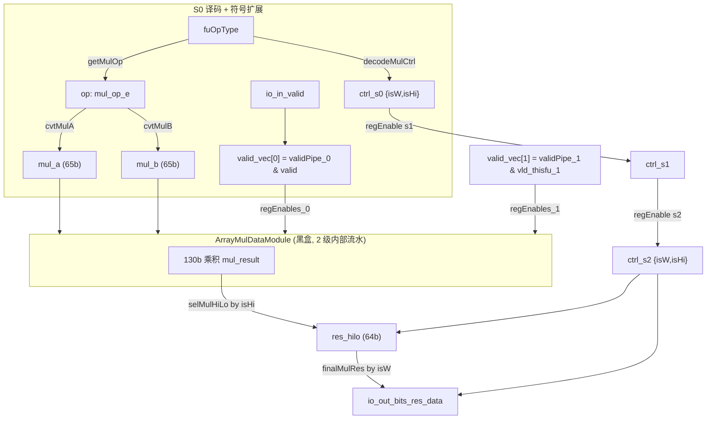

# MulUnit —— 整数乘法功能单元（学习文档）

> 设计意图来源：`src/main/scala/xiangshan/backend/fu/wrapper/MulUnit.scala`
> （`class MulUnit extends FuncUnit with HasPipelineReg`，`latency = 2`）
> 可读重写：`rtl/backend/MulUnit.sv`（核 `xs_MulUnit_core`）+ `rtl/backend/mulunit_pkg.sv`

## 1. 架构定位

MulUnit 是后端整数执行簇（ExuBlock）里的一个**功能单元（FU）**，承担 RV64 M 扩展的
乘法类指令：`mul / mulh / mulhsu / mulhu / mulw / mulw7`。它是一个 **2 拍定长流水**
（piped FU）单元：每拍可接受一条新乘法，结果在 2 拍后写回，吞吐 1 条/拍。

它本身**不实现乘法阵列**，真正的部分积压缩 + 进位传播加法在黑盒
`ArrayMulDataModule`（2 级内部流水的 Wallace/Booth 风格阵列）里完成。MulUnit 这层
wrapper 只做四件“控制 + 数据规整”的事：

1. **译码**：从 `fuOpType` 译出乘法子操作；
2. **符号处理**：按子操作把两个 64bit 源**扩到 65bit**（符号/零/低 7bit 扩展）；
3. **控制流水**：把 `{isW, isHi}` 随阵列 2 拍时延一同打拍；
4. **结果选择**：从 130bit 乘积按 `isHi` 选高/低半，按 `isW` 做 W 符号扩展。

## 2. 数据流图

## 3. opType 编码与译码（mulunit_pkg）

`fuOpType` 9bit，乘法类编码：`| type(2) | isWord(1)=bit2 | opcode(2)=bit1:0 |`

| 指令   | fuOpType | getOp=`{f[3],f[1:0]}` | a 端扩展 | b 端扩展 | isHi | isW |
|--------|----------|------------------------|----------|----------|------|-----|
| mul    | 00000    | 000 (`MUL_MUL`)        | 零扩展   | 零扩展   | 0    | 0   |
| mulh   | 00001    | 001 (`MUL_MULH`)       | 符号扩展 | 符号扩展 | 1    | 0   |
| mulhsu | 00010    | 010 (`MUL_MULHSU`)     | 符号扩展 | 零扩展   | 1    | 0   |
| mulhu  | 00011    | 011 (`MUL_MULHU`)      | 零扩展   | 零扩展   | 1    | 0   |
| mulw   | 00100    | 000 (`MUL_MUL`)        | 零扩展   | 零扩展   | 0    | 1   |
| mulw7  | 01100    | 100 (`MUL_MULW7`)      | 低 7bit 零扩 | 零扩展 | 0    | 1   |

要点：
- `getOp` 把 `func[3]` 与 `func[1:0]` 拼成 3bit，使 `mulw7`（type 高位=1）与
  普通低 2bit 操作共用一张扩展表；`mulw` 的 op 仍是 000，靠 `isW` 区分结果处理。
- **符号处理的非对称**：`mulhsu` 的被乘数 src0 带符号、乘数 src1 无符号，所以 a 端
  符号扩展、b 端零扩展。这是唯一两端规则不同的子操作。
- **X 铁律**：`cvtMulA/cvtMulB` 用 `case` + `default = '0`，精确复刻 Chisel `LookupTree`
  的 one-hot OR-mux 语义——非法 op 编码输出 0（而非透传 src），否则 FM 会在非法编码
  上判不等价。

## 4. 流水与握手（HasPipelineReg 模型）

香山的定长流水 FU 把**控制/数据流水**（`ctrlPipe` / `validPipe` / `dataPipe`）放在 FU
**外部**由发射队列 + 数据通路预先打拍后送入。因此 MulUnit 端口里看到的是
`io_in_bits_validPipe_0/1/2` 与 `io_in_bits_ctrlPipe_2_*`，而不是 FU 自己逐级搬运
robIdx/pdest。MulUnit 内部只额外维护：

- **本 FU 内部 valid 流水** `vld_thisfu_1/2`：复位敏感的两级寄存器，起点 `io_in_valid`；
- **各级真实有效** `valid_vec[i] = validPipe[i] & 本 FU valid[i]`，作为阵列与控制流水
  第 i 级寄存器使能（`regEnable(i)`）；
- **控制流水** `ctrl_s0→s1→s2`，使末级用“当初发起乘法那条指令”的 `{isW,isHi}`；
- **perf 调试信息流水**（2 级，不参与运算）。

因为是定长流水、下游无背压、不自管冲刷，所以 MulUnit **没有 `in.ready` / `out.ready`
/ `flush` 端口**。输出有效 = `validPipe_2 & vld_thisfu_2`；输出控制直接取外部
`ctrlPipe_2`。

> 注意：golden 的 perf 流水使能用 `io_in_valid` / `vld_thisfu_1`（未与外部 validPipe），
> 而控制流水使能用 `valid_vec`（与了 validPipe）。可读核保持这一细微差异以严格等价。

## 5. 结果选择

阵列输出 `mul_result` 为 130bit（= 2×65）。`xlen = 64`：
- `selMulHiLo(isHi, r)`：`isHi ? r[127:64] : r[63:0]`（取高半/低半 64bit）；
- `finalMulRes(isW, res)`：`isW ? sext(res[31:0]) : res`（W 类指令结果是 32bit 量，
  符号扩展回 64bit）。

## 6. 接口（与 golden `MulUnit` 完全一致）

| 方向 | 信号 | 说明 |
|------|------|------|
| in  | `io_in_valid` | 本拍发射有效（s0） |
| in  | `io_in_bits_ctrl_fuOpType[8:0]` | 乘法子操作编码 |
| in  | `io_in_bits_validPipe_{0,1,2}` | 外部预打拍的 valid 流水 |
| in  | `io_in_bits_ctrlPipe_2_{robIdx_flag,robIdx_value,pdest,rfWen}` | 第 2 级控制（输出透传） |
| in  | `io_in_bits_data_src_{0,1}[63:0]` | 两个源操作数 |
| in  | `io_in_bits_perfDebugInfo_*` | perf 调试信息（随流水搬运） |
| out | `io_out_valid` | 写回有效 = `validPipe_2 & vld_thisfu_2` |
| out | `io_out_bits_ctrl_*` | 透传自 `ctrlPipe_2` |
| out | `io_out_bits_res_data[63:0]` | 乘法结果 |
| out | `io_out_bits_perfDebugInfo_*` | perf 流水末级 |

黑盒子模块：`ArrayMulDataModule`（叶子单元 `C22/C32/C53/CSA3_2`）。

## 7. 验证结果

- **结构闸门**（pkg+core 合计）：`typedef struct = 1`，`typedef enum = 1`，
  `function automatic = 8`，核内生成痕迹 grep = 0。
- **UT**（双例化 `MulUnit` vs `MulUnit_xs`，共用 golden 阵列黑盒；随机背靠背 +
  6 种合法 fuOpType + 随机 validPipe）：seed 1 / 7 / 42 各 `checks=200000, errors=0`。
- **FM**（`make fm`，阵列黑盒两侧共享，`FM_MERGE_DUP=false`）：`SUCCEEDED`，
  2799 by name + 390 by signature，0 unmatched。

### 关键坑

1. **LookupTree 的 default=0**：`cvtMulA/B` 对非法 op 必须输出 0（非透传 src），否则
   UT 覆盖不到非法编码、但 FM 会在 `io_a` 低位判不等价。
2. **FM merge-dup 跨 u_core 边界折叠黑盒内部寄存器**：阵列内部多级流水寄存器在
   golden 顶层 vs 手写 `wrapper→u_core` 两种层次下，默认的“合并同值重复寄存器”pass
   会做不对称常量传播，把同源黑盒误判不等价（`Constrained 1X` unmatched + 内部
   `r_NN_reg` failed）。在 Makefile 设 `FM_MERGE_DUP=false` 即干净通过。
3. **perf 使能与控制使能不同源**：见 §4 注；保持差异以等价。
