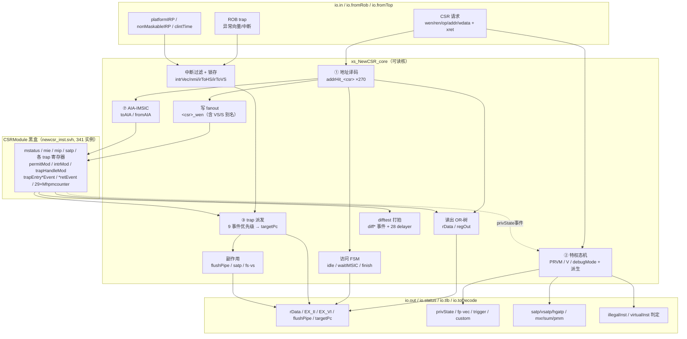
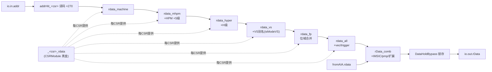
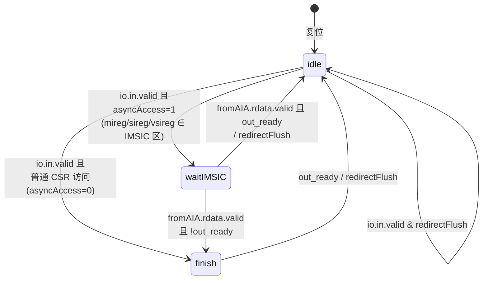
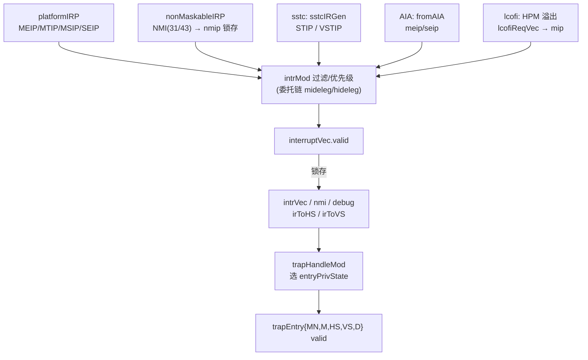
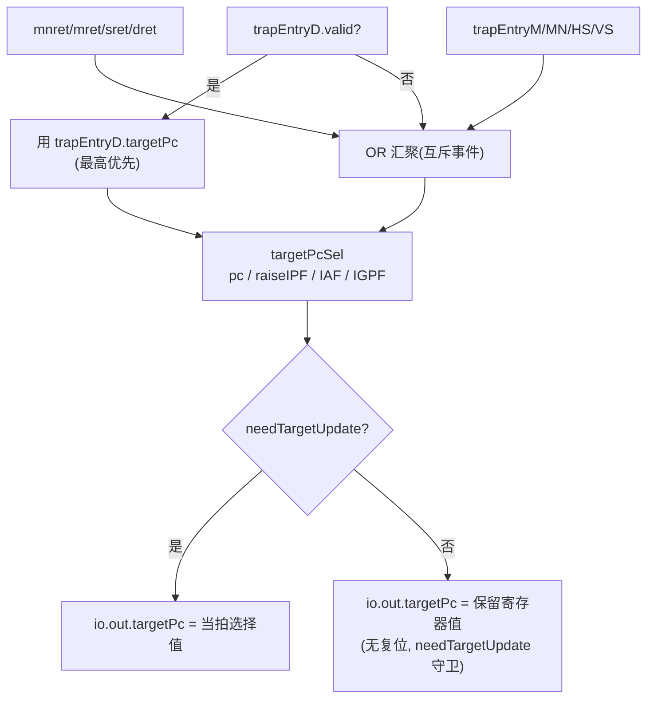

# NewCSR —— 后端控制状态寄存器文件聚合器（CSR 读写 / 特权管理 / 中断异常派发 / AIA-IMSIC）

> 设计源:`src/main/scala/xiangshan/backend/fu/NewCSR/NewCSR.scala`（`class NewCSR`）
> + `CSRDefines / CSRFields / SupervisorLevel / VirtualSupervisorLevel / HypervisorLevel / CSREvents/*`
> 可读核:`rtl/backend/NewCSR.sv`（`module xs_NewCSR_core`,3860 行）+ `rtl/backend/newcsr_pkg.sv`
> 顶层 wrapper:`rtl/backend/NewCSR_wrapper.sv`（`module NewCSR`,透传到 `xs_NewCSR_core u_core`）
> 子模块互联:`rtl/backend/newcsr_inst.svh`（341 实例,313 类型,CSRModule 全部作 golden 黑盒 `newcsr_stub.sv`）

本文是面向**学习香山 CSR 微架构**的说明文档。NewCSR 是整机里最庞杂的一个执行单元:golden 顶层单
module 14259 行,可读核把其中「聚合/编排 glue」那 6000 余行从展平的 `_T_/_GEN_` 网中还原成语义化的
手写 RTL(地址译码 `addrHit_<csr>`、写使能 `<csr>_wen`、读出 OR-树、特权态机、trap 派发…),300+
个 CSR 寄存器本身的字段逻辑则留在 `*Module` 子模块里作黑盒。读懂本核 = 读懂「一条 CSR 指令/一次 trap
从进入到落定」全流程,而无需陷进每个寄存器的位域细节。

---

## 1. RISC-V CSR / 特权背景(读代码前先建立心智模型)

NewCSR 实现的是 RISC-V 特权架构里的 CSR(Control and Status Register)文件。先厘清三件事:

### 1.1 特权级与虚拟态

RV 把 hart 的运行权限分成几级,香山支持 RVH(Hypervisor 扩展),故有「特权级 × 虚拟态」两维:

| 维度 | 取值 | 在核里的表示 |
|------|------|-------------|
| 特权级 PRVM | U=0 / S=1 / M=3(`priv_mode_e`) | `reg [1:0] PRVM`(复位 M=3) |
| 虚拟态 V | Off=0 / On=1(`virt_mode_e`) | `reg V`(复位 0) |

二者组合出 5 种有效模式(核内派生,NewCSR.sv:591-599):

```
isModeM  = (PRVM==M)            // 机器态
isModeHS = (V==0 && PRVM==S)    // Hypervisor-extended Supervisor
isModeHU = (V==0 && PRVM==U)    // HS 下的用户态
isModeVS = (V==1 && PRVM==S)    // Virtual Supervisor(客户机 OS)
isModeVU = (V==1 && PRVM==U)    // 客户机用户态
```

另有正交的 **Debug 模式**(`reg debugMode`),进入后权限最高、计数器可冻结(`debugModeStopCount`)。

### 1.2 CSR 地址空间

CSR 用 12 位地址(`ADDR_W=12`),共 4096 个槽。高 2 位编码读写权限与最低特权级。香山实现的 ~270 个
CSR 散布在:fp/vec(`0x001..0x00F`)、S 级(`0x100..0x1FF`)、VS 级(`0x200..0x2FF`)、M 级
(`0x300..0x3FF`/`0xB00`/`0xF1x`)、H 级、Debug(`0x7Bx`)、PMP/PMA、AIA 间接寄存器、以及香山自定义
(`0x5C0..`/`0xBC0..`,如 sbpctl/spfctl/mcorepwr)。核里每个 CSR 对应一行 `addrHit_<csr> = (addr==12'h…)`
译码位(NewCSR.sv:359-561),这是后续所有读写路由的基础。

### 1.3 VS/S 地址别名(RVH 的关键技巧)

为了让未改动的客户机 OS 直接跑在 VS 态,RVH 规定:**VS 态下软件用 S 地址(0x100 段)访问的,其实是
对应的 VS 寄存器(0x200 段)**。这套映射在 Scala `VirtualSupervisorLevel.sMapVS` 里(14 对):

```
sstatus↔vsstatus  sie↔vsie  stvec↔vstvec  sscratch↔vsscratch  sepc↔vsepc
scause↔vscause  stval↔vstval  sip↔vsip  stimecmp↔vstimecmp
siselect↔vsiselect  sireg↔vsireg  stopei↔vstopei  satp↔vsatp  stopi↔vstopi
```

核里别名规则统一为(读 OR-树与写 fanout 共用):

- **S 寄存器**(如 satp):命中 = `~isModeVS & addrHit_satp`(VS 态下 S 地址被映射走,不命中真 satp)。
- **VS 寄存器**(如 vsatp):命中 = `isModeVS & addrHit_satp | ~isModeVS & addrHit_vsatp`
  (VS 态下吃 S 地址,非 VS 态下吃 VS 地址)。

读出代码处处可见这条规则,例如 NewCSR.sv:977-979 的 vsatp 选择子。

### 1.4 trap 入口模式选择规则

异常/中断发生时,落到哪个特权级由 **委托寄存器(deleg)** 链决定:M 级默认全收,`medeleg/mideleg` 委
托给 HS,`hedeleg/hideleg` 再委托给 VS。NewCSR 不自己算委托,而是把 privState/deleg/mstatus 等喂给
`trapHandleMod` 黑盒,由它算出 `entryPrivState`,核据此选 5 个互斥事件源之一(见 §4)。另外 NMI(不可
屏蔽中断)走独立的 M-NMI 入口,Debug trap 优先级最高。

---

## 2. NewCSR 在后端的角色

NewCSR 同时是**三种东西**:

1. **CSR 指令的执行单元**:从 `io.in` 收译码好的 csrrw/csrrs/csrrc + 地址 + 写数据,读出旧值
   走 `io.out.rData`,把写数据 fan-out 到目标 CSRModule,并报告非法(`EX_II`)/虚拟非法(`EX_VI`)。
2. **整机的特权状态机**:持有 PRVM/V/debugMode,广播 `io.status`(privState/fp·vec state/trigger/
   custom/instrAddrTransType)、`io.tlb`(satp/vsatp/hgatp/mxr/sum/pmm…)、`io.toDecode`(各特权指令
   合法/虚拟非法判定)。
3. **中断/异常派发中枢**:从 ROB 收 `trap`,过滤/优先级仲裁中断,选 M/MN/HS/VS/Debug 入口,产生重
   定向 `targetPc`,并维护 AIA-IMSIC 的异步读写握手。

它聚合了 RISC-V 全部 CSR 寄存器(M/HS/VS/U 各级 + Debug + AIA/IMSIC + 自定义 + PMP/PMA),核心价值
在「**编排**」:300+ 个 CSRModule 是黑盒,核负责它们之间的译码、选择、仲裁、副作用与打拍。

---

## 3. 结构总览

可读核把 golden 的 6000 行 glue 还原成几个清晰的功能块。下图给出整体结构(CSRModule 一律黑盒):



### 顶层契约

| 文件 | 角色 |
|------|------|
| `NewCSR_wrapper.sv` | FM/UT impl 侧顶层,`module NewCSR`,296 端口,实例化 `xs_NewCSR_core u_core` |
| `NewCSR.sv` | **可读核 `xs_NewCSR_core`**,同 296 端口,含核 glue + `include newcsr_decls.svh` + `include newcsr_inst.svh` |
| `newcsr_inst.svh` | 341 子模块实例端口→网名互联;`_T_/_GEN_` 已全部重映射为语义网(残留 = 0) |
| `newcsr_pkg.sv` | 参数 + enum(`priv_mode_e`/`virt_mode_e`/`csr_fsm_e`)+ struct(`csr_req_t`/`trap_event_set_t`)+ function |
| `newcsr_stub.sv` | 313 子模块黑盒(显式端口方向),UT 两侧 + FM 两侧共用 |

---

## 4. 可读核讲解(结合实际代码)

### 步 1:地址译码 + 读出 OR-mux + 写 fanout

**地址译码**(NewCSR.sv:330-561, 744-803)。每个 CSR 一行命中位:

```systemverilog
assign addrHit_mstatus = io_in_bits_addr == 12'h300;  // mstatus
assign addrHit_satp    = io_in_bits_addr == 12'h180;  // satp
assign addrHit_vsatp   = io_in_bits_addr == 12'h280;  // vsatp
```

**读出 OR-树**(NewCSR.sv:809-1029, 1355-1428)。golden 用 Mux1H(地址 one-hot)选寄存器读值。可读核保
留 OR 汇聚结构但分层组织:`rdata_machine`(M 级)→ `rdata_mhpm`(+ HPM 事件/计数器 + S 级)→
`rdata_hyper`(+ H 级)→ `rdata_vs`(+ VS 别名)→ `rdata_fp`(+ fflags/frm 位域合并)→ `rdata_all`
(+ vec/cycle/trigger)。每个 CSR 贡献一项 `addrHit_x ? _x_rdata : 0`,未命中即 0,天然无 X。VS/S 别名
就在这里按 `isModeVS` 选(如 satp 在 1.3 描述)。最终读数据流:



注意核里有两条读出:`rData`(指令读回值,含 IMSIC 异步与 claim 路径)与 `regOut`(给副作用逻辑用的当
前寄存器值,NewCSR.sv:3583)。

**写 fanout**(NewCSR.sv:1044-1054)。写口由「打拍后的合法写位 × 命中位」生成,每个可写 CSR 一根
`<csr>_wen` 送进对应 CSRModule:

```systemverilog
assign mireg_wen  = wenLegalReg_last_REG & addrHit_mireg;
assign sireg_wen  = wenLegalReg_last_REG & ~isModeVS & addrHit_sireg;       // S 寄存器:VS 态不命中
assign vsireg_wen = wenLegalReg_last_REG & (isModeVS & addrHit_sireg | ~isModeVS & addrHit_vsireg);  // VS 别名
```

其中 `wenLegalReg_last_REG` 是 `permitMod` 判出的「本次写合法」位打了一拍(写在下一拍生效),它把权限检
查(由 permitMod 黑盒按 privState/counteren/stateen/envcfg 算)与写动作解耦。

### 步 2:特权态机(PRVM/V/debugMode 寄存器 + 派生)

核持有特权态寄存器并按**严格优先级**更新(NewCSR.sv:624-712)。复位为 M 态(`PRVM=3, V=0, debugMode=0`)。
关键是 PRVM/V 的更新优先级(NewCSR.sv:648-675),严格照 Scala 的 MuxCase 顺序:

```
trapEntryD > trapEntryM > trapEntryHS > trapEntryVS > trapEntryMN
          > mret > sret > dret > mnret
```

每个事件的 `privState_bits_{PRVM,V}` 来自对应 `*Event` 黑盒输出;核只做「谁 valid 谁赢」的优先级 if/else
链。`debugMode` 单独更新(dret 优先于 trapEntryD);`debugModeStopCount` 是无复位寄存器(每拍跟随
`debugMode & dcsr.STOPCOUNT`,NewCSR.sv:714-716)。

派生信号(NewCSR.sv:591-618):5 种模式布尔、`privForTrace`(给 trace 的特权编码)、`instrAddrTransType`
(bare/sv39/sv48/sv39x4/sv48x4,由 privState + satp/vsatp/hgatp 的 MODE 域 one-hot 译出)。

### 步 2(续):critical-error 致命错误锁存

核里有一条独立的**致命错误状态机**——它不止是 difftest 事件,还有对外功能端口。当 `mnstatus.NMIE=0`(正
处理 NMI、不可再嵌套) 时又来了一次 trap(且不是进 Debug 模式),即认定发生不可恢复的致命错误:

```systemverilog
criticalErrorStateInCSR = ~mnstatus.NMIE & io_fromRob_trap_valid & ~entryDebugMode;  // NewCSR.sv:588-589
```

该条件一旦置起就**永久 sticky 锁存**,再也不会自己清(NewCSR.sv:683-684,在特权态那同一个 always 块里):

```systemverilog
criticalErrorState <= io_fromTop_criticalErrorState | criticalErrorStateInCSR | criticalErrorState;
```

即顶层 `io_fromTop_criticalErrorState`(输入,NewCSR.sv:33)灌入的外部致命错误也一并锁进来。它对外产生两个
**功能输出端口**(非纯 difftest):

- `io_status_criticalErrorState = criticalErrorState & ~dcsr.CETRIG`(NewCSR.sv:3763)——广播致命错误态,
  可被 dcsr 的 CETRIG(critical-error trigger 使能)位屏蔽。
- `io_error_0`(NewCSR.sv:2161-2162)——`criticalErrorStateInCSR` 经两级打拍(`io_error_0_REG →
  io_error_0_REG_1`)后送出的错误脉冲。

(步 8 difftest 里的 `diffCriticalErrorEvent`(NewCSR.sv:1865)是同一状态的联合仿真快照,不要与这里的功能
端口混为一谈。)

### 步 2(续):访问 FSM(idle / waitIMSIC / finish)

CSR 访问用三态机握手(NewCSR.sv:1326-1477,`csr_fsm_e`)。多数 CSR 是同步的(当拍就能读出),但 AIA
间接寄存器(mireg/sireg/vsireg 落在 IMSIC 区间)是**异步**的,要发请求给外部 IMSIC 并等回数:



`io_in_ready = ~(|state)`(仅 idle 收新请求);`io_out_valid` 在 finish 或 waitIMSIC 拿到回数时拉高。
读数据/EX_II/EX_VI/isPerfCnt 走 **DataHoldBypass**:当拍是普通读就用组合值,否则用锁存寄存器
(NewCSR.sv:1529-1547),这样握手等待期间输出保持稳定。

**EX_II / EX_VI 何时置起**(NewCSR.sv:1323-1341):非法访问的报告分两类——

```systemverilog
exII_comb = normalCSRValid & (permitMod.EX_II | noCSRIllegal)  // 权限不足 或 访问未实现 CSR
          | waitIMSICValid & imsicIllegal & ~V;                // IMSIC illegal 且 非 V 态
exVI_comb = normalCSRValid & permitMod.EX_VI                   // 虚拟非法(HS 合法/VS 受禁)
          | waitIMSICValid & imsicIllegal & V;                 // IMSIC illegal 且 V 态
```

- **EX_II(illegal instruction)** 三个来源:① `permitMod` 按 privState/counteren/stateen/envcfg 判权限
  不足;② `noCSRIllegal`——访问地址**命中不了任何已实现 CSR**(`isCsrAccess & (&csrAddrLegalVec)`,即所有
  `~addrHit_*` 全 1),读写未实现寄存器;③ 异步 IMSIC 回数 `fromAIA.illegal` 且当前**非** V 态。
- **EX_VI(virtual instruction)** 两个来源:① `permitMod` 判为「HS 下合法、VS 下受禁」的虚拟非法;
  ② 异步 IMSIC 回数 illegal 且当前 V 态。

即**同一个 IMSIC illegal 按当前 V 态分流**:V=0 报 EX_II、V=1 报 EX_VI(NewCSR.sv:1338/1341)。二者最终经
DataHoldBypass 打拍走 `io_out_bits_EX_II/EX_VI`。

### 步 3:中断过滤 + 锁存

中断源(platformIRP MEIP/MTIP/MSIP/SEIP、nonMaskableIRP NMI、clintTime、AIA、sstc)先喂给 `intrMod`
黑盒做过滤/优先级,核把它的 `interruptVec` 在 `valid` 时锁存进 `intrVec/debug/nmi/irToHS/irToVS`
(NewCSR.sv:687-704)。`nmip`(NMI pending)是核里的锁存位:派发时按命中向量清(`!=6'h1F`/`!=6'h2B`),
否则把新到的 `nonMaskableIRP` OR 进去(NewCSR.sv:686-694)。`sstc`(Supervisor 定时中断,Sstc 扩展)由
`sstcIRGen` 黑盒按 stimecmp/vstimecmp 与 clintTime 比较产生 STIP/VSTIP,核把 stimecmp/vstimecmp/menvcfg
的写使能打拍喂给它(NewCSR.sv:1935-1937)。

中断优先级仲裁(在 intrMod/trapHandleMod 黑盒内完成,核负责前后编排):



**trapEntry* valid 的门控与 double-trap 路由**(newcsr_inst.svh:5011/5085/5119/5208):5 个 trap-entry 事件
的 `.valid` 不是裸的 `trap_valid`,普通 M/HS/VS/MN 入口都还 `& mnstatus.NMIE`——**NMI 处理期间
(NMIE=0)屏蔽掉这些入口**,防止在 NMI handler 里再被抢入(NMIE 由 mnret 恢复)。逐入口:

- **M 入口**(:5011):`trap_valid & M候选 & ~dbltrpToMN & ~entryDebugMode & ~debugMode & ~nmi & NMIE`。
- **M-NMI 入口**(:5085):`(trap_valid & nmi | dbltrpToMN) & ~entryDebugMode & ~debugMode & NMIE`。
- **HS/VS 入口**(:5119/:5208):`trap_valid & HS/VS候选 & ~entryDebugMode & ~debugMode & NMIE`。

**double-trap 路由**:`trapHandleMod` 判出的 `dbltrpToMN`(陷入处理过程中又发生陷入)会把入口**从 M 抢到
M-NMI**——M 入口用 `~dbltrpToMN` 把自己排除,MN 入口用 `| dbltrpToMN` 把它纳入。真 NMI(`nmi`)同理只走
MN 入口(M 入口的 `~nmi` 排除、MN 入口的 `nmi` 纳入)。这样 M-NMI 入口就同时承接了「不可屏蔽中断」与「双重
陷入」两类最高优先级事件,与 §1.4 说的「NMI 走独立 M-NMI 入口」一致。

### 步 3(续):trap 派发 + targetPc

9 个事件源(5 个 trap-entry:MN/M/HS/VS/D;4 个 xret:mnret/mret/sret/dret)各产生一个互斥的
`targetPc`(valid + pc + raiseIPF/IAF/IGPF)。核做两件事(NewCSR.sv:2086-2169):

- `needTargetUpdate` = 9 个 valid 的 OR(任一事件触发就要重定向)。
- `targetPcSel_*`:**trapEntryD 优先**(三元最前),其余按 valid 守卫 OR 汇聚(互斥,故 OR 即选择)。



`io_out_bits_targetPcUpdate = needTargetUpdate`,这是重定向给前端的信号。

### 步 4:flushPipe 副作用

某些 CSR 写会改变全局译码语义,必须冲刷流水线(NewCSR.sv:2173+)。触发条件:写 satp/vsatp/hgatp
(地址 0x180/0x280/0x680 且写合法);trigger 前端变更(`_debugMod_io_out_triggerFrontendChange`);
fp/vec status 在 on↔off 之间翻转(写 mstatus/sstatus/vsstatus 的 FS/VS 域);以及 vstart/frm/fcsr 的写。

### 步 5:输出广播(status / tlb / toDecode)

多为纯组合透传。`io.status.custom`(spfctl/slvpredctl/sbpctl/smblockctl/srnctl/mcorepwr/mflushpwr)字段
直接透传(NewCSR.sv:1359 段)。`io.tlb` 给 MMU 用:satp/vsatp/hgatp、mxr/sum、pmm/pbmte 等,其中
ASID/VMID 变更与 pmm/pbmte 是打拍寄存器(NewCSR.sv:1480-1524,跟随对应 CSR 读出 + ASID 比较)。
`io.toDecode` 给译码级用,是大量布尔判定(NewCSR.sv:3811+):

```systemverilog
assign io_toDecode_illegalInst_sfenceVMA = isModeHS & _mstatus_regOut_TVM | isModeHU;
assign io_toDecode_virtualInst_sfenceVMA = isModeVS & _hstatus_regOut_VTVM | isModeVU;
assign io_toDecode_illegalInst_wfi       = isModeHU | ~isModeM & _mstatus_regOut_TW;
```

即「当前特权态 × 相关 mstatus/hstatus 控制位」判某指令是否非法(illegal)或虚拟非法(virtual)。

### 步 6:perf + trigger

29 路性能计数使能 `countingEn_0..28`(NewCSR.sv:1790-1822)是有复位寄存器,每路按当前特权态与对应
`mhpmevent(N+3)` 的 INH(inhibit)位算出 `countEn_M*` 再打拍,送各 mhpmcounter 子模块。计数器溢出
产生 `lcofiReqVec`(Local Counter Overflow Interrupt),回灌 mip(NewCSR.sv:1703)。trigger:
tdata1/tdata2 写路由受 DMODE 门控(`triggerCanWrite = tdata1[59] & debugMode | ~tdata1[59]`,
NewCSR.sv:1580),并向前端/访存广播 trigger 配置。

### 步 7:AIA-IMSIC 异步接口

AIA(Advanced Interrupt Architecture)的 IMSIC 是片外异步部件。核通过 `toAIA`(addr/wdata/claim/vgein)
发起、`fromAIA`(rdata/中断 pending)收回(NewCSR.sv:1535-1565)。读/写 miselect/siselect/vsiselect
指向 IMSIC 区间时,`toAIA_addr` 转发间接地址;写则 `toAIA_wdata` 转发(op/data 打拍)。

**claim(中断认领)由「写」topei 触发,不是「读」**(NewCSR.sv:1045-1054, 1541-1543):

```systemverilog
assign toAIA_mClaim  = mtopeiClaimWen;   // = wenLegalReg_last_REG & addrHit_mtopei
assign toAIA_sClaim  = stopeiClaimWen;   // = wenLegalReg_last_REG & ~isModeVS & addrHit_stopei
assign toAIA_vsClaim = vstopeiClaimWen;  // = wenLegalReg_last_REG & (VS/S 别名 & addrHit_[v]stopei)
```

即必须是对 `[m|s|vs]topei` 的一次**合法写**(`wenLegalReg_last_REG` 门控)才拉起对应 claim;单纯读 topei
只返回当前 IID/IPRIO,并不向 IMSIC 认领中断。配合步 2 FSM 的 waitIMSIC 路径完成跨时钟域握手。

`csrAccess`(NewCSR.sv:1436)= `wenLegalReg_last_REG | csrAccess_REG`,**两项都是寄存后的上拍值**:
`wenLegalReg_last_REG` 是「**上拍**写合法位」(NewCSR.sv:1451,`<= permitMod.hasLegalWen`),`csrAccess_REG`
是「**上拍**读位」(NewCSR.sv:1496,`<= ren`)。它用于 toAIA 寻址有效判定。

### 步 8:difftest 打拍

本 build difftest 在场:inst.svh 含 28 个 `DelayReg_*` 延迟实例(diffArchEvent_delayer 等),核须产生喂
它们的打拍寄存器与事件 valid(NewCSR.sv:1610-2076)。这些 `diff*_r/_REG` 多是 change-detect:把中断
pending、AIA 同步事件、HPM 溢出(29 路 `diffMhpmeventOverflowVec`)、critical error、mflushpwr 等做两级
快照,边沿即事件 valid。`diffCSRState_coreid = {2'h0, hartId}`。这些只供联合仿真比对,不影响功能。

---

## 5. X(不定值)防护要点

CSR 核地址译码全覆盖、读出用 OR-tree(未命中即 0),先天无 X 隐患:

1. **读出 OR-tree** 比 golden 的 Mux1H 更稳:每路 `addrHit ? rdata : 0`,地址不命中任何 CSR 时全 0;
   即使多 addrHit 同时为 1(地址重叠 bug)也只是 OR 叠加而非 X。
2. **trap-entry / xret 优先级** 用 `priority if/else` 链(NewCSR.sv:648-675),顺序严格照 Scala MuxCase;
   targetPc 用 trapEntryD-优先三元 + 互斥 OR(NewCSR.sv:2094-2137)。
3. **特权态复位** 为 M 态(PRVM=3);UT 中子模块为黑盒 stub,事件 valid 为 X 时 4 态 `if(X)` 不取,
   PRVM 保持复位值,与 golden 行为一致。
4. **无复位寄存器**(debugModeStopCount/noCSRIllegalReg/csrAccess_REG/targetPc_r/TLB 打拍等)单列在独
   立 `always @(posedge clock)`,与 golden 同结构——放进复位块会令 FM DFF 失配。

---

## 6. 验证

| 项 | 配置 | 结果 |
|----|------|------|
| UT 双例化逐拍比 | golden NewCSR + impl NewCSR 各连 `newcsr_stub.sv`,逐拍比全部 296 输出 + 内部探针 | 3 种子 ×200000 拍,`checks=200000 errors=0`,TEST PASSED |
| FM 形式等价 | `make fmbb`,ref/impl 同读 `newcsr_stub.sv` 统一黑盒边界,identity 配对 | **SUCCEEDED**,37934 个 compare point 全部 matched,0 unmatched,0 failing |

UT 要点:`+define+SYNTHESIS`、无复位寄存器加 `+vcs+initreg+0`、`!$isunknown` 跳 don't-care(子模块黑盒
输出在 UT 里为 X,只在 golden 有定义处比对)。关键内部状态(PRVM/V/state/intrVec/nmip/debugMode)端口
看不全,故 tb 加层次探针逐拍比 golden 内部 reg。`_T_/_GEN_` 残留:核 + svh + pkg 均为 0(已全部重映射
成语义网)。

### 迭代历程(9 轮)

1. **脚手架**:gen 脚本 + 313 黑盒 stub + inst.svh + pkg + UT/FM harness,锁 296 端口契约,VCS elaborate 过。
2. **骨架**:296 端口模块头 + 224 具名网占位驱动,契约锁死。
3. **读写口(步 1)**:270 地址译码 + 读出 OR-tree + 写 fanout(VS/S 别名),增量 UT 比 rData。
4. **特权 FSM(步 2)**:PRVM/V/debugMode 寄存器 + idle/waitIMSIC/finish FSM + DataHoldBypass + 内部探针。
5. **中断 + trap 派发(步 3)**:nmip 锁存、intrVec 锁存、trapEntry 优先级、PRVM/nextV MuxCase。
6. **副作用 + 输出广播(步 4-5)**:flushPipe、status/tlb/toDecode、targetPc。
7. **perf + trigger + IMSIC(步 6-7)**:countingEn×29、lcofiReq、tdata 写路由、toAIA/fromAIA 握手。
8. **difftest 打拍(步 8)**:diff* change-detect 事件 + 28 delayer 喂数。
9. **可读化重映射(步 9)**:改 gen 脚本把 inst.svh 274 处 `_T_/_GEN_` 全换成语义网;核内 golden
   `_noCSRIllegal_T_*` / `_mstatus_w_wen_T_*` 一并重命名为 `addrHit_<csr>` / `<csr>_wen`,残留降到 0。

---

## 附:newcsr_pkg.sv 提供的可读化类型

- enum:`priv_mode_e`(U/S/M)、`virt_mode_e`(Off/On)、`csr_fsm_e`(IDLE/WAITIMSIC/FINISH)。
- struct:`csr_req_t`(io.in.bits:wen/ren/op/addr/src/wdata + xret)、`trap_event_set_t`(9 事件 valid)。
- function:`addr_hit`(地址匹配)、`in_perf_cnt_range`(perf 计数区间)、`is_topi_addr`(topi/topei 判定)。

这些取代 golden 展平的成百上千 `_T_/_GEN_`,让译码/路由/仲裁可读。
