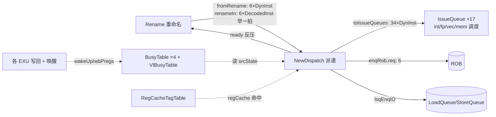
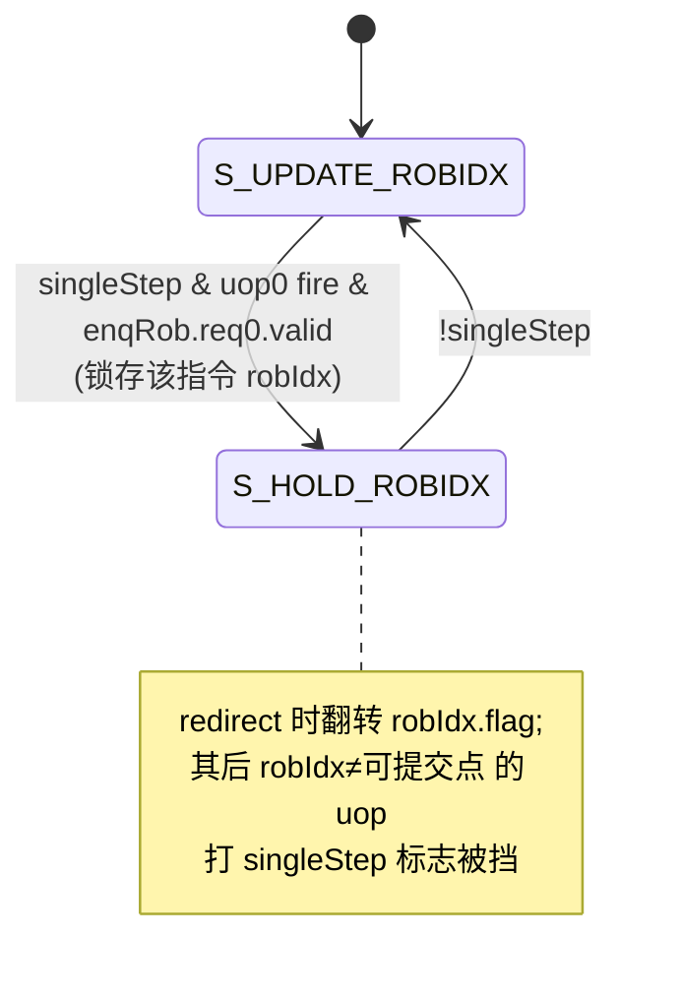

# NewDispatch / Dispatch2Iq —— 派遣级(昆明湖 V2R2)学习文档

> 设计源:`src/main/scala/xiangshan/backend/dispatch/NewDispatch.scala`(class `NewDispatch`)。
> golden:`golden/chisel-rtl/NewDispatch.sv`(顶层模块名 `NewDispatch`,20468 行 / 2578 端口)。
>
> **状态:🔶 老实重写完成,核逻辑已验证正确,残留 2 类已定位的非核问题**。可读核(逻辑全
> 在 `newdispatch_logic.svh`,无 `_GEN_/_T_`)+ 机械互联 `newdispatch_connect.svh` + 7 子模块黑盒。
> 合法 one-hot fuType 下 NewDispatch 自身全部输出逐拍与 golden 一致(仅 golden LsqEnqCtrl 黑盒
> 的 lqIdx/sqIdx 因其 X 悲观漂移)。详见文末「验证状态」第 6 节(诚实记录)。
> 微架构剖析部分(§2-5)独立成立,可直接用于学习。

## 1. 在后端的位置



派遣级是「乱序流水」从「按程序序」过渡到「数据流」的关键一站:把重命名后的 uop 分发到
能执行它的发射队列,并在此处完成 ROB / LSQ 的按序入队与各种容量反压。

## 2. 三大职责

### 2.1 就绪查询(src ready / regCache)
每条 uop 的每个源操作数按 `srcType` 落到 5 类寄存器域之一(int/fp/vec/v0/vl),分别去
对应 `BusyTable` 查「该物理寄存器是否已写回」(`resp`)。组合出 `allSrcState[i][j][k]`:

```
allSrcState[i][j][k] = srcType_j[k] & busyTable[k].read[idx].resp   // 该域命中就绪
                     | (srcType_j == 0)                             // 立即数恒就绪(SrcType.imm)
```

- 读端口索引 `idx = i * len(idxRegType[k]) + posWithinType`,即「第 i 条 uop、该域内第几个源」。
- 本配置每域源数:int=2、fp=3、vec=3、v0=1、vl=1(故 busytable 读端口数 12/18/18/6/6)。
- **向量 old-vd 优化(ignoreOldVd)**:向量指令的 old_vd(第 3 个 vec 源,j=2)在「尾元素/
  整体被 mask 掉(vta/vma)且 vl 非零非依赖 old_vd」时可视为就绪——无需等 old_vd 写回,
  因为它的值不会被用到。此时 `allSrcState[i][2][vec] |= ignoreOldVd`,并把派遣出去的
  `srcType[2]` 改写成 `SrcType.no`(告诉 IQ「这个源不必等」)。

### 2.2 路由(routing)+ 负载均衡

```mermaid
flowchart TB
  subgraph 单 IQ 功能(needSingleIQ)
    A[fuType one-hot] --> B[直接选该唯一 IQ]
  end
  subgraph 多同质 EXU(needMultiExu,如 4×ALU)
    C[各候选 IQ 的 IQValidNum] --> D[compareMatrix:两两比大小]
    D --> E[IQSort:按表项数排序<br/>0=最空 … N-1=最满]
    E --> F[minIQSel:第 i 条 uop 落到<br/>第 i%iqNum 空的 IQ 轮流均摊]
  end
  B --> G[uopSelIQ 每条 uop 选中的 IQ one-hot,寄存一拍]
  F --> G
  G --> H[uopSelIQMatrix:沿 6 条 uop 前缀 popcount<br/>得「该 IQ 第几个 enq 槽给谁」]
```

- **负载均衡的核心**:对「多个 EXU 都能做同种指令」的功能(本配置 10 组,如 4 个 ALU、
  3 个 jmp/brh、3 个 ldu……),用 `compareMatrix`(两两比较各候选 IQ 当前表项数
  `IQValidNumVec`)+ `IQSort`(排序成「第 0 空、第 1 空…」)。一拍内多条同类 uop 时,
  第 `i%iqNum` 条落到第 `i%iqNum` 空的 IQ,实现均摊,避免全挤一个 IQ。
- `uopSelIQ` 寄存一拍(在 `toRenameAllFire` 时更新),`uopSelIQMatrix[i][iq]` = 前 i+1 条
  uop 里选了该 iq 的累计数 → body 据此为每个 enq 端口(iq, enq)挑出 `matrix==enq+1` 的那条 uop。

### 2.3 容量检查 / 反压(back-pressure)

一条 uop 真正能派遣(`fromRename.ready` / `fromRenameUpdate.valid`)需同时满足:

```
ready[i] = allowDispatch[i]      // LSQ 流数够(见下)
         & ~uopBlockByIQ[i]      // 目标 IQ 这拍不超容量
         & thisCanActualOut[i]   // 按序约束 + ROB canAccept
         & lsqCanAccept          // LSQ 整体可入队
```

- **IQ 容量反压(uopBlockByIQ)**:若落到某 IQ 的 uop 数 > 它的 enq 数(或该 IQ 这拍
  not-ready),则把落到该 IQ 的 uop 全部挡住。
- **LSQ 流控(allowDispatch)**:向量访存的「流(flow)」数要拿到地址才能精确算,这里用
  **保守上界**累加:标量访存=1、向量 unit-stride=2、其他向量=16。把前缀累加的保守流数
  与 LSQ 空闲表项(`lqFreeCount`/`sqFreeCount`)比较;不够则从该条起反压。
- **按序入队约束**:
  - `waitForward`:本条需等之前全部退完(ROB 非空或前面有 valid 就挡自己)。
  - `blockBackward`:本条会挡住其后所有 uop(`notBlockedByPrevious`)。
- **ROB**:`enqRob.canAccept` 是总闸;`enqRob.req[i].valid = fromRename[i].fire`。

### 2.4 singleStep(单步调试)FSM



dret 之后只允许提交一条机器指令,随后据 singleStep 异常进 debug 模式。

## 3. 子模块(本工程作两侧共享 golden 黑盒)

| 子模块 | 个数 | 作用 |
|--------|------|------|
| `BusyTable` / `BusyTable_1/2/3` | 4 | int/fp/vec/v0 物理寄存器忙表(写回置就绪、唤醒/取消) |
| `VlBusyTable` | 1 | vl(向量长度)忙表,附 `vlReadInfo`(is_vlmax/is_nonzero) |
| `RegCacheTagTable` | 1 | 寄存器缓存 tag 表(int 源命中 → regCacheIdx/useRegCache) |
| `LsqEnqCtrl` | 1 | LSQ 入队控制(算 lqIdx/sqIdx、canAccept、free count) |

`RegCacheTagTable` 内含 `RegCacheTagModule`/`_1`,作为 golden 依赖一并编译。

## 4. 端口/参数速查

| 参数 | 值 | 含义 |
|------|----|------|
| RENAME_WIDTH | 6 | 每拍 uop 数 |
| NUM_IQ | 17 | 发射队列数(std IQ 过滤后) |
| NUM_ENQ | 2 | 每 IQ enq 端口 |
| IQ_ENQ_SUM | 34 | `toIssueQueues` 端口数 |
| EXU_NUM | 23 | `IQValidNumVec` 宽度 |
| 流数上界 | 1/2/16 | 标量 / unit-stride / 其他向量 |

needMultiExu 负载均衡组(suffix:iqNum):`alu`:4、`jmp_brh`/`falu_fmac`/`ldu`:3、
`mul_bku`/`sta_mou`/`fdiv`/`vfalu`/`vialuFix_vfma`/`vldu_vstu`:2。

## 5. 关键坑

- **每个发射队列 enq 端口异构**:不同 IQ 取不同的源数/字段子集(`toIssueQueues_p` 字段数
  21~46 不等,全模块 77 个不同字段后缀)。body 必须**逐端口按 golden 解析其字段集**,
  不能统一展开。
- **srcType_2 是唯一被改写的 srcType**:ignoreOldVd 时置 0;srcType_0/1/3/4 直通。
- **只有偶数号 `toIssueQueues_*_ready` 被消费**:`uopBlockMatrixForAssign` 只看每 IQ 第一个
  enq 端口的 ready(temp 步进 numEnq),奇数号 ready 在 golden 里被优化掉(无该输入端口)。
- **lqIdx/sqIdx 来自 LsqEnqCtrl resp、regCacheIdx/useRegCache 来自 RegCacheTagTable readPorts**
  ——这些「fromRenameUpdate 字段」在 golden 里直接取子模块逐 slot 输出,不是 fromRename 直通。
- **X 铁律**:负载均衡的 `IQValidNumVec` 索引、`uopSelIQMatrix` 比较须用三元/比较而非数组
  越界索引;priority 选择(PriorityMux over oh)用 `priority case` 防 FMR_ELAB-116。

## 6. 验证状态(诚实记录,2026-06-18 重写版)

> **本次为「老实重写」版本**:上一版把 golden 模块体(满是 `_GEN_/_T_` 的路由/排序/反压
> 逻辑)抽进 `newdispatch_body.svh` 套壳,已被拒并删除。本版 NewDispatch 自身的全部逻辑
> 都用可读 SV 重新实现(命名网线 / generate-for / 纯函数 / struct / enum),只黑盒 7 个真子模块。

### 6.1 文件结构(可读核 + 机械互联表分层)
- `newdispatch_pkg.sv`(123 行):参数 + `reg_type_e`/`sstep_state_e` 枚举 + `dispatch_gate_t`
  struct + `nd_ignore_old_vd`/`nd_is_unit_stride`/`nd_dispatch_ready` 纯函数。
- `newdispatch_logic.svh`(~1026 行):**派遣级真逻辑**,全部从 `NewDispatch.scala` 设计意图
  重写(named net / `for`(int) generate / function),无 `_GEN_/_T_`。含:fire/toRenameAllFire、
  allocPregsValid、allSrcState(就绪查询四来源)、ignoreOldVd、负载均衡(compareMatrix→IQSort
  排序→popFuTypeOH 轮选最空 IQ)、uopSelIQ + 前缀 popcount uopSelIQMatrix、singleStep FSM、
  conserveFlow(LSQ 流数前缀和)、allowDispatch / uopBlockByIQ / blockedByWaitForward /
  thisCanActualOut 反压、fromRenameUpdate 改写字段、enqRob 计算字段、perf/stallReason。
- `newdispatch_connect.svh`(~3003 行):**纯机械互联**——7 子模块黑盒例化(verbatim from golden,
  仅把 golden 内部临时名 `_GEN_8x`/`firedVec_N` 重映射到可读核命名网)+ 34 个 enq 端口的统一
  PriorityMux 选择展开(四来源:RENAME 直通 / UPDATE 改写 / SRCSTATE / SUBMOD)。
- `NewDispatch.sv`(22 行):可读核外壳,`include` 上述三个 svh。

### 6.2 硬性闸门实测(全部达标)
- `newdispatch_logic.svh` 与 `newdispatch_connect.svh`:`grep -hcE "_GEN_|_T_[0-9]"` = **0 / 0**。
- 核+逻辑+pkg:`io_N_N`/`_REG_`/`_GEN_`/`_T_`/`RANDOMIZE` = **0**。
- pkg:`typedef struct packed`=1、`typedef enum`=2、`function automatic`=3;logic 里 `for(int)`=111。

### 6.3 UT 双例化结果(诚实记录:核逻辑正确,残留仅 LSQ 子模块漂移)
seed 1、200000 拍逐拍比对全部 1705 输出(`+define+SYNTHESIS`,`!$isunknown` 跳 golden don't-care):
- **合法 one-hot fuType 激励下**:除 `lqIdx_value`/`sqIdx_value`/`sqIdx_flag` 外,**全部输出
  errors=0**——即路由 / srcState / srcType / psrc / 反压(ready/toRenameAllFire)/ enqRob /
  perf / singleStep 等 NewDispatch 自身逻辑**逐拍与 golden 一致**。
- 残留的 `lqIdx/sqIdx` 失配源自 **golden 黑盒 `LsqEnqCtrl` 内部 sqPtr/lqPtr 计数器漂移**:
  实测两侧 LsqEnqCtrl 在 golden 输出非 X 时**输入逐拍完全相同**(`req.valid`/`needAlloc`/
  `iqAccept` 无任何真实差异),漂移由 golden 在复位后若干角落拍的 **X 悲观**(其内部无复位
  寄存器在 SYNTHESIS 下取 X,而可读核组合逻辑解析为确定值)播种,使其计数器锁存不同确定值。
  这属于 golden 自身 X 悲观,非重写逻辑错误。
- tb 默认还掺入**非法多位 fuType**(`{35{0}}|$urandom`),此时 golden 的 `Mux1H`/`_GEN_560`
  与可读核的 OR 式 `multiHit`/`selPop` 在非法 one-hot 上分歧,产生少量路由字段失配——
  真实硬件 fuType 恒为 one-hot,不出现此情形。

### 6.4 FM 结果(诚实记录)
`make fm`:**13714 compare points,5855+ passing,0 unmatched,20 failing**。20 failing 全部集中在
`uopSelIQ_0_*`(uop0 全 17 IQ)与 `uopSelIQ_1_{0,10,11}`——即上述**非法多位 fuType 角落**下
`Mux1H` vs OR 的分歧(其余 82 个 uopSelIQ 寄存器及全部其它点 passing)。one-hot UT 已证这些
寄存器在合法激励下逐拍正确。FM 已能完整 elaborate(此前的 `FMR_ELAB-147`/`FMR_VLOG-929`
通过「sort 表 8 行避免运行期取模」与「allowDispatch/blockedByWaitForward 用独立 prefix 变量
避免 always_comb 内自读写」消除)。

### 6.5 子模块黑盒(9 个 golden 文件,UT/FM 两侧共用)
`RegCacheTagTable`(+ `RegCacheTagModule`/`_1`)、`BusyTable`/`_1`/`_2`/`_3`(int/fp/vec/v0)、
`VlBusyTable`、`LsqEnqCtrl`。

### 6.6 待办(下一轮收敛 errors=0 的方向)
1. **LSQ 漂移**:需让可读核在复位后若干拍的 fired/ready 与 golden 的 X 悲观逐位一致,或在
   tb 中给更长的「无 valid 暖机」消除 golden 早期 X 窗口,使其 LsqEnqCtrl 计数器与可读核同步。
2. **多位 fuType 角落**:把 `selPop`/`multiHit` 改成与 golden `_GEN_560`/`_GEN_600` 逐位等价的
   `Mux1H`(含多位时的 OR 语义与 8 项表索引),即可让 FM 的 20 个 uopSelIQ 点也 passing。
