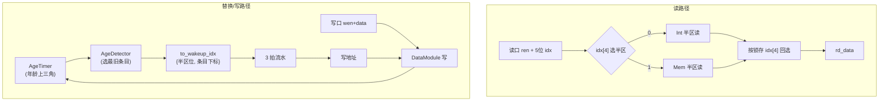

# RegCache —— 寄存器缓存(顶层路由/流水)

## 1. 架构定位

`RegCache` 是后端发射/执行附近的一个**小容量、多读口寄存器值缓存**,缓存最近写回
的物理寄存器值,使发射读操作数时优先命中这里,减少对物理寄存器堆(PRF)读口的占用。

设计源:`src/main/scala/xiangshan/backend/regcache/RegCache.scala` 及其子模块
(`RegCacheDataModule` / `RegCacheAgeTimer` / `RegCacheAgeDetector`)。

可读核 / 包装:
- 核:`rtl/backend/RegCache.sv`(`xs_regcache_core`)+ `rtl/backend/regcache_pkg.sv`
  + 黑盒例化片段 `rtl/backend/regcache_blackbox.svh`(由 `scripts/gen_regcache.py` 生成)
- 包装(golden 同名,FM 用):`rtl/backend/RegCache_wrapper.sv`

> 本可读核重写的是 RegCache **顶层的路由与流水逻辑**;实际存储与年龄逻辑在 3 类
> 子模块里,按任务约定**作为黑盒**(UT/FM 两侧都直接用同一份 golden 叶子)。

## 2. 为什么需要 RegCache

乱序超标量每拍要为多条指令读多个源操作数,PRF 读口是面积/时序大头。但「刚写回的
值往往很快又被后续相关指令读用」。香山据此在 PRF 旁加一个小缓存:命中即从 RegCache
读,省一次 PRF 读口。它分两个对称半区:

| 半区 | 用途 | 条目数 | 写口 | 替换年龄配对 |
|------|------|--------|------|--------------|
| IntRegCache | 整数域 | 16 | 4 | C(16,2)=120 |
| MemRegCache | 访存域 | 12 | 3 | C(12,2)=66 |

> 注意两半区**条目数不同**(16 vs 12)。读地址 `RegCacheIdx` 为 5 位:最高位选半区,
> 低 4 位选条目。Mem 半区只用到低 12 个条目。

## 3. 三条主数据流

### (1) 读:半区拆分 + 同步读 + 数据回选
- 每个外部读口按 `idx[4]` 把读使能路由到 Int 或 Mem 半区:
  `int_ren = RegNext(ren & ~idx[4])`、`mem_ren = RegNext(ren & idx[4])`(打 1 拍,复位 0)。
- 读地址 `idx` 用 `RegEnable(idx, ren)` 锁存 1 拍(仅有请求时更新),低 4 位送两半区。
- 子模块同步读出后,顶层按**锁存地址的最高位**回选 Int/Mem 的读数据。

### (2) 替换下标回送
- `AgeTimer` 维护各条目两两相对年龄(上三角配对 `age[i][j]`),`AgeDetector` 据此为
  每个写口选出**最旧条目**作为下次写入的替换目标。
- 替换下标拼上半区最高位(Int→0、Mem→1)后,组合输出给唤醒队列 `to_wakeup_idx`,
  同时经 **3 拍流水**(`RegNextN(_, 3)`)作为写口的写地址 —— 对齐「写数据从执行单元
  产出回到 RegCache」的延迟。

### (3) 写:半区路由
- 前 4 个写口 → Int 半区,后 3 个 → Mem 半区。写使能/数据直接来自外部,
  **写地址来自 (2) 的替换下标流水末级**(不是外部给的地址)。

## 4. 结构(从设计意图重写)

golden 把 23 读口 × 2 半区的流水寄存器、120/66 条三角年龄线、3 拍 rcIdx 链全部
展平成几百个 `_REG` / `_GEN`。可读核回到 Scala 的 `lazyZip.foreach` / `RegNextN` 本意:

- 读流水、读路由、写路由、rcIdx 延迟链全部用 `genvar`/`generate` 按端口生成;
- 三角年龄信息用一维数组 `age_int[120]`/`age_mem[66]` 表达,黑盒连接由
  `gen_regcache.py` 机械生成到 `regcache_blackbox.svh`;
- 参数(条目数、读写口数、流水深度、年龄配对数)集中在 `regcache_pkg`。

## 5. 验证结果

- **UT**:`verif/ut/RegCache/`。golden `RegCache`(含 6 个黑盒叶子)与可读核
  `RegCache_xs`(核 + 同一份黑盒叶子,各自独立状态)双例化,每拍随机驱动 23 读口
  (ren+5位 idx)、7 写口(wen+data)与偶发复位,上升沿后比对 23 读数据 + 7 唤醒下标。
  - seed 1 / 7 / 42 各 200000 拍(× 30 输出 = 6000000 checks),**errors=0**。
- **FM**:`make fm`,`RegCache` `Verification SUCCEEDED`。impl 侧带上同一份 golden 叶子,
  使两边子模块完全相同,只比对顶层路由/流水逻辑的等价性(签名分析)。
- **结构闸门**:核 `genvar`/`generate`/`always_ff` 均有;生成痕迹 grep
  (`io_*_N_N`/`_REG_N`/`_GEN_`/`_T_N`/`RANDOMIZE`)在核 / pkg / wrapper / svh 全为 0。
  (黑盒叶子的 `io_ageInfo_i_j` 等扁平端口是 golden 固有接口,属机械连接层,非可读逻辑。)

## 6. 关键坑

- **两半区规模不对称**:最初误以为 Int/Mem 都是 16 条目;实际 Mem 半区只有 **12 条目**
  (validInfo_0..11、ageInfo 66 对、AgeDetector 输出 3 个)。需对每半区分别参数化
  (`INT_SIZE`/`MEM_SIZE`、`INT_AGE_PAIRS`/`MEM_AGE_PAIRS`),否则黑盒例化端口对不上。
- **写地址不是外部端口**:golden `RegCache` 的 writePorts 只有 wen+data 外部端口,
  写地址来自内部 AgeDetector 替换下标的 3 拍流水。tb 不驱动写地址。
- **tb 采样**:时序模块,输入/复位统一在 negedge 驱动、上升沿后 `#1` 比对,避免边沿竞争。
