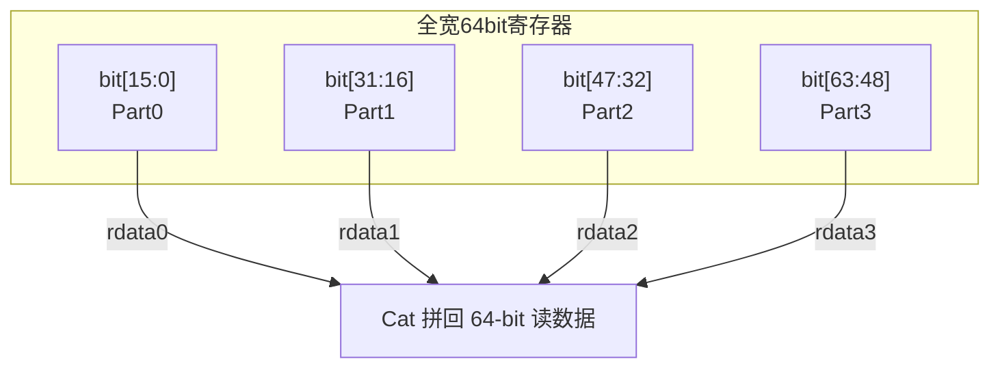
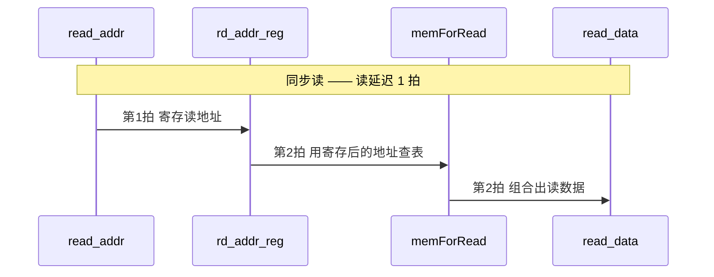

# RegFile —— 物理寄存器堆分片(IntRegFilePart0-3 / FpRegFilePart0-3)

> 可读核：`rtl/backend/RegFilePart.sv`（`xs_RegFilePart_core`，参数化覆盖全部 8 个分片）
> 类型包：`rtl/backend/regfile_pkg.sv`
> 包装层：`rtl/backend/{Int,Fp}RegFilePart{0-3}_wrapper.sv`（golden 同名，扁平端口 → 核）
> 生成器：`scripts/gen_regfile.py`（产 8 个 wrapper + UT 工件）
> 设计源：`src/main/scala/xiangshan/backend/regfile/Regfile.scala`
>         （`class Regfile` + `object IntRegFileSplit` / `object FpRegFileSplit`）
> golden：`golden/chisel-rtl/{Int,Fp}RegFilePart{0-3}.sv`
>         （Int 每片 6662 行 / 112 端口；Fp 每片 3680 行 / 106 端口）

## 1. 它在后端的位置

后端乱序流水：取指 → 译码 → 重命名 → 派遣 → 发射 → **读寄存器(DataPath)** → 执行 →
**写回(WbDataPath)** → 提交。物理寄存器堆就是这条流水里"存操作数 / 存执行结果"的中央存储：

```mermaid
flowchart LR
  ISSUE["发射队列<br/>(给出 psrc 物理寄存器号)"] -->|读地址| RF
  RF["物理寄存器堆<br/>IntRegFile / FpRegFile"] -->|读数据(延迟1拍)| BYP["BypassNetwork<br/>(旁路在飞结果)"]
  BYP --> FU["执行单元 FU"]
  FU -->|写回 wen/addr/data| RF
  RF -.异步.-> DBG["debug_rports<br/>(difftest/调试)"]
```

香山按寄存器类型分了多个独立寄存器堆：整数 `IntRegFile`、浮点 `FpRegFile`、向量 `VfRegFile` 等。
本工程重写其中的 **整数堆与浮点堆**。

## 2. 为什么要"分片(Part)"

整数/浮点物理寄存器全宽是 64-bit。如果用一个寄存器阵列同时提供 11 个读口 + 8 个写口，
单个阵列的读写口太宽，物理实现(布线、面积、读出 mux 树)非常吃力。

`IntRegFileSplit` / `FpRegFileSplit` 把寄存器堆按**数据位竖切**成 `splitNum=4` 片：



每个 PartN 只保存全宽的 16-bit 切片，所有 Part **共享同一组读/写/debug 地址**、并行工作；
顶层把各 Part 读出的 16-bit 再 `Cat` 拼回 64-bit。写时同理把 64-bit 写数据切成 4 段分发。
所以 8 个 PartN 模块结构完全相同，只是 `name` 后缀不同 → **可以用同一套可读核覆盖**。

> 实测：golden 的 `IntRegFilePart1/2/3` 与 `Part0` 模块体逐字节相同（仅模块名不同），
> `FpRegFilePart1/2/3` 与 `Part0` 同理。所以验证 Part0 即等价于验证全部 4 片。

## 3. 各分片参数

| 参数 | IntRegFilePartN | FpRegFilePartN | 含义 |
|------|----------------|----------------|------|
| `NUM_PREGS`  | 224 | 192 | 物理寄存器个数 |
| `NUM_READ`   | 11  | 11  | 同步读口数 |
| `NUM_WRITE`  | 8   | 6   | 写口数 |
| `NUM_DEBUG`  | 32  | 32  | 异步 debug 读口数 |
| `DATA_WIDTH` | 16  | 16  | 本分片每寄存器位宽(64 切 4) |
| `ADDR_WIDTH` | 8   | 8   | 地址位宽(可寻址 256，>numPregs 部分为 padding) |
| `HAS_ZERO`   | 1   | 0   | 整数堆 x0 恒零；浮点堆无恒零寄存器 |

## 4. 三类端口的时序



- **同步读口 `readPorts`**：地址先打 1 拍(`rd_addr_reg`)，再查 `memForRead` 组合出数据，
  即**读延迟 1 拍**。这是面积/时序友好的寄存器堆典型结构(读地址寄存而非数据寄存)。
- **写口 `writePorts`**：同步写。对每个物理寄存器，各写口做 one-hot 命中(`wen && addr==row`)，
  用 Mux1H 选写数据；**无写读旁路**——因为读经过了 1 拍地址寄存，同拍写当拍读看到的是旧值，
  旁路由下游 `BypassNetwork` 单独负责。Scala 侧有 `assert` 保证多写口不会同拍写同地址。
- **debug 读口 `debug_rports`**：**异步读**(延迟 0 拍)，当拍地址直查 `memForRead`，仅供
  difftest/调试观测寄存器现态，不在功能路径上。

### memForRead 查找表

`memForRead` 是一张 256 项(地址 8-bit)的读视图：

| 索引 | Int(HAS_ZERO) | Fp |
|------|---------------|-----|
| 0 | 恒 `0`（x0，写入丢弃，不实例化真寄存器） | `mem[0]`（真寄存器） |
| 1 .. numPregs-1 | `mem[i]` | `mem[i]` |
| numPregs .. 255 | padding `0` | padding `mem[0]`（与 firtool golden 对齐） |

> padding 区在正常运行时不会被寻址(物理寄存器号 < numPregs)，此处只为与 golden 逐位一致，
> 避免 FM 在地址越界处出现 don't-care 失配。

## 5. 可读核结构

`xs_RegFilePart_core`（132 行，对照 golden 单片 6662 行，约 1/50）按功能分 4 节：

1. **写逻辑**：`genvar row` 遍历每个寄存器，组合算 one-hot 命中 + Mux1H 写数据；
   `HAS_ZERO && row==0` 分支恒零(x0)，其余 `if(|hit)` 才更新。
2. **memForRead 视图**：`genvar i` 构 256 项查找表(见上表)。
3. **同步读口**：`genvar r` 给每口寄存地址 + 查表。
4. **debug 读口**：`genvar d` 给每口异步查表。

包装层(`*_wrapper.sv` / UT 的 `*_xs`)由 `gen_regfile.py` 机械生成：把 golden 的扁平端口
(`io_readPorts_N_addr` 等)打包成核的数组端口，再把核的数组输出拆回扁平端口。

## 6. 验证结果

### UT(golden 双例化逐拍比对，seed 1/7/42)

激励每拍随机驱动 11 读地址、各写口 wen/addr/data、32 debug 地址；地址约束在 `0..numPregs-1`
覆盖全部物理寄存器(含 x0)；对同拍写同地址做去重以遵守 golden 语义。逐拍 `!$isunknown` 跳
don't-care 后比对全部 11 读口 + 32 debug 口输出。

| 模块 | seed 1 | seed 7 | seed 42 |
|------|--------|--------|---------|
| **IntRegFilePart0** | checks=8600000 errors=0 | checks=8600000 errors=0 | checks=8600000 errors=0 |
| **FpRegFilePart0**  | checks=8600000 errors=0 | checks=8600000 errors=0 | checks=8600000 errors=0 |

> 其余 6 个分片(Int/Fp Part1/2/3)与 Part0 golden 模块体逐字节相同，且共用同一可读核
> (仅 wrapper 模块名不同)，故未单建 UT 目录，等价性由"Part0 UT 通过 + 模块体相同"保证。

### FM(golden 顶层 vs 手写同名 wrapper → 核)

纯寄存器堆叶子，无子模块，签名分析直接配平。

| 模块 | FM 结果 |
|------|---------|
| IntRegFilePart0 | `Verification SUCCEEDED` |
| FpRegFilePart0  | `Verification SUCCEEDED` |
| IntRegFilePart3 | `Verification SUCCEEDED`（抽查另一片，确认 wrapper 链接） |
| FpRegFilePart3  | `Verification SUCCEEDED`（抽查另一片） |

## 7. 复跑

```bash
# UT
cd verif/ut/IntRegFilePart0 && make compile && make run SEED=1 && make run SEED=7 && make run SEED=42
cd verif/ut/FpRegFilePart0  && make compile && make run SEED=1 && make run SEED=7 && make run SEED=42
# FM
cd verif/ut/IntRegFilePart0 && make fm
cd verif/ut/FpRegFilePart0  && make fm
# 重新生成 8 个 wrapper + UT 工件
python3 scripts/gen_regfile.py
```

## 8. 关键坑

- **读写口无旁路**：读延迟 1 拍来自读地址寄存(不是数据寄存)，同拍写不旁路到读。误把它写成
  "组合读 + 写读旁路"会与 golden 失配；旁路是下游 BypassNetwork 的职责，不在寄存器堆里。
- **x0 / HAS_ZERO**：整数堆 0 号寄存器恒 0、写丢弃、不占触发器；浮点堆 0 号是真寄存器。
  这是 `IntRegFile`(hasZero=true) 与 `FpRegFile`(hasZero=false) 的唯一语义差别。
- **padding 区**：地址 8-bit 可寻 256，但物理寄存器只有 224/192 个。高地址 padding 必须与
  golden 对齐(Int 填 0，Fp 填 mem[0])，否则 FM 在该区出现常量失配。
- **同拍写同地址**：golden 用 assert 禁止，多写口同拍写同地址属未定义；UT 激励需去重，
  否则 Mux1H(按位或)会把两份数据或在一起，与 golden 行为不可比。
```
