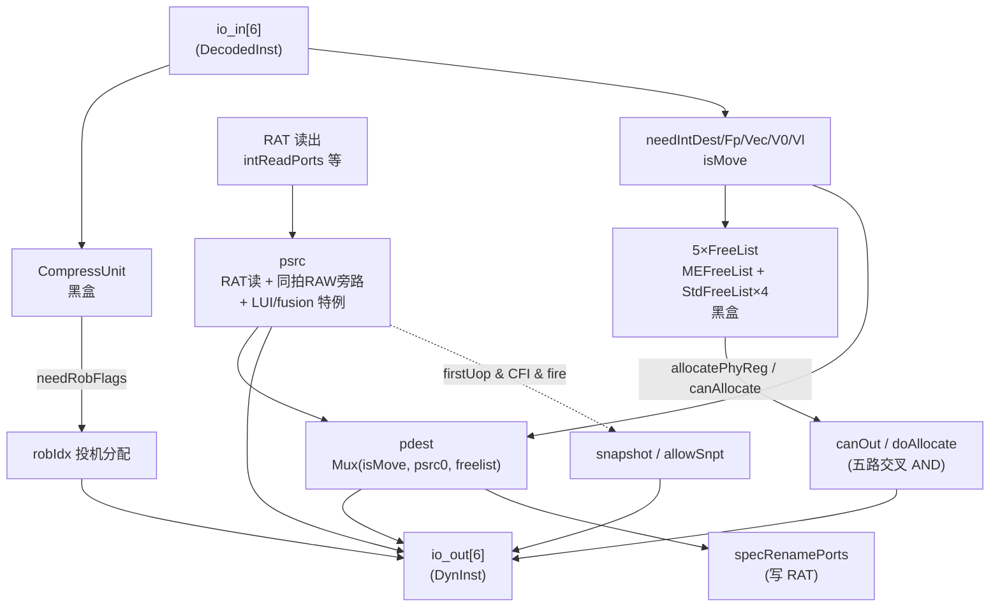

# Rename（重命名流水）—— 学习文档

> 可读核：`rtl/backend/Rename.sv`（`xs_Rename_core`）+ 类型包 `rtl/backend/rename_pkg.sv`。
> 黑盒子模块：`CompressUnit` / `MEFreeList` / `StdFreeList`(×4 变体) / `SnapshotGenerator`(golden 同名)。
> golden 顶层 `golden/chisel-rtl/Rename.sv`（6470 行 / 1579 端口）。
> **A 批（重命名教学核心）+ B 批（译码级机器）均已实现并验证**，详见 §3 / §5 / §6。

---

## 1. Rename 在后端的位置

```
Decode → 【Rename】 → Dispatch → Issue → RegRead/Bypass → Exec → Writeback → ROB(commit)
```

Rename 的唯一职责：**消除写后写(WAW)/读后写(WAR)假相关**，把指令里的「逻辑寄存器号」
翻译成「物理寄存器号」。物理寄存器远多于逻辑寄存器（整数 224 个物理 vs 32 个逻辑），
每个写寄存器的指令都拿到一个全新的物理寄存器，于是不同指令写同名逻辑寄存器不再冲突，
乱序执行得以放开。

两件核心事：
1. **源寄存器翻译（psrc）**：查「寄存器别名表 RAT」拿当前映射；再叠加**同拍内 RAW 旁路**。
2. **目的寄存器翻译（pdest）**：向「空闲列表 FreeList」要一个新物理寄存器；
   若是 `mv rd, rs`（move），做 **move elimination** 直接复用源物理号，不占新寄存器。

---

## 2. 顶层数据流



---

## 3. A 批关键设计点

### 3.1 同拍内 RAW 旁路（psrc 的关键路径）

RAT 这一拍读出的是「上拍提交后」的映射。但本拍同时进来的 6 条指令里，**前序指令
（0..i-1）可能也写了同一逻辑寄存器**——它们的新 pdest 这拍才刚算出、RAT 还没更新。
所以必须在本级把前序 pdest 直接转发给后序 psrc，否则后序读到旧映射就错了。

对第 `i` 口的第 `s` 源（用 `lsrc[s]` 作 target）：

```
普通命中(k<i): (in[k].ldest == in[i].lsrc[s]) && writeMatch
  writeMatch = srcType[s]∈{xp,fp,vp} 且 prev(k) 写对应类别
v0/vl 命中(不比 ldest): s==3 且 (vp|v0) 且 prev 写 v0 ; s==4 且 vp 且 prev 写 vl
```

命中后按 **foldLeft（低位起、最高命中口最终生效）** 折叠覆盖（`bypass_fold` 函数）。
对应 golden `bypassCond(j)(i-1)` 一位向量 + `foldLeft(Mux(next, pdest, z))`。

> **注意端口差异**：golden 顶层把 `io_in_0` 的 `lsrc_2/3/4` 优化掉了（port 0 永远不是
> 旁路消费者），只有 `io_in_1..5` 有完整 5 个 lsrc。wrapper 据此对 port 0 把 lsrc[2..4] 接 0。

### 3.2 move elimination（pdest）

`mv rd, rs` 不真正搬数据，只让 rd 也指向 rs 的物理寄存器：

```
pdest = isMove ? psrc0 : freelist_alloc
```

这是 rename 的关键路径：pdest 依赖 psrc0，psrc0 又可能来自前序 pdest（旁路），
前序 pdest 又来自 freelist……（见 Scala 注释里展开的 N 级 Mux 链）。

> **坑（已踩）**：move 源 psrc0 的取法**分口不同**——
> - **port 0**：用 `uops(0).psrc.head`，即**未被 LUI 清零**的 raw psrc0（`psrc0Raw[0]`）；
> - **port i>0**：用 `io.out(i).bits.psrc(0)`，即**已含旁路 + LUI 清零**的对外 psrc0。
>
> 起初统一用 raw 或统一用对外 psrc0 都会在不同口上出错；分口处理后归零。

`isMove` 还要排除带异常的指令：`isMove = in.isMove & ~(|exceptionVec)`。

### 3.3 LUI 的 psrc0 清零

LUI 的源寄存器恒为零寄存器，故 psrc0 强制清零：

```
isLUI = (fuType == ALU 35'h40) && (selImm ∈ {U 4'h2, LUI32 4'hB})
out.psrc0 = isLUI ? 0 : (旁路后的 psrc0)
```

> **坑（已踩）**：`35'h40` 是 **ALU**（不是 fence）。fence 是 `35'h200`，load 是 `35'h8000`。
> 一开始误把 isLUI 当 fence 条件，大量 psrc0 误清零。

### 3.4 robIdx 投机分配 + 回退

`robIdxHead` 是 ROB 的循环写指针（`flag` + `value`，value 模 `ROB_SIZE=160`）。
每条「`io_in valid && lastUop && needRobFlag`」的指令占一个 ROB 槽（压缩后的多条指令共槽）。

```
第 i 口 robIdx = robIdxHead + (它之前这种指令的个数)        // 组合
robIdxHead 下一值优先级：
  redirect            → 拉到 redirect.robIdx
  lastCycleMisprediction(误预测但不冲刷自身) → head + 1
  canOut(本拍放行)     → head + validCount
  否则                → 保持
```

`lastCycleMisprediction = RegNext(redirect.valid & ~redirect.level)`（level=flushItself）。

### 3.5 FreeList 互联（doAllocate 五路交叉 AND / canOut）

5 类物理寄存器各一个 FreeList。只有**所有 5 个都 canAllocate 且 dispatch 能收**，
才真正分配；`isWalk`（回滚重放）时一定能分配。

```
第 X 个 FreeList.doAllocate = (其余 4 个 canAllocate) & dispatchReady | isWalk
canOut = dispatchReady & (5 个 canAllocate 全 1) & ~isWalk
out.valid[i] = in.valid[i] & (5 个 canAllocate 全 1) & ~isWalk
in.ready[i]  = ~in.valid[0] | canOut
```

任一 FreeList 没空间 → canOut=0 → 整条流水卡住。

### 3.6 snapshot / allowSnpt

```
allowSnpt = notInSameSnpt & ~lastCycleCreateSnpt & in[0].firstUop
out.snapshot[i] = allowSnpt & (|brType | fuType[0]=isJump) & in.fire[i]
genSnapshot = OR over ( out.fire[i] & out.snapshot[i] )      // 喂给 FreeList snptEnq
```

> **坑 1（已踩）**：`genSnapshot` 是 **out.fire & snapshot** 的 OR，不是单纯 `|snapshot`。
> 漏掉 `out.fire` 会导致 snptEnq 与 golden 不一致，进而 FreeList 快照栈错位、
> 全核 X 污染级联。
>
> **坑 2（已踩）**：`notInSameSnpt` 的 `distanceBetween` 是**循环指针距离**：
> 同 flag 时 `headNext - lastEnq`，异 flag 时还要减半圈 `0x60`；阈值判断用
> golden 的「距离高 3bit `[7:5]` 非零」逐位复刻（见核中 `_ns_same/_ns_diff/_ns_hi`）。
> 用普通无符号比较会在跨界/异 flag 时偏差。

---

## 4. 85 个直通字段

golden 每口 111 个输出里，85 个是 `DecodedInst → DynInst` 纯直通（instr / exceptionVec /
ftqPtr / fuType / vpu_* / fpu_* / …）。核里用 `io_out_passthru[i] = io_in_bits[i]` 一句带过，
wrapper 再把 struct 成员摊回 golden 扁平端口。

此外 A 批改写的字段：`srcType_0`（fused-lui-load 改 imm）、`imm`（fence/lui32/fused-lui-load
融合）、`hasException`、`eliminatedMove`。

---

## 5. B 批：译码级组合机器（本批已实现）

下列字段是**译码级组合机器**（依赖 CompressUnit 的 masks/instrSizes/needRobFlags/
canCompressVec 做跨口归并/压缩，或依赖 vtype/emul 计算向量流数）。本批**已全部按 Scala
帮助函数语义重写**，UT 纳入逐拍比对（0 错）、FM 全部 passing（除自由计数器外）。

| 字段 | 含义 | 算法根因 |
|------|------|----------|
| `wfflags`（聚合） | 压缩窗口内任一写 fflags | `\|(masks(i) & Cat(in.wfflags))` |
| `dirtyFs` | 浮点脏标志（压缩聚合） | `\|(masks(i) & Cat(in.fpWen))` |
| `dirtyVs` | 向量脏标志（压缩聚合） | `\|(masks(i) & Cat(isDirtyVsUop))`；逐口排除标量(SCA_SIM)、原子 CAS(0x35..37)、4 条不改状态向量指令(vfmv.f.s/vcpop.m/vfirst.m/vmv.x.s) |
| `instrSize` | 压缩后指令数 | 直取 `CompressUnit.instrSizes(i)` |
| `numWB` | 压缩后写回个数 | `needRobFlags(i) ? ((i==0\|\|needRobFlags(i-1)) ? (isMove\|hasExc?0:in.numWB) : compressedWB) : compressedWB`；`compressedWB = instrSize - PopCount(mask & isMove)` |
| `lastUop`（压缩精确化） | 压缩后是否末 uop | `needRobFlags(i) & in.lastUop` |
| `traceBlockInPipe.itype` | trace 跳转类型 | isXret(csr systemop) → ExpIntReturn(3)；否则 `jumpTypeGen(brType, rd=ldest, rs=lsrc0)`（依 jal/jalr/branch 与 rd/rs 是否链接寄存器 x1/x5、是否 x0 分类 8..15，非分支跳转→None） |
| `traceBlockInPipe.iretire` | 退休半字数 | 可压缩→Σ组内 halfWordNum；否则本口+（融合则下口）halfWordNum。RVC→1、非 RVC→2 |
| `traceBlockInPipe.ilastsize` | 末指令尺寸 | 可压缩→最高命中口的 isRVC；否则本口(融合取下口)isRVC，取反（RVC→0/HalfWord、非 RVC→1/Word） |
| `numLsElem` | 向量访存元素流数 | 门控 `valid & isVlsType & ~(isVleff & lastUop)`；US(isAllUS)→2(VecMemUnitStrideMaxFlowNum)；否则按 instType={isSegment,mop} 选 `MulDataSize(emul/lmul) >> eew/sew`；emul = isWhole?GenUSWholeEmul(nf):isMasked?0:(veew-vsew+vlmul) |
| `debugInfo_renameTime` | 自由计数器 | 全局 GTimer，**仍 UT 跳过、FM 不可判**（非功能 debug 口） |

> **FuType 位序**（取自 Scala `FuType.addType` 顺序，已写入 `rename_pkg.sv`）：
> csr=5、vipu=18、vfalu=24、vldu=31、vstu=32、vsegldu=33、vsegstu=34。
> `isVlsType = fuType[31\|32\|33\|34]`、`isSegment = fuType[33\|34]`。
>
> **坑（已踩）**：`MulDataSize(mul)` 把 emul/lmul 译成「整寄存器需写字节数」(2/4/8/16)，
> 用 `priority case` 复刻查表（mul∈{0..3}→16、7→8、6→4、5→2），再 `>> eew` 得元素流数。
> emul/lmul 是 3bit 有符号（5/6/7 表示 1/8..1/2 即负），`emul>lmul` 比较必须用 `$signed`。

---

## 6. 验证

### 6.1 UT（golden 双例化逐拍比对）

- 工具：`scripts/gen_rename.py` 生成 `Rename_wrapper.sv` / `verif/ut/Rename/{variants_xs.sv,tb.sv}`。
- wrapper 把 1579 扁平端口拆/装成核的 struct/数组；子模块两侧共用 golden 黑盒。
- tb 随机激励（窄寄存器号域提高旁路命中率；redirect/walk/snapshot 稀疏触发）。
- 比对 **A 批字段**：`psrc_0..4 / pdest / robIdx_{flag,value} / *RenamePorts(wen/addr/data) /
  out_valid / in_ready / snapshot / eliminatedMove / hasException / srcType_0 / imm`。
- 比对 **B 批字段**（本批新增逐拍比对）：`instrSize / dirtyFs / dirtyVs /
  traceBlockInPipe_{itype,iretire,ilastsize} / lastUop / numWB / wfflags / numLsElem`。
  stim 增加 `fuOpType / vpu_{nf,veew,vsew,vlmul} / uopSplitType / numWB` 随机化，并偏置
  fuType 命中向量访存(31..34)/向量算术(vfalu24/vipu18)/csr(5) 以覆盖各 B 批分支。
- **内部层次探针**：`robIdxHead_value`、`intFreeList.headPtrOH`、`fpFreeList.headPtrOH`
  两侧逐拍比对（`!$isunknown` 跳 golden 启动期 X）。
- 仅 `debugInfo_renameTime`（自由计数器）与 85 直通字段在 tb 内跳过（直通字段由 FM 覆盖）。

**结果**：seed 1 / 7 / 42 各 200000 拍，errors = 0，TEST PASSED（已含全部 B 批字段）。

### 6.2 FM（Formality 等价）

- `make fm`：golden `Rename` vs 手写 `Rename_wrapper`（→核）。impl 侧也带上 golden 子模块
  （Makefile `WRAPPER_SRCS`），两侧用同一套真实子模块，其内部寄存器逐一配对。
- **实测结果（B 批补完后）**：**8375 passing / 20 failing / 0 aborted**。
  - 20 个 failing **全部是 `io_out_0_bits_debugInfo_renameTime[*]` 位**（自由计数器 GTimer，
    两侧独立计数，结构上不可等价 → 属预期，UT 亦跳过为 don't-care）。
  - **原 20 个 B 批功能字段 failing 全部消除**：`dirtyFs / dirtyVs / instrSize / numLsElem /
    traceBlockInPipe_{itype,iretire,ilastsize} / wfflags` 现全部 passing（passing 从 8338 升到 8375）。
  - **A 批字段 + 子模块内部寄存器**全部 passing（无回归）。
  - 残留 renameTime failing 由 **UT 探针证伪**：UT 把全部 B 批字段纳入逐拍比对，600K 拍 0 错，
    仅 renameTime 跳过；即除自由计数器外功能完全等价。
  - 详见 `fm_work/Rename/{fm.log,failing.rpt}`。

---

## 7. 接口要点

| 组 | 方向 | 说明 |
|----|------|------|
| `io_in[6]` | in | DecodedInst（98 字段；port0 无 lsrc_2..4） |
| `io_out[6]` | out | DynInst（111 字段；85 直通 + A 批计算 + B 批计算，均已实现） |
| `io_intReadPorts` 等 | in | RAT 读出物理号 |
| `io_*RenamePorts` | out | 写 RAT 的投机口（wen/addr/data） |
| `io_*_old_pdest` / `io_int_need_free` | in | 回收用旧物理号 |
| `io_redirect` / `io_rabCommits` | in | 重定向 / 提交·回滚 |
| `io_snpt` / `io_snptLastEnq` / `io_snptIsFull` | in | 快照 |
| `io_perf` / `io_stallReason` | out | 性能/卡顿（非 A 批功能口，置 0/直通） |
