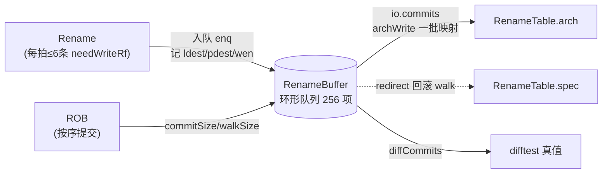
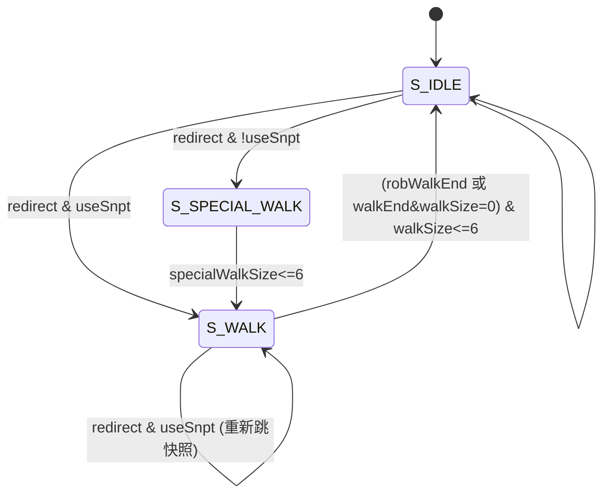

# RenameBuffer —— 重命名缓冲(Rename Buffer, Rab)

> 可读核：`rtl/backend/RenameBuffer.sv`（`xs_RenameBuffer_core`）+ `rtl/backend/renamebuffer_pkg.sv`
> 包装层：`rtl/backend/RenameBuffer_wrapper.sv`（golden 同名 `RenameBuffer`，扁平端口 → 核）
> 设计源：`src/main/scala/xiangshan/backend/rob/Rab.scala`（class RenameBuffer）
> golden：`golden/chisel-rtl/RenameBuffer.sv`（47092 行 / 2193 端口；纯叶子，仅含 SnapshotGenerator 子模块）

## 1. 它在后端的位置

后端流水：取指 → 译码 → **重命名(Rename)** → 派遣 → 发射 → 执行 → 写回 → **提交(ROB)**。

重命名(Rename)给每条写寄存器的指令分配一个**新物理寄存器**，并把"逻辑号→新物理号"
写进投机态 RAT(`spec_table`)。但**旧的物理号**还不能立刻回收给 freelist——必须等这条
指令**真正提交(commit)**、确认不会被分支错误/异常冲掉，才能把旧映射写进体系结构态
RAT(`arch_table`) 并回收旧物理号。

问题在于：**重命名是乱序流水的入口、提交是 ROB 的出口**，两者吞吐与时机都不同。
RenameBuffer(Rab) 就是夹在中间的一个 **256 项环形 FIFO**，把"入队映射"与"出队回收"
解耦：



参数(KunmingHu 默认)：`RabSize=256`，`RenameWidth=6`，`RabCommitWidth=6`，
`PhyRegIdxWidth=8`，`LogicRegsWidth=6`，`RenameSnapshotNum=4`。

## 2. 环形队列与五个指针

队列项存 `RabCommitInfo`：`{ldest, pdest, rfWen, fpWen, vecWen, v0Wen, vlWen, isMove}`。
指针都是 `CircularQueuePtr {flag, value}`：`value∈[0,256)` 环绕，`flag` 每绕一圈翻转，
用来区分"空 vs 满"和先后关系。

| 指针 | 作用 | 推进 |
|------|------|------|
| `enq_ptr` | 入队头(rename 写入位置) | + `enqCount`(本拍真正占位数)；walk 结束时跳回 `walkPtrNext` |
| `deq_ptr` | 出队头(commit 读取/弹出位置) | idle 走 `commitCount`，special_walk 走 `specialWalkCount` |
| `walk_ptr` | 回滚回放指针 | 从快照/过渡点起，walk 中 + `walkCount` |
| `diff_ptr` | difftest 真值读指针 | + `fromRob.commitSize` |
| `deq_ptr_oh` | `deq_ptr` 的 256 位 one-hot | 跟随 `deq_ptr` 左循环移位(对齐 golden 同名寄存器) |

> 注：Scala 里还有 `vcfgPtr`、`enqPtrOH`、`currentVdIdx`、条目里的 `robIdx`，但在本
> golden 例化中**没有任何输出消费**，被 firtool 优化掉，故核中不实现(保持等价)。
> 候选条目读取直接用 `(ptr.value + i) % 256` 索引数组，等价于 golden 的 `Mux1H(OH移位)`，
> 且 `value` 恒在合法范围 → 不会产生 X 索引。

## 3. 三态状态机



编码必须与 golden 一致：`S_IDLE=0`、`S_SPECIAL_WALK=1`、`S_WALK=2`。

- **S_IDLE**：正常工作。一边入队，一边按 ROB 给的 `commitSize` 把队头若干项提交
  (`io.commits.isCommit=1`)。提交即把这批 (ldest,pdest) 经 `io.commits.info` 送
  `RenameTable.archWrite` 回收旧物理号。
- **S_WALK**：分支预测错误且有快照时进入。`walk_ptr` 跳到所选快照点，从那里**逐拍把
  投机映射回放**写回 `RenameTable.spec`(`io.commits.isWalk=1`)，直到 `walk_ptr` 追上
  `enq_ptr`。回放完 `enq_ptr` 跳回 `walkPtrNext`。
- **S_SPECIAL_WALK**：分支错误但**无可用快照**时的过渡态。此时本拍**既是 commit 又是
  walk**：把"刚算出的待提交数 `commitSizeNxt`"整体转成 `specialWalkSize`，用 `deq_ptr`
  把这些项走完(同时回收 + 回放)，`specialWalkSize<=6` 时转入普通 `S_WALK`。

## 4. 压缩计数(每拍最多处理 6 项)

ROB 一拍可能告知"待提交 `commitSize` 项 / 待回滚 `walkSize` 项"，但 Rab 每拍最多处理
`RabCommitWidth=6` 项，故用累计寄存器 + 压缩：

```
commitValid[i] = (idle & i<commitSize) | (special_walk & i<specialWalkSize)   // 本拍哪几口有效
walkValid[i]   = (walk & i<walkSize)   | (special_walk & i<specialWalkSize)
commitNum/walkNum = 压缩(commitValid/walkValid)                               // 本拍实际处理条数(0..6)
commitCount       = (isCommit&!isWalk) ? commitNum : 0                        // 驱动 deqPtr/size
walkCount         = (isWalk&!isCommit) ? walkNum   : 0                        // 驱动 walkPtr/size
specialWalkCount  = (isCommit&isWalk)  ? walkNum   : 0                        // 驱动 deqPtr/size
```

size 的下一拍值(累加 ROB 新增、减去本拍处理数)：

```
commitSizeNxt      = commitSize + fromRob.commitSize - commitCount
walkSizeNxt        = walkSize   + fromRob.walkSize   - walkCount
newSpecialWalkSize = (redirect & !useSnpt) ? commitSizeNxt : 0   // 无快照回滚把待提交数转过来
specialWalkSizeNxt = specialWalkSize + newSpecialWalkSize - specialWalkCount
```

寄存：`commitSize` 在无快照 redirect 拍清零(已转给 special_walk)；`walkSize` 在 redirect 拍清零。

## 5. 入队 / 提交 / 回滚 数据流

- **入队**：`realNeedAlloc[i] = req[i].valid & (rfWen|fpWen|vecWen|v0Wen|vlWen)`；
  `enqCount = ΣrealNeedAlloc`；第 i 口写到 `allocatePtr[i] = enqPtr.value + (前 i 口占位数)`。
  这样跳过不写寄存器的指令，紧凑占位。
- **提交/回滚输出**：`io.commits.info[i]` 在 commit/special_walk 用 `deqPtr` 候选，walk 用
  `walkPtr` 候选。
- **toVecExcpMod**：special_walk 且 `vecLoadExcp.valid` 时，把提交项的 (ldest,pdest) 打一拍
  送向量异常合并模块(`preg` 端口仅取低 7 位)。
- **diffCommits**：difftest 用的"真值流"，**无旁路**直接按 `diffPtr+i` 读队列，
  `commitValid[i]=i<fromRob.commitSize`(共 255 口)。

## 6. 关键设计点 / 踩坑(重写时务必注意)

1. **`numValidEntries` 的位宽语义**：同 `flag` 时 golden 先做 **8 位**减法再零扩展
   (`{1'b0, 8'(enqVal - deqVal)}`)——借位**不进 bit8**；异 `flag` 时才是真正的 9 位
   `enqVal - 256 - deqVal`。若同 flag 路直接写 9 位减法，借位会污染 bit8，导致
   `allowEnqueue` 阈值比较错误(`canEnq` 偶发翻转)。这是本模块唯一一处隐蔽位宽坑。
2. **`allowEnqueue` 阈值**：`numValidEntries+enqCount < 251`(=size-RenameWidth+1) → 可入队；
   `< 245`(=size-2*RenameWidth+1) → 可派遣。结果打一拍输出，且 `canEnq` 还要 `&(state==idle)`。
3. **walkPtr 是无复位寄存器**，仅在四种触发(idle→walk / special_walk→walk / walk中再
   redirect&useSnpt / walk推进)下条件赋值，其余拍保持。`special_walk→walk` 跳到的是
   `deqPtrNext.head`(过渡走完后的队头)。
4. **`specialWalkEndNext = specialWalkSize < 7`**(即 `<= RabCommitWidth`)、
   **`walkEndNextCycle` 需 `walkSize < 7`** —— 是 `< 7` 不是 `<= 5`，差一即错。
5. **`vecLoadExcp.valid` 锁存**：无快照 redirect 拍载入 `fromRob.vecLoadExcp.valid`；
   `special_walk` 走完(`specialWalkEndNext`)时清零；否则保持。`toVecExcpMod` 的 fire 还要
   `state==special_walk & vecLoadExcp.valid & commitValid[i]`。
6. **被优化掉的信号**：`io_enqPtrVec`、`io_diffCommits_isCommit`(恒 1)、`vcfgPtr`、
   `currentVdIdx`、条目 `robIdx`、`vecLoadExcp` 的 isStrided/isVlm 字段——本配置无消费者，
   golden 已删，核中也不实现以保持端口与逻辑等价。

## 7. 接口(可读核 `xs_RenameBuffer_core`)

| 方向 | 信号 | 说明 |
|------|------|------|
| in  | `io_req[6]` (`rab_req_t`) | rename 入队请求(valid/ldest/pdest/各 wen/isMove) |
| in  | `io_fromRob_{commitSize,walkSize,walkEnd,vecLoadExcp_valid}` | ROB 提交/回滚指示 |
| in  | `io_redirect_valid` | 重定向(分支错误/异常) |
| in  | `io_snpt_*` | 快照端口(转发给 SnapshotGenerator 黑盒) |
| out | `io_canEnq / io_canEnqForDispatch` | 是否允许入队/派遣 |
| out | `io_commits_{isCommit,isWalk,commitValid[6],walkValid[6],info[6]}` | 提交/回滚通道 → RAT |
| out | `io_status_{walkEnd,commitEnd}` | walk/commit 是否将结束 |
| out | `io_toVecExcpMod_{valid,lreg,preg}[6]` | 向量异常映射(special_walk 用) |
| out | `io_diffCommits_{commitValid,info}[255]` | difftest 真值流 |

子模块 `SnapshotGenerator`(对 enqPtr 打快照，4 个)按黑盒例化，UT/FM 两侧共用同一 golden。

## 8. 验证结果

- **UT**(golden vs 手写双例化，逐拍比对**全部输出** + 内部层次探针：`state`/五个指针/
  `deq_ptr_oh`/三个 size/`vec_load_excp_valid`/**全部 256 个队列条目的 ldest+pdest**)：
  seed 1/7/42 各 200000 拍 `errors=0`。激励覆盖 rename 入队、commit 出队、redirect 的快照
  walk 与无快照 special_walk、walkEnd。
- **FM**：golden `RenameBuffer` vs 手写 `RenameBuffer_wrapper`(→核)，`SnapshotGenerator`
  两侧同一黑盒。**FM 未完成、无任何比对结果**：golden 是 47092 行的极大扁平叶子(256×8bit
  队列数组扇出到 6 路 commit + 255 路 diff 的巨型 Mux1H/OH 选择树)，fm_shell 在 `match`
  阶段的「Building verification models / Merging duplicated registers」步骤上反复被中止
  (fm.log 末尾为 SIGTERM `Process terminated by kill`)，始终无法走到 `verify`(三次重试
  均如此)——**从未产生 passing/failing 任何比对点结果**，既非通过也非失配，如实记录。
  **正确性改由 UT 内部层次探针保证**：tb 每拍把手写核的 `state`/五个指针(value+flag)/
  256 位 `deq_ptr_oh`/三个 size/`vec_load_excp_valid`/**全部 256 个队列条目(ldest+pdest)**
  逐一与 golden 同名内部寄存器比对，seed 1/7/42 各 200000 拍全部 0 失配——等价于对
  golden 内部状态做了逐拍形式无关的强等价检查。
