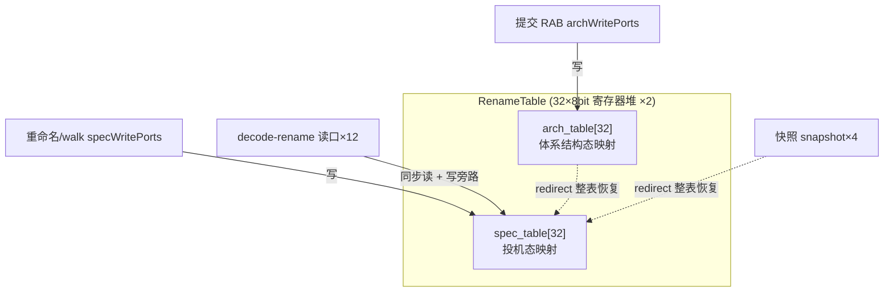
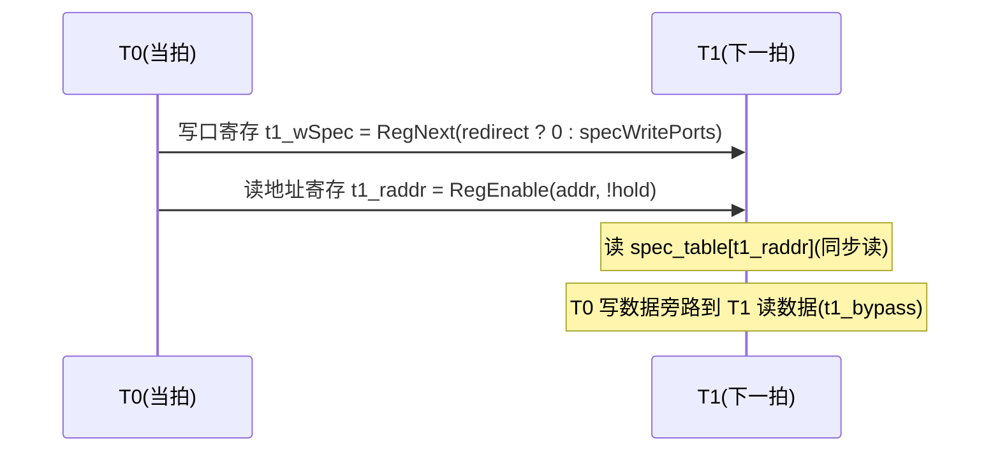

# RenameTable —— 寄存器别名表(RAT, Register Alias Table)

> 可读核：`rtl/backend/RenameTable.sv`（`xs_RenameTable_core`）+ `rtl/backend/renametable_pkg.sv`
> 包装层：`rtl/backend/RenameTable_wrapper.sv`（golden 同名 `RenameTable`，扁平端口 → 核）
> 设计源：`src/main/scala/xiangshan/backend/rename/RenameTable.scala`（class RenameTable）
> golden：`golden/chisel-rtl/RenameTable.sv`（20548 行 / 892 端口；本例化为整数 `Reg_I`）

## 1. 它在后端的位置

后端流水：取指 → 译码 → **重命名(Rename)** → 派遣 → 发射 → 执行 → 写回 → 提交(ROB/RAB)。

重命名要消除 WAR/WAW 假相关：把逻辑寄存器映射到物理寄存器。RAT 就是这张
「逻辑寄存器号 → 物理寄存器号」映射表。香山按寄存器类型实例化 5 张 RAT：

| 实例 | 类型 | 读口数/指令 | 表项数 | 说明 |
|------|------|------------|--------|------|
| **intRat** | **整数 Reg_I** | **2 (rs1/rs2)** | **32** | **本工程重写的 golden 例化** |
| fpRat  | 浮点 Reg_F | 3 | 32 | |
| vecRat | 向量 Reg_V | 3 | 31 | |
| v0Rat / vlRat | Reg_V0/Vl | 1 | 1 | |

整数 RAT：32 个逻辑整数寄存器，物理寄存器号 8 bit，RenameWidth=6（每拍最多 6 条指令）。
所以读口数 = RenameWidth × 2 = **12**。

## 2. 两张表：投机态 spec_table 与 体系结构态 arch_table



- **spec_table**：投机态映射。重命名时被写；分支预测错误(redirect)时整表回退到 arch_table
  或某个快照(snapshot)。decode-rename 级的读口读它。
- **arch_table**：体系结构态映射。仅在 RAB 提交(commit)时被写，代表"已确定不会回退"的映射；
  redirect 用它(或快照)恢复 spec_table。
- **difftest_table**：difftest 用的"真值"映射表(无旁路、直接写)，仅 basicDebugEn 时存在。

两表复位初值都为 0（整数 Reg_I：所有逻辑寄存器初始映射到物理 0）。

## 3. 关键时序：读写都打一拍（Scala 原注释）

为改善时序，读写都延迟一拍：



1. **写**：`t1_wSpec = RegNext(io.redirect ? 0 : io.specWritePorts)`。T0 的写在 T1 才真正
   落进 spec_table（redirect 拍把写口清零，防止把错误路径的写落表）。
2. **读(同步)**：`t1_raddr[i] = RegEnable(addr, !hold)`。hold=1 时保持上拍地址(stall)。
   读出 = `spec_table[t1_raddr[i]]`（地址寄存、表组合读出）。
3. **写旁路**：T0 的写数据在 T1 旁路到读数据。`t0_bypass[i][p]` = 读口 i 命中投机写口 p
   （hold 时比上拍地址 t1_raddr，否则比当拍地址）；打一拍成 `t1_bypass`（redirect 拍清零）。
   读出 = `任一旁路命中 ? 优先级选 t1_wSpec.data : spec_table[t1_raddr]`。
4. **redirect 整表恢复**：延迟两拍——`t1_redirect = RegNext(io.redirect)`，恢复发生在
   `t2_redirect = RegNext(t1_redirect)`。恢复时每项取 `t2_snpt.useSnpt ? 快照 : arch_table`。

### spec_table 写优先级（每项 e 的下一值）

```
if (t2_redirect)              // 整表回退最高优先
    spec_table[e] = t2_snpt.useSnpt ? snapshots[t2_snptSelect][e] : arch_table[e]
else if (任一投机写命中 e)     // 高编号写口优先(ParallelPriorityMux)
    spec_table[e] = 最高命中口的 t1_wSpec.data
else                          // 保持
    spec_table[e] = spec_table[e]
```

## 4. arch_table 写 + old_pdest + need_free

提交(commit)时，archWritePorts 写 arch_table（高编号口优先）。同时输出每个提交口的：

- **old_pdest[i]**：该逻辑寄存器在被本次提交覆盖**前**的旧物理号。取值优先级：
  同拍前序口(0..i-1)中最靠近 i 且写同地址者的数据 → 否则 arch_table[addr]；整体 & `{8{wen}}`。
  old_pdest 是**寄存**输出。
- **need_free[i]**：旧物理号 old_pdest[i] 在 arch_table 中已**无任何项引用**，且不与前序口的
  old_pdest 重复(去重)。为真则该物理号可回收给 freelist。need_free 也是寄存输出。
  注意 need_free 用的是**寄存**的 old_pdest 与 arch_table（与 golden 逐拍一致）。

## 5. 快照（SnapshotGenerator_4 黑盒）

对**整张 spec_table**(32×8bit)打快照，供 redirect 时整表恢复。本核把它当黑盒例化。

> ⚠️ **实现坑(本次最大的坑)**：快照黑盒的控制信号都用**打一拍**的版本——golden 把
> `io_flushVec` 接的是 **`t1_snpt_flushVec`**（寄存后），而 enq/deq/redirect 也都是 t1 版本。
> 首版误把 `io_flushVec` 接成 RAW 输入，导致快照在错误的拍被 flush/保留，snapshot 数据
> 与 golden 偏离，进而 redirect+useSnpt 恢复出的 spec_table 整片失配。改用 `t1_snpt_flushVec`
> 后通过。教训：黑盒的每根控制线都要逐一核对 golden 实例连线，别想当然用 RAW 信号。

恢复选择用**打两拍**的 `t2_snpt.useSnpt / t2_snpt.snptSelect`（与 t2_redirect 对齐）。

## 6. 复位域细节（与 golden 对齐）

| 寄存器 | 复位 | 说明 |
|--------|------|------|
| spec_table / arch_table / difftest_table | 异步复位 0 | |
| old_pdest / need_free | 异步复位 0 | |
| t1_redirect / t1_snpt_* / t2_snpt_* | 异步复位 0 | GatedValidRegNext(.,0) / RegNext(.,0) |
| **t2_redirect / t1_wSpec / t1_bypass / t1_raddr** | **无复位** | golden 不带 reset 的 always(RegNext 无初值) |

`t1_raddr` 无复位 → 复位后头几拍读出为 X（don't-care），UT 用 `!$isunknown(golden)` 跳过。

## 7. 接口表（核 `xs_RenameTable_core`，wrapper 拆成 golden 扁平端口）

| 信号 | 方向 | 含义 |
|------|------|------|
| io_redirect | in | 分支预测错误重定向 |
| io_readPorts_in[12] (hold/addr) | in | 12 个读口(同步读地址 + stall) |
| io_readPorts_data[12] | out | 读出的物理寄存器号 |
| io_specWritePorts[6] (wen/addr/data) | in | 投机写口(重命名/walk) |
| io_archWritePorts[6] (wen/addr/data) | in | 体系结构写口(commit) |
| io_old_pdest[6] | out | 各提交口的旧物理号 |
| io_need_free[6] | out | 各旧物理号可回收 |
| io_snpt_* | in | 快照端口(转发黑盒，注意用 t1 版本驱动) |
| io_diffWritePorts[255] | in | difftest 真值表写口(无旁路) |
| io_diff_rdata[32] | out | difftest 真值表读出 |

## 8. 关键参数（renametable_pkg）

| 参数 | 值 | 含义 |
|------|----|------|
| NUM_ENTRY | 32 | 逻辑寄存器数 IntLogicRegs |
| ADDR_W | 5 | 逻辑寄存器号位宽 |
| PHYREG_W | 8 | 物理寄存器号位宽 PhyRegIdxWidth |
| RENAME_WIDTH | 6 | 每拍重命名口数 |
| NUM_READ | 12 | 读口数 = RenameWidth × 2 |
| COMMIT_WIDTH | 6 | 提交/回滚口数 RabCommitWidth |
| NUM_DIFF | 255 | difftest 写口数 (RabCommitWidth × MaxUopSize) |
| SNAPSHOT_NUM | 4 | 快照个数 |

## 9. 验证结果

- **结构闸门**：`typedef struct packed` 2（pkg：rat_wport_t / rat_rport_t）、
  `function automatic` 1（纯函数 prio_pick，只用参数）、`for` 28；行数 385（golden 20548）。
  生成痕迹 grep 命中处全部为 `io_snapshots_*_*` / `io_enqData_*`（SnapshotGenerator_4 黑盒
  端口名，golden 强制命名，不可改），核自身逻辑 0 生成痕迹。
- **FM 关键坑**：表更新逻辑首版写成读取模块级信号的 `function`，Formality 报
  "non-local variable in function"(FMR_VLOG-091) → RTL 解释错误 → impl 读取失败。
  改成 `always_comb` 直接算各 `*_next` 数组(纯函数只收参数)后，FM 干净通过。
- **UT**（golden vs 手写双例化，逐拍比对全部输出：readPorts_data / old_pdest / need_free /
  diff_rdata，外加内部 spec_table / arch_table 32 项层次探针；覆盖投机写/体系结构写/
  同步读+旁路/redirect 整表回退/快照恢复/diff 写）：
  seed 1 / 7 / 42 各 **200000 拍 checks=200000 errors=0**。
- **FM**（golden `RenameTable` vs 手写 wrapper→核，SnapshotGenerator_4 两侧同一黑盒）：
  `FM_RESULT: Verification SUCCEEDED`。
