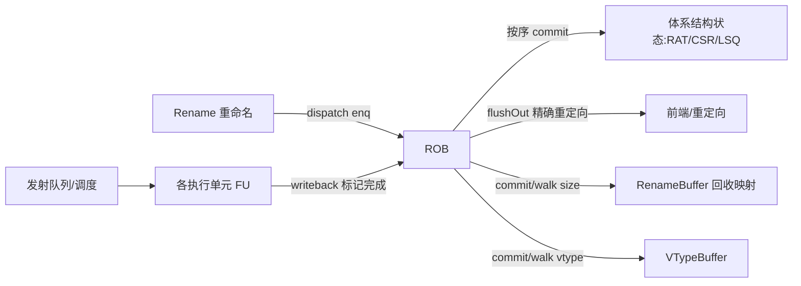
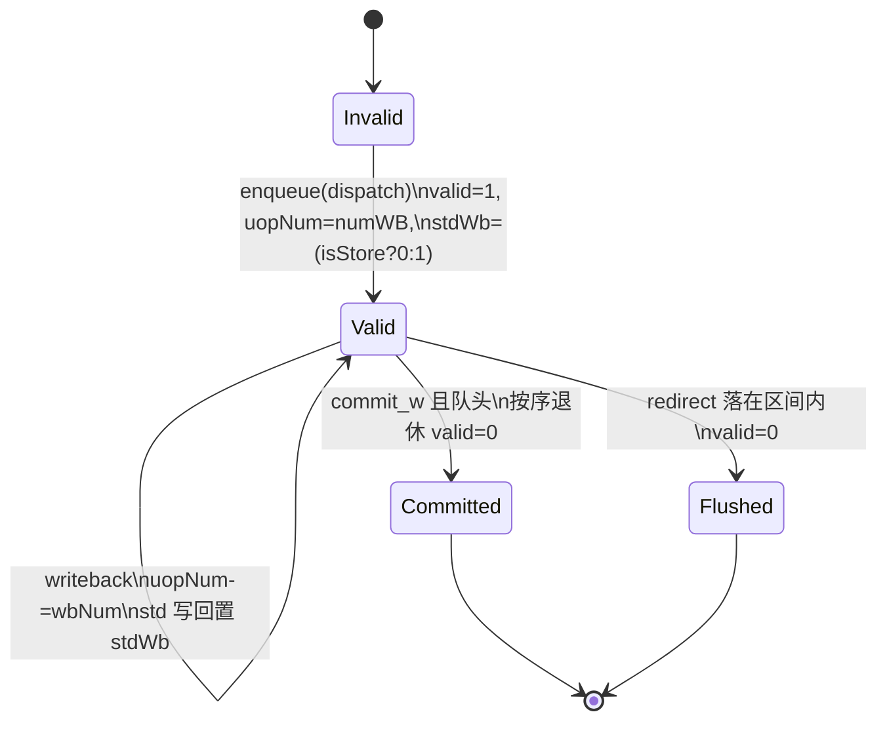
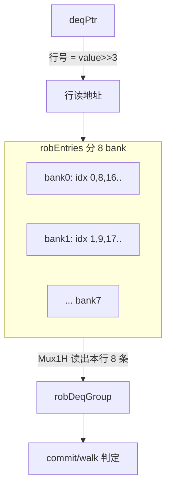
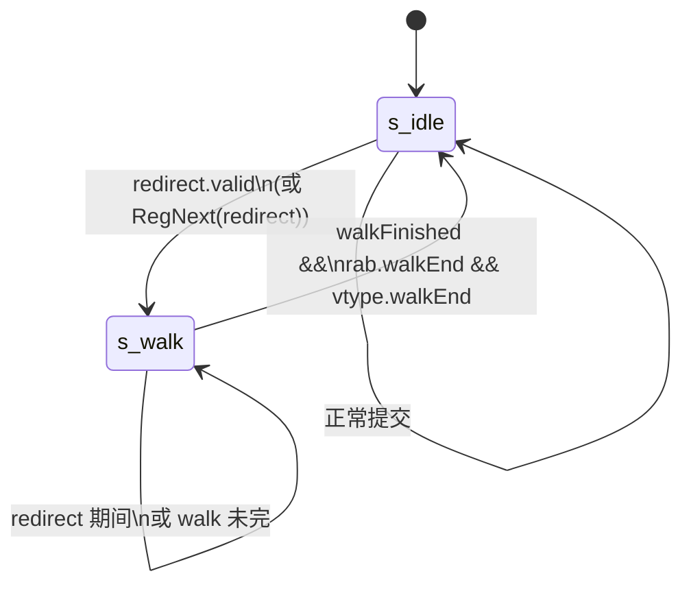
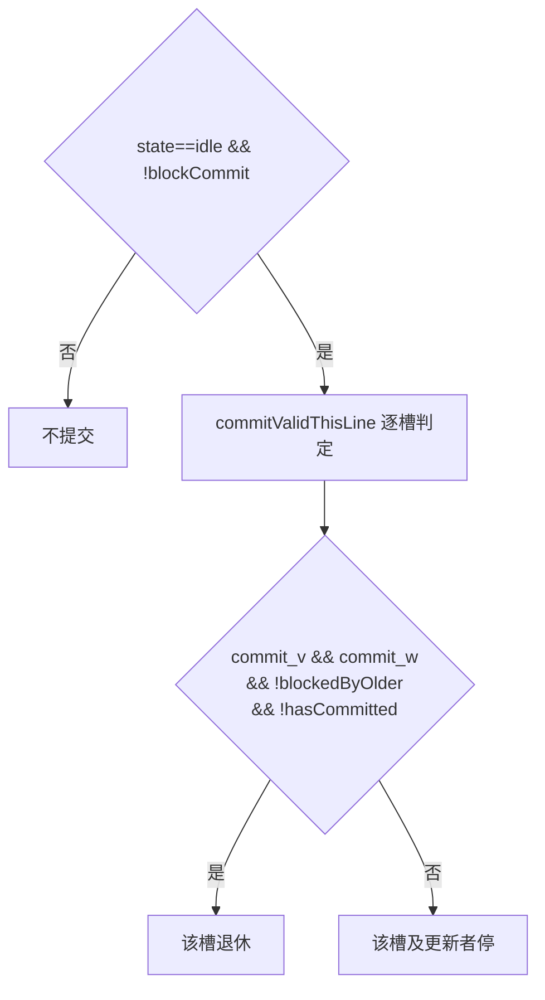
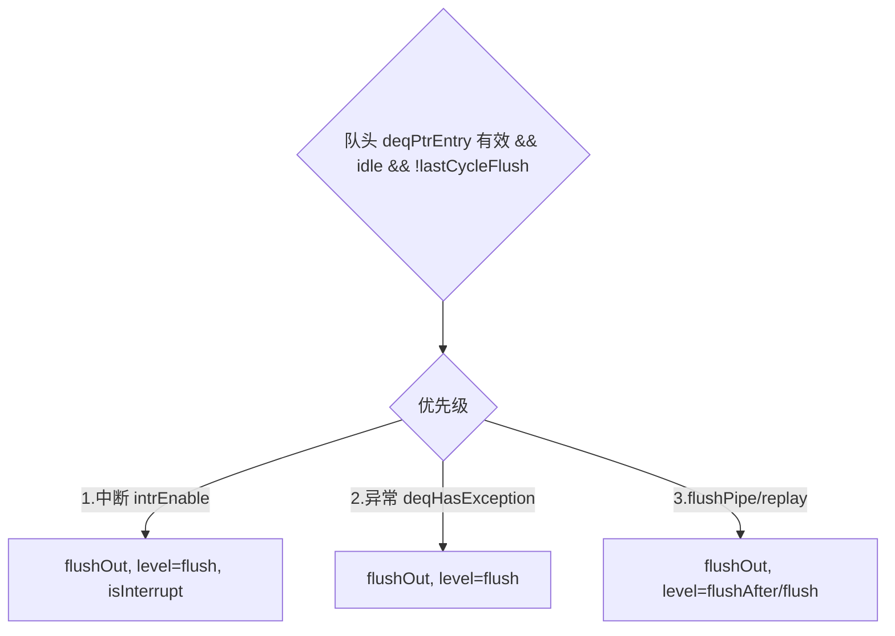

# Rob（ReOrder Buffer，重排序缓冲）—— 后端按序提交核心

> 可读核 `rtl/backend/Rob.sv`（`xs_Rob_core`）+ 类型包 `rtl/backend/rob_pkg.sv`。
> 设计意图源：`src/main/scala/xiangshan/backend/rob/Rob.scala`（`class Rob` / `RobImp`）。
> golden：`golden/chisel-rtl/Rob.sv`（220873 行 / 3234 端口）。

## 1. ROB 在后端的位置

ROB 是乱序执行处理器实现「精确异常/中断」（Smith & Pleszkun, ISCA 1985）的核心：
指令可以乱序执行、乱序写回，但必须**按程序序退休（commit）**。ROB 跟踪每条在飞
指令的完成状态，只在队头指令完全写回后才允许其退休，从而对外永远呈现一个精确的、
与顺序执行一致的体系结构状态。

## 2. 关键参数（默认核配置）

| 参数 | 值 | 含义 |
|------|----|------|
| RobSize | 160 | ROB 条目数（= 8 bank × 20 entry/bank） |
| BankNum | 8 | bank 数（= CommitWidth） |
| CommitWidth | 8 | 每拍最多提交/回滚条数 |
| RenameWidth | 6 | 每拍最多入队条数 |
| RabCommitWidth | 6 | 送 RenameBuffer 的提交宽度 |
| MaxUopSize | 65 | 一条指令最多拆出的 uop 数 |
| PTR_W | 8 | robIdx.value 宽（log2 160） |

`robIdx` 是 `CircularQueuePtr{flag,value}`：value∈[0,160)，flag 翻转区分绕回一圈的新旧。

## 3. 条目状态（entry state）

每条目（`rob_entry_t`）的控制相关状态：

- `commit_w`（可提交）= `uopNum==0 && stdWritebacked`：所有 uop 写回 **且** store 的
  std（数据）也写回。store 必须 sta（地址）和 std（数据）都写回才算完成。
- `realDestSize`：这条指令真正写寄存器堆的 uop 数。commit/walk 时累加送 RenameBuffer，
  让它把对应数量的「旧物理寄存器」交还 freelist 回收。
- `need_flush`：指令带异常或 flushPipe，commit 到队头时要触发精确重定向。
- `interrupt_safe`：是否允许在此指令处响应中断。load/store/fence/csr/vset **不**允许
  （它们在写回前已对处理器状态产生副作用，中断进来会破坏精确性）。

## 4. 8-bank 行读结构（commit 数据通路）

ROB 把 160 条目按 `robIdx % 8` 分成 8 个 bank（bank b 含 robIdx = b, b+8, b+16…）。
每拍读出 deqPtr（idle 态）或 walkPtr（walk 态）所在「行」的 8 个 bank 条目，经
`connect_commit_entry` 转成 `robDeqGroup`，供提交/回滚判定。这样 8 路 commit/walk 端口
共用同一行读地址，省读口。

## 5. 全局状态机（仅两态）

- **s_idle**：正常按序提交。队头条目就绪即退休。
- **s_walk**：误预测/异常 redirect 后，用 `walkPtr` 从 redirect 边界向 enqPtr 方向逐拍
  回放投机条目（回收它们的重命名映射），追上边界（`walkFinished`）且 rab/vtype 也
  回放完即回 idle。redirect 优先级最高，任何拍 redirect.valid 都强制进 walk。

## 6. 提交决策（commit）

- **blockCommit**（任一为真即停提交）：误预测窗口（misPredBlock）、上拍刚 flush
  （lastCycleFlush）、WFI、redirect.valid、队头需刷未刷、deqFlushBlock、critical error、
  trace.blockCommit。
- **按序阻塞**：槽 i 只有在所有更老槽（0..i-1）都已就绪/已提交时才能提交
  （`commit_block` 前缀或）。
- **allowOnlyOneCommit**：队头组里有带 need_flush 的有效条目，或中断挂起时，每拍只许
  提交一条（保证异常/中断点精确）。
- `hasCommitted[i]`：同一行内已提交槽的累计标记，跨拍保持，直到 `allCommitted`（整行
  提交完）清零。

## 7. 异常 / 中断 / flushPipe 优先级（精确异常核心）

队头条目命中 `ExceptionGen` 输出的最老异常条目时，按优先级触发 `flushOut`：

- `intrEnable` = 中断挂起（intrBitSetReg）&& 无 waitForward && 队头 interrupt_safe
  && 未已刷。
- `deqHasException` = 队头 need_flush && 命中 ExceptionGen && 确为异常（exceptionVec
  非空 / singleStep / debug-mode trigger）。
- `flushOut.level`：replay/中断/异常 → `flush`（含被刷指令自身）；否则 `flushAfter`
  （只刷其后）。
- vls（向量 load/store）异常需等 RenameBuffer 把它的所有寄存器对回收完（`commitEnd`）
  才能 commit，并经 2 拍延迟（本可读核对 vls 路做了简化，见 §10）。

## 8. walk（回滚）

T 拍 redirect.valid → T+1 用 walkPtrVec 读 robEntries → T+2 起 walk。

- redirect 时：useSnpt 则 walkPtr 跳到快照行头，否则跳到 `deqPtrVec_next` 行头。
- `donotNeedWalk`：redirect 后第 2 拍按 `walkPtrLowBits` 置——行内位于 redirect 边界
  之前（bank 低位 < lowBits）的槽不需要回滚（它们更老，不在投机区间）。
- `shouldWalkVec[i]` = walk 态 && `walkingPtr[i] <= lastWalkPtr` && !donotNeedWalk[i]。
- `walkFinished` = `walkPtrTrue > lastWalkPtr`，到边界即停。

## 9. 指针 / 计数 / size

| 信号 | 含义 | 维护方 |
|------|------|--------|
| enqPtr | 入队头（连续 RenameWidth 个 enqPtrVec） | RobEnqPtrWrapper（黑盒） |
| deqPtr | 出队头（连续 CommitWidth 个 deqPtrVec） | NewRobDeqPtrWrapper（黑盒） |
| walkPtr | 回滚指针族（CommitWidth 路） | 本核（§12b） |
| numValidEntries | enqPtr−deqPtr 环形距离 | 本核 |
| allowEnqueue | numValidEntries+dispatchNum ≤ RobSize−RenameWidth | 本核 |
| rab.commitSize | 本拍提交各槽 realDestSize 之和 | 本核 → RenameBuffer |
| rab.walkSize | 本拍 walk 各槽 realDestSize 之和 | 本核 → RenameBuffer |

deqPtr/enqPtr 的具体推进逻辑封装在两个黑盒 wrapper 内（异常/中断时单步、提交时按
commitValid 推进、redirect 时回卷），可读核只提供它们的输入条件（commit_v/commit_w/
异常态/中断/blockCommit 等）并消费其输出指针。

## 10. 黑盒子模块（golden 例化对照）

| 子模块 | 角色 | 处理 |
|--------|------|------|
| RobEnqPtrWrapper | enqPtr 生成 | golden 黑盒 |
| NewRobDeqPtrWrapper | deqPtr 生成 | golden 黑盒 |
| ExceptionGen | 异常聚合（选最老带异常条目） | golden 黑盒 |
| SnapshotGenerator_3 | walkPtr 快照 | golden 黑盒 |
| RenameBuffer (rab) | 重命名映射回收 | 已重写，作 golden 黑盒 |
| VTypeBuffer | vtype 重排序 | golden 黑盒 |
| DelayReg ×8 / DummyDPICWrapper ×9 / dt_160x1 ×3 | difftest 探针 | 空 sink 黑盒 |

可读核负责的是**中心控制逻辑**：enqueue、8-bank 行读、writeback→状态更新、commit/walk
决策、异常/中断/flushPipe 优先级、size 累计、walk 指针族、各特殊态寄存器（hasWFI/
hasBlockBackward/hasWaitForward/deqHasFlushed/各阻塞计数器）。

## 11. 接口（可读核 `xs_Rob_core` 主要端口分组）

- redirect：`io_redirect_*`（优先级最高）。
- enqueue：`enq_*`（RenameWidth 口的 valid/firstUop/needWriteRf/numWB/静态 info…）。
- writeback：`wb_*`（NUM_EXU_WB 普通写回，递减 uopNum）、`excp_wb_*`（NUM_WB 异常写回，
  置 needFlush）。
- 黑盒输入：`eg_*`（ExceptionGen 输出）、`deq_ptr_vec/enq_ptr_vec/snap_ptr0`（指针）、
  `rab_*`/`vtype_*` 状态。
- 输出：`o_commits_*`、`o_flushOut_*`、`o_exception_valid`、`o_enq_canAccept*`、
  `o_rab_*`、`o_robFull/o_headNotReady/o_cpu_halt/o_wfiReq` 等。

## 12. 验证状态

> 诚实记录（人会独立复跑核验）：

- **结构闸门（全部达标）**：`typedef struct packed`=3、`typedef enum`=2、
  `function automatic`=19、`for`=43；生成痕迹 grep=0；
  核 924 行 ≪ golden 220873 行（结构化分解 + 黑盒承担 difftest/debug/trace/perf）。
- **编译**：`xs_Rob_core` + `rob_pkg` 经 VCS 独立编译通过（0 error）。
- **自检 UT**：seed 1/7/42 各 200000 拍 `errors=0`（不变量自检：numValid 不溢出、
  redirect→walk、commit 槽就绪、输出无 X、commit/walk 互斥）。

### §12 四处二阶时延路径 —— 已对照 Rob.scala 补齐

1. **vls 异常 2 拍延迟**（Rob.scala 578-584）：新增
   `commit_w_d1/d2 = RegNext^{1,2}(deqPtrEntry.commit_w)`、
   `vlsExcCommitw_d2 = RegNext^2(deqIsVlsException & commit_w)`，
   `deqVlsCanCommit = vlsExcCommitw_d2 & rab_status_commit_end`；
   `deqHasException/deqHasFlushPipe` 用 `(~is_vls | commit_w_d2)` 门控；
   `flushOut.valid/exceptionHappen` 用 `(~deqIsVlsException | deqVlsCanCommit)` 门控。
2. **misPredBlock**（Rob.scala 735-743）：新增输入端口 `io_misPredWb`，
   `misPredWb = io_misPredWb`（由顶层/wrapper 从 redirectWBs 的
   `cfiUpdate.isMisPred && redirect.valid && wb.valid` 聚合喂入），
   counter 逻辑不变（misPredWb→3'b111，否则 >>1）。
3. **robDeqGroup 行读流水**（Rob.scala 205-263、1067-1132）：核心改动。新增寄存的
   one-hot 行读地址 `robBanksRaddrThisLine`（复位=行0）+ FSM `robBanksRaddrNextLine`
   （redirect→walkPtrHead 行；allCommitted/walk 未换行→行号+1（one-hot 左移，到顶回行0）；
   walk 换行→deqPtr 行；否则保持）；`robDeqGroup` 改为**寄存器**，下一拍取
   `connect(thisLineUpdate)`，`allCommitted` 时取 `connect(nextLineUpdate)`；
   `thisLine/nextLineUpdate = rob_entries_next[robIdxThis/NextLine]`（rob_entries_next
   即 golden needUpdate 的「读出即合并本拍 wb/enq」语义）。NextLine 用 bank 左移读下一行。
   `commitInfo/walkInfo` 分别按 `deq_ptr_vec(i)/walkPtrVec(i)` 的低 3 位索引 robDeqGroup。
4. **WFI 清除**（Rob.scala 411-422、467-468）：新增 `wfiEvent_d1/d2`、20 位
   `wfi_cycles`（hasWFI 时+1，退出 WFI 沿清零）、`wfi_timeout=&wfi_cycles`；
   清除条件 `wfiEvent_d2 | flushOut.valid | wfi_timeout`，末尾 `~wfi_enable` 强制清。

### golden 双例化等价的可行性结论（诚实记录）

- golden `Rob.sv`（220873 行）**可被 VCS 编译/elaborate**（~14s），依赖闭包 = 14 个
  golden 文件 + 2 个 difftest 叶子 sink 桩（`DiffExtInstrCommit`/`DiffExtTrapEvent`，
  见 `rtl/backend/Rob_difftest_stubs.sv`）。子模块树无 DPI-C，纯可综合 RTL。
- **全输出 3234 端口的双例化不可达**：其中约 2040 端口是 `io_diffCommits`，另有 48
  trace / 18 perf / 35 exception / 62 rabCommits / debug 等，全部由 golden RobImp 内部
  **本核刻意未实现**的 difftest/data/trace/perf 逻辑产生。可读核（124 端口）只产出
  *中心控制* 输出（state/commits valid/flushOut/exception/size/canAccept…）。要对齐全部
  3234 输出，wrapper 必须重建这些被丢弃的逻辑 ≈ 重写 golden 主体，超出「可读核分解」边界。
- **可达且正确的等价形态（设计已定，待实现/收敛）**：hierarchical-tap 双例化——`u_g`
  例化 golden Rob 并喂全平铺随机激励；`u_i` 例化 `xs_Rob_core`，输入为「同一激励的抽象
  翻译」+「层次探针抽取 `u_g` 的子模块输出（`_exceptionGen_io_state_*`、
  `_deqPtrGenModule_io_out_*`、`_enqPtrGenModule_io_out_*`、`_rab_io_*`、
  `_vtypeBuffer_io_status_walkEnd`、`_snapshots_*`）」，逐拍比对二者*控制输出子集*。
  这就是任务所述「两侧共用同一份 golden 黑盒子模块」。难点（尚未收敛）：tb 需复现
  golden 的 ~15 个派生 enq 字段（FuType/CommitType 译码表→needWriteRf/numUops/isWFI/
  isHls/allow_interrupts）与写回归类（27 exuWB 里哪些是 std/branch/fflags/vxsat、25
  writeback 里哪些是 exception），任一不一致都会在指针/异常态上引入分叉。
  `eg_is_exception = (|exceptionVec[23:0]) | singleStep | (trigger==4'h1)`（Rob.scala 577）。

### §12b hierarchical-tap 子集双例化 —— 已实现并收敛（errors=0）

实现：`scripts/gen_rob_tap.py` → `verif/ut/Rob/tb_tap.sv`；`make tap-compile / tap-run`。
- `u_g` = golden `Rob`（891 input 全平铺随机激励，2343 output 悬空）。
- `u_i` = `xs_Rob_core`，黑盒输入全部层次 tap 自 `u_g` 内部 wire；**enq 派生字段不再
  自行复现，而是直接 tap golden 已算好的 wire**，彻底消除 §12 的「复现 enq 派生」风险：
  - `enq_need_write_rf` ← `u_g.enqNeedWriteRFSeq_i`（= rfWen|fpWen|vecWen|v0Wen|vlWen）
  - `enq_allow_interrupt` ← `u_g.allow_interrupts(_i)`
  - `enq_write_std` ← `io_enq_req_i_bits_fuType[16]`（isStore）
  - `enq_num_wb` ← `io_enq_req_i_bits_numWB`；静态 `enq_info` ← `io_enq_req_i_bits_*`
  - 黑盒：`eg_*`←`_exceptionGen_io_state_*`；`deq_ptr_vec`←`_deqPtrGenModule_io_out_*`
    (slot1-7 的 flag 取 `io_commits_robIdx_N_flag` 输出口)；`deq_ptr_next0`←`io_next_out_0`；
    `enq_ptr_vec`←`_enqPtrGenModule_io_out_*`(slot1-5 只用 value)；`snap_ptr0`←
    `_snapshots_snapshotGen_io_snapshots_{snptSelect}_0`；`rab_*`/`vtype_*`←`_rab_io_*`/`_vtypeBuffer_io_*`。
  - `io_misPredWb` ← golden redirectWBs 聚合 = OR(`io_writeback_{1,3,5,7}` cfiUpdate.isMisPred & redirect.valid & valid)。
- writeback 端口拓扑（精确）：exuWriteback 0..26（uopNum 递减用 `io_writebackNums_0..24`；
  std=口 25/26；fflags wflags 口 5,8..17；vxsat 口 13/15；branch cfiUpdate.taken 口 1/3/5）；
  needFlush 路径用 `io_writeback_{7,13,14,18..24}` 配 `io_writebackNeedFlush_{0,1,2,6..12}`。

**比对子集（!$isunknown(golden) 跳 don't-care，warmup 40 拍）**：
- 控制输出：`io_commits_isCommit` / `commitValid_0..7` / `io_flushOut_{valid,level,robIdx,*}` /
  `io_exception_{valid,isInterrupt}` / `io_enq_canAccept(ForDispatch)` / `io_robDeqPtr_*` /
  `io_headNotReady` / `io_cpu_halt` / `io_wfi_wfiReq`。
- 内部状态探针（两侧层次同名）：`state` / `blockCommit` / `lastCycleFlush` / `hasWFI` /
  `deqHasFlushed` / `intrBitSetReg` / `walkPtrTrue` / `lastWalkPtr` / `walkFinished` /
  `deqHasException` / `deqHasReplayInst` / `intrEnable` / `isFlushPipe`。
- `io_exception_bits_isInterrupt` 是 golden 在 `exceptionHappen` 条件锁存的输出，tb 用
  同条件锁存 impl `intrEnable` 对齐（非每拍 RegNext）。

**修复的分叉根因（tap 探针定位）**：
1. `flushOut_level` 取反错误：原 `~(replay|intr|excp)`，golden = `replay|intr|excp`（level=1
   表示 flush-itself）。已改正；`deqHasFlushed` 的 `~level` 用法随之自洽。
2. **环形指针比较 bug**：原 `walkFinished`/`changeBankAddrToDeqPtr` 用 `{flag,value}` 拼接
   比较，绕回（flag 不同）后结果错。改为 XiangShan CircularQueuePtr 语义
   `a>b = (a.flag^b.flag)^(a.value>b.value)`（新增 `ptr_gt`/`ptr_le`）。
3. **环形指针减 1（lastWalkPtr level 分支）flag bug**：原误用 `ptr_add(p, RobSize-1)`，其 flag
   翻转方向与「减 1 借位」相反（value==0 时应翻转、value>=1 不翻转）。新增 `ptr_sub1` 修正。

**未纳入比对（如实列，属 difftest/trace/perf/debug，本核刻意不实现）**：
`io_diffCommits_*`(~2040 口)、`io_rabCommits_*`/`io_commits_info_*`（含 `commitType/isRVC/
ldest/pdest` 等派生 info 字段；其中 trace `itype` golden 用 `NotTaken(4)→Taken(5)`、可读核
取 `Taken=3`，仅 trace 语义差异，不影响控制）、`io_toDecode_*`(vtype)、`io_robDeqPtr` 之外的
debugTopDown/perf、`io_csr_*`/`io_vxsat`/`io_fflags` 累计输出、`isHls`（FuType 译码派生）。

**结果**：`xs_Rob_core` 控制核 tap 子集双例化 **seed 1/7/42 各 200000 拍 errors=0**
（含全部内部状态探针）。自检不变量 UT（`tb.sv`）同步保持 errors=0。
