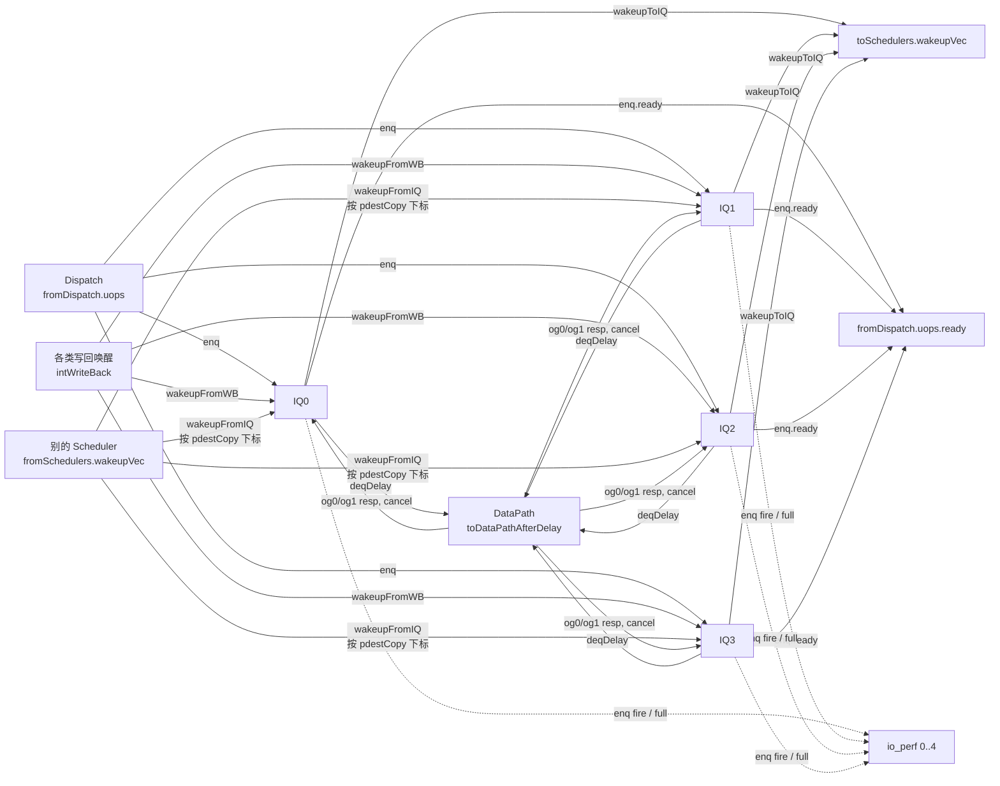

# Scheduler(Int 变体)—— 发射调度顶层

> 设计源:`src/main/scala/xiangshan/backend/issue/Scheduler.scala`
> (`class Scheduler` / `SchedulerImpBase` / `SchedulerArithImp`)
> golden:`golden/chisel-rtl/Scheduler.sv`(2906 行,782 端口,Int 变体)
> 可读核:`rtl/backend/Scheduler.sv`(864 行)+ `scheduler_int_pkg.sv` + `scheduler_int_iq_connect.svh`

## 1. 架构定位

Scheduler 是「发射调度顶层」,把若干个 **IssueQueue(发射队列)** 例化在一起,
并把它们之间、以及它们与 Dispatch / DataPath / 其它 Scheduler 的连线兜起来。

关键认识:**Scheduler 本身几乎不含算法逻辑**。真正的乱序调度(条目阵列、
年龄仲裁、唤醒队列、FU busy 表)全部封装在被它例化的 IssueQueue 子模块里
(见 `IssueQueueAluCsrFenceDiv` 文档)。Scheduler 是一个**互联(glue)模块**。

本工程的 Backend 实例化了 4 个 Scheduler(Int/Fp/Vf/Mem)。本文档对应 **Int Scheduler**,
内含 4 个发射队列:

| 编号 | IssueQueue 类型 | 承担的功能单元 | enq 端口 | perf full 位 |
|------|----------------|---------------|---------|-------------|
| IQ0  | `IssueQueueAluMulBkuBrhJmp`                  | ALU/乘法/位操作/分支跳转 | uops 0,1 | bit0 |
| IQ1  | `IssueQueueAluMulBkuBrhJmp`(第二份)         | 同上 | uops 2,3 | bit1 |
| IQ2  | `IssueQueueAluBrhJmpI2fVsetriwiVsetriwvfI2v` | ALU/分支/I2F/Vset | uops 4,5 | bit2 |
| IQ3  | `IssueQueueAluCsrFenceDiv`                   | ALU/CSR/Fence/除法 | uops 6,7 | bit3 |

## 2. 数据流



## 3. Scheduler 做的三件事(可读核三节)

### A) 例化 4 个 IssueQueue 并互联(`scheduler_int_iq_connect.svh`)
纯连线:每个 IQ 的端口直接连到 Scheduler 顶层对应端口。无任何组合/时序逻辑。

**唤醒网络的关键设计点 —— pdest 多拷贝**:同一个唤醒源(exuIdx)给每个 IQ
提供「不同的 pdest 拷贝」(`pdestCopy_0/1`、`rfWenCopy_*`、`loadDependencyCopy_*`)。
这是物理上为缩短唤醒目的寄存器号扇出的时序而做的复制,拷贝下标由 IQ 在调度块内
的位置决定(本变体:IQ0/IQ1 取 copy0,IQ2/IQ3 取 copy1,见 `copy_idx_of_iq()`)。
golden 把「选哪份拷贝」固化为「连到哪个 `pdestCopy_k` 端口」,svh 据此直连。

### B) dispatch-ready 透传
每个 IQ 的 `enq0.ready` 回送给对应的 `fromDispatch.uops.ready`(4 条 assign)。

### C) 发射 perf 统计(唯一的真实逻辑)
- `enq_fire[8]` = 每 IQ 每路 `enq.ready & uop.valid`(用 `genvar/for` + 二维
  `enq_ready/enq_valid` 数组生成);
- `iq_full[4]` = 每 IQ 的 `enq0.ready`;
- 三级 RegNext 流水(与 firtool 一致):先把 `enq_fire/iq_full` 各打一拍
  (`last_cycle_*`),再对已寄存的 `enq_fire` 求 `popcount8`(故计数比 fire 晚一拍),
  最后再打一拍输出。`perf_sample_t` struct 表达两级流水。

## 4. 重写方法学(为什么是「可读核 + 机械互联 svh」)

对 golden 的端口级分析:355 个输出里 **346 个由 IQ 例化内部直接驱动**(纯连线),
仅 9 个 `assign`(4 条 ready 透传 + 5 条 perf 输出);整模块唯一的时序/组合逻辑就是
perf 计数树 + 两级 RegNext。即 Scheduler 是「真正的互联模块」,符合 `.svh 套壳闸门`
的**合法场景**(逻辑都在被黑盒的 IssueQueue 子模块里)。

- `scheduler_int_pkg.sv`:参数 + `iq_id_e` 枚举 + `perf_sample_t` struct +
  `copy_idx_of_iq()` / `popcount8()` 函数。
- `Scheduler.sv`(可读核 = golden 同名顶层):A/B/C 三节,perf 用 genvar/for。
- `scheduler_int_iq_connect.svh`:4 个 IQ 例化 + 539 条端口直连,**0 个 `_GEN_/_T_`**。

## 5. 验证结果

### 结构闸门
| 项 | 结果 |
|----|------|
| `typedef struct packed` | 1(`perf_sample_t`) |
| `typedef enum` | 1(`iq_id_e`) |
| `function automatic` | 2(`copy_idx_of_iq`/`popcount8`) |
| `genvar` / `for` | 1 / 1(perf 计数) |
| 核+pkg 生成痕迹(`io_*_N_N`/`_REG_N`/`_GEN_`/`_T_N`/`RANDOMIZE`) | **0** |
| svh `_GEN_/_T_` 密度 | **0**(纯例化+连线) |
| 行数 | 864(核)vs golden 2906 |

### UT(双例化逐拍比对全部 355 输出)
u_g=golden `Scheduler`,u_i=可读核 `Scheduler_xs`;两侧共享 golden IQ 黑盒(33 模块闭包)。

| seed | checks | errors |
|------|--------|--------|
| 1  | 200000 | 0 |
| 7  | 200000 | 0 |
| 42 | 200000 | 0 |

> 早期 perf 流水深度差一拍曾导致 `io_perf_*` 大量 mismatch(其余 350 输出始终全对),
> 按 golden 「先寄存 enq_fire 再 popcount」的三级流水修正后 0 错。

### Formality 等价
`FM_RESULT: Verification SUCCEEDED`。17972 个 compare point 全 passing,
0 unmatched / 0 failing;其中 28 个由**签名分析**配对(正是被改名的 perf 流水寄存器),
证明等价靠逻辑而非名字。

## 6. 复跑
```bash
cd verif/ut/Scheduler && cp Makefile.sched Makefile
source ../../../scripts/env.sh
make compile
make run SEED=1   # 同理 SEED=7 / SEED=42
make fm
```
生成器:`python3 scripts/gen_scheduler_int.py`
