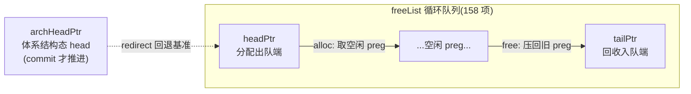
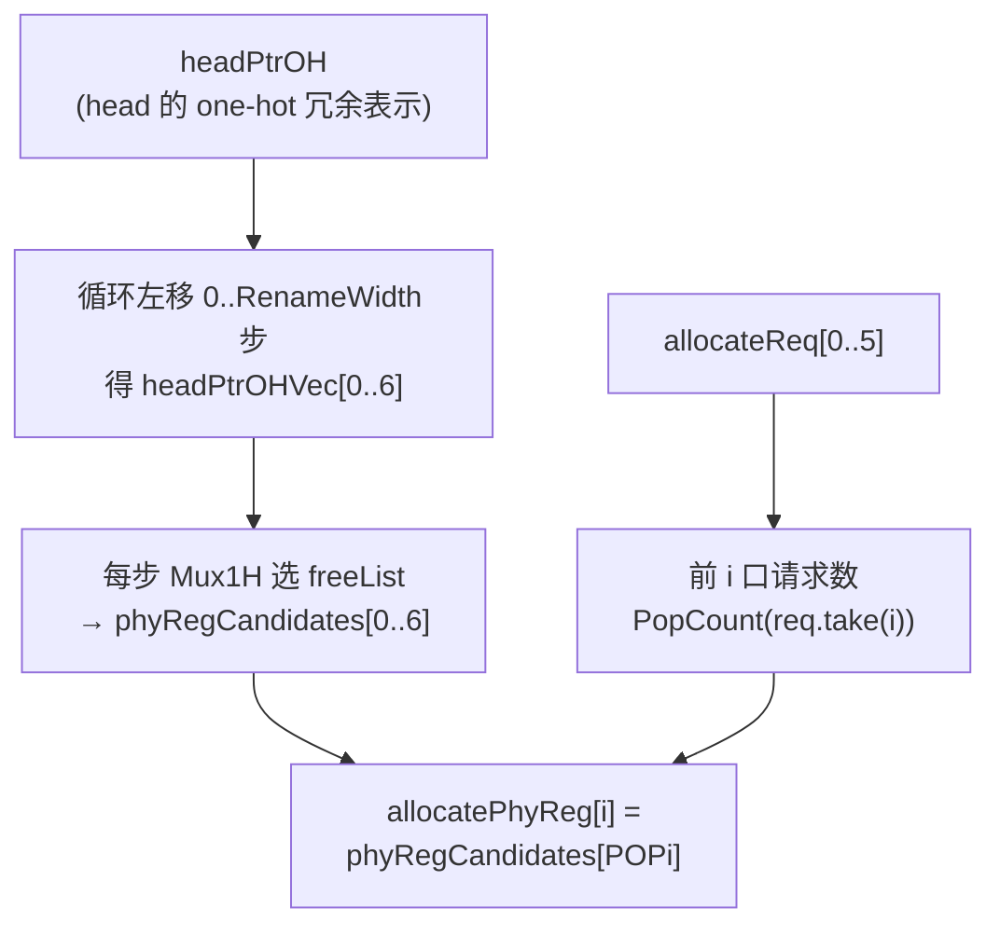
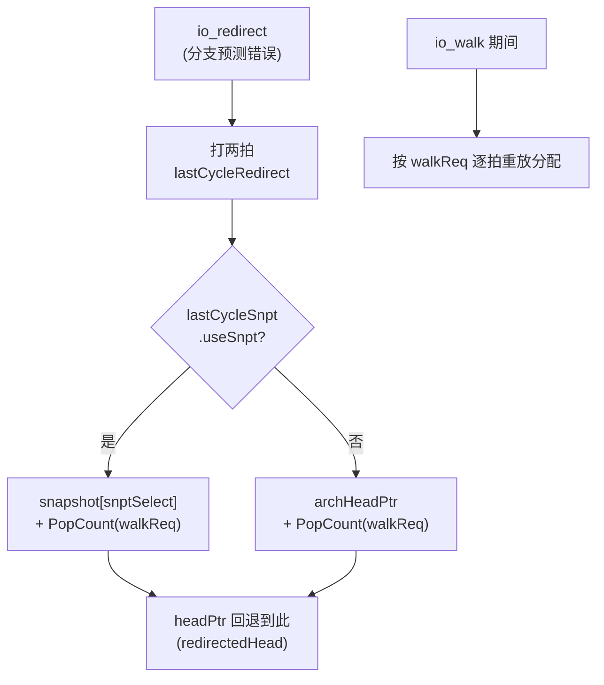

# StdFreeList —— 重命名「标准空闲列表」(物理寄存器分配/回收)

> 可读核：`rtl/backend/StdFreeList.sv`（`xs_StdFreeList_core`）+ `rtl/backend/stdfreelist_pkg.sv`
> 包装层：`rtl/backend/StdFreeList_wrapper.sv`（golden 同名 `StdFreeList`，扁平端口 → 核）
> 设计源：`src/main/scala/xiangshan/backend/rename/freelist/{BaseFreeList,StdFreeList}.scala`
> golden：`golden/chisel-rtl/StdFreeList.sv`（3654 行 / 61 端口；本例化为浮点 `Reg_F`）

## 1. 它在后端的位置

后端流水：取指 → 译码 → **重命名(Rename)** → 派遣 → 发射 → 执行 → 写回 → 提交(ROB/RAB)。

重命名要消除 WAR/WAW 假相关：把逻辑寄存器映射到一个**新的物理寄存器**。这就需要一个
「空闲物理寄存器池」。香山按寄存器类型分了几条独立空闲列表：

| 实例 | 类型 | freeListSize | numLogicRegs | 说明 |
|------|------|--------------|--------------|------|
| intFreeList | 整数 | — | — | 用 `MEFreeList`(支持 move elimination) |
| **fpFreeList** | 浮点 Reg_F | **158** | **34** | **本工程重写的 golden 例化** |
| vecFreeList | 向量 Reg_V | … | … | 同为 `StdFreeList` |
| v0/vlFreeList | Reg_V0/Vl | … | … | 同为 `StdFreeList` |

`StdFreeList` 是「标准」空闲列表（不含 move elimination 引用计数），管理 fp/vec 类物理寄存器。

## 2. 核心数据结构：循环队列 + 三个指针

空闲池 `freeList[158]` 是一个**循环队列**，三个指针(均为 `fl_ptr_t = {flag, value}`)：



- **headPtr**：投机态分配指针。每拍按"实际分配个数"前移（出队）。
- **archHeadPtr**：体系结构态分配指针，仅在 **commit** 拍按"提交且写该类寄存器的指令数"前移。
  它代表"真正用掉、不会再回退"的进度；分支预测错误时 head 可回退到它。
- **tailPtr**：回收指针。按本拍 `freeReq` 个数前移（入队）。代码里用 `lastTailPtr` 保存上拍
  tail 值以改善时序。

> `fl_ptr_t.flag` 区分"绕过几圈"，用于在 value 相同时判断队列是空还是满。由于 `SIZE=158`
> **不是 2 的幂**，指针加法需手动检测越界回绕（`ptr_add` 函数），这是与 2 幂队列的关键区别。

## 3. 三大操作

### 3.1 分配 (alloc)



- 用 `headPtrOH`（head 的 one-hot 表示）循环左移，再 `Mux1H` 选 `freeList`，省去对 158 路做
  译码比较，**改善时序**。`headPtrOH` 与 `headPtr` 是同一指针的两种冗余表示。
- 第 `i` 个分配口取第 `PopCount(allocateReq[0..i-1])` 个候选——即按"前面几口实际要了几个"
  做错位选择，使连续分配口拿到连续的空闲 preg。

### 3.2 回收 (free)

提交/回滚的指令把不再需要的旧物理寄存器写回池：第 `i` 口写入位置 =
`lastTailPtr + PopCount(freeReq[0..i-1])`。本核用**显式地址译码**（对每个条目 E 判断"是否等于
某口的写入下标"）而非变量下标写，既避免越界 X（利于 FM/综合），也把回收的地址译码讲得很直白。

> 为何 free 路径可直接用组合的 `io_freeReq` 而非寄存？因为 `canAllocate` 仅在
> `空闲数 >= RenameWidth` 时才置位（打一拍；RTL 为 `freeRegCnt >= RENAME_WIDTH`，golden 写作
> `freeRegCnt > 5`，RenameWidth=6 时两者等价），保证"本拍回收的寄存器至少下一拍才会被分配"，
> 故回收写入与分配读出不冲突。

### 3.3 重定向回滚 (redirect / walk)



- 分支预测错误时，前两拍打拍的 `redirect`/`snpt` 选出回退目标：
  - 若错误点之前打过**快照(snapshot)**，head 回退到 `snapshot[snptSelect] + 已 walk 数`；
  - 否则回退到 `archHeadPtr + 已 walk 数`。
- 随后 `io_walk` 期间，用 `walkReq`（而非 `allocateReq`）逐拍重放分配，把投机态恢复到正确点。
- 快照存储由子模块 **SnapshotGenerator** 负责（本核黑盒例化，golden 同名子模块）。

优先级（Scala 注释原文）：**(1) 异常/flushPipe → (2) walking → (3) 误预测 → (4) 正常出队**。
体现在 `realDoAllocate = !io_redirect && isAllocate`：redirect 当拍不推进 head。

## 4. 空闲计数与 canAllocate

```
freeRegCnt = distance(tailPtr, headPtr) - (本拍要分配的数)
io_canAllocate = RegNext(freeRegCnt >= RenameWidth)   // 打一拍，改善时序
```

`canAllocate` 打一拍是关键设计：它让回收路径可以安全打拍（见 3.2）。

## 5. 接口表（核 `xs_StdFreeList_core`）

| 信号 | 方向 | 含义 |
|------|------|------|
| io_redirect / io_walk | in | 重定向脉冲 / 处于回滚重放 |
| io_allocateReq[6] | in | 各重命名口是否要分配 |
| io_walkReq[6] | in | 回滚重放时的分配请求 |
| io_allocatePhyReg[6] | out | 各口分到的物理寄存器号(8bit) |
| io_canAllocate / io_doAllocate | out/in | 可分配(打拍) / 本拍确实分配 |
| io_freeReq[6] / io_freePhyReg[6] | in | 回收请求 / 回收的物理寄存器号 |
| io_commit_isCommit / commitValid[6] / info_fpWen[6] | in | 提交信息(推进 archHeadPtr) |
| io_snpt_* | in | 快照入/出队、选择、flush |
| io_perf_value[4] | out | 空闲度四分位性能事件 |

## 6. 验证结果

- **UT**（golden 双例化逐拍比对，含内部 `headPtr/archHeadPtr/lastTailPtr` 层次探针）：
  seed 1 / 7 / 42 各 **200000 拍，checks=200000，errors=0**。激励覆盖 alloc / free / commit
  推进 archHead / redirect+walk 回滚 / snapshot。
- **FM**：`make fm` → **Verification SUCCEEDED**（0 unmatched，全部 compare points 等价）。

## 7. 重写关键坑（诚实记录）

1. **非 2 幂指针回绕**：`SIZE=158` 不是 2 的幂，`ptr_add` 必须显式判 `value+offset >= SIZE`
   并翻转 flag，不能简单拼接溢出。`distance` 同理分 flag 同/异两支。
2. **数组越界 X**：`freeList[变量下标]` 写、`OH[变量下标]=1` 在 FM 里会对越界下标产生 **X**
   并传播到比对点（先表现为 `freeList_0/112/128` 失配）。解法：回收写改**显式地址译码**
   （常量比较）、one-hot 用**移位**生成（越界自动移出，不产生 X）；候选数组开到 2 的幂 + 3bit 索引。
3. **异步 vs 同步复位**：golden 主寄存器是**异步复位**(`posedge clk or posedge reset`)。最初用
   同步复位导致 `headPtrOH`、`freeList[157]` 在 FM 下失配——改异步后即通过。
4. **复位域细分**：`lastCycleRedirect = RegNext(RegNext(io.redirect))` **无复位初值**，而
   `lastCycleSnpt = RegNext(RegNext(io.snpt, 0))` 第一级**有复位 0**、第二级无复位。必须把这几个
   打拍寄存器拆到"带复位主块"与"无复位块"两处，否则 5 个 redirect/snpt 寄存器在 FM 下失配。
5. **FM 解析限制**：`func(...).value`（对函数返回值取字段）VCS 接受、FM(V-2023.12) 报语法错；
   需先把函数结果赋给临时变量再取字段。
6. **perf 两级打拍**：四分位事件经 `REG → REG_1` 两级寄存器，少一级会差一拍。
