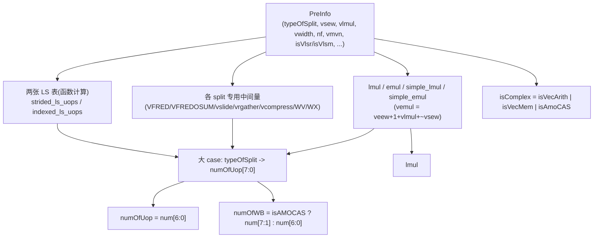

# UopInfoGen —— 微操作数生成器（昆明湖后端 / 译码阶段叶子）

> Scala 源：`xiangshan.backend.decode.UopInfoGen`（含两张内联真值表
> `strdiedLSNumOfUopTable` / `indexedLSNumOfUopTable`）
> 可读核：`rtl/backend/UopInfoGen.sv`（`xs_UopInfoGen_core`）+ `rtl/backend/uopinfogen_pkg.sv`
> wrapper：`rtl/backend/UopInfoGen_wrapper.sv`（golden 同名 `UopInfoGen`）
> golden：`golden/chisel-rtl/UopInfoGen.sv`（266 行 / 15 端口）+ 两张表 golden

## 1. 架构定位

UopInfoGen 是译码阶段的**纯组合叶子**。对一条**向量 / 特殊指令**，根据前级
译码给出的预解析信息 `PreInfo`，算出它要拆成多少个微操作（uop）：

| 输出 | 含义 |
|------|------|
| `numOfUop` | 该指令展开的 uop 总数（向量按 LMUL/EMUL/NF/SEW 展开，可达数十） |
| `numOfWB` | 写回次数；除 AMOCAS 为 `numOfUop>>1` 外都等于 `numOfUop` |
| `lmul` | 译出的 LMUL 整数倍（1/2/4/8） |
| `isComplex` | 是否"复杂"（向量算术 / 向量访存 / AMOCAS），需走拆分通道 |

## 2. 数据流

## 3. 设计要点

### 3.1 LMUL / EMUL 推导
- `lmul`：VLmul 000/001/010/011 → 1/2/4/8，分数 LMUL 取 1；
- `simple_lmul`：同上但取 log2（0..3）；
- `vemul = veew + 1 + vlmul + ~vsew`（3 位模运算，对应有效元素的 EMUL）；
- `emul`/`simple_emul` 同 lmul 的方式从 `vemul` 推出。

### 3.2 numOfUop 大 case
Scala 用一个 `MuxLookup(typeOfSplit -> 表达式)` 罗列 44 种 split 的 uop 数公式。
可读核用 `unique case (uop_split_e'(typeOfSplit))`，**每条 case 对应一种 split**，
并配有意义的枚举名（`SPLIT_VEC_VVV` / `SPLIT_VEC_SLIDEUP` / `SPLIT_AMO_CAS_Q`…）。
公式直接照 Scala 意图（如 `VEC_VFV → lmul+1`、`VEC_SLIDE1DOWN → lmul*2`、
`VEC_RGATHER_VX → numOfUopVrgather+1`、`VEC_MVNR → vmvn+1`）。

### 3.3 各 split 专用中间量
`VFRED`（addTime+foldTime，至少 1）、`VFREDOSUM`（vlMax 移位，至少 1）、
`vslide`/`vrgather`（按 vlmul 阶梯）、`vrgatherei16`（vsew=0 且非 m8 时翻倍）、
`WV/WX`（展宽/收窄，WX 多一条 move 故比 WV 大 1）等，逐一对应 Scala 同名 val，
用纯函数 / 三元 mux 表达（注释标出物理含义）。

### 3.4 两张向量访存 LS 表——按算法计算而非抄真值表
Scala 用 `QMCMinimizer` 把两张表的**生成规则**压成真值表（golden 是子模块
`strdiedLSNumOfUopTable` / `indexedLSNumOfUopTable` 里的与/或矩阵）。可读核
**不抄矩阵**，而是用 `function automatic` 直接重写生成算法：

- **strided**（src = `{simple_emul, nf}`）：
  `uop = ((1<<emul)*(nf+1) <= 8) ? (1<<emul)*(nf+1) : 0`
- **indexed**（src = `{simple_emul, simple_lmul, nf}`）：
  `nf==0` → `max(1<<emul, 1<<lmul)`；
  `nf>0`  → `lp=(1<<lmul)*(nf+1)`，`uop = (lp<=8) ? max(lp, 1<<emul) : 0`

这两个函数与 golden QMC 真值表**签名等价**（FM 已通过，见 §4）。

### 3.5 X 铁律
`case` 用 `unique case` 带 `default`；所有阶梯查找用三元 mux；无悬空索引。

## 4. 验证

### UT（`verif/ut/UopInfoGen/`）
golden（含两张表子模块）vs 可读核双例化，每拍随机驱动 PreInfo（`typeOfSplit`
大概率取 44 种合法 split 码、偶尔随机；vsew/vlmul/vwidth/nf/vmvn 全随机），
逐输出 `!$isunknown` 比对 isComplex/numOfUop/numOfWB/lmul。

| seed | checks | errors |
|------|--------|--------|
| 1  | 800,000 | 0 |
| 7  | 800,000 | 0 |
| 42 | 800,000 | 0 |

### FM
`make fm`：**SUCCEEDED**。可读核（两张表内联为函数）与 golden（两张表为子
模块）整体签名等价。

## 5. 结构闸门实测

| 指标 | 值 |
|------|----|
| `typedef enum` | 1（uop_split_e，44 种 split） |
| `typedef struct` | 2（preinfo_t / uopinfo_t） |
| `function automatic` | 7（lmul/simple/VFRED 系/两张 LS 表 等） |
| `case` 使用 | 16 |
| 生成痕迹 grep | 0 |
| 核行数 | 239（golden 266 + 两张表另算） |

## 6. 关键坑

1. **`vemul` 公式易写错**：是 `veew + 1 + vlmul + ~vsew`（不是再 +1）。
2. **numOfWB 的减半**：仅 `isAMOCAS`（CAS_W/D/Q）取 `numOfUop>>1`，用
   `num_uop[UOP_W:1]` 表达（注意内部 `num_uop` 是 8 位，输出取低 7 位）。
3. **vcompress 在 m8 时 = 43**（超出 4 位），故在 case 里按 8 位直接给出，没有
   并入 4 位的中间 wire。
4. **两张 LS 表用算法重写**而非转写真值表，仍能 FM 通过——印证"从设计意图
   重写"在组合译码表上同样可达签名等价。
