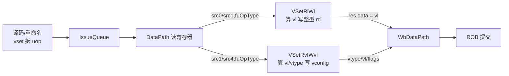
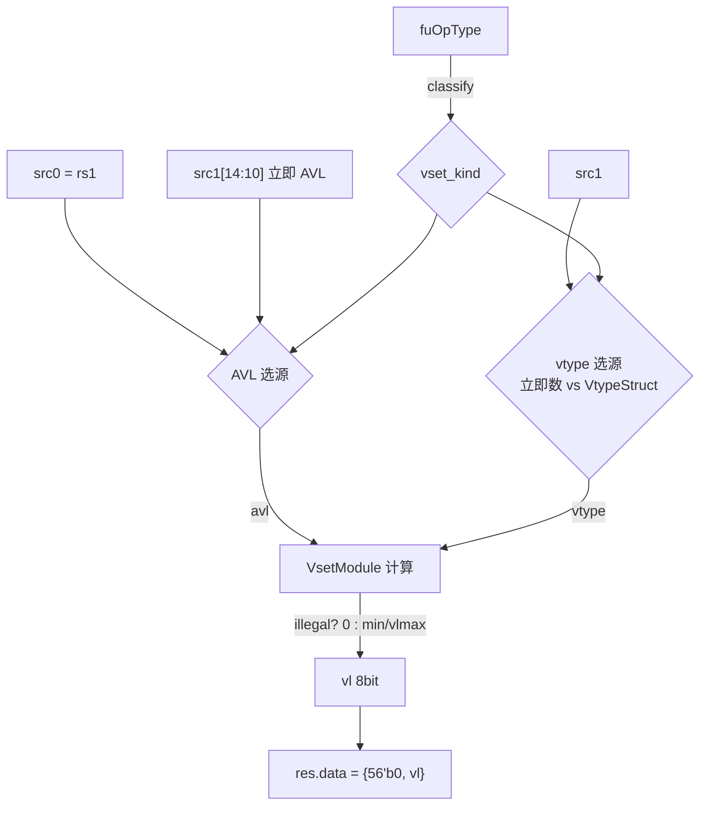

# 香山 V2R2(昆明湖)向量配置单元 VSetRiWi —— 学习文档

> 可读重写:`rtl/backend/VSetRiWi.sv`(核 `xs_VSetRiWi_core`)+ 共享包
> `rtl/backend/vset_pkg.sv` + golden 同名 wrapper `rtl/backend/VSetRiWi_wrapper.sv`。
> 设计源:`src/main/scala/xiangshan/backend/fu/wrapper/VSet.scala`(`class VSetRiWi`、
> `class VSetBase`)与 `src/main/scala/xiangshan/backend/fu/Vsetu.scala`(`class VsetModule`)、
> `src/main/scala/xiangshan/package.scala`(`object VSETOpType`)。

## 1. VSet 在后端的位置与角色

RISC-V 向量扩展(RVV)用 `vset{i}vl{i}` 指令在运行时配置「当前向量长度 `vl`」
与「向量类型 `vtype`(SEW/LMUL/ta/ma)」。香山把一条 `vset` 指令在译码阶段
**分裂成多个 uop**,分派到不同执行单元:



**VSetRiWi** 处理「把新算出的 `vl` 写回整型寄存器 `rd`」的那个 uop
(`uvsetrd_*` 系列):它读两个整型源、算出 `vl`,结果走整型写回通道。
它**不写** vtype 寄存器(那是 `VSetRvfWvf` 的活)。本单元是
**单周期纯组合** 的叶子功能单元,握手/控制位由外层 `PipedFuncUnit` 负责。

## 2. 核心概念:AVL、VLMAX 与 vl = min(AVL, VLMAX)

- **AVL(Application Vector Length)**:软件请求的元素个数。
- **VLMAX**:当前 `vtype` 下一次能处理的最大元素数 = `VLEN * LMUL / SEW`。
- **vl**:实际生效的向量长度,一般取 `min(AVL, VLMAX)`;特例下直接取 VLMAX。

VLMAX 的乘除在硬件里用**取对数变加减**实现(见 `Vsetu.scala` 注释):

```
log2(VLMAX) = log2(VLEN) + log2(LMUL) - log2(SEW)
            = 7          + vlmul       - (vsew + 3)
VLMAX       = 1 << log2(VLMAX)
```

其中 `vlmul` 是 3 位补码编码的 `log2(LMUL)`(分数 LMUL 为负),`vsew` 编码
`log2(SEW)-3`(SEW=8/16/32/64 ⇒ vsew=0/1/2/3)。这些计算封装在
`vset_pkg` 的 `calc_log2_sew` / `calc_vlmax` / `calc_vl` 等 `function automatic` 中。

## 3. 数据流与三大变体

`fuOpType[7:6]` 决定 `vset` 变体,进而决定 AVL 与 vtype 从哪里取(`vset_pkg::vset_kind_e`):

| func[7:6] | 变体      | AVL 来源            | vtype 来源                  |
|-----------|-----------|---------------------|-----------------------------|
| 00        | vsetivli  | 立即数 `src1[14:10]` | 立即数(reserved 2 位)      |
| 10        | vsetvli   | 整型 rs1 = `src0`    | 立即数(reserved 3 位)      |
| 01 / 11   | vsetvl    | 整型 rs1 = `src0`    | 整型 rs2 的 VtypeStruct(`src1`,含 vill) |



> `vtype` 的 `vma/vta/vsew/vlmul` 三路位置相同(`src1[7]/[6]/[5:3]/[2:0]`),
> 差异只在 `illegal`(仅 vsetvl 从 `src1[63]` 取 vill)与 `reserved`(位段宽度)。
> 这一「按变体分派」在核里用 `unique case (kind)` 直接表达,见 `VSetRiWi.sv`。

## 4. vl 与合法性计算(对应 VsetModule)

合法性 `illegal`(`calc_illegal`)由四项或起来:
- **LMUL 保留**:`vlmul == 100`;
- **SEW 保留 / 超界**:`vsew[2]==1`,或 `log2(SEW) > log2VsewMax`,其中
  `log2VsewMax = vlmul[2] ? (log2ELEN + vlmul) : log2ELEN`(LMUL<1 时上界随之降低);
- **reserved 非 0**;
- **输入 vill**(vsetvl 路径)。

最终 `vl`(`calc_vl`):
- `illegal` ⇒ `vl = 0`;
- 否则 `take_vlmax = (非 vsetivli 且 setVlmax 位) | (AVL > VLMAX)` ⇒ 取 VLMAX,
  否则取 AVL。`setVlmax` 对应 `rs1==x0 且 rd!=x0` 时把 vl 钉成 VLMAX 的语义。

## 5. 接口

可读核 `xs_VSetRiWi_core`(组合):

| 端口      | 方向 | 位宽 | 含义 |
|-----------|------|------|------|
| func      | in   | 9    | fuOpType(vset 变体编码) |
| src0      | in   | 64   | 整型 rs1(普通 AVL) |
| src1      | in   | 64   | 整型 rs2 / 立即数载体(vtype、立即 AVL) |
| res_data  | out  | 64   | 写回 rd 的 vl(零扩展) |

golden 同名 wrapper `VSetRiWi`(`VSetRiWi_wrapper.sv`)额外把
valid/robIdx/pdest/rfWen/perfDebugInfo 直通,端口与 `golden/chisel-rtl/VSetRiWi.sv`
完全一致,供 FM 与系统替换。

## 6. 验证结果

- **UT(双例化逐拍比对)**:tb 同时例化 golden `VSetRiWi`(含 `VsetModule`)与
  可读核 `VSetRiWi_xs`,每拍随机驱动 func/src0/src1(92% 取合法 vset 变体表做
  定向覆盖 + 8% 随机 9 位码;src1 重点扫 `vsew∈[0,7]`、`vlmul∈[0,7]` 全组合含
  保留/非法编码,AVL 跨 VLMAX 边界),比对全部 9 个输出。
  - seed 1 / 7 / 42:各 `checks=1,800,000`,`errors=0`,`TEST PASSED`。
- **Formality 等价**:golden `VSetRiWi`(+ `VsetModule`) vs 可读核 wrapper。
  `FM_RESULT: Verification SUCCEEDED`。

### 复跑

```bash
cd verif/ut/VSetRiWi
make run SEED=1   # 同理 SEED=7 / SEED=42
make fm
```

## 7. 重写关键坑

1. **对数移位量的 3 位回绕**:`calc_vlmax` 的移位量写成 `(vlmul-1)-log2Vsew`,
   利用 3 位补码回绕恰好等于 `7+vlmul-log2Vsew`(因 `vlmul-1 ≡ vlmul+7 (mod 8)`),
   与 golden 一致。若用更宽位算会丢掉 LMUL 分数时的回绕语义。
2. **reserved 位宽随变体而变**:vsetivli 只有 2 位 reserved(`src1[9:8]`),
   vsetvli 有 3 位(`src1[10:8]`),vsetvl 有 55 位(`src1[62:8]`)。位宽错会让
   `(|reserved)` 的非法判定与 golden 不符。
3. **VsetModule 不是黑盒**:golden 把 vl 计算放在子模块 `VsetModule`,但本工程
   要求从设计意图重写,故把该计算内联为 `vset_pkg` 的纯函数,而非例化黑盒——
   这样 vl/vtype 算法对阅读者完全可见。UT/FM 侧仍用 golden 的 `VsetModule.sv` 对照。
4. **vset 变体用 enum 分派**:`func[7:6]` 的三态用 `vset_kind_e` 表达,核内
   `unique case` 让「按变体取源」一目了然,优于一串 `is_vsetvl/is_vsetivli` 三元链。
