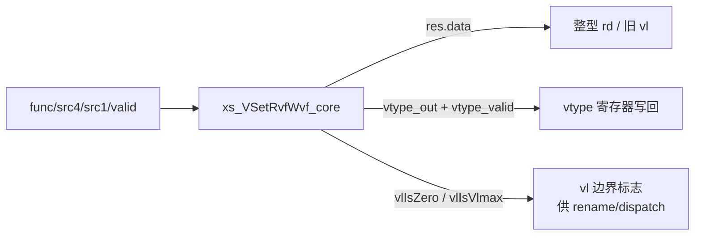
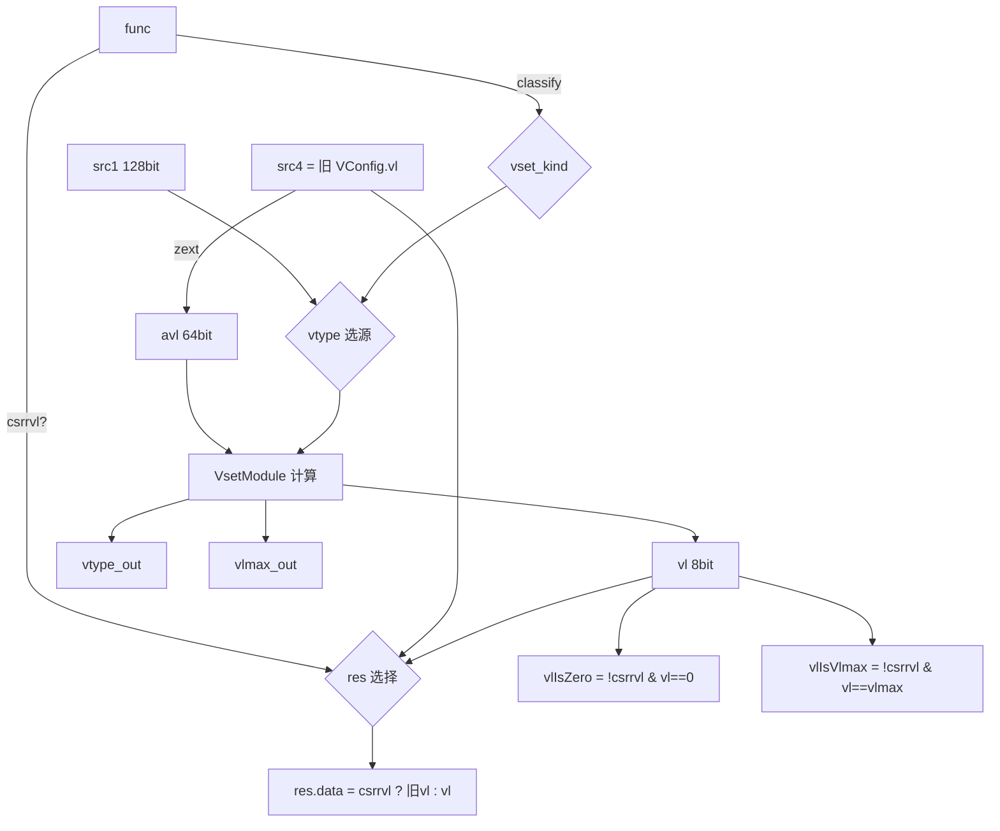

# 香山 V2R2(昆明湖)向量配置单元 VSetRvfWvf —— 学习文档

> 可读重写:`rtl/backend/VSetRvfWvf.sv`(核 `xs_VSetRvfWvf_core`)+ 共享包
> `rtl/backend/vset_pkg.sv` + golden 同名 wrapper `rtl/backend/VSetRvfWvf_wrapper.sv`。
> 设计源:`src/main/scala/xiangshan/backend/fu/wrapper/VSet.scala`(`class VSetRvfWvf`、
> `class VSetBase`)与 `src/main/scala/xiangshan/backend/fu/Vsetu.scala`(`class VsetModule`)。
>
> 本文聚焦 VSetRvfWvf 与 VSetRiWi 的**差异**;VLMAX/vl/vtype 的通用计算原理
> 见 [VSetRiWi.md](VSetRiWi.md) 第 2、4 节(两者共用 `vset_pkg`)。

## 1. 角色:保持 vl 改 vtype + 写回 vconfig

一条 `vset` 指令在 `rs1==x0 && rd==x0` 时语义是「保持旧 `vl` 不变,只更新 `vtype`」。
香山把它分裂出的 uop(`uvsetvcfg_vv` / `uvsetvcfg_keep_v`)由 **VSetRvfWvf** 处理。
此外读取当前 `vl` 的伪指令(`csrrvl`)也复用本单元。

与 VSetRiWi 相比,VSetRvfWvf 多做三件事:



1. **AVL = 旧 vl**:不读 rs1,而是把上一条配置的 `vl`(经 `src4` = 旧 `VConfig.vl`)
   当作 AVL,从而「保持 vl」(`vl = min(oldVL, 新VLMAX)`)。
2. **写回 vtype 寄存器**:输出 `vtype_out`(SEW/LMUL/ta/ma/vill)与写使能
   `vtype_valid`(仅 vsetvl 路径 `func[6]` 且本拍 valid)。
3. **vl 边界标志**:`vlIsZero`(新 vl==0)、`vlIsVlmax`(新 vl==VLMAX)——
   下游用它们快速判断「全不活跃 / 满长度」,省去重复比较。

## 2. 数据流



> vtype 选源与 VSetRiWi 同构(`unique case (kind)`):vsetvl 取 `src1` 的
> VtypeStruct(含 vill),立即数路径无 vill、reserved 取 2/3 位零扩展。
> 区别仅在 `src1` 端口宽 128 位(golden 该 uop 的 src1 来自向量数据通路),
> 但仍只用低 64 位的 vtype 字段。

## 3. 关键输出语义

- **`res.data`**:`csrrvl`(读 vl)时直接回送 `src4`(旧 vl),不取新算的 vl;
  其余情况回送新 `vl`。对应 Scala `Mux(isReadVl, oldVL, vl)`。
- **`vtype_valid`**:`func[6] & valid`——只有 vsetvl 路径(vtype 真正变化)才写
  vtype 寄存器。`csrrvl`(func[6]=0)与立即数路径不写。
- **`vlmax_out`**:对外 VLMAX 取下界保护 `max(1<<log2Vlmax, VLEN/SEW)`,避免
  LMUL 为分数(<1)时 `1<<log2Vlmax` 截位成 0;`vlIsVlmax` 用它比较。
- **`vtype_out`**:非法时整体清零并置 `vill=1`,`vsew` 收窄为 2 位。

## 4. 接口

可读核 `xs_VSetRvfWvf_core`(组合):

| 端口         | 方向 | 位宽 | 含义 |
|--------------|------|------|------|
| valid        | in   | 1    | 本拍有效(决定 vtype_valid / 边界标志) |
| func         | in   | 9    | fuOpType |
| src4         | in   | 8    | 旧 VConfig.vl(AVL = 保持的 vl) |
| src1         | in   | 128  | rs2 VtypeStruct / 立即数载体 |
| res_data     | out  | 64   | 写回 rd 的 vl(csrrvl 时为旧 vl) |
| vtype_valid  | out  | 1    | vtype 寄存器写使能 |
| vtype_out    | out  | 8    | 写回的 vtype(struct:vill/vma/vta/vsew[2]/vlmul[3] = 1+1+1+2+3 = 8) |
| vl_is_zero   | out  | 1    | 新 vl == 0 |
| vl_is_vlmax  | out  | 1    | 新 vl == VLMAX |

golden 同名 wrapper `VSetRvfWvf`(`VSetRvfWvf_wrapper.sv`)把 vtype struct 拆成
扁平字段、并直通 valid/robIdx/pdest/rfWen/vlWen/perfDebugInfo,端口与
`golden/chisel-rtl/VSetRvfWvf.sv` 完全一致。

## 5. 验证结果

- **UT(双例化逐拍比对)**:tb 同时例化 golden `VSetRvfWvf`(含 `VsetModule`)与
  可读核 `VSetRvfWvf_xs`,每拍随机驱动 valid/func/src4(旧 vl)/src1(vtype),
  比对全部 18 个输出(含 vtype 各字段、vlIsZero、vlIsVlmax)。激励重点覆盖
  vv/keep_v/csrrvl 三类 uop、vsew/vlmul 全组合、oldVL 跨 VLMAX 边界。
  - seed 1 / 7 / 42:各 `checks=3,600,000`,`errors=0`,`TEST PASSED`。
- **Formality 等价**:golden `VSetRvfWvf`(+ `VsetModule`) vs 可读核 wrapper。
  `FM_RESULT: Verification SUCCEEDED`。

### 复跑

```bash
cd verif/ut/VSetRvfWvf
make run SEED=1   # 同理 SEED=7 / SEED=42
make fm
```

## 6. 重写关键坑

1. **AVL 来自 src4 而非 rs1**:这是 VSetRvfWvf 与 VSetRiWi 最易混的差异——
   它保持旧 vl,故 `avl = zext(src4=oldVL)`。golden 里是
   `vsetModule.io.in.avl := oldVL`。
2. **csrrvl 必须透传旧 vl**:`res.data` 与 `vlIsZero/vlIsVlmax` 都要在 `csrrvl`
   时走「读旧 vl、不当配置」分支;漏掉会在读 vl 时误报边界标志。
3. **vtype_valid 只看 func[6]**:不要用「非 csrrvl」当条件——立即数 keep_v 路径
   (func[6]=0)也不写 vtype 寄存器,只有 vsetvl 才写。
4. **vlmax 下界保护**:`vlIsVlmax` 比较的是 `max(1<<log2Vlmax, VLEN/SEW)`,
   与裸 `1<<log2Vlmax` 不同(LMUL 分数时后者会截 0)。
5. 其余(对数移位回绕、reserved 位宽、VsetModule 内联为纯函数、enum 分派)
   与 VSetRiWi 相同,见 [VSetRiWi.md](VSetRiWi.md) 第 7 节。
